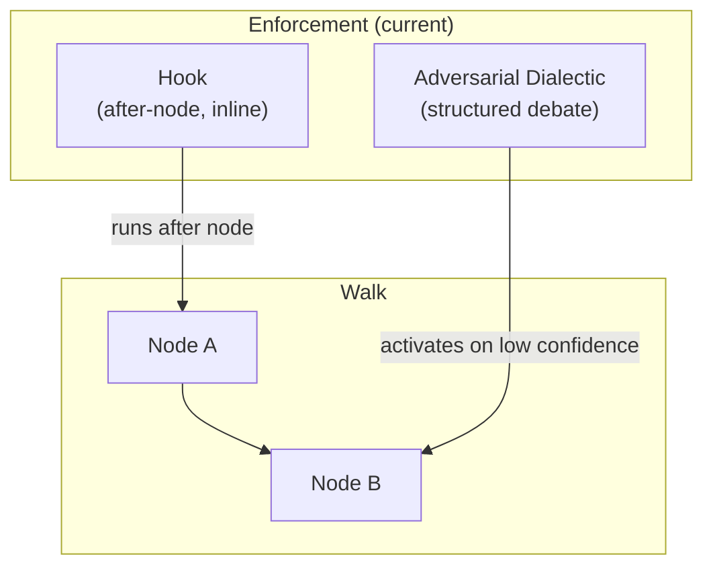
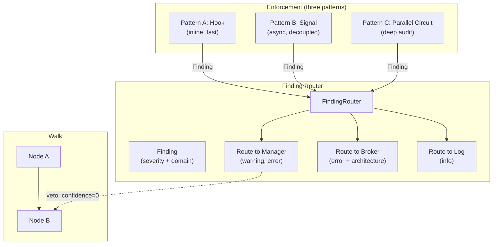

# Contract — finding-router

**Status:** active  
**Goal:** Enforcer findings route to the correct authority (Worker's Manager, or Broker) based on severity and domain. Findings can flag (soft), block (medium), or veto (hard) circuit execution. Three enforcement patterns are supported: inline (Hook-based), signal-based (async), and parallel circuit.  
**Serves:** Containerized Runtime (vision)

## Contract rules

- **Lateral, not hierarchical.** Enforcers are not in the command chain — they observe it. Findings route laterally to the appropriate authority. A lint failure goes to the Worker's Manager. An architecture violation escalates to the Broker.
- **Severity drives routing.** Three levels: `info` (flag — annotate, no action), `warning` (block — pause propagation until acknowledged), `error` (veto — abort sub-circuit, Manager must re-plan). Routing rules map severity + domain to authority level.
- **Three patterns, one type.** The `Finding` type is the same regardless of whether it was produced by a Hook (inline), a signal (async), or a parallel circuit. Consumers choose the enforcement pattern; the router handles all three.
- **Backward-compatible.** Existing circuits without enforcers work unchanged. Findings are opt-in. The veto mechanism integrates with existing edge evaluation — no new walk control flow.
- Global rules apply.

## Context

Brainstorming session: [Agentic hierarchy and Operator API](65013565-a183-40d2-ae82-707267f65454) — identified that Enforcers need a feedback mechanism to route findings to the right authority. Current enforcement is limited to `Hook` (synchronous, after-node side effect) and `Adversarial Dialectic` (structured debate within a single walk). Neither supports independent, lateral audit across circuit boundaries.

- `agent-roles` contract — provides `Role` type. Enforcers are a role; findings route based on the target's role.
- `dispatch/signal.go` — `Signal` struct and `SignalBus`. Existing event transport for inter-agent coordination.
- `dispatch/dispatch.go` — `Dispatcher` interface. Work distribution.
- `node.go` — `Hook` interface: `Name()`, `Run(ctx, nodeName, artifact) error`. Current inline enforcement.
- `dialectic/dialectic.go` — `SynthesisDecision`: affirm, amend, acquit, remand, unresolved. Existing veto vocabulary.
- `walker.go` — `WalkerState.ConfidenceHistory`. Confidence values drive edge evaluation — the veto mechanism integrates here.

### Current architecture

Hooks are inline and synchronous. The dialectic is a special walk path. Neither produces typed findings that route to an authority.

### Desired architecture

All three patterns produce the same `Finding` type. The `FindingRouter` routes based on severity and domain. Veto findings set artifact confidence to 0, triggering remand edges.

## FSC artifacts

| Artifact | Target | Compartment |
|----------|--------|-------------|
| Finding Router design reference | `docs/agentic-hierarchy-design.md` | domain |
| `Finding`, `FindingRouter` glossary terms | `glossary/` | domain |

## Execution strategy

Seven phases. Finding type first, then routing, then each enforcement pattern, then veto integration.

### Phase 1 — Finding type

Define the `Finding` type and severity constants. Pure data — no behavior.

### Phase 2 — FindingRouter

Routing engine that maps severity + domain to an authority (Manager, Broker, or log-only).

### Phase 3 — SignalBus integration

Findings emitted as typed signals on the `SignalBus`. Enables async enforcement and cross-circuit finding propagation.

### Phase 4 — Edge condition helpers

Helper functions for `when:` expressions that check for enforcer findings in the signal bus.

### Phase 5 — Veto mechanism

`FindingError` signals override artifact confidence to 0, triggering the dialectic's remand path or a custom veto edge.

### Phase 6 — Parallel enforcement circuit

The most powerful pattern: a separate circuit runs concurrently, observing the work circuit's artifacts and producing findings.

### Phase 7 — Validate and tune

Green-yellow-blue cycle.

## Coverage matrix

| Layer | Applies | Rationale |
|-------|---------|-----------|
| **Unit** | yes | Finding construction, FindingRouter rule matching, severity constants |
| **Integration** | yes | Walk with EnforcerHook producing findings, signal-based finding routing, veto confidence override |
| **Contract** | yes | Finding schema, FindingRouter rule format, signal event format for findings |
| **E2E** | yes | YAML circuit with enforcer hook, parallel enforcement circuit, veto triggering remand |
| **Concurrency** | yes | Parallel enforcement circuit running concurrently with work circuit, SignalBus thread safety |
| **Security** | yes | Enforcer findings may contain sensitive audit data — scoped by domain |

## Tasks

### Phase 1 — Finding type

- [ ] P1.1: Define `Finding` struct in `finding.go` (framework root or `enforcement/` package): `Severity FindingSeverity`, `Domain string`, `Source string` (enforcer name), `NodeName string`, `Message string`, `Evidence map[string]any`, `Timestamp time.Time`.
- [ ] P1.2: Define `FindingSeverity` type (string) with constants: `FindingInfo` ("info"), `FindingWarning` ("warning"), `FindingError` ("error").
- [ ] P1.3: Define `FindingCollector` interface: `Report(ctx context.Context, f Finding) error`, `Findings() []Finding`. Simple accumulator for collecting findings during a walk.
- [ ] P1.4: Implement `InMemoryFindingCollector` — thread-safe slice-backed collector.
- [ ] P1.5: Unit tests: Finding construction, severity constants, collector accumulation, concurrent writes.
- [ ] P1.6: Validate — `go test -race ./...` green.

### Phase 2 — FindingRouter

- [ ] P2.1: Define `RouteRule` struct: `Severity FindingSeverity`, `Domain string` (glob pattern), `Target RouteTarget` (enum: `TargetManager`, `TargetBroker`, `TargetLog`).
- [ ] P2.2: Define `FindingRouter` struct: holds `[]RouteRule` and dispatches findings to the appropriate target. Rules are evaluated in order; first match wins. Default: `info` → log, `warning` → manager, `error` → broker.
- [ ] P2.3: Define `RouteTarget` callbacks: `ManagerHandler func(Finding)`, `BrokerHandler func(Finding)`, `LogHandler func(Finding)`. Consumers wire handlers to their authority chain.
- [ ] P2.4: `FindingRouter` implements `FindingCollector` — `Report()` routes and collects.
- [ ] P2.5: Unit tests: rule matching (exact domain, glob domain, severity precedence), default routing, custom rules.
- [ ] P2.6: Validate — `go test -race ./...` green.

### Phase 3 — SignalBus integration

- [ ] P3.1: Define finding signal format: event = `"enforcer:<severity>"` (e.g., `"enforcer:error"`), meta includes `domain`, `source`, `node_name`, `message`.
- [ ] P3.2: Add `EmitFinding(f Finding)` method to `SignalBus` (or a helper that wraps `Emit`). Encodes the finding as a signal.
- [ ] P3.3: Add `FindingsSince(idx int) []Finding` method to `SignalBus` (or a helper that filters/decodes finding signals from `Since(idx)`).
- [ ] P3.4: Wire `FindingRouter` to emit findings as signals when configured with a `SignalBus`.
- [ ] P3.5: Unit tests: emit finding as signal, decode finding from signal, FindingsSince filtering.
- [ ] P3.6: Validate — `go test -race ./...` green.

### Phase 4 — Edge condition helpers

- [ ] P4.1: Register `signals.has_finding(severity)` as an expr-lang function available in `when:` conditions. Returns true if the signal bus contains a finding of the given severity (or higher).
- [ ] P4.2: Register `signals.finding_count(severity)` — returns the count of findings at or above the given severity.
- [ ] P4.3: Register `signals.finding_domain(domain)` — returns true if any finding matches the domain pattern.
- [ ] P4.4: Unit tests: edge evaluation with finding-aware conditions.
- [ ] P4.5: Integration test: circuit with edge `when: "signals.has_finding('error')"` routing to an error-handling node when an enforcer emits a finding.
- [ ] P4.6: Validate — `go test -race ./...` green.

### Phase 5 — Veto mechanism

- [ ] P5.1: Define `VetoHook` — a Hook that watches the `FindingCollector` for `FindingError` findings. When one arrives, it overrides the current artifact's confidence to 0.0.
- [ ] P5.2: Wire `VetoHook` into the walk loop as an optional after-hook. When confidence drops to 0, the existing dialectic activation logic (`NeedsAntithesis()`) or a veto edge triggers.
- [ ] P5.3: Define `veto` edge type or document the pattern using existing `when:` conditions (e.g., `when: "artifact.confidence == 0 && signals.has_finding('error')"`).
- [ ] P5.4: Integration test: walk with VetoHook. Enforcer hook produces `FindingError`. Verify: artifact confidence becomes 0, walk routes to remand/error path.
- [ ] P5.5: Integration test: walk with VetoHook but only `FindingWarning`. Verify: confidence unchanged, walk continues normally.
- [ ] P5.6: Validate — `go test -race ./...` green.

### Phase 6 — Parallel enforcement circuit

- [ ] P6.1: Define `ParallelEnforcerConfig` — configuration for running an enforcement circuit alongside a work circuit. Fields: `EnforcerCircuit *CircuitDef`, `ObservedNodes []string` (which work-circuit nodes to monitor), `CheckInterval time.Duration`.
- [ ] P6.2: Implement `RunWithEnforcer(ctx, workCircuit, enforcerConfig)` — starts both circuits. The enforcer circuit reads work-circuit artifacts via a shared `SignalBus`. Enforcer findings are routed via `FindingRouter`.
- [ ] P6.3: The enforcer circuit's nodes receive work-circuit artifacts as input (via signal bus or shared artifact store). Enforcer nodes produce `Finding` artifacts.
- [ ] P6.4: Integration test: work circuit (3 nodes) + enforcer circuit (2 nodes). Enforcer detects a bad artifact and emits `FindingError`. Verify: finding routes to manager handler, work circuit receives veto signal.
- [ ] P6.5: Integration test: work circuit completes before enforcer. Verify: enforcer circuit is cancelled cleanly.
- [ ] P6.6: Validate — `go test -race ./...` green.

### Phase 7 — Validate and tune

- [ ] P7.1: Validate (green) — all tests pass, acceptance criteria met.
- [ ] P7.2: Tune (blue) — review API surface, ensure FindingRouter is ergonomic for common patterns (lint, test, security audit). No behavior changes.
- [ ] P7.3: Validate (green) — all tests still pass after tuning.

## Acceptance criteria

**Given** an `EnforcerHook` that produces a `FindingError`,  
**When** the hook runs after a node during `Walk()`,  
**Then** the finding is routed to the Broker handler (default routing for errors). The artifact's confidence is overridden to 0. The walk routes to the remand/error path.

**Given** a `FindingRouter` with a custom rule `{severity: warning, domain: "test.*", target: manager}`,  
**When** a finding with severity `warning` and domain `test.unit` is reported,  
**Then** the finding routes to the Manager handler, not the default target.

**Given** a circuit with an edge `when: "signals.has_finding('error')"`,  
**When** an enforcer emits a `FindingError` signal,  
**Then** the edge evaluates to true and the walk transitions to the error-handling node.

**Given** a `ParallelEnforcerConfig` with an enforcer circuit,  
**When** `RunWithEnforcer` is called,  
**Then** both circuits run concurrently. The enforcer reads work-circuit artifacts via the signal bus. Findings from the enforcer route through the `FindingRouter`.

**Given** an existing circuit with no enforcers,  
**When** walked with the updated framework,  
**Then** behavior is identical to before. No findings, no routing, no veto. Zero breaking changes.

**Given** the `SignalBus` after an enforcer run,  
**When** `FindingsSince(0)` is called,  
**Then** all findings are returned as `Finding` structs decoded from the bus signals.

## Security assessment

| OWASP | Finding | Mitigation |
|-------|---------|------------|
| A01 Broken Access Control | Enforcer findings may contain sensitive audit data (security vulnerabilities, credential exposure, access violations). | Findings are scoped by domain. `ArtifactScope` from `agent-roles` controls which roles can read findings in each domain. Security-domain findings are visible only to the Broker role by default. |
| A09 Logging & Monitoring | Enforcer findings are a critical audit trail. Loss or suppression of findings is a security concern. | `FindingCollector` is append-only. `SignalBus` is append-only. Findings cannot be deleted or modified after emission. `InMemoryFindingCollector` is thread-safe. |

## Notes

2026-03-05 — Contract drafted from agentic hierarchy brainstorming session. The Enforcer is the most architecturally interesting role because it's lateral — it doesn't sit in the command chain, it observes it. Three enforcement patterns (Hook, Signal, Parallel Circuit) serve different needs: Hook for fast deterministic checks (lint), Signal for decoupled async audit, Parallel Circuit for deep analysis (security, architecture review). The veto mechanism integrates with existing dialectic machinery — confidence override is the bridge between the Enforcer and the walk engine. Depends on `agent-roles` (findings route based on role) and benefits from `operator-reconciliation` (Managers handle warnings, Brokers handle escalations).

2026-03-08 — All seven phases implemented. P1: Finding/FindingSeverity/FindingCollector/InMemoryFindingCollector in `finding.go`, vetoArtifact + ErrFindingVeto sentinel. P2: FindingRouter with glob-based RouteRule, FindingHandlers callbacks, first-match routing, default severity→target mapping. P3: dispatch/signal_finding.go with EmitFinding/FindingsSince/DecodeFinding round-trip encoding on SignalBus. P4: ExprContext extended with SignalExprHelpers exposing `signals.HasFinding()`, `signals.FindingCount()`, `signals.FindingDomain()` to when: expressions via FindingCollectorKey in WalkerState.Context. P5: VetoHook returns ErrFindingVeto, hookingWalker in runner.go intercepts it and wraps artifact with Confidence() 0. P6: RunWithEnforcer runs work+enforcer circuits concurrently with shared FindingRouter and ArtifactStore, drain timeout for enforcer grace period. All tests pass with -race. doc.go updated.
