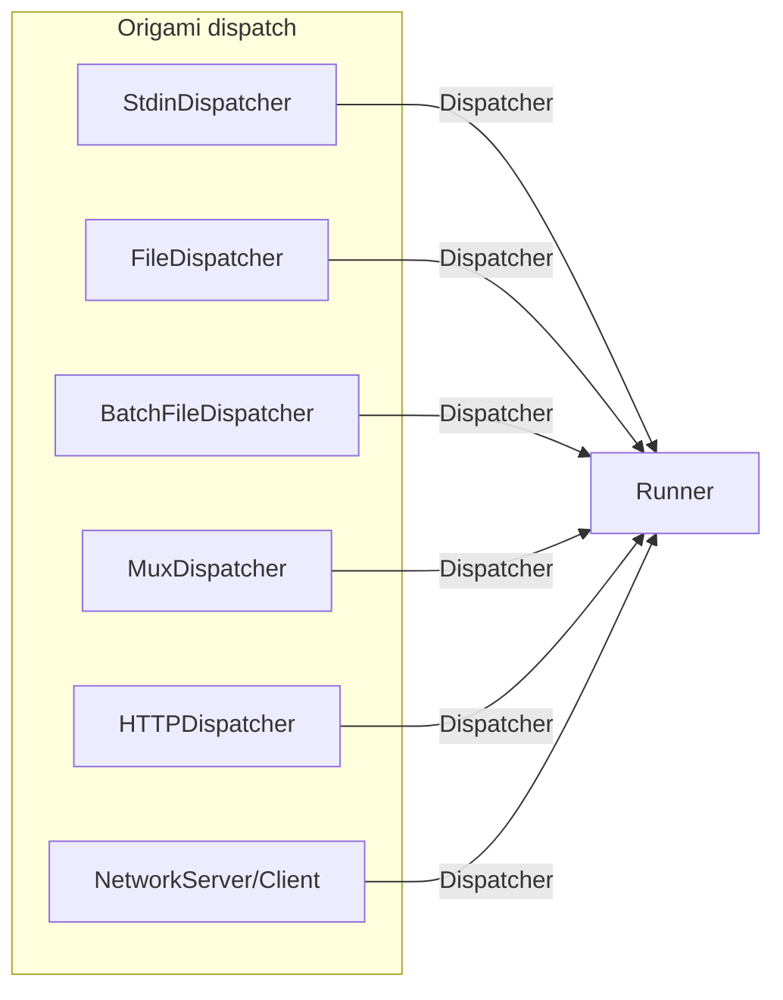
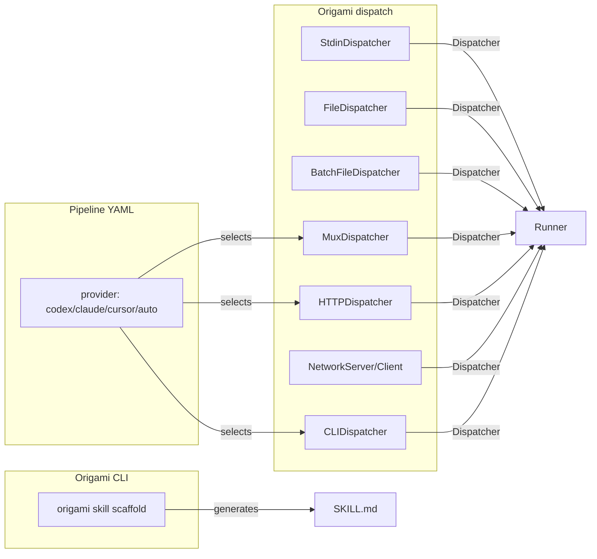

# Contract — origami-cursor-first-architecture

**Status:** active  
**Goal:** Make Origami treat Cursor as a first-class citizen: CLIDispatcher for external LLM providers, `origami skill scaffold` for automatic SKILL.md generation, and `provider:` routing for per-step LLM selection.  
**Serves:** Framework Maturity

## Contract rules

- CLIDispatcher MUST implement the `Dispatcher` interface — same as Stdin, HTTP, Mux.
- Skill scaffolding MUST produce a valid SKILL.md from a pipeline YAML without manual editing.
- Provider routing MUST be optional — pipelines without `provider:` fields work unchanged.
- All new code MUST have unit tests. No untested dispatcher.
- The BYO principle applies: Origami provides interfaces and batteries, consumers bring implementations.

## Context

- `dispatch/dispatch.go` — `Dispatcher` interface, `DispatchContext`, `ExternalDispatcher`.
- `dispatch/http.go` — `HTTPDispatcher` as prior art for API-based dispatch.
- `dispatch/mux.go` — `MuxDispatcher` for channel-based MCP bridge.
- `glossary/glossary.mdc` — "Three CLIs" pattern, "BYO Architecture".
- Asterisk `skills/asterisk-calibrate/SKILL.md` — first MCP-based skill, validates the pattern.
- Asterisk `skills/asterisk-analyze/SKILL.md` — original agentic skill, signal protocol reference.

### Current architecture



### Desired architecture



## FSC artifacts

| Artifact | Target | Compartment |
|----------|--------|-------------|
| CLIDispatcher design reference | `docs/cursor-skill-guide.md` | domain |
| Three Skills, Agent Overloading, CLIDispatcher, Provider glossary terms | `glossary/glossary.mdc` | domain |

## Execution strategy

Three phases, ordered by dependency:

1. **Phase 2 — CLIDispatcher** (`dispatch/cli.go`): Shell out to CLI-based LLM tools (Codex, Claude). Read prompt from file, pipe to CLI, capture output. Timeout + context cancellation.
2. **Phase 3 — Skill scaffolding** (`cmd/origami/cmd_skill.go` + `docs/cursor-skill-guide.md`): Parse pipeline YAML, generate SKILL.md template with MCP tools, node-to-step mapping, artifact schemas.
3. **Phase 4 — Provider routing**: Add optional `provider:` field to pipeline YAML node definitions. Route each step to the appropriate dispatcher based on provider config.

## Coverage matrix

| Layer | Applies | Rationale |
|-------|---------|-----------|
| **Unit** | yes | CLIDispatcher: mock command execution, timeout, error paths. Scaffold: parse YAML, generate SKILL.md. |
| **Integration** | yes | CLIDispatcher + real `echo` command as smoke test. Scaffold + example pipeline YAML. |
| **Contract** | yes | `Dispatcher` interface compliance for CLIDispatcher. |
| **E2E** | N/A | Consumer-level E2E (Asterisk/Achilles) validates the full chain. |
| **Concurrency** | N/A | CLIDispatcher is stateless; one process per dispatch. |
| **Security** | yes | CLI command injection, API key handling in environment. |

## Tasks

- [x] Implement `CLIDispatcher` in `dispatch/cli.go` with `exec.CommandContext`, timeout, stderr capture.
- [x] Write `dispatch/cli_test.go` — 8 tests: valid/invalid command, options, echo, args, missing prompt, failure, timeout, empty output.
- [x] Implement `origami skill scaffold` command in `cmd/origami/cmd_skill.go`.
- [x] Write `docs/cursor-skill-guide.md` — developer guide for building Cursor Skills from Origami pipelines.
- [x] Add optional `provider:` field to `NodeDef` in `dsl.go`, propagate through `transformerNode.Process` into `TransformerContext.Meta["provider"]`.
- [x] Implement `ProviderRouter` dispatcher in `dispatch/provider.go` — routes by provider name, falls back to default.
- [x] Write `dispatch/provider_test.go` — 5 tests: default route, named route, unknown, register, empty provider.
- [x] Add `Provider` field to `DispatchContext` in `dispatch/dispatch.go`.
- [x] Add glossary terms: Three Skills, Agent Overloading, CLIDispatcher, Provider, ProviderRouter.
- [x] Validate (green) — all 13 packages pass, all 3 repos build clean.
- [ ] Tune (blue) — refactor for quality.
- [ ] Validate (green) — all tests still pass after tuning.

## Acceptance criteria

```gherkin
# CLIDispatcher
Given a pipeline step configured with provider: codex
  And the CODEX_CLI environment variable points to a valid binary
When the dispatcher executes the step
Then it shells out to the CLI, pipes the prompt, and returns the artifact JSON
  And respects context cancellation and timeout

# Skill scaffold
Given a pipeline YAML file with 4 nodes (scan, classify, assess, report)
When the user runs "origami skill scaffold pipeline.yaml"
Then it generates a SKILL.md with MCP tool call instructions for each node
  And includes artifact schemas derived from node output types
  And includes subagent delegation instructions per the agent bus protocol

# Provider routing
Given a pipeline YAML with nodes using different provider: values
When the pipeline runs
Then each node dispatches to the correct backend (cursor -> Mux, codex -> CLI, openai -> HTTP)
  And nodes without provider: use the default dispatcher
```

## Security assessment

| OWASP | Finding | Mitigation |
|-------|---------|------------|
| A03:2021 Injection | CLIDispatcher shells out to external commands | Use `exec.CommandContext` with explicit args (no shell interpolation). Validate command path exists. |
| A07:2021 Auth failures | API keys for external providers | Keys via environment variables only; never logged or included in artifacts. |

## Notes

2026-02-23 23:10 — Created. Scope: CLIDispatcher + skill scaffold + provider routing. Aligned with "Cursor as first-class citizen" vision from user session.
2026-02-23 23:18 — All implementation tasks complete. CLIDispatcher (6 tests), skill scaffold (2 CLI tests), ProviderRouter (5 tests), provider field on NodeDef. All 13 Origami packages pass. Asterisk and Achilles both build clean. Remaining: tune + final validate.
