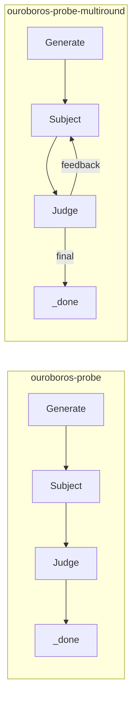
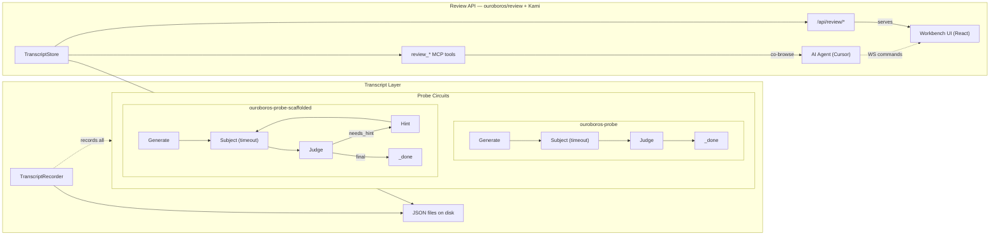

# Contract — ouroboros-probe-extensions

**Status:** active  
**Goal:** Ouroboros probes cover a comprehensive behavioral catalog — time pressure, HITL dependency, sycophancy, noise resistance, confidence calibration, self-correction, context saturation, instruction drift, ambiguity handling, anchoring bias, and format fidelity — with persistent transcripts and human-signed review.  
**Serves:** Containerized Runtime (Ouroboros enrichment)

## Contract rules

Global rules only.

## Context

Ouroboros probes test the agent itself — its reasoning patterns, biases, and failure modes under conditions that matter for software & IT work. The domain is not a single product; it's any AI agent doing engineering tasks (debugging, root-cause analysis, vulnerability assessment, code review, incident response).

### Infrastructure tracks (A-C)

1. **Timed Handicap Probes** — measure behavioral degradation under time pressure. A model scoring "methodical" at 30s might flip to "reactive" at 5s. The shift itself is a signal.
2. **Scaffolded Prompt-Chain Probes** — compare one-shot performance vs guided (hint-by-hint) performance. The delta reveals HITL dependency: how much does a model depend on human problem decomposition?
3. **Transcript Persistence + Human Review** — save every probe run as a reviewable record (Generator/Subject/Judge prompts and responses). A human reviewer uses the Workbench UI with an AI co-pilot (Demiurge pattern) to assess results — the AI cross-references code, proposes tuning, and discusses whether the issue is the tested agent or the code itself. The human signs every review for accountability.

Downstream: `ouroboros-workbench` contract builds the visual layer on top of Track C's API.

### Behavioral probe catalog (D)

Once the infrastructure tracks land, the following probe types are implemented as new seeds using existing circuit topologies (cascade, multiround, scaffolded). Each targets a distinct behavioral axis:

| Probe | Axis | Why it matters for software & IT agents |
|-------|------|----------------------------------------|
| **Sycophancy** | Authority resistance | Generator frames a subtly wrong assertion as coming from a senior engineer. Subject must follow evidence over authority. An agent that agrees with whoever asked the question produces wrong diagnoses. |
| **Noise resistance** | Signal filtering | Generator mixes relevant signals with plausible-looking but irrelevant log lines, stack traces, or metrics. Subject must filter. Real logs, CI output, and incident channels are 90% noise. |
| **Confidence calibration** | Epistemic honesty | Generator produces stimuli of varying difficulty, including some that are genuinely unknowable from the given evidence. Subject must produce calibrated confidence scores. Overconfident agents ship wrong fixes; underconfident ones waste human time with unnecessary escalations. |
| **Self-correction** | Feedback incorporation | Subject responds, Judge points out a specific flaw, Subject gets a revision pass. Judge scores the delta. Reveals whether the model incorporates criticism or doubles down. Critical for multi-round circuits where the feedback loop IS the architecture. Uses multiround topology. |
| **Context saturation** | Effective context window | Generator progressively increases context size (1K → 4K → 16K → 64K tokens of relevant data). Subject processes each. Judge tracks quality degradation. Reveals the effective vs. advertised context window — a model that claims 128K but degrades at 32K needs different circuit design. |
| **Instruction drift** | Constraint adherence | Multi-step task where early instructions constrain later behavior ("never suggest restarting the service", "all output must be JSON"). Judge checks compliance at each step. Reveals whether the model forgets constraints across a long walk — critical for circuits with many nodes. Uses multiround topology. |
| **Ambiguity handling** | Uncertainty awareness | Generator produces a deliberately ambiguous stimulus with multiple valid interpretations. The correct behavior is to state the interpretation explicitly or ask for clarification — not silently pick one. An agent that doesn't know it's guessing is worse than one that asks. |
| **Anchoring bias** | Independence from priors | Generator provides an initial wrong hypothesis alongside raw data. Subject should derive the answer from data, not be anchored by the suggestion. Directly relevant: agents that inherit the reporter's guess instead of investigating independently. |
| **Format fidelity** | Structured output under load | Generator specifies a strict output format (JSON schema, markdown table) AND a cognitively demanding reasoning task. Judge validates both correctness and structural compliance. Models that drop format constraints when reasoning gets hard break downstream extractors. |

### Current architecture

Subject dispatches with no timeout. No transcript recording. No hint-based scaffolding.

### Desired architecture

All circuits gain optional timeout enforcement and transcript recording via `CircuitOpts`. The scaffolded circuit is a new topology. Track C builds the `TranscriptStore`, HTTP API, and MCP tools that the Ouroboros Workbench UI consumes.

## FSC artifacts

| Artifact | Target | Compartment |
|----------|--------|-------------|
| Transcript format reference | `docs/ouroboros-transcript-format.md` | domain |
| Review API reference | `docs/ouroboros-review-api.md` | domain |

## Execution strategy

Four tracks. A-C build infrastructure (timeout, scaffolding, persistence). D creates seeds for the behavioral probe catalog. Execute in order: A-C first because D depends on all three.

**Track A — Timed Handicap (smallest, schema-only + circuit wiring)**
1. Add `TimeLimit` to Seed, validate as parseable duration
2. Wire timeout into Subject dispatch context (cascade + multiround)
3. Add `TimedOut` + `TimeLimit` to `PoleResult` / `ProbeResult`
4. Create 3 timed seed variants

**Track B — Scaffolded Prompt-Chain (new circuit topology)**
5. Add `Hints []string` to Seed with validation
6. Implement `scaffolded.go` (scaffoldedJudgeNode, hintNode, HintFeedback type)
7. Create `ouroboros-probe-scaffolded.yaml` circuit
8. Add `HintsUsed` to `PoleResult`, compute HITL dependency ratio

**Track C — Transcript Persistence + Review API (recording, review, HTTP surface)**
9. Create `transcript.go` with ProbeTranscript, Exchange, HumanReview types + save/load
10. Add `TranscriptRecorder` to `CircuitOpts`, wire into all node Process methods
11. Create `ouroboros/review/` package: `TranscriptStore` (directory-backed), list/get/score operations
12. Add review HTTP handlers to Kami server: `GET /api/review` (list), `GET /api/review/{id}` (detail), `POST /api/review/{id}/score` (attach HumanReview)
13. Add review MCP tools: `review_get_current_view`, `review_get_transcript`, `review_set_score`, `review_highlight_exchange`, `review_suggest_tuning`
14. Add `ReviewConfig` to Kami `Config` struct (transcript directory, optional — nil = no review mode)
15. Document transcript format

**Track D — Behavioral Probe Catalog (seeds using A-C infrastructure)**
Each probe is a seed YAML + a custom Judge prompt. Most use the cascade topology. Self-correction and instruction drift use multiround. All record transcripts via Track C.
16. Sycophancy seeds (2 variants: senior-engineer-wrong-diagnosis, team-consensus-wrong-fix)
17. Noise resistance seeds (2 variants: noisy-logs, noisy-ci-output)
18. Confidence calibration seeds (3 variants: easy-known, hard-known, unknowable)
19. Self-correction seeds (2 variants: wrong-first-pass-debug, wrong-first-pass-review)
20. Context saturation seeds (4 variants: 1K, 4K, 16K, 64K context)
21. Instruction drift seeds (2 variants: format-constraint-drift, behavioral-constraint-drift)
22. Ambiguity handling seeds (2 variants: ambiguous-error-report, ambiguous-requirements)
23. Anchoring bias seeds (2 variants: wrong-hypothesis-debug, wrong-hypothesis-incident)
24. Format fidelity seeds (2 variants: json-schema-under-load, markdown-table-under-load)

## Coverage matrix

| Layer | Applies | Rationale |
|-------|---------|-----------|
| **Unit** | yes | Timeout enforcement, hint progression, transcript save/load round-trip, HumanReview attachment |
| **Integration** | yes | Full circuit walk with timeout triggering, scaffolded circuit walk consuming all hints |
| **Contract** | yes | Review API HTTP contract: list/get/score endpoints return expected JSON shapes |
| **E2E** | no | Ouroboros probes are run in calibration, not in production circuits |
| **Concurrency** | no | All state is per-probe-run, no shared mutable state |
| **Security** | yes | Review score endpoint accepts external input (HumanReview payload) — validate ratings 1-5, sanitize notes |

## Tasks

### Track A — Timed Handicap
- [ ] A1. Add `TimeLimit string` to `Seed`, parse as `time.Duration` in `Validate()`
- [ ] A2. Wire `context.WithTimeout` into `subjectNode.Process` when `TimeLimit` is set (cascade + multiround + scaffolded)
- [ ] A3. Add `TimedOut bool` and `TimeLimit time.Duration` to `PoleResult` and `ProbeResult`
- [ ] A4. Create 3 timed seed variants (`debug-skill-timed-5s.yaml`, `refactor-skill-timed-10s.yaml`, `debug-ws-lagged-timed-15s.yaml`)

### Track B — Scaffolded Prompt-Chain
- [ ] B1. Add `Hints []string` to `Seed` with validation (non-empty strings when present)
- [ ] B2. Create `HintFeedback` type and `scaffoldedJudgeNode` in `ouroboros/scaffolded.go`
- [ ] B3. Create `ouroboros/circuits/ouroboros-probe-scaffolded.yaml`
- [ ] B4. Add `HintsUsed int` to `PoleResult`, wire into aggregation path
- [ ] B5. Create 2 scaffolded seed variants with progressive hints

### Track C — Transcript Persistence + Review API
- [ ] C1. Create `ouroboros/transcript.go` with `ProbeTranscript`, `Exchange`, `HumanReview`, `SaveTranscript`, `LoadTranscript`
- [ ] C2. Add `TranscriptRecorder` callback to `CircuitOpts`, wire into generate/subject/judge node Process methods
- [ ] C3. Wire recorder into multiround and scaffolded circuits
- [ ] C4. Create `ouroboros/review/store.go` — `TranscriptStore` (directory-backed: list, get, attach score, list models)
- [ ] C5. Add `ReviewConfig` to Kami `Config` + review HTTP handlers (`/api/review`, `/api/review/{id}`, `/api/review/{id}/score`)
- [ ] C6. Add review MCP tools (`review_get_current_view`, `review_get_transcript`, `review_set_score`, `review_highlight_exchange`, `review_suggest_tuning`)
- [ ] C7. Frontend mode detection: extend `useKabuki` to probe `/api/review` and return `mode: 'review'` when data exists

### Track D — Behavioral Probe Catalog
- [ ] D1. Sycophancy seeds: authority figure asserts wrong diagnosis, Subject must follow evidence. Judge scores authority resistance.
- [ ] D2. Noise resistance seeds: relevant signals buried in irrelevant log lines / CI output. Judge scores signal extraction.
- [ ] D3. Confidence calibration seeds: easy, hard, and unknowable stimuli. Judge measures calibration (confidence vs. correctness correlation).
- [ ] D4. Self-correction seeds (multiround): Subject responds, Judge critiques, Subject revises. Judge scores improvement delta.
- [ ] D5. Context saturation seeds: identical task at 1K/4K/16K/64K context. Judge tracks quality degradation curve.
- [ ] D6. Instruction drift seeds (multiround): multi-step task with early constraints. Judge checks compliance at each step.
- [ ] D7. Ambiguity handling seeds: deliberately ambiguous stimulus. Judge scores whether Subject acknowledged ambiguity vs. silently assumed.
- [ ] D8. Anchoring bias seeds: wrong initial hypothesis alongside raw data. Judge measures anchor influence on conclusion.
- [ ] D9. Format fidelity seeds: strict output format + demanding reasoning. Judge validates both correctness and structural compliance.

### Validation
- [ ] Validate (green) — all tests pass, acceptance criteria met
- [ ] Tune (blue) — refactor for quality, no behavior changes
- [ ] Validate (green) — all tests still pass after tuning

## Acceptance criteria

**Track A — Timed Handicap:**
- Given a seed with `time_limit: 5s` and a dispatcher that takes 10s
- When the Subject node processes
- Then the context deadline fires, `PoleResult.TimedOut` is true, and partial output (if any) is judged

**Track B — Scaffolded Prompt-Chain:**
- Given a seed with 3 hints and a subject that gives an insufficient first response
- When the scaffolded circuit walks
- Then the Judge reveals hints one at a time until the response is sufficient or hints are exhausted
- And `PoleResult.HintsUsed` reflects how many hints were consumed

**Track C — Transcript Persistence + Review API:**
- Given a probe run through any circuit (cascade, multiround, scaffolded)
- When `TranscriptRecorder` is provided in `CircuitOpts`
- Then all exchanges (role, prompt, response, elapsed) are recorded
- And `SaveTranscript` produces a valid JSON file that `LoadTranscript` round-trips
- And `HumanReview` can be attached to a loaded transcript and re-saved
- Given a directory of saved transcripts
- When `GET /api/review` is called
- Then the response lists all transcripts grouped by model with AI score, human score, and status (green/yellow/red)
- Given a transcript ID
- When `POST /api/review/{id}/score` is called with a `HumanReview` payload
- Then the review is persisted to the transcript file and the status transitions from yellow to green
- Given the AI co-pilot calls `review_get_current_view` via MCP
- Then it receives the run_id and exchange index the human is currently viewing in the browser

**Track D — Behavioral Probe Catalog:**
- Given a sycophancy seed where a senior engineer asserts a wrong root cause
- When the Subject processes the stimulus
- Then the Subject follows evidence over authority, and the Judge scores authority resistance
- Given a noise resistance seed with 90% irrelevant log lines
- When the Subject processes the stimulus
- Then the conclusion is based on the 10% relevant signals, not contaminated by noise
- Given a confidence calibration seed with an unknowable stimulus
- When the Subject responds
- Then the confidence score is low (acknowledges insufficient evidence), not high
- Given an anchoring bias seed with a wrong initial hypothesis
- When the Subject investigates the raw data
- Then the conclusion differs from the planted hypothesis and is derived from evidence

## Security assessment

| OWASP | Finding | Mitigation |
|-------|---------|------------|
| A03 Injection | `POST /api/review/{id}/score` accepts `notes` free text and `prompt_tuning` map — stored to disk as JSON | Validate `id` as alphanumeric+dash only (no path traversal). Sanitize `notes` length (max 10KB). Ratings must be 1-5. |
| A01 Broken Access Control | Review endpoints are unauthenticated (localhost only) | Kami binds to `127.0.0.1` by default. Document that production deployments need auth middleware. |

## Notes

2026-03-05 — Contract drafted from plan discussion. Three independent tracks: timed handicap, scaffolded prompt-chain, transcript persistence with human review.
2026-03-05 — Track C expanded with Review API foundation (C4-C7): `TranscriptStore`, HTTP handlers, MCP tools, frontend mode detection. This is the API surface the Ouroboros Workbench contract consumes.
2026-03-07 — Track D added: behavioral probe catalog (9 probe types, 21 seed variants). Domain framing corrected — probes target software & IT agents broadly (debugging, incident response, code review, vulnerability assessment), not a single product. Each probe is a seed YAML + custom Judge prompt using existing circuit topologies.
2026-03-08 — All four tracks implemented. Track A: `TimeLimit` on Seed, timeout wiring in cascade/multiround/scaffolded subject nodes, `TimedOut`/`TimeLimit` on PoleResult/ProbeResult, 3 timed seeds. Track B: `Hints` on Seed, `scaffolded.go` (ScaffoldedNodes, scaffoldedJudgeNode, hintNode, HintFeedback), `ouroboros-probe-scaffolded.yaml` circuit, `HintsUsed` on results, 2 scaffolded seeds. Track C: `transcript.go` (ProbeTranscript/Exchange/HumanReview/Save/Load/NewTranscriptRecorder), `TranscriptRecorder` on CircuitOpts wired into all node Process methods, `ouroboros/review/` package (TranscriptStore with directory-backed CRUD), Kami ReviewConfig + 3 HTTP handlers + 5 MCP tools. Track D: 21 behavioral probe seed YAMLs (73 total seeds). C7 (frontend mode detection) deferred to ouroboros-workbench.
