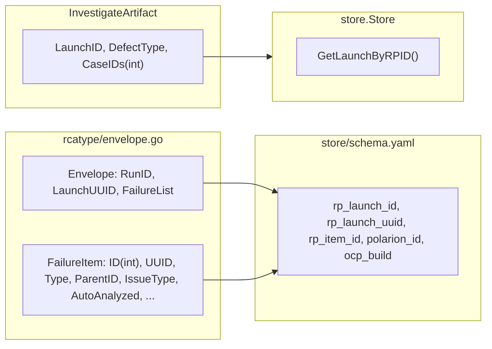
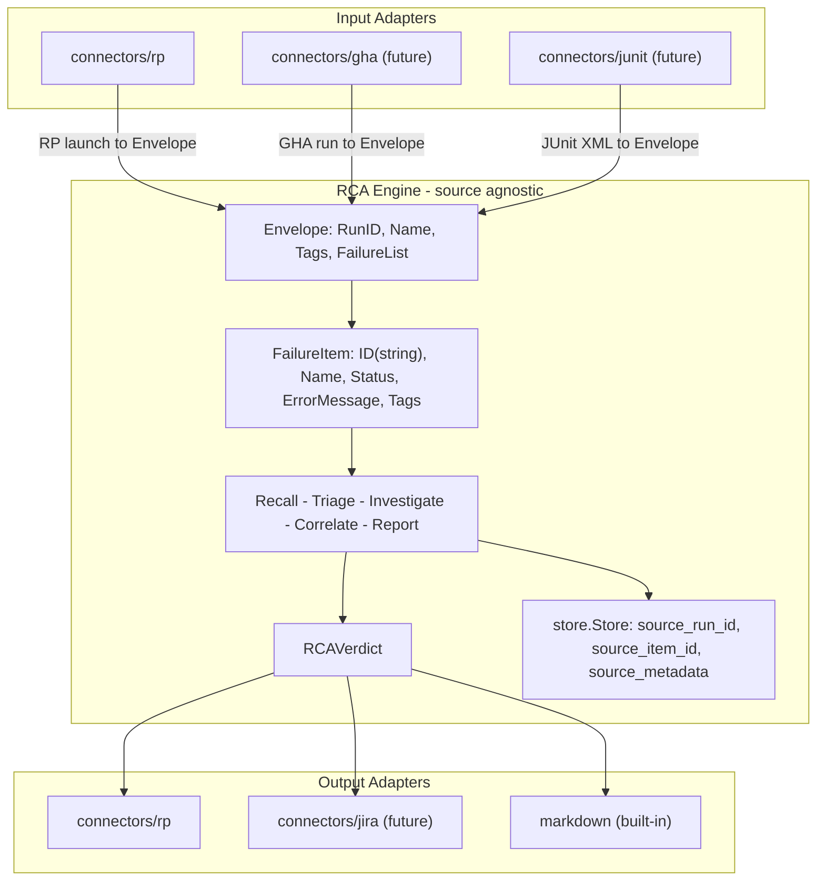

# Contract — sockets-and-plugs-2

**Status:** abandoned  
**Goal:** The RCA schematic's data shapes (Envelope, store schema, RCA output) are source-agnostic — any CI tracker can plug in without touching schematic code.  
**Serves:** API Stabilization (next-milestone)  
**Absorbed by:** `domain-separation-container.md` Phase 5 — genericize processing pipeline (`map[string]any` artifacts, remove all RP-specific data shapes from the engine).

## Contract rules

- Envelope field removals are breaking changes to `rcatype` — all consumers must be updated atomically.
- Store schema changes require a v2-to-v3 YAML migration that runs on existing `.asterisk/asterisk.db` files without data loss.
- No new connector implementations (GHA, JUnit, etc.) — this contract normalizes the boundary; future connectors are separate work.
- Existing Asterisk behaviour must be preserved — the binary works identically before and after.

## Context

Conversation: [Refactor & Decompose](66be52b6-6924-4dad-8855-0f4805f73825) identified that Sockets & Plugs v1 decoupled **import edges** (schematics no longer import connectors) but left **data shapes** coupled to ReportPortal.

Split from: `sockets-and-plugs` (v1 complete, shipped).

Key findings from the audit:

- **Envelope** (`rcatype/envelope.go`): 7 RP-specific fields (`LaunchUUID`, `FailureItem.UUID`, `.Type`, `.ParentID`, `.CodeRef`, `.IssueType`, `.AutoAnalyzed`). Only `rpconv/` touches them — the RCA engine never reads them.
- **Store schema** (`store/schema.yaml`): 6 RP-hardcoded columns (`rp_launch_id`, `rp_launch_uuid`, `rp_item_id`, `polarion_id`, `ocp_build`).
- **Store interface**: `GetLaunchByRPID` — RP in the method name. No other callers outside tests.
- **RCA output** (`InvestigateArtifact`): `LaunchID` field should be `RunID` for consistency with the normalized naming.
- **DefectWriter.Push()**: accepts file path + Jira args — should accept a structured verdict.

### Current architecture

### Desired architecture

## FSC artifacts

| Artifact | Target | Compartment |
|----------|--------|-------------|
| Normalized Envelope design rationale | `docs/` | domain |
| Updated glossary: TestRun, TestFailure, RCAVerdict | `glossary/` | domain |

## Execution strategy

Four sequential streams. Each builds on the previous. Build + test after every stream.

### Stream A: Normalize Envelope to source-agnostic fields

Remove RP-specific fields from the core Envelope type; move them to the RP adapter layer.

1. Add `Tags map[string]string` to `Envelope` for source-specific metadata (replaces `LaunchUUID`).
2. Add `Tags map[string]string` to `FailureItem` for source-specific metadata.
3. Change `FailureItem.ID` from `int` to `string` (opaque identifier — RP passes `strconv.Itoa(itemID)`, other sources pass their native ID).
4. Add `ErrorMessage` and `LogSnippet` fields to `FailureItem` (currently populated late by `rp_source.ResolveRPCases`; should be available at ingestion).
5. Remove from `FailureItem` core: `UUID`, `Type`, `Path`, `CodeRef`, `ParentID`, `IssueType`, `AutoAnalyzed`. Move to `rpconv/` which populates `Tags["rp.uuid"]`, `Tags["rp.type"]`, etc.
6. Remove `LaunchUUID` from `Envelope`. `rpconv/` stores it as `Tags["rp.launch_uuid"]`.
7. Update `rpconv/` to populate the generic fields from RP-specific data and store RP-specific values in Tags.
8. Update `EnvelopeFetcher.Fetch(launchID int)` signature — `launchID` parameter becomes `runID string`.
9. Update all consumers in `schematics/rca/` (hooks, params, cmd/, analysis, cal_runner) to use the normalized fields.
10. Unit test: Envelope roundtrip with Tags, FailureItem with string ID.

### Stream B: Clean store schema (v2-to-v3 migration)

Rename RP-hardcoded columns to source-agnostic names; write migration.

1. In `schema.yaml` (bump to version 3):
   - `circuits.rp_launch_id` → `circuits.source_run_id`
   - `launches.rp_launch_id` → `launches.source_run_id`
   - `launches.rp_launch_uuid` → `launches.source_run_uuid`
   - `jobs.rp_item_id` → `jobs.source_item_id`
   - `cases.rp_item_id` → `cases.source_item_id`
   - `cases.polarion_id` → `cases.external_ref` (JSON text for extensible external references)
   - `versions.ocp_build` → `versions.build_id`
   - Update unique constraints to use new column names.
2. Write `migrations/v2-to-v3.yaml` with `rename_column` operations.
3. Update Go struct field names in `types.go`:
   - `Launch.SourceLaunchID` → `Launch.SourceRunID`
   - `Launch.SourceLaunchUUID` → `Launch.SourceRunUUID`
   - `Job.SourceItemID` (already generic — keep)
   - `Case.SourceItemID` (already generic — keep)
   - `Case.PolarionID` → `Case.ExternalRef`
   - `Version.OCPBuild` → `Version.BuildID`
4. Rename `GetLaunchByRPID` → `GetLaunchBySourceRunID` in `Store` interface + all implementations.
5. Change `SaveEnvelope(launchID int, ...)` → `SaveEnvelope(runID string, ...)` and `GetEnvelope(launchID int, ...)` → `GetEnvelope(runID string, ...)`.
6. Update `SqlStore` and `MemStore` implementations for all renamed columns/methods.
7. Update all callers across `schematics/rca/` and `connectors/rp/`.
8. Unit test: open v2 DB, run migration, verify data preserved with new column names.

### Stream C: Normalize RCA output

Align the investigation artifact and DefectWriter with source-agnostic conventions.

1. Rename `InvestigateArtifact.LaunchID` → `InvestigateArtifact.RunID`.
2. Change `InvestigateArtifact.CaseIDs` from `[]int` to `[]string` (opaque item IDs).
3. Refactor `DefectWriter.Push(artifactPath, jiraTicketID, jiraLink string)` to `DefectWriter.Push(verdict RCAVerdict) (*PushedRecord, error)` where `RCAVerdict` is a structured type containing `RunID`, `CaseIDs`, `RCAMessage`, `DefectType`, `Component`, `ConvergenceScore`, `EvidenceRefs`.
4. Update `DefaultDefectWriter` and `DefectWriterRP` to accept the new signature.
5. Update `cmd_push.go` and all callers.
6. Document in `vocabulary/vocabulary.yaml` that defect type codes are a generic taxonomy; RP adapter maps them to RP project-configured types.
7. Update calibration testdata artifacts (`artifact.json` files) to use `run_id` instead of `launch_id`.

### Stream D: Validate + tune

1. Full build, test-race, lint across Origami, Asterisk, Achilles.
2. v2-to-v3 migration tested on existing DB files (create v2 fixture, run migration, assert).
3. Asterisk `just build` produces working binary.
4. Refactor for quality — no behavior changes.
5. Final validation.

## Coverage matrix

| Layer | Applies | Rationale |
|-------|---------|-----------|
| **Unit** | yes | Envelope roundtrip with Tags, FailureItem string ID, store migration, RCAVerdict serialization, renamed Store methods |
| **Integration** | yes | v2-to-v3 migration on real SQLite DB; `origami fold` + `go build` end-to-end |
| **Contract** | yes | Store interface changes enforced at compile time; DefectWriter new signature checked by Go compiler |
| **E2E** | yes | Asterisk binary works identically with normalized data shapes |
| **Concurrency** | N/A | Data shape changes only — no shared state or parallel paths |
| **Security** | yes | See Security assessment |

## Tasks

- [ ] Stream A — Normalize Envelope: add Tags to Envelope and FailureItem, change ID to string, remove RP-specific fields, update rpconv and all consumers.
- [ ] Stream B — Clean store schema: rename columns, write v2-to-v3 migration, update Go types and Store interface, update all callers.
- [ ] Stream C — Normalize RCA output: rename LaunchID to RunID, change CaseIDs to string, refactor DefectWriter.Push to accept RCAVerdict.
- [ ] Validate (green) — build, test-race, lint across all 3 repos; migration tested on v2 fixture.
- [ ] Tune (blue) — refactor for quality. No behavior changes.
- [ ] Validate (green) — all tests still pass after tuning.

## Acceptance criteria

- **Given** an Envelope created by `rpconv/` from an RP launch, **when** inspected, **then** RP-specific values (`launch_uuid`, `item_type`, `issue_type`, `auto_analyzed`) are in `Tags["rp.*"]`, not in dedicated fields.
- **Given** a `FailureItem`, **when** its `ID` is read, **then** it is a `string` (not `int`), allowing RP items (`"456789"`), GHA steps (`"step-abc"`), or JUnit cases (`"com.example.TestFoo"`) without type conversion.
- **Given** an existing v2 SQLite database, **when** `store.Open()` runs, **then** the v2-to-v3 migration renames columns without data loss and the version is bumped to 3.
- **Given** the store schema after migration, **when** columns are inspected, **then** no column name contains `rp_`, `polarion`, or `ocp_`.
- **Given** an `InvestigateArtifact`, **when** serialized to JSON, **then** the field is `run_id` (not `launch_id`) and `case_ids` contains strings (not ints).
- **Given** a `DefectWriter` implementation, **when** `Push()` is called, **then** it accepts an `RCAVerdict` struct (not a file path).
- **Given** the Asterisk binary built after this contract, **when** used against RP, **then** it behaves identically to the pre-contract binary.

## Security assessment

| OWASP | Finding | Mitigation |
|-------|---------|------------|
| A03:2021 Injection | `Tags` map accepts arbitrary key-value pairs from external sources. Could a malicious tag key/value cause injection? | Tags are stored as JSON text in the DB and rendered into prompts as plain text. No SQL interpolation — parameterized queries only. Prompt injection risk is pre-existing and orthogonal to this contract. |
| A04:2021 Insecure Design | Changing `FailureItem.ID` from `int` to `string` — could this weaken identity guarantees? | IDs are opaque identifiers used for deduplication and lookup, not security boundaries. The dedup key (`project:runID:itemID`) remains deterministic regardless of ID type. |

## Notes

2026-03-04 03:00 — Contract drafted from architectural discussion in [Refactor & Decompose](66be52b6-6924-4dad-8855-0f4805f73825). Audit found 7 RP-specific Envelope fields, 6 RP-hardcoded store columns, 1 RP-named Store method. The RCA engine consumes only generic fields — RP-specific data is adapter-layer baggage that blocks multi-tracker support. First Sockets & Plugs contract (v1) decoupled import edges; this sequel decouples data shapes.
