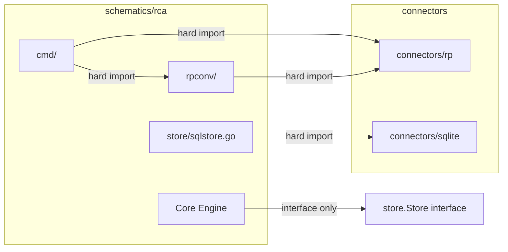
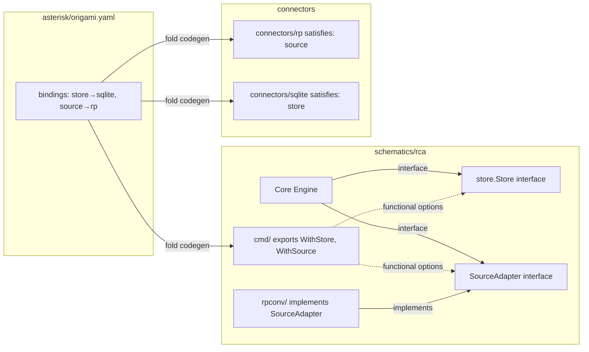

# Contract — sockets-and-plugs

**Status:** abandoned  
**Goal:** Schematics declare typed sockets, connectors declare plugs, product manifests bind them — validated at LSP, lint, and compile layers.  
**Serves:** API Stabilization (next-milestone)  
**Superseded by:** `domain-separation-container.md` — EE abstraction stack (topology → socket types → schematic → connectors → implementation) provides a richer model. Future "Topology layer" contract formalizes the validation engine.

## Contract rules

- No runtime reflection for wiring — all connector binding is resolved at `origami fold` time via Go's type system.
- Schematics must not import connector packages after this contract. Only the generated `main.go` bridges both.
- Existing Asterisk behaviour must be preserved — the binary works identically before and after.

## Context

Conversation: [Refactor & Decompose](66be52b6-6924-4dad-8855-0f4805f73825) established the three-level taxonomy (Primitives / Connectors / Schematics). The refactor removed RP naming from generic types but left hard `import` edges from `schematics/rca/cmd/` → `connectors/rp` and `schematics/rca/store/` → `connectors/sqlite`. This contract eliminates those edges.

- `component.go` — existing `ComponentManifest` with `Provides` / `Requires`
- `fold/manifest.go` — existing `Manifest` struct (imports, embed, CLI, serve, demo)
- `fold/codegen.go` — generates `main.go` from manifest
- `lint/` — 24 rules, `Rule` interface, `LintContext`, auto-wired into LSP
- `schematics/rca/store/store.go` — `Store` interface (already decoupled)
- `schematics/rca/rcatype/envelope.go` — `EnvelopeFetcher` interface
- `schematics/rca/cmd/helpers.go` — hardcoded `connectors/rp` imports (7 files total)

### Current architecture

### Desired architecture

## FSC artifacts

| Artifact | Target | Compartment |
|----------|--------|-------------|
| Socket/Plug glossary entries | `glossary/glossary.mdc` | domain |
| Binding lint rule IDs (M1-M4) | `docs/lint-rules.md` | domain |

## Execution strategy

Five sequential streams. Each stream builds on the previous. Build + test after every stream.

### Stream A: Socket/Plug schema

Extend the component manifest with socket and plug declarations.

1. Add `SocketDef` and `SatisfiesDef` types to `component.go`.
2. Extend `ComponentManifest.Requires` with `Sockets []SocketDef`.
3. Add `Satisfies []SatisfiesDef` to `ComponentManifest`.
4. Write `schematics/rca/component.yaml` declaring two sockets: `store` (store.Store) and `source` (SourceAdapter).
5. Write `connectors/rp/component.yaml` with `satisfies: [{socket: source, factory: NewSourceAdapter}]`.
6. Write `connectors/sqlite/component.yaml` with `satisfies: [{socket: store, factory: NewStore}]`.
7. Unit test: parse component.yaml with sockets/satisfies, verify roundtrip.

### Stream B: SourceAdapter interface + decouple imports

Define the source adapter abstraction and remove hard connector imports from the schematic.

1. Define `SourceAdapter` interface in `schematics/rca/` (methods extracted from `rcatype.EnvelopeFetcher` + RP push/fetch patterns in `cmd/helpers.go`).
2. Create `connectors/rp/source.go` implementing `SourceAdapter` (wraps `rpconv` + `rp.Client`).
3. Move SQLite store construction out of `schematics/rca/store/` — `sqlstore.go` and `schema.go` keep `connectors/sqlite` import but are instantiated externally via factory.
4. Refactor `schematics/rca/cmd/` to accept `store.Store` and `SourceAdapter` via functional options instead of constructing `connectors/rp` clients directly.
5. Remove all `connectors/rp` imports from `schematics/rca/cmd/` and `mcpconfig/server.go`.
6. Verify: `go list -deps schematics/rca/cmd` no longer includes `connectors/rp`.

### Stream C: Manifest bindings + fold codegen

Wire the binding mechanism into the build pipeline.

1. Add `Bindings map[string]string` field to `fold.Manifest`.
2. Extend `fold.GenerateMain` template to emit `WithStore(...)` / `WithSource(...)` calls using resolved connector import paths.
3. Export `Option` type and `WithStore`/`WithSource` from `schematics/rca/cmd/`.
4. Update Asterisk `origami.yaml` with `bindings:` section.
5. Unit test: `GenerateMain` with bindings produces correct Go source.
6. Integration test: `fold.Run` with bindings produces a compilable binary.

### Stream D: Lint rules M1-M4

Static validation of socket/binding consistency.

1. Create `lint/rules_binding.go` with four rules:
   - **M1/unbound-socket** (error): schematic socket has no binding in manifest.
   - **M2/unknown-binding** (error): manifest binds a name the schematic doesn't declare.
   - **M3/unsatisfied-connector** (error): connector doesn't declare `satisfies` for bound socket.
   - **M4/missing-connector** (error): binding references an unresolvable FQCN.
2. Extend `LintContext` to resolve `component.yaml` files via FQCN (reuse `fold.ModuleRegistry`).
3. Register rules in the `strict` profile.
4. LSP inherits automatically — `computeDiagnostics` calls `lint.Run()`.
5. Unit tests for each rule: positive case (finding emitted) + negative case (no finding).

### Stream E: Validate + tune

1. Full build, test-race, lint across Origami, Asterisk, Achilles.
2. Asterisk `just build` produces working binary with binding-based wiring.
3. Refactor for quality — no behavior changes.
4. Final validation.

## Coverage matrix

| Layer | Applies | Rationale |
|-------|---------|-----------|
| **Unit** | yes | Socket/satisfies YAML parsing, lint rules M1-M4, codegen template output, SourceAdapter interface |
| **Integration** | yes | fold + go build with bindings end-to-end |
| **Contract** | yes | Go interface satisfaction enforced at compile time — no runtime checks needed |
| **E2E** | yes | Asterisk binary works identically with binding-based wiring |
| **Concurrency** | N/A | Build-time only — no shared state or parallel paths |
| **Security** | yes | Factory injection surface — see Security assessment |

## Tasks

- [ ] Stream A — Socket/Plug schema: extend ComponentManifest, write component.yaml files, unit test parsing.
- [ ] Stream B — SourceAdapter interface: define interface, implement in connectors/rp, decouple cmd/ imports.
- [ ] Stream C — Manifest bindings + fold codegen: add Bindings to Manifest, extend GenerateMain, update Asterisk.
- [ ] Stream D — Lint rules M1-M4: rules_binding.go, LintContext FQCN resolution, unit tests.
- [ ] Validate (green) — build, test-race, lint across all 3 repos.
- [ ] Tune (blue) — refactor for quality. No behavior changes.
- [ ] Validate (green) — all tests still pass after tuning.

## Acceptance criteria

- **Given** a schematic declares `requires.sockets: [{name: store}]` and no binding exists in the product manifest, **when** `origami lint --profile strict` runs, **then** M1/unbound-socket error is reported.
- **Given** a product manifest has `bindings: {store: origami.connectors.sqlite}`, **when** `origami fold` runs, **then** the generated main.go contains `WithStore(sqlconn.NewStore)`.
- **Given** the generated main.go, **when** `go build` runs, **then** the Go compiler verifies interface satisfaction statically (no reflection).
- **Given** a connector factory returns a type that does not implement the socket interface, **when** `go build` runs, **then** compilation fails with a type mismatch error.
- **Given** an Asterisk manifest with `bindings: {store: origami.connectors.sqlite, source: origami.connectors.rp}`, **when** `just build` runs, **then** the output binary behaves identically to the pre-contract hardcoded binary.
- **Given** `schematics/rca/cmd/` after this contract, **when** `go list -deps` is inspected, **then** `connectors/rp` and `connectors/sqlite` do not appear.

## Security assessment

| OWASP | Finding | Mitigation |
|-------|---------|------------|
| A03:2021 Injection | Connector factories are referenced by FQCN strings in YAML — could a malicious FQCN cause code injection? | No. FQCNs are resolved to Go import paths at fold time and compiled statically. The Go compiler validates all imports. No `reflect` or `plugin` loading. |
| A08:2021 Integrity | Could a tampered component.yaml declare a malicious factory? | component.yaml files live in the Go module source tree, covered by `go.sum` checksum verification. Same trust boundary as any Go dependency. |

## Notes

2026-03-04 01:30 — Contract drafted from architectural discussion in Refactor & Decompose session. Three-layer validation (LSP/lint/compile) designed to shift errors left. SourceAdapter interface shape TBD — will be extracted from current `rcatype.EnvelopeFetcher` + RP push patterns during Stream B.
