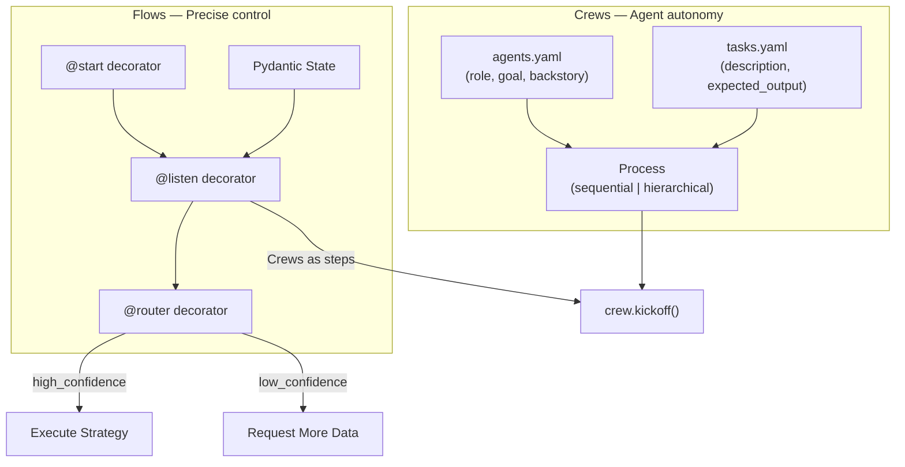
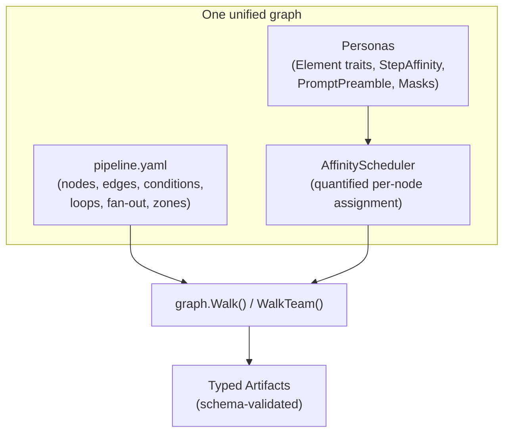

# Contract — Case Study: CrewAI Crews+Flows Duality

**Status:** draft  
**Goal:** Analyze CrewAI's Crews+Flows architecture against Origami's unified graph model, map concepts, identify competitive gaps, and close the three highest-leverage gaps in the framework.  
**Serves:** Polishing & Presentation (nice)

## Contract rules

- The case study document is the primary deliverable. Code changes are secondary.
- Competitive analysis must be evidence-based — cite specific CrewAI features and Origami equivalents.
- Actionable tasks must not duplicate work in existing contracts. Cross-reference explicitly.
- No blind feature copying. Every proposed improvement must justify why Origami's existing architecture is the better foundation.
- CrewAI is the market leader (44.6k stars, 100k+ developers). The analysis must be respectful of their achievements while precise about architectural differences.

## Context

- **CrewAI:** The dominant open-source multi-agent orchestration framework. Python-based, MIT license, 44.6k GitHub stars, 100k+ certified developers, enterprise AMP suite. Dual architecture: Crews (autonomous agent teams) and Flows (event-driven workflows). Source: `github.com/crewAIInc/crewAI`.
- **Market position:** CrewAI is the framework Origami will be compared against. The "engine reveal" must articulate why a Go graph framework with quantified agent traits is architecturally superior to the Python market leader.
- **Existing OmO case study:** `case-study-omo-agentic-arms-race` analyzed a prompt-engineering harness. CrewAI is a fundamentally different competitor — a proper framework with its own abstractions.
- **Key architectural insight:** CrewAI solved the "autonomy vs control" tension by building two separate systems (Crews for autonomy, Flows for control) and gluing them together with Python code. Origami solved the same tension with one unified system: the graph DSL provides control, walkers provide autonomy.

### CrewAI architecture

Two systems, glued by Python code. Crews handle agent collaboration. Flows handle workflow orchestration. To combine them, you write Python that invokes `crew.kickoff()` inside a Flow listener.

### Origami architecture (equivalent scope)

One system. The DSL provides what Flows provide (conditions, routing, state). Walkers with Personas provide what Crews provide (agent autonomy, role-based behavior). No glue code needed.

## FSC artifacts

| Artifact | Target | Compartment |
|----------|--------|-------------|
| CrewAI case study (competitive analysis) | `docs/case-studies/crewai-crews-and-flows.md` | domain |
| Hierarchical delegation pattern (YAML example) | `testdata/patterns/hierarchical-delegation.yaml` | domain |
| Glossary: "agent-in-YAML", "cross-walk memory", "hierarchical delegation" | `glossary/` | domain |

## Execution strategy

Part 1 writes the case study document (analysis + concept mapping). Part 2 implements three actionable improvements extracted from the analysis. Part 3 validates.

## Coverage matrix

| Layer | Applies | Rationale |
|-------|---------|-----------|
| **Unit** | yes | WalkerDef YAML parsing, MemoryStore get/set, WalkerDef → Walker construction |
| **Integration** | no | No cross-boundary changes |
| **Contract** | yes | WalkerDef schema (new DSL addition), MemoryStore interface |
| **E2E** | no | Pattern documentation + small API additions |
| **Concurrency** | yes | MemoryStore must be safe for concurrent walker access |
| **Security** | no | No trust boundaries affected |

## Tasks

### Part 1 — Case study document (complete)

- [x] **CS1** Write `docs/case-studies/crewai-crews-and-flows.md`
- [x] **CS2** Update `docs/case-studies/index.mdc` to include the new document

### Part 2 — Actionable improvements (extracted)

Implementation tasks extracted to dedicated feature contract:

- **Gap 1 (WalkerDef) + Gap 2 (MemoryStore) + Gap 3 (Hierarchical delegation)** → `walker-experience` contract

### Part 3 — Validate and tune

- [ ] **V1** Validate (green) — case study document is complete and accurate.
- [ ] **V2** Tune (blue) — Review case study for tone (respectful of CrewAI's scale, precise about architectural differences).
- [ ] **V3** Validate (green) — no regressions after tuning.

## Acceptance criteria

**Given** the case study document at `docs/case-studies/crewai-crews-and-flows.md`,  
**When** a reader familiar with CrewAI reads it,  
**Then** they understand: how CrewAI's dual architecture maps to Origami's unified graph, where Origami is architecturally superior, where Origami has gaps, and what three improvements close those gaps.

**Given** a pipeline YAML with a `walkers:` section defining two walkers (water/seeker and fire/herald),  
**When** `LoadPipeline` and `BuildWalkersFromDef` are called,  
**Then** two `Walker` instances are returned with correct element, persona, and preamble.

**Given** a `MemoryStore` with a value set during walk 1 for walker "seeker",  
**When** walk 2 starts with the same walker identity and calls `Memory().Get("seeker", "key")`,  
**Then** the value from walk 1 is returned. A different walker identity returns nothing.

**Given** `testdata/patterns/hierarchical-delegation.yaml`,  
**When** loaded with `LoadPipeline` and built with `BuildGraphWith`,  
**Then** the graph has a coordinator node, parallel fan-out edges to 2+ specialist nodes, and a merge node.

## Security assessment

No trust boundaries affected. WalkerDef reads local YAML. MemoryStore is in-process with no persistence beyond the process lifetime. The hierarchical delegation pattern is a YAML example.

## Notes

2026-02-25 — Part 2 implementation tasks extracted to `walker-experience` contract. Part 1 (case study document) complete. Case study contract is now analysis-only with cross-references to the feature contract.

2026-02-25 — Contract created from competitive analysis of CrewAI (`github.com/crewAIInc/crewAI`, 44.6k stars). CrewAI is the dominant multi-agent framework. Its Crews+Flows duality (two systems for autonomy vs control) vs Origami's unified graph (one system for both) is the central architectural comparison. Three gaps identified: agent-in-YAML (WalkerDef), cross-walk memory (MemoryStore), hierarchical delegation pattern. CrewAI's scale (100k+ developers, enterprise AMP) is a market advantage Origami addresses through architectural depth rather than ecosystem breadth.
