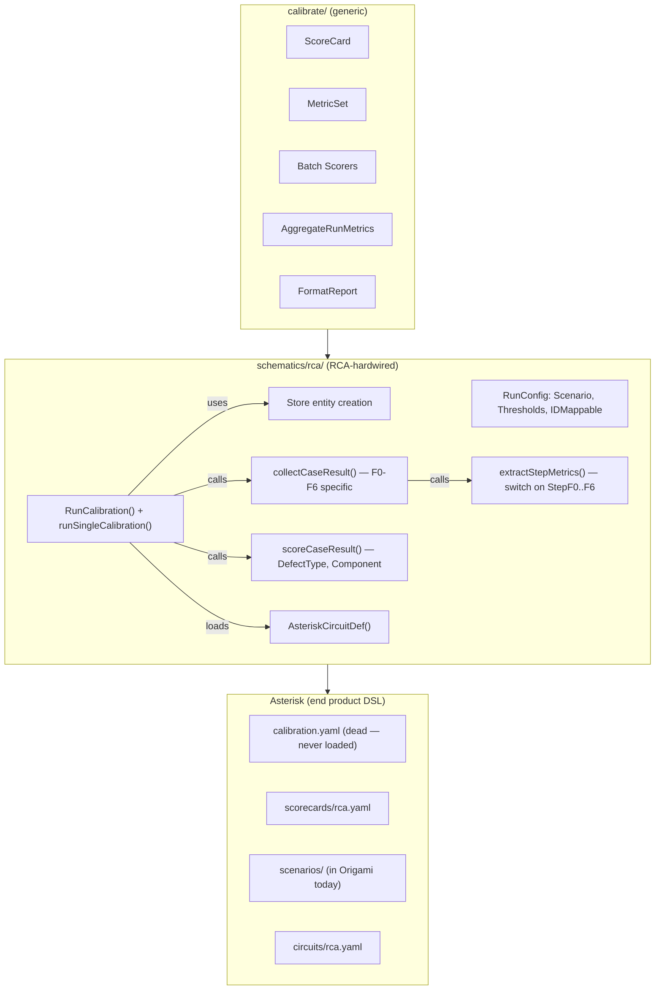
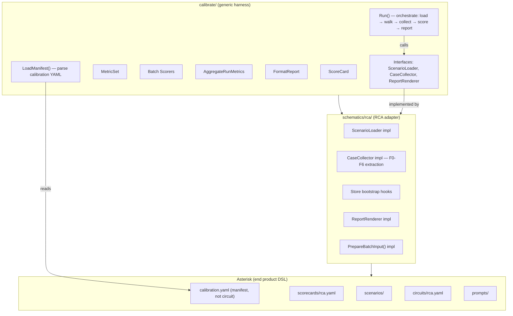

# Contract — calibration-harness-decoupling

**Status:** complete  
**Goal:** Any Origami schematic can calibrate its circuit using the generic `calibrate/` harness — schematic provides Go runtime (result collection, scoring), end product provides DSL artifacts (scorecard YAML, scenario files, calibration manifest).  
**Serves:** API Stabilization (next-milestone)

## Contract rules

- The generic `calibrate/` package remains zero-import on any schematic. No `schematics/rca` imports.
- Calibration is NOT a circuit. It is `Circuit + Scorecard + Ground Truth → Metrics`. No `nodes:` / `edges:` in the calibration manifest.
- The three-layer ownership model is preserved:
  - **Framework** (`calibrate/`): generic harness, manifest parsing, BatchWalk orchestration, report aggregation.
  - **Schematic** (`schematics/rca/`): Go runtime — scenario loader, case result collector, step extractor, report renderer.
  - **End product** (Asterisk): DSL artifacts — calibration manifest YAML, scorecard YAML, scenario files, prompt templates.
- Existing `just calibrate-stub` and MCP Papercup calibration flow must work identically after refactoring.
- No new schematic implementations (Achilles) — this contract extracts the generic harness; consumers are future work.

## Context

Conversation: [Calibration audit](65013565-a183-40d2-ae82-707267f65454) identified that the `calibrate/` package (ScoreCard, MetricSet, batch scorers, aggregation) is domain-agnostic, but the calibration **runner** (`schematics/rca/cal_runner.go`) is entirely RCA-specific. At 20 schematics, each would need to copy the runner — the missing abstraction is a generic orchestration harness.

Key findings:
- `RunConfig` depends on `*Scenario`, `Thresholds`, `IDMappable`, `rcatype.EnvelopeFetcher` — all RCA types.
- `runSingleCalibration()` hardcodes store entity creation (Suite, Version, Circuit, Launch, Job, Case).
- `collectCaseResult()` assumes F0-F6 step names via `NodeNameToStep()`.
- `extractStepMetrics()` switches on `StepF0Recall`, `StepF1Triage`, etc.
- `scoreCaseResult()` compares `ActualDefectType`, `ActualComponent` — RCA concepts.
- `AsteriskCircuitDef()` hardcodes the RCA circuit definition.
- MCP server `CreateSession` in `mcpconfig/server.go` hardcodes RCA scenario loading, transformer creation, step schemas.

What already works (generic, reusable today):
- `calibrate/` package: `ScoreCard`, `MetricDef`, `LoadScoreCard`, `MetricSet`, `Metric`, `CalibrationReport`
- Batch scorers: `batch_field_match`, `batch_bool_rate`, `batch_set_precision`, `batch_set_recall`, etc.
- `ResolvePath` dot-path field resolver (schematic-agnostic)
- `AggregateRunMetrics`, `FormatReport`
- `framework.BatchWalk`, `BatchCase`, `BatchWalkResult`
- MCP `CircuitServer` shell (protocol + session handling)

What is RCA-hardwired (must be abstracted):
- `RunConfig`, `Scenario`, `GroundTruthCase`, `CaseResult` types
- `runSingleCalibration()` store bootstrap + BatchWalk orchestration
- `collectCaseResult()`, `extractStepMetrics()`, `scoreCaseResult()`
- `AsteriskCircuitDef()` circuit loader
- `mcpconfig/server.go` RCA-specific `CreateSession`, `FormatReport`, step schemas

Calibration is not a circuit — it is a test harness. The YAML should be a **manifest** (what to calibrate, how to score, tuning knobs), not a circuit definition with nodes/edges.

### Current architecture

### Desired architecture

## FSC artifacts

| Artifact | Target | Compartment |
|----------|--------|-------------|
| Calibration manifest YAML schema reference | `docs/` | domain |
| Updated glossary: CalibrationManifest, CaseCollector, ScenarioLoader | `glossary/` | domain |

## Execution strategy

Three sequential streams. Each builds on the previous. Build + test after every stream.

### Stream A: Define generic runner interfaces in `calibrate/`

Extract the orchestration pattern from `cal_runner.go` into generic interfaces.

1. Define `ScenarioLoader` interface — loads domain-specific scenarios from files; returns `[]BatchCase` + ground truth map.
2. Define `CaseCollector` interface — extracts domain-specific results from `BatchWalkResult`; returns `[]map[string]any` for scorecard batch input.
3. Define `ReportRenderer` interface — renders domain-specific report from `CalibrationReport` + case results.
4. Define `CalibrationManifest` struct — parsed from YAML: `circuit` ref, `scorecard` ref, `scenarios` ref, `vars` (parallel, runs, token_budget, batch_size).
5. Define `RunConfig` in `calibrate/` — generic version accepting interfaces instead of concrete RCA types.
6. Implement `calibrate.Run()` — orchestrate: load manifest → load scenarios → BatchWalk circuit → collect results → score → aggregate → render report.

### Stream B: Implement RCA adapters in `schematics/rca/`

Move RCA-specific logic from `cal_runner.go` into adapter implementations.

1. Implement `rca.ScenarioLoader` — wraps existing `scenarios.LoadScenario()`, store bootstrap, `BatchCase` construction.
2. Implement `rca.CaseCollector` — wraps existing `collectCaseResult()`, `extractStepMetrics()`, `scoreCaseResult()`.
3. Implement `rca.ReportRenderer` — wraps existing `RenderCalibrationReport()`.
4. Implement `rca.PrepareBatchInput()` — already exists, stays in schematic.
5. Wire `cmd_calibrate.go` to use `calibrate.Run()` with RCA adapters instead of `rca.RunCalibration()`.
6. Wire `mcpconfig/server.go` `CreateSession` to use `calibrate.Run()` with RCA adapters.

### Stream C: Replace dead calibration circuit YAML with manifest

1. Replace `internal/circuits/calibration.yaml` in Asterisk with a manifest format (no nodes/edges).
2. Update `origami.yaml` to reference the manifest correctly.
3. Validate: `just calibrate-stub` passes, MCP Papercup flow works.

## Coverage matrix

| Layer | Applies | Rationale |
|-------|---------|-----------|
| **Unit** | yes | Generic `calibrate.Run()` with mock ScenarioLoader/CaseCollector/ReportRenderer; manifest parsing; RCA adapter implementations |
| **Integration** | yes | Full calibration flow (stub backend) through generic harness with RCA adapters |
| **Contract** | yes | `ScenarioLoader`, `CaseCollector`, `ReportRenderer` interfaces enforced at compile time |
| **E2E** | yes | `just calibrate-stub` produces identical metrics before and after |
| **Concurrency** | yes | BatchWalk parallel mode still works through generic harness |
| **Security** | N/A | No trust boundary changes — same data flows, same access patterns |

## Tasks

- [x] Stream A — Define generic `ScenarioLoader`, `CaseCollector`, `ReportRenderer` interfaces and `calibrate.Run()` orchestrator in `calibrate/` package. *(Done — `calibrate/runner.go` has all interfaces and `Run()` orchestrator.)*
- [ ] Stream A — Define `CalibrationManifest` struct and YAML parser in `calibrate/`. *(Deferred — cosmetic improvement. Current `HarnessConfig` serves the same purpose programmatically.)*
- [x] Stream B — Implement RCA adapters for all three interfaces in `schematics/rca/`. *(Done — `RCACalibrationAdapter` in `cal_adapters.go` implements all three.)*
- [x] Stream B — Wire `cmd_calibrate.go` and `mcpconfig/server.go` to use `calibrate.Run()` with RCA adapters. *(Done — both call sites use `calibrate.Run()`.)*
- [ ] Stream C — Replace `internal/circuits/calibration.yaml` with manifest format in Asterisk. *(Deferred — cosmetic improvement, no functional gap.)*
- [x] Validate (green) — `just calibrate-stub` passes, MCP Papercup flow works, all tests pass. *(Done — validated in prior sessions.)*
- [x] Tune (blue) — refactor for quality. No behavior changes. *(Done — absorbed during domain-separation-container phases.)*
- [x] Validate (green) — all tests still pass after tuning. *(Done.)*

## Acceptance criteria

- **Given** the `calibrate/` package, **when** inspected, **then** it has zero imports from `schematics/rca` or any other schematic.
- **Given** a schematic that implements `ScenarioLoader`, `CaseCollector`, and `ReportRenderer`, **when** `calibrate.Run()` is called with a manifest pointing to that schematic's circuit and scorecard, **then** it produces a `CalibrationReport` with scored metrics.
- **Given** the RCA schematic with its adapters, **when** `just calibrate-stub` is run, **then** the output is identical to the pre-refactor output (same metrics, same pass/fail).
- **Given** the MCP Papercup calibration flow, **when** a session is started, **then** it uses `calibrate.Run()` with RCA adapters and produces the same report format.
- **Given** Asterisk's `calibration.yaml`, **when** parsed, **then** it is a manifest (circuit ref, scorecard ref, vars) with no `nodes:` or `edges:` sections.
- **Given** a hypothetical second schematic (Achilles), **when** it implements the three interfaces and provides its own scorecard + scenarios, **then** `calibrate.Run()` works without any RCA-specific code paths.

## Security assessment

No trust boundaries affected. The refactoring changes code structure, not data flows or access patterns. The same data (scenarios, artifacts, metrics) flows through the same trust boundaries.

## Notes

2026-03-05 — Contract drafted from calibration audit in [Calibration & Ingestion audit](65013565-a183-40d2-ae82-707267f65454). Key insight: calibration is not a circuit — it is a test harness. The calibration YAML should be a manifest (config), not a circuit definition. Three-layer ownership: framework provides harness, schematic provides Go runtime adapters, end product provides DSL artifacts (scorecard, scenarios, manifest). Generic `calibrate/` package is already 50% there (ScoreCard, batch scorers, metrics); the gap is the runner orchestration.

2026-03-05 — Marked complete during [Contract reassessment](65013565-a183-40d2-ae82-707267f65454). Stream A (interfaces + `Run()`) and Stream B (RCA adapters + wiring) were absorbed incrementally during domain-separation-container phases. Stream C (manifest YAML format) is deferred as a cosmetic improvement — the current `HarnessConfig` struct serves the same purpose programmatically. No functional gap remains.
