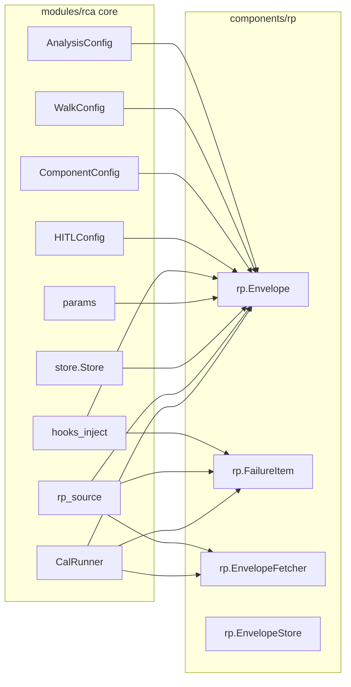
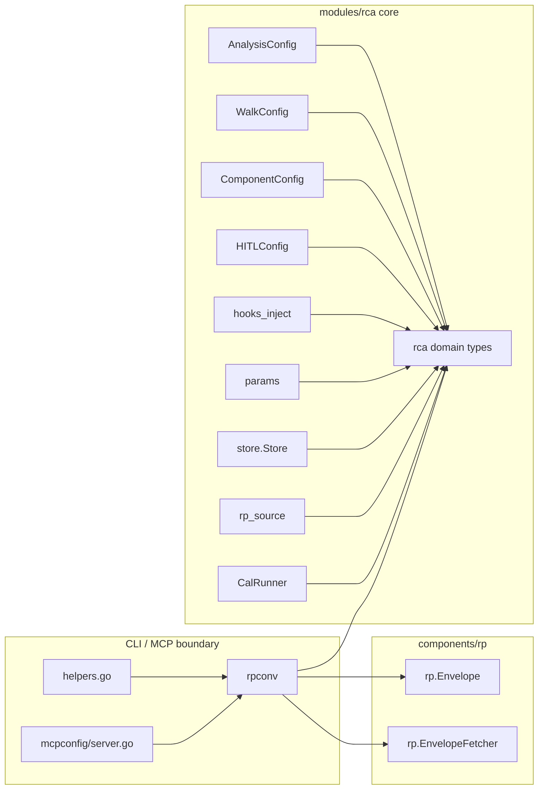

# Contract — decouple-rca-rp

**Status:** complete  
**Goal:** Zero `components/rp` imports in `modules/rca/` core files — RP becomes a pluggable data source wired at the CLI/MCP boundary.  
**Serves:** API Stabilization

## Contract rules

- No `components/rp` import is allowed in `modules/rca/` outside of `cmd/`, `mcpconfig/`, and `rpconv/`.
- RCA domain types must be JSON-serializable and structurally identical to RP types (field-for-field copy) to avoid lossy conversion.
- `store.EnvelopeStoreAdapter` is retained as a GoF adapter; its role changes from trivial forwarding to type conversion.
- Global rules only otherwise.

## Context

- [Adapter-component evaluation](../../notes/adapter-component-evaluation.md) — previous rename analysis revealed deep coupling.
- [Module catalog](../../docs/module-catalog.md) — documents current RCA module structure.
- [Glossary](../../glossary/glossary.mdc) — defines Envelope, Component, ModelBackend.

### Current architecture

### Desired architecture

## FSC artifacts

| Artifact | Target | Compartment |
|----------|--------|-------------|
| Glossary entry for `rca.Envelope` | `glossary/` | domain |
| Module catalog update | `docs/` | domain |

## Execution strategy

Six sequential streams. Each stream builds on the previous.

**Stream A — Define RCA-native domain types.** Create `modules/rca/envelope.go` with `Envelope`, `FailureItem`, `Attribute`, `ExternalIssue` structs and an `EnvelopeFetcher` interface. These are field-for-field copies of the RP types, owned by the RCA domain.

**Stream B — Conversion boundary.** Create `modules/rca/rpconv/` package with `EnvelopeFromRP`, `EnvelopeToRP` conversion functions and an `RPFetcherAdapter` that wraps `rp.EnvelopeFetcher` to return `*rca.Envelope`.

**Stream C — Update RCA core.** Replace all `rp.Envelope` / `rp.FailureItem` / `rp.Attribute` / `rp.ExternalIssue` / `rp.EnvelopeFetcher` references in core files with RCA-native types. Files: `analysis.go`, `walk.go`, `component.go`, `hitl.go`, `params.go`, `hooks_inject.go`, `rp_source.go`, `cal_runner.go`.

**Stream D — Update store layer.** Change `store.Store` interface to use `*rca.Envelope`. Update `memstore.go`, `sqlstore.go`, `adapter.go` (now converts between `rca.Envelope` and `rp.Envelope`), and store tests.

**Stream E — Update CLI/MCP boundary.** Update `cmd/helpers.go`, `cmd/cmd_calibrate.go`, `cmd/cmd_analyze.go`, `mcpconfig/server.go` to use `rpconv` conversion at the boundary.

**Stream F — Documentation and glossary.** Update glossary, module-catalog, contract notes.

## Coverage matrix

| Layer | Applies | Rationale |
|-------|---------|-----------|
| **Unit** | yes | Conversion functions (`EnvelopeFromRP`, `EnvelopeToRP`), store operations with new types, params builders. |
| **Integration** | yes | `store.EnvelopeStoreAdapter` bridge between RCA and RP types. |
| **Contract** | yes | `store.Store` interface signature change; `rca.EnvelopeFetcher` interface. |
| **E2E** | yes | `just calibrate-stub` must pass — validates full circuit with decoupled types. |
| **Concurrency** | yes | `go test -race` on all RCA packages. |
| **Security** | N/A | No trust boundaries affected — this is an internal type refactor. |

## Tasks

- [ ] Stream A — define `rca.Envelope`, `rca.FailureItem`, `rca.Attribute`, `rca.ExternalIssue`, `rca.EnvelopeFetcher` in `modules/rca/envelope.go`.
- [ ] Stream B — create `modules/rca/rpconv/` with `EnvelopeFromRP`, `EnvelopeToRP`, `RPFetcherAdapter`.
- [ ] Stream C — replace `rp.*` types with `rca.*` types in all core files.
- [ ] Stream D — update `store/store.go`, `memstore.go`, `sqlstore.go`, `adapter.go`, and store tests.
- [ ] Stream E — update CLI commands and MCP server to use `rpconv` at the boundary.
- [ ] Stream F — update glossary and module-catalog.
- [ ] Validate (green) — all tests pass, acceptance criteria met.
- [ ] Tune (blue) — refactor for quality. No behavior changes.
- [ ] Validate (green) — all tests still pass after tuning.

## Acceptance criteria

- Given any file in `modules/rca/` outside of `cmd/`, `mcpconfig/`, and `rpconv/`, when I search for `components/rp` imports, then zero matches are found.
- Given a calibration stub run (`just calibrate-stub`), when the run completes, then all metrics pass acceptance thresholds.
- Given the full test suite (`go test -race ./...`), when run after all changes, then zero failures and zero data races.
- Given `origami fold` and `origami lint`, when run on all circuits, then zero new findings.
- Given `rg 'components/rp' modules/rca/ --glob '!cmd/' --glob '!mcpconfig/' --glob '!rpconv/'`, when executed, then the output is empty.

## Security assessment

No trust boundaries affected. This is a pure internal refactoring of type ownership within the same binary. No new inputs, no new serialization boundaries, no new network paths.

## Notes

2026-03-01 22:00 — Contract drafted. Coupling inventory: 20+ files in `modules/rca/` import `components/rp/`. Key types to internalize: `Envelope`, `FailureItem`, `Attribute`, `ExternalIssue`, `EnvelopeFetcher`. Already clean: `rp.Client`, `rp.DefectPusher`, `rp.ReadAPIKey` (CLI-only).

2026-03-02 — Deviation: circular import `rca → store → rca` prevented placing types in `modules/rca/`. Per user decision, types live in `modules/rca/rcatype/` sub-package. Adapter moved from `store/adapter.go` to `rpconv/conv.go` with type conversion logic. All streams A-F executed: 2 new packages created, 14 core/store files updated, 4 CLI/MCP boundary files updated, 2 files deleted.
