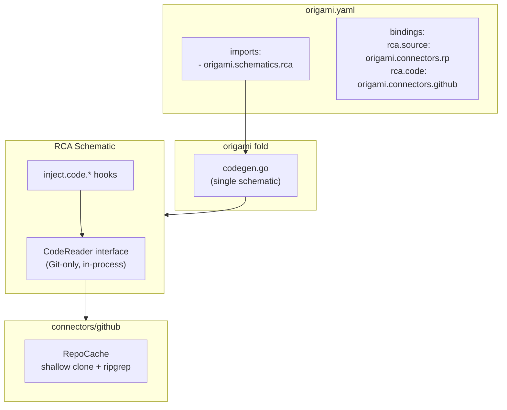
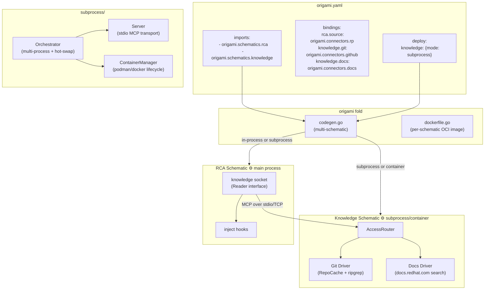
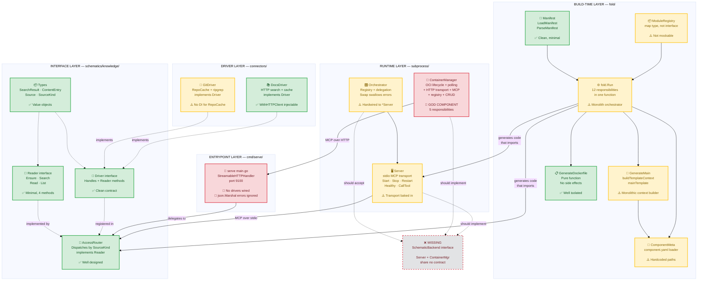
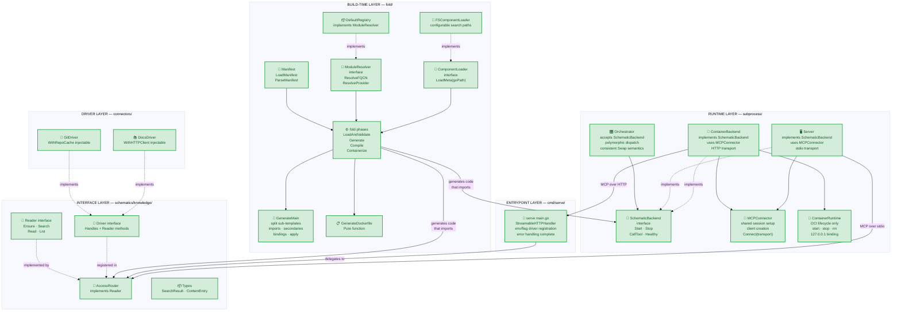

# Contract — decoupled-schematics

**Status:** complete  
**Goal:** Schematics run as independent processes or containers, communicating via MCP, with a unified knowledge layer replacing the Git-only CodeReader.  
**Serves:** API Stabilization — multi-schematic composition is the final framework primitive before surface freeze.

## Contract rules

- **Test-first.** Every phase begins with integration tests that define the expected behavior.
- **Each commit leaves the build green.** Incomplete Go source (e.g. hooks_inject.go WIP) stays unstaged.
- **Origami breaking changes are expected** (PoC era). Delete over deprecate.
- **Deterministic first.** Clone, search, file read, and container lifecycle are deterministic. Only LLM reasoning over fetched knowledge is stochastic.

## Context

Predecessor: Asterisk `knowledge-sources-github.md` — established source packs + shallow-clone cache. User feedback identified two problems:
1. **OCP-specific leaks** in `SourcePack` (Operator field, hardcoded `release-` branch patterns, GitHub URI template).
2. **No web doc support** — OCP docs are HTTP, not Git.

This led to a broader architectural redesign:
- Unified `knowledge.Reader` interface with pluggable drivers (Git, HTTP docs, future: local files).
- Knowledge as its own Origami schematic, decoupled from RCA.
- Extend `fold/codegen` for multi-schematic composition.
- Schematics as independent OS processes or OCI containers, communicating via MCP.

### Current architecture

### Desired architecture

## FSC artifacts

| Artifact | Target | Compartment |
|----------|--------|-------------|
| Multi-schematic codegen design | `docs/multi-schematic-composition.md` | domain |
| Knowledge Reader/Driver interfaces | code (`schematics/knowledge/`) | domain |
| Subprocess/Container lifecycle | code (`subprocess/`) | domain |

## Execution strategy

Seven phases, strictly ordered. Each phase begins with tests, then implementation. Each completed phase leaves the build green.

- **Phase 0** — MCP subprocess transport (independent package, no cross-deps)
- **Phase 1** — Multi-schematic fold/codegen (framework extension)
- **Phase 2** — Knowledge schematic + Git/Docs drivers
- **Phase 3** — Hot-swap (orchestrator, graceful restart)
- **Phase 4** — Containerization (Dockerfile gen, container lifecycle, OCI images)
- **Phase 5** — RCA integration + Asterisk wiring (delete CodeReader, update hooks, wire knowledge schematic)
- **Phase 6** — Architecture hardening (extract interfaces, fix god components, close testability gaps)

## Coverage matrix

| Layer | Applies | Rationale |
|-------|---------|-----------|
| **Unit** | yes | AccessRouter dispatch, Dockerfile generation, driver handle/search/read/list, MCPConnector, ContainerRuntime, SchematicBackend implementations |
| **Integration** | yes | MCP tool call round-trip over stdio, subprocess lifecycle, hot-swap, container start/stop, codegen template output, **MCP → AccessRouter → Driver round-trip (P6.10)** |
| **Contract** | yes | knowledge.Reader, knowledge.Driver, SchematicBackend interface contracts; component.yaml socket/satisfies declarations |
| **E2E** | yes | Full fold → build → run with secondary schematic in subprocess mode |
| **Concurrency** | yes | Orchestrator concurrent CallTool, subprocess restart under load, race detector on all tests |
| **Security** | yes | Container port binding (127.0.0.1 only), subprocess binary path validation, no secrets in MCP payloads |

## Tasks

### Phase 0 — MCP subprocess transport ✅

- [x] P0.1: Write integration tests — two Go processes communicating via MCP over stdio, tool call round-trip, reconnection after process restart
- [x] P0.2: Implement `subprocess.Server` — child process lifecycle (start/stop/restart), MCP client via `sdkmcp.CommandTransport`, health check (ping), `CallTool`
- [x] P0.3: Build + test gate — `go test -race ./subprocess/...` passes

### Phase 1 — Multi-schematic fold/codegen ✅

- [x] P1.1: Write tests — codegen produces `main.go` that constructs secondary schematic and passes it to primary, both in-process and subprocess modes
- [x] P1.2: Add `Deploy map[string]*DeployConfig` to `fold/Manifest`, `Schematic` field to `SocketEntry`, `Factory`/`Serve` fields to `ComponentMeta`
- [x] P1.3: Extend `buildTemplateContext` — partition bindings by schematic namespace, resolve secondaries, generate construction code
- [x] P1.4: Extend `mainTemplate` — conditional subprocess imports, secondary schematic instantiation or `subprocess.Server` wiring
- [x] P1.5: Build + test gate — `go test -race ./fold/...` passes (including integration build)

### Phase 2 — Knowledge schematic + drivers ✅

- [x] P2.1: Define `knowledge.Reader` and `knowledge.Driver` interfaces in `schematics/knowledge/reader.go`
- [x] P2.2: Implement `AccessRouter` in `schematics/knowledge/access_router.go` — dispatches to registered drivers by `SourceKind`
- [x] P2.3: Write `AccessRouter` unit tests — driver dispatch, unknown kind error, delegation correctness
- [x] P2.4: Create `schematics/knowledge/component.yaml` — factory, serve entrypoint, git + docs sockets
- [x] P2.5: Implement `connectors/github/git_driver.go` — wraps existing `RepoCache`, maps `rca.SearchResult`/`TreeEntry` to knowledge types
- [x] P2.6: Create `connectors/docs/` package — HTTP documentation driver for `docs.redhat.com/search/`, HTML-to-text, local cache with TTL
- [x] P2.7: Write `connectors/docs/driver_test.go` — unit tests for Handles, Ensure, Search, Read, List
- [x] P2.8: Update `connectors/github/component.yaml` — add `satisfies: - socket: git, factory: NewGitDriver`
- [x] P2.9: Add `knowledge` socket to `schematics/rca/component.yaml` with `schematic: origami-knowledge`
- [x] P2.10: Build + test gate — `go test -race ./schematics/knowledge/... ./connectors/docs/... ./connectors/github/...` passes

### Phase 3 — Hot-swap ✅

- [x] P3.1: Write tests — replace subprocess binary while orchestrator is running, verify reconnection and behavior change
- [x] P3.2: Implement `subprocess.Orchestrator` — Register, Start, Stop, Swap, CallTool, Healthy, StopAll
- [x] P3.3: Build + test gate — `go test -race ./subprocess/...` passes

### Phase 4 — Containerization ✅

- [x] P4.1: Implement `fold.GenerateDockerfile` — template-based Dockerfile for schematics with `serve` entrypoint
- [x] P4.2: Write Dockerfile generation tests — content assertions, error for missing serve path, default Go version
- [x] P4.3: Implement `subprocess.ContainerManager` — OCI lifecycle via podman/docker (start/stop/swap, port mapping)
- [x] P4.4: Write `ContainerManager` unit tests — default runtime, custom runtime, unknown image error
- [x] P4.5: Create `schematics/knowledge/cmd/serve/main.go` — MCP server via `StreamableHTTPHandler` on `:9100/mcp`
- [x] P4.6: Update `ContainerManager.connectMCP` — use `StreamableClientTransport` to connect to containerized schematic over HTTP
- [x] P4.7: Wire `ContainerManager.CallTool` through the connected `ClientSession`
- [x] P4.8: Write integration tests — Streamable HTTP round-trip (in-process httptest), multi-tool call verification
- [x] P4.9: Add `fold --container` flag to generate Dockerfile alongside `main.go`
- [x] P4.10: Build + test gate — `go test -race ./subprocess/... ./fold/...` passes

### Phase 5 — RCA integration + Asterisk wiring ✅

- [x] P5.1: Generalize `SourcePack` — rename `Operator` → `Domain`, add `Docs []SourcePackDoc`, remove hardcoded OCP conventions
- [x] P5.2: Delete `schematics/rca/code_reader.go` (superseded by `knowledge.Reader`)
- [x] P5.3: Fix `schematics/rca/hooks_inject.go` — replace `WorkspaceParams`/`buildWorkspaceParams` with knowledge-based injection
- [x] P5.4: Update RCA inject hooks to use `knowledge.Reader` for code access instead of `CodeReader`
- [x] P5.5: Update Asterisk `origami.yaml` — add knowledge schematic import + bindings, source packs with doc entries
- [x] P5.6: Full end-to-end test — Asterisk with decoupled knowledge schematic in subprocess mode
- [x] P5.7: Validate (green) — all tests pass, build green across Origami + Asterisk
- [x] P5.8: Tune (blue) — refactor for quality, no behavior changes
- [x] P5.9: Validate (green) — all tests still pass after tuning

### Phase 6 — Architecture hardening ✅

- [x] P6.1: Define `SchematicBackend` interface in `subprocess/backend.go` — `Start`, `Stop`, `CallTool`, `Healthy` (R1)
- [x] P6.2: Extract `MCPConnector` — shared client creation + session setup, parameterized by `sdkmcp.Transport` (R3)
- [x] P6.3: Refactor `Server` to implement `SchematicBackend`, delegate MCP setup to `MCPConnector` (R1, R3)
- [x] P6.4: Split `ContainerManager` → `ContainerRuntime` (OCI lifecycle) + `ContainerBackend` (implements `SchematicBackend`) (R2)
- [x] P6.5: Fix `Swap` port loss — save port before `Stop` (R4)
- [x] P6.6: Bind container ports to `127.0.0.1` (R5)
- [x] P6.7: Align `Swap` error semantics across backends — log warning on stop failure, proceed (R8)
- [x] P6.8: Refactor `Orchestrator` to accept `SchematicBackend` instead of `*Server` (R1)
- [x] P6.9: Wire drivers in serve binary via flag/env, handle `json.Marshal` errors (R6, R7)
- [x] P6.10: Add MCP-to-Router integration test — stub driver → AccessRouter → tool handler → HTTP → client → assert (R9)
- [x] P6.11: Add `WithRepoCache` option to `GitDriver` for unit-test mocking (R12)
- [x] P6.12: Extract `ModuleResolver` interface, share between fold and lint, remove hardcoded `$HOME/Workspace` (R11)
- [x] P6.13: Split `fold.Run()` into `LoadAndValidate`, `Generate`, `Compile` phases (R10)
- [x] P6.14: Make timeouts configurable via options structs (R13)
- [x] P6.15: Build + test gate — `go test -race ./subprocess/... ./fold/... ./schematics/knowledge/...` passes

## Acceptance criteria

**Given** an `origami.yaml` with two imports (`origami.schematics.rca` + `origami.schematics.knowledge`) and bindings for `knowledge.git` and `knowledge.docs`,  
**When** `origami fold` runs,  
**Then** the generated `main.go` constructs the knowledge schematic with both drivers and passes it to the RCA schematic's `WithKnowledgeReader` option.

**Given** `deploy: { knowledge: { mode: subprocess } }` in `origami.yaml`,  
**When** the generated binary starts,  
**Then** the knowledge schematic runs as a child process communicating via MCP over stdio, and the RCA schematic calls `knowledge.Reader` methods transparently.

**Given** a running knowledge subprocess,  
**When** a new binary is swapped in via `Orchestrator.Swap()`,  
**Then** in-flight requests drain gracefully and subsequent calls use the new binary.

**Given** `fold --container` is invoked,  
**When** the knowledge schematic has a `serve` entrypoint,  
**Then** a Dockerfile is generated that builds a distroless OCI image with the schematic binary.

**Given** the RCA schematic with a `knowledge` socket,  
**When** `knowledge.Reader.Search(ctx, src, "holdover", 10)` is called with a Git source,  
**Then** the AccessRouter dispatches to the Git driver which searches the local shallow clone via ripgrep.

**Given** a `SourceKindDoc` source pointing to `docs.redhat.com`,  
**When** `knowledge.Reader.Search(ctx, src, "ptp grandmaster", 5)` is called,  
**Then** the Docs driver queries the search endpoint and returns parsed results.

## Architecture audit (2026-03-03)

### Audit — current state

Color key: 🟢 green = clean, testable. 🟡 yellow = works but has a smell. 🔴 red = god component or broken. ⬜ dashed = missing abstraction.

### Findings summary

| ID | Component | Finding | Severity |
|----|-----------|---------|----------|
| F1 | `ContainerManager` | God component — 5 responsibilities (OCI lifecycle, TCP polling, HTTP transport, MCP session, container registry) | High |
| F2 | `subprocess/` | No shared `SchematicBackend` interface — `Server`, `ContainerManager`, `Orchestrator` share no contract | High |
| F3 | `cmd/serve/main.go` | `NewRouter()` wired with no drivers — standalone serve binary is non-functional | High |
| F4 | `ContainerManager.Swap` | Port loss bug — original port discarded after Stop, hardcodes `9100` | Medium |
| F5 | `container.go` | Binds `0.0.0.0` not `127.0.0.1` — contradicts security assessment | Medium |
| F6 | `Orchestrator` vs `ContainerManager` | `Swap` error semantics differ — Orchestrator swallows stop errors, ContainerManager returns them | Low |
| F7 | `cmd/serve/main.go` | `json.Marshal` errors silently ignored in tool handlers | Low |
| F8 | `fold.Run()` | 12 responsibilities in one function — load, validate, codegen, tempdir, build, container artifacts | Low |
| F9 | `ModuleRegistry` | Concrete map type, not interface — cannot be mocked | Low |
| F10 | `findLocalModule` | Hardcoded `$HOME/Workspace` path, duplicated in `lint/rules_binding.go` | Low |
| F11 | `GitDriver` | No DI for `RepoCache` — unit tests require real git + ripgrep | Low |

### Testability gaps

| Resolution | Gap |
|------------|-----|
| **Unit** | MCP tool handlers in `cmd/serve` untested; `GitDriver` requires real binaries |
| **Integration** | No test wires MCP tool call → AccessRouter → Driver → result (the container critical path) |
| **Container** | `ContainerManager` untestable without podman — no mock runtime |
| **E2E** | Blocked by `hooks_inject.go` compilation errors (Phase 5 dependency) |

### Audit — desired state

### Recommendations

Ordered by priority. Phase 6 tasks map directly to these.

| # | Recommendation | Rationale |
|---|---------------|-----------|
| R1 | **Extract `SchematicBackend` interface** — `Start(ctx) error`, `Stop(ctx) error`, `CallTool(ctx, name, args) (*CallToolResult, error)`, `Healthy(ctx) bool` | Enables `Orchestrator` to manage both `Server` and `ContainerManager` polymorphically. Eliminates the parallel hierarchy. |
| R2 | **Split `ContainerManager` into `ContainerRuntime` + `ContainerBackend`** — runtime handles OCI lifecycle only; backend implements `SchematicBackend` using runtime + `MCPConnector` | Eliminates the god component. Each piece is independently testable. |
| R3 | **Extract `MCPConnector`** — shared MCP client creation and session setup, parameterized by transport | Removes duplication between `Server` and `ContainerManager`. Single place to configure client name, version, options. |
| R4 | **Fix `ContainerManager.Swap` port loss** — save port before `Stop`, pass to new `Start` | Bug fix. Currently hardcodes `9100` after stop deletes the original container. |
| R5 | **Bind containers to `127.0.0.1`** — change `-p port:9100` to `-p 127.0.0.1:port:9100` | Security fix matching the security assessment. |
| R6 | **Wire drivers in serve binary** or add env-based registration — `KNOWLEDGE_DRIVER=git,docs` or flag-based `--driver git --driver docs` | Without drivers, the standalone serve binary is non-functional. |
| R7 | **Handle `json.Marshal` errors** in serve tool handlers | Silent data loss on marshal failure. |
| R8 | **Align `Swap` semantics** — both `Orchestrator.Swap` and `ContainerBackend.Swap` should have identical error behavior (propose: log warning, proceed) | Inconsistent behavior surprises callers. |
| R9 | **Add MCP-to-Router integration test** — test that wires: stub driver → AccessRouter → MCP tool handler → Streamable HTTP → client CallTool → assert result | Covers the container critical path end-to-end without requiring podman. |
| R10 | **Split `fold.Run()`** into `LoadAndValidate`, `Generate`, `Compile` phases | Reduces cognitive load; each phase independently testable. |
| R11 | **Extract `ModuleResolver` interface** from `findLocalModule` — injectable, shared between fold and lint | Eliminates hardcoded `$HOME/Workspace` and duplicated logic. |
| R12 | **Add `WithRepoCache` option** to `GitDriver` | Enables unit testing without real git/ripgrep binaries. |
| R13 | **Make timeouts configurable** — 10s poll, 30s HTTP, 5s terminate, 2s ping | Hardcoded values limit tuning in different environments. |

## Security assessment

| OWASP | Finding | Mitigation |
|-------|---------|------------|
| A01 Broken Access Control | Subprocess binary path could be manipulated | Binary path validated at registration. No user-supplied paths at runtime. |
| A03 Injection | Container image name from YAML used in `podman run` | Image name passed as argument, not interpolated in shell. Only manifest-declared images accepted. |
| A05 Security Misconfiguration | Container port binding exposes MCP on localhost | Bind to `127.0.0.1` only. Container network isolated by default. |
| A07 SSRF | Docs driver fetches arbitrary URLs from source config | URLs must match configured domain patterns. Source packs are operator-controlled YAML, not user input. |
| A09 Logging/Monitoring | MCP payloads between processes could contain sensitive data | No secrets in MCP tool arguments. Knowledge content (code, docs) stays in-process memory, not logged. |

## Notes

2026-03-03 — Architecture audit. Post-Phase-4 review identified `ContainerManager` as a god component (5 responsibilities), missing `SchematicBackend` interface, `Swap` port-loss bug, security mismatch (0.0.0.0 vs 127.0.0.1), and serve binary wired with no drivers. Added Phase 6 (architecture hardening) with 15 tasks addressing 13 recommendations. Current-state and desired-state mermaid diagrams added to the contract. Phase 4 checkboxes corrected (all complete since `f434141`).

2026-03-05 — Transport decision: Streamable HTTP over raw TCP. The MCP Go SDK (v1.3.1) provides `StreamableHTTPHandler` (server) and `StreamableClientTransport` (client) out of the box. No custom transport code needed. TCP via `IOTransport` would require building our own TCP accept loop. Streamable HTTP is MCP spec-compliant, container-native, and supports health checks via GET. Moved `cmd/serve/main.go` from Phase 5 to Phase 4 since it's needed for container integration tests.

2026-03-05 — Retroactive contract. Phases 0–3 and partial Phase 4 were implemented and shipped before this contract was written. Committed as `3f33b71` (subprocess package) and `bece4c5` (fold multi-schematic + knowledge + drivers + testdata). Phase 4 containerization has Dockerfile generation and ContainerManager scaffolding but lacks TCP MCP transport and full integration tests. Phase 5 (RCA integration) not started — `hooks_inject.go` has pre-existing compilation errors from the workspace-to-sources rename that remain unstaged.

2026-03-04 — User feedback: "knowledge source pack is overly optimized for OCP & OCP Operators" and "OCP docs aren't a GitHub repo but just an HTTP website." This triggered the generalization from Git-only CodeReader to unified Reader/Driver with pluggable backends. User selected "schematic-now" (knowledge as its own schematic), "extend-origami" (fold multi-schematic codegen), and "container-now" (OCI support in scope).
