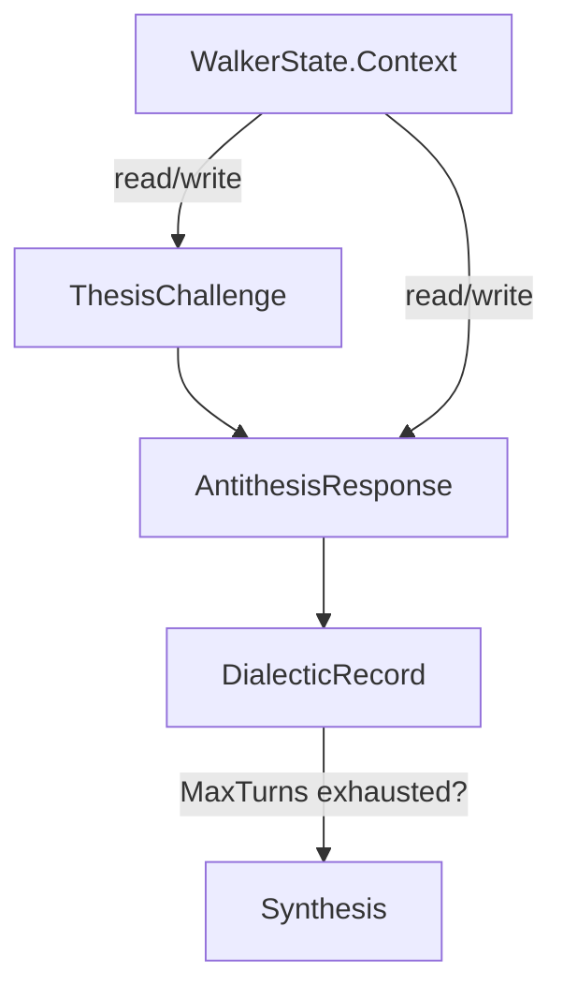
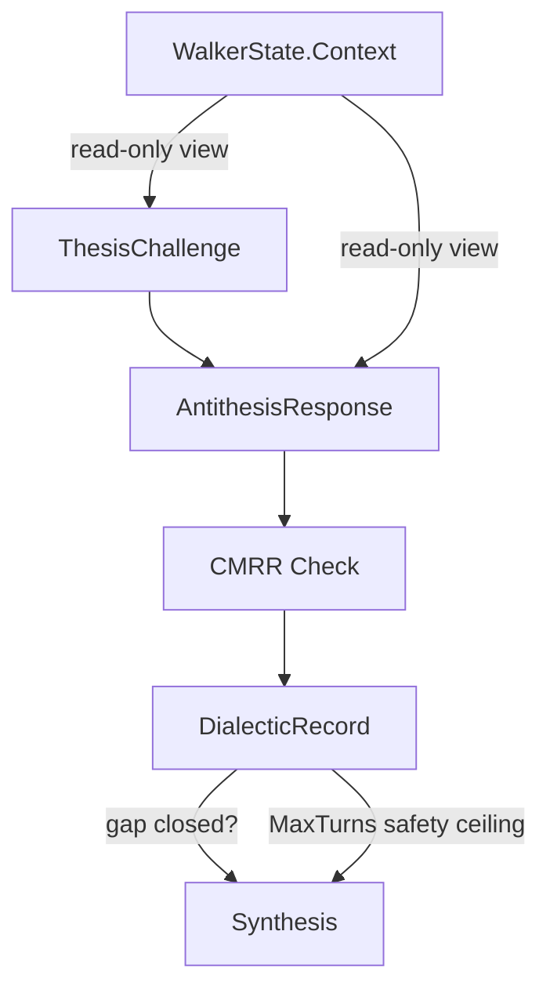

# Contract — dialectic-hardening

**Status:** complete  
**Goal:** Add gap-closure convergence check, evidence immutability enforcement, and shared-assumption detection (CMRR) to the Adversarial Dialectic.  
**Serves:** API Stabilization

## Contract rules

- Gap-closure replaces turn-count as the primary convergence criterion. `MaxTurns` becomes a safety ceiling, not the convergence signal.
- Evidence immutability is enforced by providing a read-only view of `WalkerState.Context` during D0-D4, not by deep-copying.
- CMRR is a new challenge step, not a modification of existing thesis/antithesis steps.
- All three changes are backward-compatible: existing dialectic pipelines gain better convergence behavior without YAML changes.
- Derived from: [electronic-circuit-theory.md](../../docs/case-studies/electronic-circuit-theory.md), Takeaways 8-10.

## Context

- [electronic-circuit-theory.md](../../docs/case-studies/electronic-circuit-theory.md) — Op-Amp golden rules (gap closure, evidence immutability), CMRR pattern.
- [dialectic.go](../../../../dialectic.go) — `DialecticConfig`, `NeedsAntithesis()`, `BuildDialecticEdgeFactory` (HD1-HD12). HD5 checks `rec.Converged || len(rec.Rounds) >= rec.MaxRounds` — needs gap metric. HD10/HD11 check `MaxTurns` — needs trajectory-aware termination.
- [walker.go](../../../../walker.go) — `WalkerState.Context` is `map[string]any` with unrestricted read/write.
- [evidence_gap.go](../../../../evidence_gap.go) — `EvidenceGap`, `EvidenceGapBrief`. Gap closure builds on this.

### Current architecture

### Desired architecture

## FSC artifacts

| Artifact | Target | Compartment |
|----------|--------|-------------|
| Gap closure, evidence immutability, CMRR glossary entries | `glossary/` | domain |

## Execution strategy

1. Define `GapClosure` metric: measures remaining disagreement between final thesis and antithesis positions.
2. Modify HD5 convergence check: primary criterion is `GapClosure < threshold`, secondary is `MaxRounds` safety ceiling.
3. Implement read-only context view: `ReadOnlyContext(ctx map[string]any) map[string]any` returns a copy or a wrapper that panics on write.
4. Wire read-only context into dialectic walker during D0-D4 node processing.
5. Define `CMRRCheck` type: identifies premises shared by both thesis and antithesis, flags consensus as suspicious.
6. Add CMRR as an optional step in the dialectic pipeline (between antithesis response and hearing).

## Coverage matrix

| Layer | Applies | Rationale |
|-------|---------|-----------|
| **Unit** | yes | GapClosure computation, read-only context enforcement, CMRR detection |
| **Integration** | yes | Dialectic pipeline walk with gap-closure convergence |
| **Contract** | yes | DialecticConfig interface, Synthesis artifact shape |
| **E2E** | yes | defect-dialectic.yaml walk converges on gap closure |
| **Concurrency** | no | Dialectic is single-walker |
| **Security** | yes | Evidence immutability prevents process-bias attacks |

## Tasks

- [ ] Define `GapClosure float64` field on `DialecticRecord` — measures remaining thesis-antithesis disagreement
- [ ] Add `GapClosureThreshold float64` to `DialecticConfig` (default 0.15)
- [ ] Modify HD5: converge when `GapClosure < GapClosureThreshold`, not just `Converged || MaxRounds`
- [ ] Modify HD10/HD11: `MaxTurns` becomes safety ceiling with descriptive message ("safety ceiling reached, gap closure was X")
- [ ] Implement `ReadOnlyContext(ctx map[string]any) map[string]any` — returns a read-only view
- [ ] Wire read-only context into dialectic walker during D0-D4 node processing
- [ ] Define `CMRRCheck` struct: `SharedPremises []string`, `SuspicionScore float64`
- [ ] Implement CMRR detection logic: surface premises agreed by both thesis and antithesis
- [ ] Add CMRR as optional dialectic step (configurable via `DialecticConfig.CMRREnabled`)
- [ ] Update `defect-dialectic.yaml` and `defect-court.yaml` testdata
- [ ] Update glossary with gap closure, evidence immutability, CMRR terms
- [ ] Validate (green) — all tests pass, acceptance criteria met.
- [ ] Tune (blue) — refactor for quality. No behavior changes.
- [ ] Validate (green) — all tests still pass after tuning.

## Acceptance criteria

- **Given** a dialectic where thesis and antithesis reach agreement after 3 rounds (gap closure < 0.15),
- **When** HD5 evaluates the `DialecticRecord`,
- **Then** convergence is detected even though `MaxRounds` (6) was not reached.

- **Given** a dialectic where thesis and antithesis disagree after MaxTurns rounds (gap closure = 0.40),
- **When** HD10 fires,
- **Then** the walk terminates with "safety ceiling reached, gap closure was 0.40" — not "turn limit exceeded."

- **Given** a walker processing a D0 (indict) node,
- **When** the walker attempts to modify `WalkerState.Context["prior_evidence"]`,
- **Then** the modification is prevented (panic or error) — evidence is read-only during dialectic.

- **Given** thesis claims "the bug is in repo X" and antithesis claims "the bug is in repo X but caused by dependency Y",
- **When** CMRR check runs,
- **Then** "bug is in repo X" is flagged as a shared assumption with suspicion score > 0.

## Security assessment

| OWASP | Finding | Mitigation |
|-------|---------|------------|
| A03 | Evidence immutability prevents one dialectic role from tampering with another's evidence mid-debate. | Read-only context view enforced during D0-D4. |

## Notes

2026-03-01 — Contract created from electronic circuit case study. Gap-closure convergence implements Op-Amp Golden Rule 1 (Takeaway 8). Evidence immutability implements Golden Rule 2 (Takeaway 9). CMRR check implements Takeaway 10. The key insight: in a dialectic, consensus should raise suspicion, not confidence.
