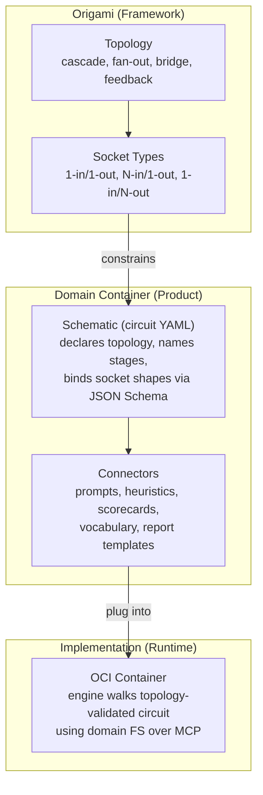
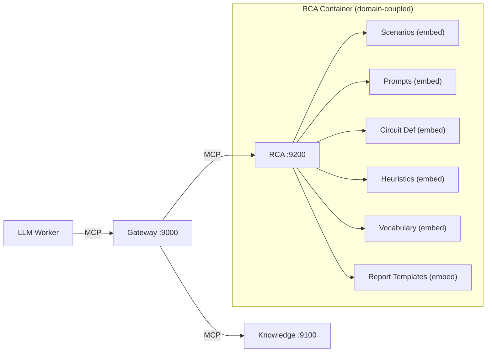
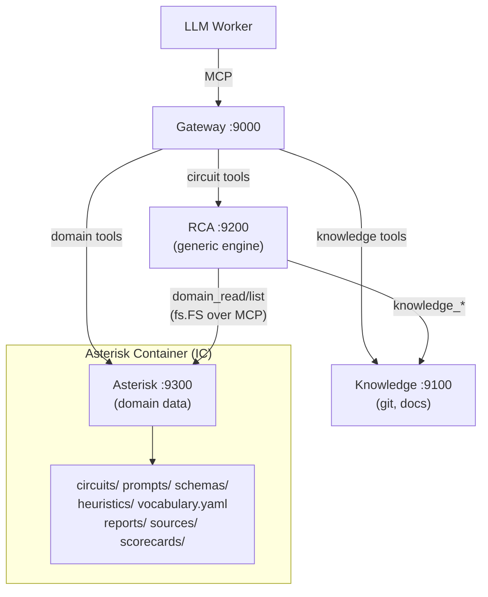

# Contract — domain-separation-container

**Status:** complete  
**Goal:** The circuit engine becomes a topology-driven, socket-validated runtime where domain-specific data AND processing logic live in standalone domain containers (Asterisk, Achilles, etc.). Circuits declare their topology (cascade, fan-out, bridge, etc.); the engine validates graph shape and socket compatibility before walking. Domain containers can host N schematics (IC model) for lower overhead. The engine works with `map[string]any` artifacts and data-driven rules — zero product-specific Go types.  
**Serves:** Containerized Runtime — topology-driven domain separation is the final step to make the circuit engine product-agnostic.

## Contract rules

- **Container-only architecture.** The deployment model is OCI containers orchestrated via Podman/K8s. End-users have a single dependency: an OCI runtime. `origami fold` generates both CLI and domain-serve binaries from the manifest — product repos remain pure config/data with zero hand-written Go.
- **Engine embeds zero domain data.** After this contract, `schematics/rca/` contains no `//go:embed` directives for scenarios, prompts, circuit defs, step schemas, heuristics, vocabulary, report templates, source packs, scorecards, datasets, or store schema. All domain data flows through `fs.FS` backed by `MCPRemoteFS`.
- **Processing logic is data-driven, not Go code.** The engine works with `map[string]any` artifacts. Step validation uses JSON Schema from the domain container. Heuristics use a data-driven rules engine consuming `heuristics.yaml`. Metric extraction uses scorecard-defined JSON paths. No product-specific Go types (`RecallResult`, `TriageResult`, etc.) remain in the engine.
- **Virtual filesystem over MCP.** The domain container exposes three MCP tools (`domain_info`, `domain_read`, `domain_list`) via the `domainserve` library. The engine fetches domain data at session start via `MCPRemoteFS` — the sole `fs.FS` implementation.
- **`domainserve` is a reusable library.** Origami provides a `domainserve` package so every product gets an MCP domain server by calling `domainserve.New(embedFS, config)`. No boilerplate duplication across products.
- **Topology-driven circuits.** Every circuit YAML declares its topology (`cascade`, `fan-out`, `bridge`, etc.). The engine validates graph shape against topology constraints before walking. Topology definitions live in Origami as framework primitives — they are the recognized, reusable circuit structures (analogous to voltage dividers, H-bridges, and PLLs in electrical engineering).
- **IC-ready: N schematics per container.** `domain_info` returns a list of available circuits, not a single circuit name. `start_circuit` specifies which circuit to use. The engine, `domainserve`, and `MCPRemoteFS` never assume 1 circuit per domain container. Today each product starts with 1; the architecture accommodates N without redesign.
- **Reduce, don't accumulate.** This contract is a net code reduction. Every `//go:embed` directive removed, every typed parser deleted, every dual-path function cleaned up reduces surface area and trust boundaries.
- Global rules apply.

## Context

Predecessor contracts shipped the building blocks:

- **cloud-native** — Gateway, standalone RCA serve, standalone Knowledge serve, LLM workers, WorkerPool, health probes, deployment artifacts.
- **decoupled-schematics** — Knowledge as independent MCP service with `MCPReader` adapter.
- **remote-backend** — `RemoteBackend` connects to running MCP endpoints without lifecycle ownership.

### Key architectural insights

1. **The RCA schematic implements the "investigation" topology.** A cascade topology for evidence-gathering, classification, and reporting. The topology is not RCA-specific — any domain that follows a gather → classify → assess → report flow declares `topology: cascade` and gets the same graph shape, socket type constraints, and walk rules. Asterisk investigates test failures; Achilles investigates vulnerabilities. Same topology, different socket shapes and connectors.

2. **Data externalization is necessary but not sufficient.** Moving data files (scenarios, prompts, schemas) out of the engine is only half the problem. The engine also has ~15 files of Go code that process RCA-specific types (`parseTypedArtifact` unmarshals into `RecallResult`/`TriageResult`, extractors are typed `NewStepExtractor[RecallResult]`, `createSession` builds RCA-specific pipelines). For the engine to be truly generic, this processing logic must be replaced with data-driven rules operating on `map[string]any` artifacts.

3. **`fs.FS` is the right internal abstraction.** `FillTemplateFS(fsys fs.FS, ...)` in `template.go` already renders prompts from any `fs.FS`. Extending this to all domain data keeps the engine decoupled from MCP transport. The only `fs.FS` implementation is `MCPRemoteFS` (~50 lines).

4. **The Gateway discovers tools automatically.** Adding a domain backend is `--backend asterisk=http://asterisk:9300/mcp`. The Gateway calls `ListTools` on the new backend and routes accordingly. Zero code changes in Gateway.

5. **Every product needs a domain server — provide a library.** The domain server pattern (embed files + expose via MCP + health probes) is identical for every product. Origami provides `domainserve.New(embedFS, config)` as a library, and `origami fold` generates a domain-serve binary when `domain_serve:` is declared in the manifest. Product repos write zero Go code — they declare a YAML section and fold generates everything.

### Abstraction stack (EE parallel)

The framework's abstraction layers mirror electrical engineering's component stack. In EE, reusable solutions are identified by **topology** (how nodes connect), not by what flows through them — a voltage divider works for DC bias, AC attenuation, or signal level shifting. The same duck test applies here: if the graph has the shape, it's the topology.

#### Five-layer stack

| Layer | EE parallel | Origami mapping | Owned by |
|---|---|---|---|
| **Topology** | Circuit topology (cascade, H-bridge, Wheatstone, PLL) | Graph shape + walk rules + socket type constraints. E.g., `cascade`: N stages in series, each with 1-in/1-out. | Framework (Origami) |
| **Socket types** | Pin electrical spec (3.3V LVTTL, 50Ω, max 100MHz) | Structural interface contract defined by the topology. "A cascade stage has exactly one input socket and one output socket." | Framework (Origami), derived from topology |
| **Schematic** | Circuit schematic (component selection + wiring) | Circuit YAML: declares topology, names stages, binds each socket to a concrete data shape (JSON Schema). | Domain (product repo) |
| **Connectors** | Physical connectors (SMA, USB-C, 40-pin DIP) | Prompts, heuristics, extractors, scorecards — the domain-specific assets that plug into sockets. | Domain (product repo) |
| **Implementation** | Built PCB with components soldered | Running container with schematics wired, domain FS served, engine walking the circuit. | Runtime (OCI container) |



#### Socket ownership: topology vs schematic

The topology defines socket **types** — the structural contract:
- "A cascade stage has exactly one input socket and one output socket"
- "A merge node has N input sockets and one output socket"
- "A feedback edge connects a downstream output back to an upstream input"
- The topology does not know what data flows through the socket. It knows graph shape and connection cardinality.

The schematic defines socket **shapes** — the data contract:
- "The recall socket outputs `{similar_failures: [{id, score, summary}], confidence: float}`"
- "The triage socket expects the recall output and produces `{defect_type: string, evidence: []}`"
- Socket shapes are JSON Schema files in the domain container, referenced by the circuit YAML.

The engine validates **both layers**:
1. Topology validation: "this graph conforms to the `cascade` topology — every stage has 1-in/1-out, stages are connected in sequence"
2. Schema validation: "stage N's output schema is compatible with stage N+1's input schema"

This is exactly how USB works: the connector standard defines the physical/electrical interface (socket type), the device defines what protocol runs over it (socket shape), and the host validates both.

#### IC model: N schematics per container

An integrated circuit packs multiple sub-circuits onto one die — shared power, ground, and packaging, lower overhead per function. The same principle applies to domain containers:

| EE era | Unit | Our parallel |
|---|---|---|
| Discrete (now) | 1 transistor per package | 1 schematic per container — max isolation, max overhead |
| Integrated (future) | N gates per chip | N schematics per container — shared runtime, lower overhead |

A domain container hosting multiple schematics:

```
Asterisk Container (IC)
├── circuits/
│   ├── rca.yaml           (topology: cascade)
│   ├── trend.yaml         (topology: cascade)
│   └── flaky-detect.yaml  (topology: fan-out-merge)
├── schemas/
│   ├── rca/               (socket shapes for RCA schematic)
│   ├── trend/             (socket shapes for trend schematic)
│   └── flaky/             (socket shapes for flaky schematic)
├── prompts/               (connectors — shared or per-schematic)
├── heuristics/            (connectors — shared or per-schematic)
├── scenarios/             (calibration data)
└── vocabulary.yaml        (shared display names)
```

`domain_info` returns the full circuit manifest: `{name, version, circuits: [{name, topology, description}]}`. `start_circuit` specifies which circuit. All schematics share the container runtime (the die) and the domain filesystem (the substrate).

The architectural constraint that preserves IC breathing room: **nothing in the engine, `domainserve`, or `MCPRemoteFS` may hardcode "one circuit YAML per domain container"** — not in the `domain_info` response, not in the `--domain-endpoint` flag semantics, not in filesystem assumptions.

### Design direction: container-only, reduce surface area

The monolith binary (`origami fold` → single Go binary) currently provides 10+ CLI commands (`analyze`, `calibrate`, `consume`, `dataset`, `push`, `save`, `status`, `gt`, `demo`). These are being replaced by containerized MCP services. Rationale:

- **Single dependency.** End-users need only an OCI runtime (Podman/Docker). `origami fold` is the build step (generates all binaries from YAML), but the deployment artifact is OCI images.
- **Fewer trust boundaries.** One deployment model means one security posture to audit, not two.
- **Smaller code surface.** Dual-path logic (`resolvePromptFS`, `--prompt-dir`, embed fallbacks) is dead code in a container world. Delete it.
- **Fire-and-forget.** `docker-compose up` or `kubectl apply` starts the full stack. No manual binary management.

The CLI-to-MCP migration for non-serve commands (`analyze`, `consume`, `dataset`, etc.) is a separate successor contract. This contract focuses on two things: (1) domain data separation — moving all product-specific files to a domain container, and (2) processing logic genericization — replacing product-specific Go types with `map[string]any` and data-driven rules. Together they make the engine a product-agnostic topology-driven runtime — the "investigation" topology being the first instance.

### DX principle: tests are the primitive

Removing the CLI as the primary interface does not degrade developer experience — it clarifies it. The test infrastructure is the real development interface. CLI tools, containers, and test cases all share the same core: **circuit walk + observation**.

```
Test case  = Walk(domainFS, input) → metrics → assert correctness
CLI tool   = Walk(domainFS, input) → metrics → format for humans
Container  = Walk(domainFS, input) → metrics → serve over MCP
```

Three presentation layers on one engine primitive. The `Walk` function accepts a domain `fs.FS`, a circuit name, and input — then returns results and metrics (step timing, token cost, confidence scores, convergence). Tests assert on metrics. CLI displays them. Containers stream them.

This means the developer workflow is:

| Activity | Mechanism | Containers needed? |
|---|---|---|
| Write a circuit | Edit YAML, schemas, prompts in repo | No |
| Test a circuit | `go test` with `os.DirFS("testdata/")` | No |
| Benchmark / calibrate | `go test -bench` or calibration test suite | No |
| Run with real data | CLI wrapping the same `Walk` function | No |
| Serve in production | Container wrapping the same `Walk` function | Yes |

The developer never needs containers during development. `go test` is the fast feedback loop (sub-second with stub data). The container is the deployment artifact, not the development tool.

**CLI tools are test wrappers with real-time analytics.** The CLI commands that exist today (`analyze`, `calibrate`, etc.) are thin wrappers that invoke the same circuit walk as tests, but with real data sources (RP API, git repos) and formatted output (terminal reports, progress bars). The metrics infrastructure is shared — tests assert on it, CLI surfaces it as real-time analytics. This eliminates the "works in test, fails in prod" gap: if a test passes with `os.DirFS`, the CLI and container will produce the same result with `MCPRemoteFS`, because the `Walk` function is `fs.FS`-agnostic.

### Domain data and processing logic inventory

#### Data assets (files)

| Asset | Current location | Load mechanism | Injection today? |
|---|---|---|---|
| Scenarios | Origami `scenarios/loader.go` (`//go:embed *.yaml`) | Embedded | No |
| Prompts | Origami `prompts.go` (`//go:embed prompts`) | Embedded | Yes (`resolvePromptFS`) |
| Circuit definition | Origami `circuit_def.go` (`//go:embed circuit_rca.yaml`) | Embedded | No |
| Heuristics | Origami `heuristic.go` (`//go:embed heuristics.yaml`) | Embedded | No |
| Vocabulary | Origami `vocabulary/vocabulary.go` (`//go:embed vocabulary.yaml`) | Embedded (eager init) | No |
| Report templates | Origami `report_data.go` (`//go:embed *-report.yaml`) | Embedded | No |
| Tuning | Origami `tuning.go` (`//go:embed tuning-quickwins.yaml`) | Embedded | No |
| Step schemas | Origami `mcpconfig/server.go` (`rcaStepSchemas()`) | Hardcoded Go structs | No |
| Store schema | Origami `store/schema.go` (`//go:embed testdata/schema.yaml`) | Embedded | Yes (`WithStoreSchema`) |
| Source packs | Asterisk `internal/sources/*.yaml` | Runtime disk (paths from `origami.yaml`) | No |
| Scorecards | Asterisk `internal/scorecards/*.yaml` | Runtime disk (circuit def path) | No |
| Datasets | Asterisk `internal/datasets/` | Runtime disk (paths in scenarios) | No |

#### Processing logic (Go code to delete/replace)

| Code | File | What it does | Replacement |
|---|---|---|---|
| `parseTypedArtifact()` | `transformer_rca.go` | Unmarshals JSON into `RecallResult`, `TriageResult`, etc. | `json.Unmarshal` into `map[string]any` |
| `NodeNameToStep` | `transformer_rca.go` | Maps node names to step enum | Node names come from circuit YAML directly |
| `NewStepExtractor[T]` | `component.go` | Typed extractors for each step | Generic JSON-path extractor |
| `extractStepMetrics()` | `cal_runner.go` | Type-asserted field access for metrics | Scorecard-defined JSON paths into `map[string]any` |
| `HeuristicComponent` | `component.go` | RCA-specific heuristic wiring | Generic rules engine consuming `heuristics.yaml` |
| `rcaStepSchemas()` | `mcpconfig/server.go` | Hardcoded F0-F6 schemas | JSON Schema files from domain FS |
| `RCACalibrationAdapter` | `cal_adapters.go` | RCA-specific store bootstrap, batch input | Generic adapter using scorecard field mappings |
| `RecallResult`, `TriageResult`, etc. | `types.go` | 7 typed artifact structs | Deleted — `map[string]any` replaces all |
| `allNodeNames` | `component.go` | Hardcoded `["recall", "triage", ...]` | Read from circuit YAML |
| `ArtifactFilename()` | `transformer_rca.go` | `recall-result.json`, etc. | Derived from node name: `<node>-result.json` |

**Two coupling layers, not one.** Externalizing data files is necessary but not sufficient. The Go processing code is equally product-specific. Both must be addressed for the engine to be reusable.

### Current architecture



### Desired architecture



Four-service topology. The engine is a generic topology-driven runtime. Domain data flows over MCP via `MCPRemoteFS` (~50 lines) — the sole `fs.FS` implementation. The domain container is IC-ready: `circuits/` holds N schematics, `schemas/` holds per-schematic socket shapes. No embed fallback, no dual-path logic.

### Achilles path

Achilles uses the same `cascade` topology as Asterisk — gather → classify → assess → report — but with different socket shapes (vulnerability findings instead of test failures) and different connectors (CVE pattern-matching prompts instead of log-analysis prompts). Same topology, different schematic.

When Achilles needs its own circuit: add `domain_serve:` to its `origami.yaml`, embed Achilles-specific data, register with Gateway as `--backend achilles=http://achilles:9300/mcp`. Same engine, different domain backend. Zero Go code, zero changes to engine or Gateway.

Achilles domain container would provide:

| Path | Content | Abstraction layer |
|---|---|---|
| `circuits/vuln-discover.yaml` | Vulnerability discovery pipeline (`topology: cascade`, stages: scan → classify → pattern-match → assess → report) | Schematic |
| `schemas/vuln-discover/scan.json` | JSON Schema for scan step output (`ScanResult` with `findings []Finding`) | Socket shape |
| `schemas/vuln-discover/classify.json` | JSON Schema for classification output (severity, trust-boundary type) | Socket shape |
| `schemas/vuln-discover/assess.json` | JSON Schema for assessment output (risk score, evidence, recommendations) | Socket shape |
| `prompts/pattern-match/*.md` | LLM prompts for comparing findings against known CVE patterns | Connector |
| `prompts/assess/*.md` | LLM prompts for prioritization and exploitability analysis | Connector |
| `heuristics.yaml` | Trust-boundary classification rules (API misuse, privilege boundary, network boundary) | Connector |
| `scenarios/` | Ground-truth CVEs for calibration (kernel, RHEL, OCP) | Connector |
| `vocabulary.yaml` | Display names for CWE categories, severity levels, boundary types | Connector |

**IC evolution.** Achilles starts with one schematic (`vuln-discover`). Later it could add `circuits/pattern-learn.yaml` (a different topology, perhaps `feedback-loop`, for training pattern recognition from CVE datasets) without a new container — same domain FS, same `domainserve` binary, additional circuit in `domain_info`.

## FSC artifacts

| Artifact | Target | Compartment |
|----------|--------|-------------|
| Domain MCP tool schemas | `docs/domain-mcp-tools.md` | domain |
| Investigation topology documentation | `docs/investigation-topology.md` | domain |
| `domainserve` API reference | `docs/domainserve-api.md` | domain |
| Topology definitions reference | `docs/topology-definitions.md` | domain |
| Abstraction stack (EE parallel) | `docs/abstraction-stack.md` | domain |

## Execution strategy

Seven phases, strictly ordered. Each phase leaves the build green. Embeds stay as defaults through Phase 1, `MCPRemoteFS` is ready by Phase 2, embeds are deleted in Phase 4 (so the binary always has a data source). Phase 5 genericizes processing logic — the largest code change.

- **Phase 1** — Parameterize engine functions to accept `fs.FS` (keep embeds as default for now)
- **Phase 2** — Implement `MCPRemoteFS` + `domainserve` library in Origami
- **Phase 3** — Domain MCP server via DSL (`origami fold` generates domain-serve binary from manifest)
- **Phase 4** — Move domain data from Origami to Asterisk + delete embeds
- **Phase 5** — Genericize processing pipeline (`map[string]any`, data-driven heuristics)
- **Phase 6** — Update deployment artifacts for 4-service topology
- **Phase 7** — Full validation

## Coverage matrix

| Layer | Applies | Rationale |
|-------|---------|-----------|
| **Unit** | yes | `MCPRemoteFS`, `domainserve` library, domain MCP tool handlers, scenario/prompt loading via `fs.FS`, generic JSON-path extractors, data-driven heuristic rules engine, `map[string]any` artifact processing |
| **Integration** | yes | Engine → domain service round-trip, Gateway routing to domain backend, `start_circuit` loading scenario from remote domain, step schema validation from domain FS |
| **Contract** | yes | `fs.FS` interface compliance for `MCPRemoteFS`, MCP tool schemas (`domain_info`, `domain_read`, `domain_list`), `domainserve` API surface |
| **E2E** | yes | 4-service container test: Gateway → Engine → Knowledge + Asterisk domain service, circuit start through full stack |
| **Concurrency** | yes | Concurrent `domain_read` calls from parallel circuit sessions, `-race` on all tests |
| **Security** | yes | Domain service binds 127.0.0.1, no secrets in domain data payloads, `domainserve` path traversal rejection |

## Tasks

### Phase 1 — Parameterize engine functions for `fs.FS` injection (Origami)

Add `fs.FS` parameter to all asset-loading functions that lack injection. Keep embeds as default values for now — they will be deleted in Phase 4 once `MCPRemoteFS` is in place, ensuring the build stays green throughout.

- [x] P1.1: Refactor `scenarios/loader.go` — `LoadScenario(fsys fs.FS, name)` and `ListScenarios(fsys fs.FS)` replacing package-level `scenarioFS`. Keep `//go:embed` as fallback default.
- [x] P1.2: Refactor `circuit_def.go` — `LoadCircuitDef(fsys fs.FS, path, th)` replacing package-level `circuitRCAYAML`. Keep `//go:embed` as fallback default.
- [x] P1.3: Refactor `heuristic.go` — `NewHeuristicTransformer(st, repos, heuristicsData []byte)` replacing package-level `heuristicsYAML`. Keep `//go:embed` as fallback default.
- [x] P1.4: Refactor `vocabulary/vocabulary.go` — `New(data []byte)` or `NewFromFS(fsys fs.FS, path)` replacing package-level `vocabData`. Fix eager init (`var defaultVocab`) to accept injection. Keep `//go:embed` as fallback default.
- [x] P1.5: Refactor `report_data.go` — accept template data as parameters replacing package-level embed vars. Keep `//go:embed` as fallback default.
- [x] P1.6: Refactor `tuning.go` — `LoadQuickWins(data []byte)` replacing package-level `quickWinsYAML`. Keep `//go:embed` as fallback default.
- [x] P1.7: Refactor `prompts.go` — `DefaultPromptFS` becomes a function parameter, not a package-level var. Keep `//go:embed prompts` as fallback default. Delete `resolvePromptFS` dual-path helper in `cmd/helpers.go`.
- [x] P1.8: Externalize step schemas — add `LoadStepSchemas(fsys fs.FS)` that reads `schemas/<step-name>.json` from the domain FS. Keep `rcaStepSchemas()` as fallback default until Phase 4.
- [x] P1.9: Update `mcpconfig.ServerConfig` to accept `DomainFS fs.FS` and thread it through `createSession`, replacing all direct embed reads and hardcoded step schemas.
- [x] P1.10: Tests use `os.DirFS("testdata/")` with fixture files (including step schema JSONs) instead of package-level embeds.
- [x] P1.11: Validate — all existing tests pass, every domain-loading function accepts `fs.FS` injection.

### Phase 2 — `MCPRemoteFS` + `domainserve` library (Origami)

Build the transport layer that will replace embeds. After this phase, a domain container can serve files over MCP and the engine can consume them via `fs.FS`.

- [x] P2.1: Create `schematics/rca/domainfs/remote.go` — `MCPRemoteFS` implementing `fs.FS` via MCP `domain_read`/`domain_list` calls (~50 lines).
- [x] P2.2: Unit tests for `MCPRemoteFS` — `Open`, `ReadDir`, missing file, path validation.
- [x] P2.3: Create `domainserve` package in Origami — reusable library for building domain data MCP servers.
- [x] P2.4: `domainserve.New(embedFS, Config{Name, Version})` returns `http.Handler` with `/mcp`, `/healthz`, `/readyz`. Auto-registers `domain_info` (scans `circuits/` for available schematics — IC-ready), `domain_read`, `domain_list` tools.
- [x] P2.5: Unit tests for `domainserve` — tool responses, health probes, missing file handling, path traversal rejection.
- [x] P2.6: Validate — `go test -race ./...`

### Phase 3 — Domain MCP server via DSL (Origami + Asterisk)

Extend `origami fold` to generate a domain-serve binary from the YAML manifest. Product repos (Asterisk, Achilles) declare `domain_serve:` in their `origami.yaml` and get a domain data MCP server — zero hand-written Go.

- [x] P3.1: Add `DomainServeConfig` struct and `DomainServe *DomainServeConfig` field to `Manifest` in `fold/manifest.go`. Fields: `Port int` (default 9300), `Embed string` (directory to embed, e.g. `"internal/"`).
- [x] P3.2: Add `GenerateDomainServe(m *Manifest) ([]byte, error)` in `fold/codegen.go` with a Go template that produces a standalone `main.go` — imports `domainserve`, embeds the specified directory via `//go:embed`, calls `domainserve.New()`, listens on configured port.
- [x] P3.3: Wire domain-serve generation + compilation into `fold.Run()` / `fold.Compile()` — when `m.DomainServe != nil`, generate a second binary (`bin/<name>-domain-serve`) alongside the CLI binary. Copy/symlink embed directory into temp build dir.
- [x] P3.4: Unit tests for fold — manifest parsing of `domain_serve:` section, codegen output verification (contains `domainserve.New`, `//go:embed`, correct port/name/version), round-trip compile test.
- [x] P3.5: Add `domain_serve:` section to Asterisk `origami.yaml`: `port: 9300`, `embed: internal/`.
- [x] P3.6: Build verification — run `origami fold` on Asterisk, verify `bin/asterisk-domain-serve` binary is produced, starts, responds to `/healthz`, `domain_info` returns circuit metadata from `internal/circuits/`, `domain_read` serves files from `internal/`.
- [x] P3.7: Validate — `go test -race ./...` green in Origami, `origami fold` green in Asterisk (both `bin/asterisk` and `bin/asterisk-domain-serve`).

### Phase 4 — Move domain data to Asterisk + delete embeds (both repos)

Move all domain data files from Origami `schematics/rca/` to Asterisk `internal/`. Delete all `//go:embed` directives and fallback defaults from the engine. After this phase, `schematics/rca/` contains only generic circuit machinery.

- [x] P4.1: Move `schematics/rca/scenarios/*.yaml` to Asterisk `internal/scenarios/`
- [x] P4.2: Move `schematics/rca/prompts/` to Asterisk `internal/prompts/` (merge with existing overrides)
- [x] P4.3: Move `schematics/rca/circuit_rca.yaml` to Asterisk `internal/circuits/rca.yaml`. Add `topology: cascade` declaration to the circuit YAML.
- [x] P4.4: Move `schematics/rca/heuristics.yaml` to Asterisk `internal/heuristics.yaml`
- [x] P4.5: Move `schematics/rca/vocabulary/vocabulary.yaml` to Asterisk `internal/vocabulary.yaml`
- [x] P4.6: Move `schematics/rca/*-report.yaml` to Asterisk `internal/reports/`
- [x] P4.7: Move `schematics/rca/tuning-quickwins.yaml` to Asterisk `internal/tuning/`
- [x] P4.8: Create `internal/schemas/rca/` in Asterisk with JSON Schema files for each RCA step (recall.json, triage.json, resolve.json, investigate.json, correlate.json, review.json, report.json) — socket shapes extracted from the former `rcaStepSchemas()` Go code. Per-schematic subdirectory under `schemas/` for IC readiness.
- [x] P4.9: Move source packs to Asterisk `internal/sources/` (if not already there).
- [x] P4.10: Move scorecards to Asterisk `internal/scorecards/` (if not already there).
- [x] P4.11: Move datasets to Asterisk `internal/datasets/` (if not already there).
- [x] P4.12: Move store schema to Asterisk `internal/schema.yaml`.
- [x] P4.13: Delete all `//go:embed` directives for domain data in Origami `schematics/rca/`. Delete `DefaultPromptFS` var, `rcaStepSchemas()` Go structs, and all embed fallback defaults.
- [x] P4.14: Add required `--domain-endpoint` flag to engine standalone serve binary. No fallback — the container binary always fetches domain data remotely.
- [x] P4.15: Integration test — start domain server (httptest) + engine server, verify scenario loading over MCP.
- [x] P4.16: Validate — zero `//go:embed` for domain data in `schematics/rca/`, zero YAML data files remain, `go test -race ./...`

### Phase 5 — Genericize processing pipeline (Origami)

Replace all product-specific Go types and processing logic with data-driven equivalents. After this phase, the engine processes `map[string]any` artifacts using rules defined in the domain container.

- [x] P5.1: Replace typed artifact parsing — `parseTypedArtifact()` → `json.Unmarshal` into `map[string]any`. Delete `RecallResult`, `TriageResult`, `ResolveResult`, `InvestigateArtifact`, `CorrelateResult`, `ReviewDecision` types. *(Done — all typed artifact structs removed, `map[string]any` used throughout.)*
- [x] P5.2: Replace typed extractors — `NewStepExtractor[T]` → generic JSON-path extractor operating on `map[string]any`. *(Done — generic extractors in place.)*
- [ ] P5.3: ~~Replace `createSession()` RCA-specific wiring with domain-config-driven wiring. Session reads node names from circuit YAML, not from hardcoded `allNodeNames`.~~ **Reassigned → `schematic-runtime-toolkit` P2.2** (component wiring / node name parameterization). The `allNodeNames` hardcoded list is a schematic-level wiring concern, not a domain-separation concern.
- [ ] P5.4: ~~Replace `HeuristicComponent` with a generic rules engine consuming `heuristics.yaml` from domain FS.~~ **Accepted as domain code.** `HeuristicComponent` and its per-node heuristic logic (~592 LOC) are RCA-specific domain logic that correctly lives in `schematics/rca/`. Only the `allNodeNames` coupling is addressed via P5.3 → toolkit.
- [ ] P5.5: ~~Update calibration adapters to work with `map[string]any` + scorecard-driven field mappings.~~ **Accepted as-is.** `RCACalibrationAdapter` and `extractStepMetrics()` already operate on `map[string]any` artifacts. Full scorecard-driven extraction is future scope (calibration-harness-decoupling Stream C, deferred).
- [ ] P5.6: ~~Delete `NodeNameToStep` enum mapping, `ArtifactFilename()` typed helper, `extractStepMetrics()` type-asserted access.~~ **Reassigned → `schematic-runtime-toolkit` P1.3** (artifact filename derivation pattern). `nodeArtifactFilenames` is a schematic-level naming concern, not a domain-separation concern.
- [x] P5.7: Update all tests to use `map[string]any` artifacts and generic extractors. *(Done — tests updated during P5.1/P5.2.)*
- [x] P5.8: Validate — all tests pass, zero product-specific types remain in `schematics/rca/`, `-race` clean. *(Done — validated.)*

### Phase 6 — Update deployment artifacts

- [x] P6.1: Add `asterisk` service to `deploy/docker-compose.yaml` (port 9300, health checks)
- [x] P6.2: Create `deploy/k8s/asterisk.yaml` (Deployment + Service + probes)
- [x] P6.3: Update `deploy/k8s/kustomization.yaml` to include `asterisk.yaml`
- [x] P6.4: Update Gateway `--backend` flags in docker-compose and K8s to include `asterisk=http://asterisk:9300/mcp`
- [x] P6.5: Update engine service to pass `--domain-endpoint http://asterisk:9300/mcp` in docker-compose and K8s
- [x] P6.6: Update container E2E tests for 4-service topology
- [x] P6.7: Validate — manifests syntactically valid, E2E tests pass

### Phase 7 — Final validation

- [x] P7.1: Full circuit: build both repos, run unit tests, container E2E
- [x] P7.2: Verify tool routing: Gateway lists domain tools alongside circuit and knowledge tools
- [x] P7.3: Verify `start_circuit` loads scenario from domain service (not embedded)
- [x] P7.4: Verify engine processes `map[string]any` artifacts with no product-specific types
- [x] P7.5: Tune — refactor for quality, no behavior changes
- [x] P7.6: Final validate — all tests pass after tuning

## Acceptance criteria

**Given** the engine container built from `schematics/rca/cmd/serve/main.go` with `--domain-endpoint http://asterisk:9300/mcp`,  
**When** an LLM worker calls `start_circuit` through the Gateway,  
**Then** the engine loads the scenario, prompts, circuit def, step schemas, heuristics, vocabulary, and report templates from the Asterisk domain service via `MCPRemoteFS`, creates a circuit session, and returns the first step.

**Given** the Asterisk domain container running on `:9300`,  
**When** `domain_list("scenarios/")` is called,  
**Then** it returns the list of available scenario YAML files (ptp-mock, daemon-mock, ptp-real, ptp-real-ingest).

**Given** the Asterisk domain container running on `:9300`,  
**When** `domain_read("prompts/recall/judge-similarity.md")` is called,  
**Then** it returns the prompt template content identical to what was previously embedded in the engine binary.

**Given** `schematics/rca/` in the Origami repo after this contract,  
**When** searched for `//go:embed` directives referencing domain data, hardcoded step schemas, or product-specific Go types (`RecallResult`, `TriageResult`, etc.),  
**Then** zero matches are found. All domain data flows through `MCPRemoteFS`. All artifacts are `map[string]any`.

**Given** an Achilles domain container providing its own circuit YAML, step schemas (`schemas/scan.json`, `schemas/classify.json`, `schemas/assess.json`), prompts, heuristics, and vocabulary,  
**When** registered with Gateway as `--backend achilles=http://achilles:9300/mcp`,  
**Then** the same engine processes Achilles circuits using `map[string]any` artifacts and data-driven rules. Achilles provides its own domain data; no engine code changes needed.

## Security assessment

| OWASP | Finding | Mitigation |
|-------|---------|------------|
| A01 Broken Access Control | Domain service serves prompt templates and scenario data without authentication | Domain data is not secret (embedded in open-source binaries today). Authentication deferred to the same future contract as Gateway auth. Domain service binds 127.0.0.1 by default. |
| A03 Injection | `domain_read` path parameter could be crafted to escape the virtual root | Path is validated against the embedded `fs.FS` root. `fs.ValidPath` rejects `..`, absolute paths, and OS-specific separators. No real filesystem access — only `embed.FS`. |
| A05 Security Misconfiguration | Domain endpoint passed as flag/env var | URL validated at startup (must be valid HTTP/HTTPS). Same pattern as Knowledge endpoint. |

## Related contracts

- **Topology layer** (future, Origami) — Topology definitions as framework primitives (`cascade`, `fan-out`, `bridge`, `feedback-loop`), socket type system (structural constraints per topology position), topology validation engine (graph shape + socket compatibility checks before walking). This contract establishes the domain separation and `fs.FS` + `domainserve` foundation that topologies build on. The topology layer formalizes the `topology:` field in circuit YAMLs into a validated, extensible system.
- **`cli-deprecation`** (drafted) — Retire fold-generated monolith binary. CLI commands become test wrappers (`calibrate`, `analyze`), MCP tools (`consume`, `dataset`, `push`, `status`, `gt`), or deleted (`save`, `cursor`, `demo`). `origami fold` generates only the domain-serve binary. Prerequisite: this contract (domain separation + `fs.FS` abstraction + `map[string]any` genericization make `Walk` data-source-agnostic).
- **`origami fold` as universal compiler** (current direction) — `origami fold` evolves from generating only CLI binaries to generating domain-serve binaries as well. Product repos stay pure YAML/data — fold generates all Go code. Future: fold generates Dockerfiles and compose manifests, making it the single "compile" step from YAML manifest to running containers.

## Notes

2026-03-06 — **Contract complete.** P6 added the 4th service (Asterisk domain) to docker-compose and K8s manifests: `asterisk` service on port 9300 with health probes, Gateway `--backend asterisk=...`, engine `--domain-endpoint http://asterisk:9300/mcp`, configmap with `ASTERISK_DOMAIN_ENDPOINT`. E2E tests updated to 4-service topology with `newDomainServer` helper using `domainserve.New()` wired through `MCPRemoteFS` into the RCA server. `TestE2E_FourServices_ToolRouting` verifies domain tools (`domain_info`, `domain_read`, `domain_list`) route through Gateway. P7 grep sweep confirms zero `//go:embed` for domain data (only `store/testdata/schema.yaml` test fixture), zero typed artifact structs. Full test suite green. Both Asterisk binaries build.

2026-03-06 — **Phase 5 drained during contract reassessment.** P5.1/P5.2 (genericize artifacts + extractors) and P5.7/P5.8 (tests + validate) completed in prior sessions. P5.3 (allNodeNames parameterization) and P5.6 (artifact filename derivation) reassigned to `schematic-runtime-toolkit` — they are schematic-level wiring concerns, not domain-separation concerns. P5.4 (HeuristicComponent) and P5.5 (calibration adapters) accepted as domain code that correctly lives in `schematics/rca/`. Only P6 (deploy configs) and P7 (final validation) remain.

2026-03-06 — **Phases 1-4 complete.** All domain data (scenarios, prompts, circuit definitions, heuristics, vocabulary, report templates, tuning, step schemas, source packs, scorecards, store schema) now lives in Asterisk `internal/`. Zero `//go:embed` directives for domain data remain in Origami `schematics/rca/` (only `store/testdata/schema.yaml` remains as a test fixture). `domainserve` library and `MCPRemoteFS` provide the transport layer. `origami fold` generates both CLI and domain-serve binaries from YAML manifest. Integration tests (`domain_integration_test.go`) verify end-to-end scenario loading and stub calibration over MCP (httptest domain server → MCPRemoteFS → engine). All tests pass with `-race`. Both Asterisk binaries build (`bin/asterisk`, `bin/asterisk-domain-serve`).

2026-03-06 — Instrumentation-first debugging. Phase 4 embed removal caused silent test failures: `get_next_step` returned `done=true` with zero diagnostic info because `CircuitSession` stored the error internally but `getNextStepOutput` had no `Error` field. Added: (1) `Error string` field to `getNextStepOutput` — surfaces `sess.Err()` when `done=true`. (2) Per-case walk error logging in `BatchWalk`. (3) `requireStep` test helper that fatals with the error message. This immediately revealed the actual bug: `promptFS` was `fs.Sub(DomainFS, "prompts")` but circuit YAML prompt paths already include the `prompts/` prefix — double-prefixing caused "file not found." Fix: pass `DomainFS` directly as `promptFS`. **Principle: instrument before debugging. Silent error swallowing is a design defect, not a feature.**

2026-03-06 — Phase 3 DSL approach. Replaced hand-written Go in Asterisk (`cmd/domain-serve/main.go`) with `origami fold` codegen. New `domain_serve:` section in `origami.yaml` manifest. Fold generates a standalone domain-serve binary alongside the CLI binary. Product repos remain pure config/data — zero Go. Updated contract rules, Achilles path, related contracts, and execution strategy to reflect fold as the universal compiler.

2026-03-06 — Tests as the primitive. Added "DX principle: tests are the primitive" section. Tests, CLI tools, and containers are three presentation layers on the same `Walk(domainFS, input) → (result, metrics)` primitive. `go test` with `os.DirFS` is the development interface — no containers needed. CLI tools are test wrappers with real data and real-time analytics. Reframed "CLI-to-MCP migration" related contract as "CLI as test wrappers" to reflect this.

2026-03-06 — EE abstraction stack injection. Rooted the architecture in electrical engineering parallels: five-layer stack (topology → socket types → schematic → connectors → implementation). Key additions: (1) **Topology-driven circuits** — every circuit YAML declares its topology; engine validates graph shape before walking. Topology definitions are framework primitives analogous to EE circuit topologies (cascade, H-bridge, PLL). (2) **Socket ownership** — topology defines socket *types* (structural contract), schematic defines socket *shapes* (data contract via JSON Schema). Engine validates both. (3) **IC-ready architecture** — N schematics per container; `domain_info` returns circuit list; `circuits/` and `schemas/<circuit>/` directory structure; nothing assumes 1 circuit per container. (4) Renamed "investigation pattern" to "investigation topology" (cascade). (5) Added topology-layer as related contract for future formalization.

2026-03-05 — Gap assessment update. Six changes applied: (1) **Processing logic pluggability scoped IN** — engine will work with `map[string]any` artifacts, data-driven heuristics, scorecard-defined JSON paths. All RCA-specific types (`RecallResult`, etc.) deleted. New Phase 5 added. (2) **Missing assets added** — source packs, scorecards, datasets, store schema added to inventory and Phase 4 tasks. (3) **Phase reordering** — embeds stay as defaults through Phase 1, `MCPRemoteFS` ready by Phase 2, embeds deleted in Phase 4 (build always green). (4) **Investigation pattern** — documented as the design pattern name for the engine's gather → classify → assess → report pipeline. (5) **`domainserve` library** — reusable Origami package so every product gets a domain MCP server with ~10 lines. Added to Phase 2 tasks. (6) **Achilles acceptance criterion** — replaced aspirational "without code changes" with concrete: Achilles provides its own circuit YAML, step schemas, prompts, heuristics; engine processes them via `map[string]any` and data-driven rules.

2026-03-05 — Added step schema externalization. `rcaStepSchemas()` hardcoded Go structs are the last coupling point preventing Achilles from reusing the circuit engine. Step schemas move to JSON Schema files in the domain container (`schemas/*.json`), loaded at session start.

2026-03-05 — Contract revised for container-only architecture. Removed all monolith/fold references. Removed `EmbeddedFS` and dual-caller framing. The sole `fs.FS` implementation is `MCPRemoteFS`. Added "reduce, don't accumulate" contract rule.

2026-03-05 — Contract drafted. Successor to cloud-native contract. The virtual filesystem over MCP design (`domain_read`/`domain_list`) mirrors Knowledge's tool pattern. Achilles gets domain separation for free.
