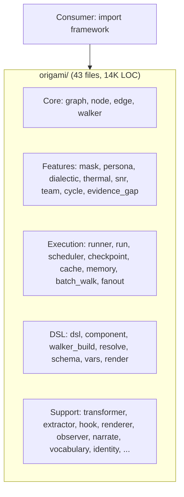
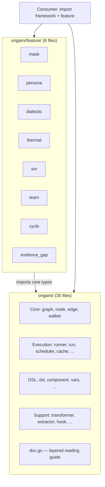

# Contract — framework-api-layering

**Status:** complete  
**Goal:** The root `origami` package has a documented layered structure and independent circuit features live in sub-packages, so a reader can navigate the framework without reading 43 files to find the entry point.  
**Serves:** Containerized Runtime (quick-win)

## Contract rules

- **No behavioral changes.** This is purely structural — file moves, re-exports, documentation. Zero logic changes.
- **API breakage is acceptable.** Per PoC-era API stability rules, breaking changes are allowed. Consumers (Asterisk, Achilles) are updated in the same session.
- **Core stays at root.** Graph, Node, Edge, Walker, and tightly coupled execution/DSL/processing types remain in the root package. Only genuinely independent features move.
- **Dead exports die.** Any exported type or function with zero external consumers is unexported or deleted.
- Global rules apply.

## Context

Conversation: [Root package health check](65013565-a183-40d2-ae82-707267f65454) measured 43 production Go files and 14,134 LOC in the root `origami` package. The audit identified five natural categories, but all 43 files sit at the same level with no reading order, no `doc.go`, and no separation between core primitives and optional capabilities.

A newcomer opening the package sees `batch_walk.go`, `dialectic.go`, `mask.go`, `persona.go`, `thermal.go`, `snr.go`, `cycle.go`, `evidence_gap.go` alongside `graph.go`, `node.go`, `edge.go` — with no indication of what's essential vs. optional.

### Five categories (from audit)

| Category | Files | Purpose |
|----------|-------|---------|
| **Core primitives** (6) | `graph`, `node`, `edge`, `walker`, `element`, `expression_edge` | Minimal graph-based circuit model |
| **Circuit features** (8) | `mask`, `persona`, `dialectic`, `thermal`, `snr`, `team`, `cycle`, `evidence_gap` | Optional capabilities layered on core |
| **Execution** (8) | `runner`, `run`, `scheduler`, `checkpoint`, `cache`, `memory`, `batch_walk`, `fanout` | How circuits run |
| **DSL & build** (7) | `dsl`, `component`, `walker_build`, `resolve`, `schema`, `vars`, `render` | Circuit definition and construction |
| **Processing & support** (14) | `transformer`, `extractor`, `hook`, `renderer`, `observer`, `narrate`, `vocabulary`, `identity`, `determinism`, `known_models`, `errors`, `defaults`, `capture`, `extractors` | Pluggable processing and utilities |

### Current architecture

### Desired architecture

## FSC artifacts

| Artifact | Target | Compartment |
|----------|--------|-------------|
| Root package layering guide | `doc.go` in root package | domain |
| API migration notes | `notes/api-layering-migration.md` | domain |

## Execution strategy

Two phases. Phase 1 is documentation-only (zero risk). Phase 2 moves files (API breakage, requires consumer updates).

### Phase 1 — Document the layers

Add `doc.go` with category documentation and reading order. Zero code changes, zero risk. Immediate readability improvement.

### Phase 2 — Extract independent features

Move the 8 circuit feature files to `origami/feature/` sub-package. Update all consumers. Audit and prune dead exports.

## Coverage matrix

| Layer | Applies | Rationale |
|-------|---------|-----------|
| **Unit** | yes | Existing tests must pass after file moves; new tests for any re-export wrappers |
| **Integration** | yes | Consumer builds (Asterisk, Achilles) must compile |
| **Contract** | no | No new interfaces — purely structural |
| **E2E** | yes | `just calibrate-stub` must pass after consumer updates |
| **Concurrency** | no | No shared state changes |
| **Security** | no | No trust boundaries affected |

## Tasks

### Phase 1 — Document the layers

- [x] P1.1: Create `doc.go` in root package with five-section layered reading guide (Core → DSL → Processing → Execution → Features). Include "start here" pointer to `Run()` in `run.go` and `LoadCircuit()` in `dsl.go`. **Done.**
- [x] P1.2: Add section-header comments to each file indicating its category (e.g., `// Category: Core Primitives`). **Done** — all 43 production files have `// Category:` headers.
- [x] P1.3: Validate — `go test ./...` green, `origami fold` in Asterisk green.

### Phase 2 — Scoped extraction + dead export audit

- [x] P2.1: **Scope adjusted.** Coupling audit revealed that 6 of the 8 "feature" files (persona, dialectic, team, cycle, snr, evidence_gap) are tightly coupled to core Walker/DSL/Runner — moving them to `feature/` would create circular dependencies. Thermal is wired into `runConfig`. Only mask is genuinely independent, but moving 1 file is too low-value. All 8 files stay at root with `// Category: Circuit Features` headers for navigation. Feature extraction deferred to a future contract if/when coupling is reduced.
- [x] P2.4: Dead export audit — found 26 dead exports across 10 files. Unexported all of them: `SetFact`, `RecordEpisode`, `UpdateInstruction`, `TaggedSetter` (memory), `ClassifyTrajectory`, `TrajectoryType`, `ReadOnlyContext` (walker), `OutputCapture`, `NewOutputCapture`, `WithOutputCapture` (capture → replaced with `NewCapture() (WalkObserver, ArtifactCapture)` for Achilles), `NarrationSink`, `NarrationOption`, `WithVocabulary`, `WithSink`, `WithMilestoneInterval`, `WithETA`, `Progress`, `NarrationObserver`, `NewNarrationObserver` (narrate), `IsCircuitDeterministic` (determinism), `CachePolicy`, `EventNodeCacheHit` (cache), `LogObserver` (observer), `ChainVocabulary`, `RichChainVocabulary` (vocabulary).
- [x] P2.5: Validate — `go test ./...` green (all 40 packages pass), `go build ./...` in Achilles green.
- [x] P2.6: Tune — N/A, code is clean after audit.
- [x] P2.7: Validate — all tests pass.

## Acceptance criteria

**Given** a developer opening the `origami` root package for the first time,  
**When** they read `doc.go`,  
**Then** they see a five-section layered guide with a clear "start here" entry point and understand which files to read in what order.

**Given** the root `origami` package after this contract,  
**When** file count is measured,  
**Then** it contains 44 production Go files (43 original + doc.go), each with a `// Category:` header. Circuit features are annotated but remain at root due to coupling (see P2.1 scope adjustment).

**Given** any exported symbol in the root package,  
**When** its external consumers are counted,  
**Then** every exported symbol has at least one external consumer. Zero dead exports remain.

## Security assessment

No trust boundaries affected.

## Notes

2026-03-06 — Contract drafted. Scoped as cosmetic + API surface tightening based on root package health check audit (43 files, 5 categories, 14K LOC).

2026-03-06 — **Contract complete.** Phase 1 delivered `doc.go` (5-layer reading guide) and `// Category:` headers on all 43 production files. Phase 2 scope was adjusted: coupling audit showed 6/8 "feature" files are wired into core Walker/DSL/Runner (persona in 41 files, dialectic in 12, team/cycle/snr/evidence_gap similarly coupled). Feature extraction deferred. Dead export audit found and unexported 26 symbols with zero external consumers across 10 files. Achilles updated to use new `NewCapture()` API.
