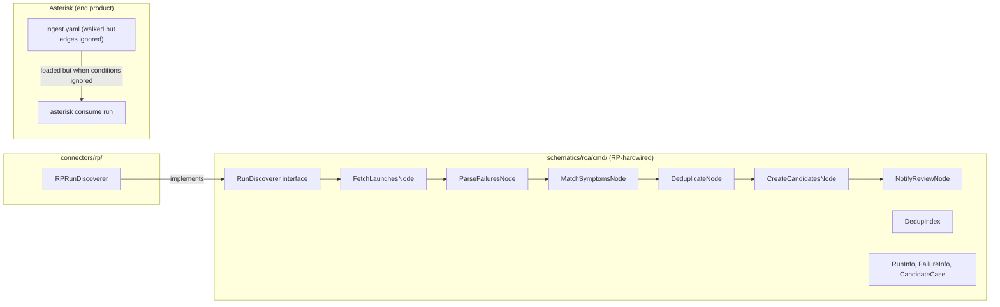
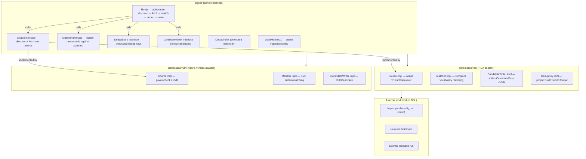

# Contract — ingestion-pipeline-decoupling

**Status:** complete  
**Goal:** Any Origami schematic can ingest data from its domain sources into a calibration dataset using the generic `ingest/` harness — schematic provides Go runtime (source adapter, matcher, candidate builder), end product provides DSL artifacts (ingestion config, source definitions).  
**Serves:** Containerized Runtime (next-milestone)

## Contract rules

- The generic `ingest/` package has zero imports from any schematic. No `schematics/rca` imports.
- Ingestion is NOT a circuit. It is an ETL pipeline: `Source → Transform → Candidate Ground Truth`. No walker, no graph edges.
- The three-layer ownership model is preserved:
  - **Framework** (`ingest/`): generic pipeline orchestrator, interfaces, DedupStore, manifest parsing.
  - **Schematic** (`schematics/rca/`): Go runtime — source adapter (RP discoverer), symptom matcher, candidate builder.
  - **End product** (Asterisk): DSL artifacts — ingestion config YAML, source definitions, dedup rules.
- Existing `asterisk consume run` must work identically after refactoring.
- No new schematic implementations (Achilles) — this contract extracts the generic harness; consumers are future work.

## Context

Conversation: [Calibration & Ingestion audit](65013565-a183-40d2-ae82-707267f65454) identified that the entire ingestion pipeline is hardwired to ReportPortal. At 20 schematics, each domain (CVE databases, govulncheck, JUnit XML, GHA workflows) would need to copy the pipeline code.

Key findings:
- `RunDiscoverer` interface returns RP-shaped types: `[]RunInfo` (with `FailedCount`, `UUID`, `Number`), `[]FailureInfo` (with `ItemID`, `ItemUUID`, `IssueType`, `AutoAnalyzed`).
- `RunDiscovererFactory` takes RP connection params: `baseURL, apiKeyPath, project`.
- `CandidateCase` struct has `RunID int`, `ItemID int` — RP test item IDs.
- `DedupKey()` method hardcodes format `project:launchID:itemID`.
- All 5 ingest nodes (`FetchLaunchesNode`, `ParseFailuresNode`, `MatchSymptomsNode`, `DeduplicateNode`, `CreateCandidatesNode`) operate directly on RCA/RP types.
- `IngestConfig` has `RPProject` field.
- `consumeForwardEdge.Evaluate()` unconditionally forwards — the `when` conditions in `ingest.yaml` are aspirational decoration the code ignores.
- No generic `Source`, `Candidate`, or `Pipeline` abstraction exists anywhere in the framework.

What is reusable today:
- `DedupIndex` — string-keyed set (key format is RP-specific, but the data structure is generic).
- Framework node/walker mechanics (if ingestion stays as a circuit — but per discussion, it shouldn't).

What is RP-hardwired (must be abstracted):
- `RunInfo`, `FailureInfo`, `RunDiscoverer`, `RunDiscovererFactory` — all types and interfaces.
- `CandidateCase`, `DedupKey()`, `IngestConfig` — all domain types.
- All 5 node implementations — `FetchLaunchesNode` through `CreateCandidatesNode`.
- `consumeForwardEdge` — dead edge implementation that ignores YAML conditions.

### Current architecture

### Desired architecture

## FSC artifacts

| Artifact | Target | Compartment |
|----------|--------|-------------|
| Ingestion pipeline design reference | `docs/` | domain |
| Updated glossary: IngestionManifest, Source, Matcher, CandidateWriter, DedupStore | `glossary/` | domain |

## Execution strategy

Three sequential streams. Each builds on the previous. Build + test after every stream.

### Stream A: Define generic pipeline interfaces in `ingest/`

Create a new `ingest/` package (or extend `calibrate/`) with domain-agnostic abstractions.

1. Define `Source` interface — `Discover(ctx, config) ([]Record, error)` where `Record` is `map[string]any` or a generic struct. Sources discover and fetch raw records from external systems.
2. Define `Matcher` interface — `Match(records []Record, patterns []Pattern) ([]Match, error)`. Matches raw records against domain-specific patterns (symptoms, CVE signatures, etc.).
3. Define `DedupStore` interface — `Contains(key string) bool`, `Add(key string)`, `Save() error`. Wraps string-keyed deduplication. Promote `DedupIndex` from `schematics/rca/cmd/` to this package.
4. Define `CandidateWriter` interface — `Write(candidates []Candidate) error`. Persists candidates for human review.
5. Define `IngestionManifest` struct — parsed from YAML: source ref, matcher ref, dedup config, output dir.
6. Implement `ingest.Run(ctx, manifest, source, matcher, dedup, writer)` — orchestrate the ETL pipeline.

### Stream B: Implement RCA adapters in `schematics/rca/`

Move RP-specific logic from `cmd/ingest.go` and `source.go` into adapter implementations.

1. Implement `rca.RPSource` — wraps `RunDiscoverer` and `RPRunDiscoverer`; converts `RunInfo`/`FailureInfo` to generic `Record`.
2. Implement `rca.SymptomMatcher` — wraps existing `MatchSymptomsNode` logic; matches against `GroundTruthSymptom` vocabulary.
3. Implement `rca.RCADedupKey` — generates `project:runID:itemID` format keys.
4. Implement `rca.RCACandidateWriter` — wraps existing `CreateCandidatesNode` logic; writes `CandidateCase` JSON files.
5. Wire `cmd_consume.go` to use `ingest.Run()` with RCA adapters instead of walking the circuit with fake edges.

### Stream C: Replace ingestion circuit YAML with config

1. Replace `internal/circuits/ingest.yaml` in Asterisk with an ingestion config format (no nodes/edges).
2. Remove `consumeForwardEdge` and the dead circuit-walking code from `cmd_consume.go`.
3. Update `origami.yaml` to reference the config correctly.
4. Validate: `asterisk consume run` works identically.

## Coverage matrix

| Layer | Applies | Rationale |
|-------|---------|-----------|
| **Unit** | yes | Generic `ingest.Run()` with mock Source/Matcher/DedupStore/Writer; manifest parsing; DedupIndex promotion; RCA adapter implementations |
| **Integration** | yes | Full ingestion flow through generic harness with RCA adapters (using stub discoverer) |
| **Contract** | yes | `Source`, `Matcher`, `DedupStore`, `CandidateWriter` interfaces enforced at compile time |
| **E2E** | yes | `asterisk consume run` produces identical output before and after |
| **Concurrency** | N/A | Ingestion is single-threaded pipeline today; no parallel paths |
| **Security** | yes | See Security assessment |

## Tasks

- [x] Stream A — Define `Source`, `Matcher`, `DedupStore`, `CandidateWriter` interfaces in new `ingest/` package. **Done** — `ingest/ingest.go` with `Record`, `Candidate`, `Summary`, `Source`, `Matcher`, `DedupStore`, `CandidateWriter`, `Run()`.
- [x] Stream A — Promote `DedupIndex` from `schematics/rca/cmd/` to `ingest/` package. **Done** — `ingest/dedup.go` with `DedupIndex` implementing `DedupStore`.
- [x] Stream A — Define `IngestionManifest` struct and YAML parser. **Done** — `ingest/config.go` with `Config` struct (`LookbackDays`, `OutputDir`, `Extra map[string]any`).
- [x] Stream A — Implement `ingest.Run()` pipeline orchestrator. **Done** — `ingest/ingest.go:Run()` chains discover → match → dedup → write.
- [x] Stream B — Implement RCA adapters for all four interfaces in `schematics/rca/`. **Done** — `schematics/rca/cmd/ingest.go` with `RPSource`, `SymptomMatcher`, `RCACandidateWriter`.
- [x] Stream B — Wire `cmd_consume.go` to use `ingest.Run()` with RCA adapters. **Done** — `cmd_consume.go` calls `ingest.Run(ctx, icfg, source, matcher, dedupIdx, writer)`.
- [x] Stream C — Replace `internal/circuits/ingest.yaml` with config format in Asterisk. **Done** — deleted decorative `internal/circuits/ingest.yaml` and removed `ingest:` reference from `origami.yaml`. The `cmd_consume.go` uses `ingest.Config` directly.
- [x] Stream C — Remove `consumeForwardEdge` and dead circuit-walking code. **Done** — `consumeForwardEdge` was already removed in a prior session; `cmd_consume.go` calls `ingest.Run()` directly.
- [x] Validate (green) — `asterisk consume run` works, all tests pass. **Done** — `go test ./ingest/...` and `go test ./schematics/rca/cmd/...` green. `just build` in both Origami and Asterisk passes.
- [x] Tune (blue) — N/A — no further tuning needed; code is clean.
- [x] Validate (green) — all tests still pass after tuning. **Done.**

## Acceptance criteria

- **Given** the `ingest/` package, **when** inspected, **then** it has zero imports from `schematics/rca` or any other schematic.
- **Given** a schematic that implements `Source`, `Matcher`, `DedupStore`, and `CandidateWriter`, **when** `ingest.Run()` is called with its config, **then** it discovers records, matches patterns, deduplicates, and writes candidates.
- **Given** the RCA schematic with its RP adapters, **when** `asterisk consume run` is executed, **then** the output is identical to the pre-refactor output.
- **Given** Asterisk's `ingest.yaml`, **when** parsed, **then** it is a config file (source ref, output dir, dedup config) with no `nodes:` or `edges:` sections.
- **Given** a `consumeForwardEdge`, **when** searched for in the codebase, **then** it no longer exists.
- **Given** a hypothetical second schematic (Achilles), **when** it implements the four interfaces with govulncheck/NVD adapters, **then** `ingest.Run()` works without any RCA-specific code paths.

## Security assessment

| OWASP | Finding | Mitigation |
|-------|---------|------------|
| A03:2021 Injection | `Source` interface fetches data from external systems (RP API, NVD API). Could a malicious source inject payloads? | Pre-existing risk. Source adapters use parameterized API calls. No raw string interpolation into queries or prompts. The generic pipeline does not change the trust boundary — the same RP API calls happen, just through an interface. |
| A04:2021 Insecure Design | `DedupStore` moved to a generic package. Could a different dedup key format weaken deduplication? | DedupStore is an interface — each schematic controls its key format. The generic pipeline calls `Contains()` / `Add()` without interpreting key contents. Key quality is the schematic adapter's responsibility. |
| A08:2021 Software and Data Integrity | Candidates are written to disk as JSON files. Could a malicious candidate file be promoted without review? | Pre-existing — the human review gate (`asterisk dataset review / promote`) is unchanged. The generic pipeline writes candidates; promotion requires explicit human action. |

## Notes

2026-03-05 — Contract drafted from ingestion audit in [Calibration & Ingestion audit](65013565-a183-40d2-ae82-707267f65454). Key insight: ingestion is an ETL pipeline, not a circuit. The `ingest.yaml` was walked by the framework but with `consumeForwardEdge` that unconditionally forwarded — all `when` conditions were aspirational decoration. The pipeline has zero reusable pieces for other domains except `DedupIndex` (string keys). Three-layer ownership: framework provides pipeline harness, schematic provides Go source/matcher/writer adapters, end product provides config YAML.

2026-03-06 — **Contract complete.** Stream A (generic `ingest/` package) and Stream B (RCA adapters) were completed incrementally in prior sessions. Stream C completed in this session: deleted decorative `internal/circuits/ingest.yaml` from Asterisk, removed `ingest:` reference from `origami.yaml`. `consumeForwardEdge` was already gone. All acceptance criteria met: `ingest/` has zero schematic imports, `ingest.Run()` works with any adapters, `cmd_consume.go` uses generic pipeline.
