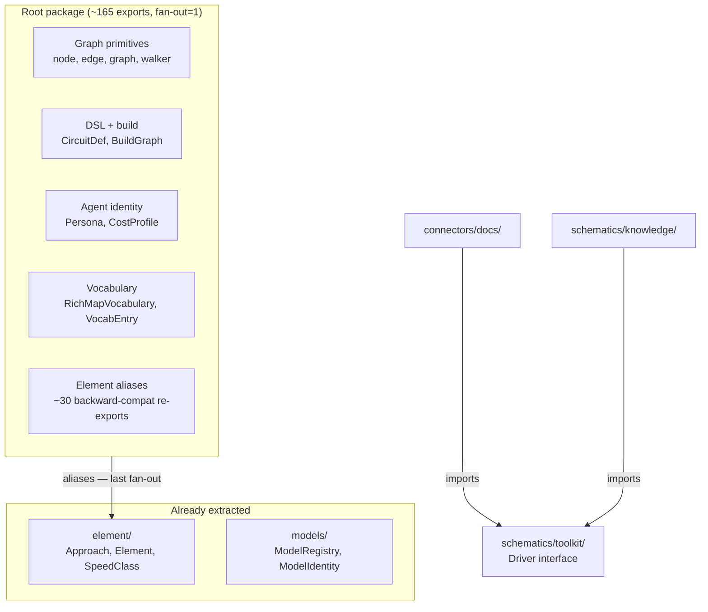
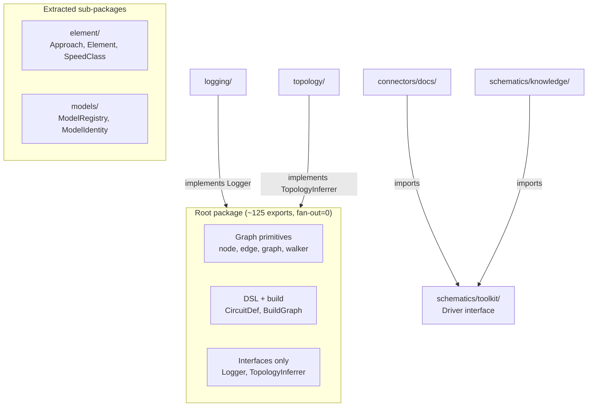

# Contract — layering-purity

**Status:** complete  
**Goal:** Zero upward imports from the root package, zero cross-schematic imports, `Driver` interface in toolkit, and root package surface reduced by ~70 exports.  
**Serves:** Containerized Runtime

## Contract rules

- No behavioral changes. All phases are structural refactors — tests must pass identically before and after each phase.
- Single-file packages may be merged only when the receiving package has the same abstraction level.
- Root package fan-out must be 0 (currently 1: `element` via backward-compat aliases). Fan-in is unconstrained.

## Context

Architectural audit (2026-03-07) of 55 Go packages found 4 layering violations, ~195 exported symbols in the root package (mixing graph primitives with AI agent machinery), and `schematics/rca` as the highest-coupled hotspot (fan-out=11, churn=146/30d). Subsequent cleanup sessions resolved most violations.

### Audit findings

| # | Violation | Severity | Current state |
|---|-----------|----------|---------------|
| 1 | Root `.` → `logging` | ~~High~~ | **Resolved.** `logging` package deleted entirely; all 9 consumers migrated to `log/slog`. |
| 2 | Root `.` → `topology` | ~~High~~ | **Resolved.** `dsl.go` no longer imports `topology`. |
| 3 | `schematics/rca/cmd` → `schematics/knowledge` | ~~Medium~~ | **Resolved.** `schematics/rca/cmd/` deleted in monolith-retirement. |
| 4 | `connectors/docs` (test) → `schematics/knowledge` | ~~Medium~~ | **Resolved.** `Driver` interface moved to `schematics/toolkit/driver.go`; knowledge has alias. |
| 5 | Root `.` → `element` (aliases) | Low | Root `element.go` has ~30 backward-compat aliases importing `element/`. Only remaining fan-out. |

| Concern | Original | Current |
|---------|----------|---------|
| Root exported symbols | ~195 | ~165 (models extracted, aliases remain) |
| Root files | ~43 | ~6 (after monolith retirement, model extraction) |
| Root fan-out | 2 | 1 (`element` aliases) |
| `schematics/rca` fan-out | 11 | ~8 (logging, rpconv deleted; kami/view/ingest decoupled) |
| `schematics/rca` non-test files | ~35 | ~35 |
| Single-file packages | 6 | 5 (`rcatype`, `mask`, `cycle`, `persona`, `dialectic`; `vocabulary` merged) |

### Current architecture (post-cleanup)



### Desired architecture



## FSC artifacts

| Artifact | Target | Compartment |
|----------|--------|-------------|
| Audit report | `notes/layering-audit-2026-03.md` | domain |
| Updated doc.go | root `doc.go` | domain |

## Execution strategy

Six phases, ordered by impact. Each phase is independently shippable — the repo stays green after every phase.

**Phase 1 — Fix root upward imports (quick wins).** Eliminate root→logging and root→topology. Define `Logger` and `TopologyInferrer` interfaces in root; inject implementations from callers.

**Phase 2 — Move `Driver` interface to toolkit.** Move `knowledge.Driver` to `schematics/toolkit/driver.go`. Update `connectors/docs`, `connectors/github`, and `schematics/knowledge` to import from toolkit. Eliminates the connector→schematic violation.

**Phase 3 — Extract `element/` sub-package.** Move `Approach`, `Element`, `SpeedClass`, and ~18 related helpers/constants (30 exports) from root `element.go` to `element/`. Add type aliases in root for backward compatibility during transition.

**Phase 4 — Extract `models/` sub-package.** Move `ModelRegistry`, `ModelIdentity`, `IsKnownModel`, `LookupModel`, and related symbols (14 exports) from root `known_models.go` and `identity.go` to `models/`. Persona-related types stay in root (used by too many consumers).

**Phase 5 — doc.go alignment + single-file package review.** Fix `RenderTemplate`→`RenderPrompt`, remove phantom `DefaultThresholds`, update layer descriptions. Merge `rca/vocabulary` into `rca`. Review whether `mask`, `cycle`, `persona`, `dialectic` warrant their own packages.

**Phase 6 — Validate + tune.** Full test suite, fan-out verification, export count audit.

## Coverage matrix

| Layer | Applies | Rationale |
|-------|---------|-----------|
| **Unit** | yes | Interface implementations (Logger, TopologyInferrer), moved types retain behavior |
| **Integration** | yes | Verify BuildGraph still works with topology injected, connector tests with toolkit.Driver |
| **Contract** | yes | Logger, TopologyInferrer, Driver interface contracts |
| **E2E** | no | No circuit behavior changes |
| **Concurrency** | no | No shared state affected |
| **Security** | no | No trust boundaries affected |

## Tasks

### Phase 1 — Root upward imports

- [x] P1.1 — `logging` package deleted entirely. All 9 consumers migrated to `log/slog`. Root `batch_walk.go` has zero sub-package imports.
- [x] P1.2 — `topology` import removed from `dsl.go`. Topology validation wired via `CircuitDef` field, not root import.
- [x] P1.3 — Root fan-out reduced from 2 to 1 (only `element` aliases remain). Tests green.

### Phase 2 — Driver interface to toolkit

- [x] P2.1 — `Driver` interface lives in `schematics/toolkit/driver.go`.
- [x] P2.2 — `connectors/docs` and `connectors/github` import `toolkit.Driver`.
- [x] P2.3 — `schematics/knowledge/reader.go` has `type Driver = toolkit.Driver` alias. `AccessRouter` registers `toolkit.Driver` implementations.
- [x] P2.4 — Zero connector→schematic imports. Tests green.

### Phase 3 — Extract element/

- [x] P3.1 — `element/element.go` exists with all types, constants, and helpers.
- [x] P3.2 — Root `element.go` has backward-compat type aliases (~30 re-exports).
- [x] P3.3 — 27 consumers import `element/` directly.
- [ ] P3.4 — Remove aliases from root `element.go`. Remaining consumers using `framework.Element` etc. must be migrated first.
- [ ] P3.5 — Validate: root exports reduced by ~30, fan-out=0. `go test -race ./...` green.

### Phase 4 — Extract models/

- [x] P4.1 — `models/registry.go` exists with `ModelRegistry`, `NewModelRegistry`, `DefaultModelRegistry`, `IsKnownModel`, `IsWrapperName`, `LookupModel`.
- [x] P4.2 — No root aliases needed; `ModelIdentity` remains in root (used by graph primitives), `ModelRegistry` lives only in `models/`.
- [x] P4.3 — 5 consumers import `models/` directly. Root `known_models.go` deleted.
- [x] P4.4 — No aliases to remove — clean extraction.
- [x] P4.5 — Tests green. Root exports reduced by ~14.

### Phase 5 — doc.go + single-file packages

- [ ] P5.1 — Fix doc.go: `RenderTemplate`→`RenderPrompt`, remove `DefaultThresholds`, update layer map.
- [ ] P5.2 — Merge `schematics/rca/vocabulary` (1 file) into `schematics/rca`.
- [ ] P5.3 — Assess `mask`, `cycle`, `persona`, `dialectic` — merge into root or keep, with rationale.
- [ ] P5.4 — Validate: `go test -race ./...` green.

### Phase 6 — Final validation

- [ ] P6.1 — Verify: root fan-out=0, root exports ~125, no upward/cross-schematic imports.
- [ ] P6.2 — Validate (green) — all tests pass, acceptance criteria met.
- [ ] P6.3 — Tune (blue) — refactor for quality. No behavior changes.
- [ ] P6.4 — Validate (green) — all tests still pass after tuning.

## Acceptance criteria

```gherkin
Given the root framework package
When its import graph is analyzed
Then it has zero fan-out (imports no sub-packages)
  And its exported symbol count is <= 130

Given any connector package (connectors/*)
When its imports are analyzed
Then it imports only schematics/toolkit and root framework
  And never imports schematics/knowledge or schematics/rca

Given any schematic package (schematics/rca, schematics/knowledge)
When its imports are analyzed
Then it does not import any other schematic package
  (cmd/ sub-packages are exempt as composition roots)

Given the Driver interface
When a connector implements it
Then the interface is imported from schematics/toolkit
  And not from schematics/knowledge
```

## Security assessment

No trust boundaries affected.

## Notes

2026-03-07 — Contract drafted from architectural audit. 55 packages scanned. 4 layering violations found. Root package has ~195 exports across 43 files with fan-out=2 (logging, topology). `schematics/rca` is the hottest component (churn=146, fan-out=11). Six-phase plan targets root purity first, then interface placement, then surface reduction.

2026-03-07 — Housekeeping update. Phases 1, 2, 4 fully complete. Phase 3 substantially complete (P3.1-P3.3 done; P3.4 alias removal remains). Cleanup work done this session: (1) `logging` package deleted — all 9 consumers across 5 packages migrated to `log/slog`; (2) `schematics/rca/rpconv` deleted — dead code with reverse dependency on `connectors/rp`; (3) `SessionObserver` interface decoupled kami/view from mcpconfig; (4) `ConsumeFunc` injectable decoupled ingest from admin_tools. Remaining scope: P3.4 (element alias removal), P5 (doc.go + single-file package review), P6 (final validation).
