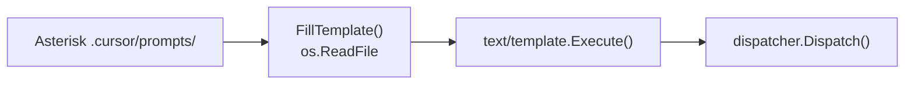
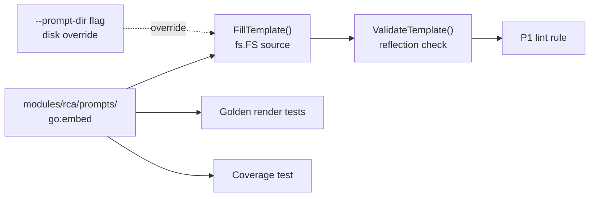

# Contract — prompt-first-class

**Status:** complete
**Goal:** Prompt templates are validated, tested, and embedded — on par with circuit YAML and scorecard YAML.
**Serves:** API Stabilization

## Contract rules

- Companion contract: Asterisk `prompt-first-class-consumer` (moves templates into `prompts/`, adds manifest).
- Prompts embedded via `go:embed`; `--prompt-dir` flag overrides for development.
- Reference files (e.g. `gap-analysis.md`) are not Go templates and must not be validated by the field checker.

## Context

- `modules/rca/template.go` — `FillTemplate()` loads from disk via `os.ReadFile`, no validation.
- `modules/rca/params_types.go` — `TemplateParams` struct (14 top-level fields, ~30 nested types).
- `modules/rca/transformer_rca.go` — `rcaTransformer.Transform()` renders, writes, dispatches.
- `lint/rules_structural.go` — `EmptyPrompt` checks node has a prompt, but not content validity.
- `.cursor/prompts` hardcoded in 11 source/test files (see Task 2).
- `modules/rca/mcpconfig/testdata/.cursor/prompts/` — full mirror of consumer prompts for MCP tests.

### Current architecture

### Desired architecture

## FSC artifacts

| Artifact | Target | Compartment |
|----------|--------|-------------|
| P1 lint rule docs | `docs/` | domain |

## Execution strategy

Three phases, each gated by `go build` + `go test`:

1. **Embed + plumbing** — Copy prompts into `modules/rca/prompts/`, add `go:embed`, upgrade `FillTemplate()` to `fs.FS`, update all 11 hardcoded path references, remove testdata mirror.
2. **Validator** — `ValidateTemplate()` using reflection on `TemplateParams` struct to check `{{.Field}}` references.
3. **Lint + tests** — P1 lint rule, golden render tests (F0-F6), template coverage test.

## Coverage matrix

| Layer | Applies | Rationale |
|-------|---------|-----------|
| **Unit** | yes | `ValidateTemplate()` field checker, `FillTemplate()` with embedded vs disk FS, template coverage. |
| **Integration** | yes | MCP tests using embedded prompts instead of testdata mirror. |
| **Contract** | yes | `TemplateParams` struct is the contract between Go code and template files. |
| **E2E** | no | Prompt rendering is tested via calibration (stub), not a dedicated E2E. |
| **Concurrency** | no | `FillTemplate()` is stateless; no shared mutable state. |
| **Security** | no | No trust boundaries affected — prompts are developer-authored, not user-supplied. |

## Tasks

- [x] T1: Embed default prompts — `modules/rca/prompts/` with `//go:embed prompts` via `DefaultPromptFS`. `FillTemplateFS()` accepts `fs.FS`. `--prompt-dir` overrides via `resolvePromptFS()`.
- [x] T2: Update all `.cursor/prompts` references — all 11 source files migrated to embedded FS.
- [x] T3: Remove testdata prompt mirror — `modules/rca/mcpconfig/testdata/.cursor/prompts/` deleted. MCP tests use `DefaultPromptFS`.
- [x] T4: Template field validator — `ValidateTemplateFields()` in `template.go`. AST walker + reflection. 15 unit tests covering typos, nesting, range, with, maps, parse errors.
- [x] T5: Lint rule P1 — `P1/template-param-validity` in `lint/rules_prompt.go`. Generic callback pattern via `WithPromptFS`/`WithPromptValidator` options. CLI wired in `cmd/origami/main.go`.
- [x] T6: Golden render tests — `TestPromptGolden` (7 subtests) in `template_golden_test.go` with `testdata/golden/prompt-*.md` snapshots. `-update-golden` flag.
- [x] T7: Template coverage test — `TestTemplateParams_AllFieldsUsed` + `ExtractTemplateFields()` + `AllFieldPaths()`. Exclusion list with documented reasons.
- [x] Validate (green) — `go build ./...`, `go test ./...` (36 packages), `origami lint --profile strict`. All acceptance criteria met.
- [x] Tune (blue) — no separate tune pass needed; code quality addressed during implementation.
- [x] Validate (green) — final `go test ./...` all green.

## Acceptance criteria

- **Given** a prompt template with `{{.Failure.ErrorMesage}}` (typo), **When** `ValidateTemplate()` runs, **Then** it returns an error naming the invalid field.
- **Given** `origami lint --profile strict` on a circuit with prompt templates, **When** a template references a nonexistent param, **Then** a `P1/template-param-validity` finding is emitted.
- **Given** the default embedded prompts, **When** `FillTemplate()` is called without `--prompt-dir`, **Then** prompts are loaded from the embedded FS.
- **Given** `--prompt-dir=/custom/path`, **When** `FillTemplate()` is called, **Then** disk prompts override embedded defaults.
- **Given** all 7 prompt templates and the `TemplateParams` struct, **When** the coverage test runs, **Then** every struct field is referenced by at least one template.

## Security assessment

No trust boundaries affected. Prompt templates are developer-authored source artifacts embedded at build time, not user-supplied input. Template rendering uses Go `text/template` (not `html/template`), which is appropriate since output is consumed by LLM agents, not browsers.

## Notes

2026-03-01 — Contract drafted. Companion: Asterisk `prompt-first-class-consumer`.
2026-03-03 — Contract complete. All 7 tasks done. Phase 1 was pre-existing; Phases 2-3 implemented in session. New files: `lint/rules_prompt.go`, `modules/rca/template_golden_test.go`, `modules/rca/testdata/golden/prompt-*.md` (7 golden snapshots). Modified: `template.go` (+ValidateTemplateFields, +ExtractTemplateFields, +AllFieldPaths), `lint/lint.go` (+PromptFS/PromptValidator options), `lint/rules.go` (+promptRules), `cmd/origami/main.go` (CLI wiring).
