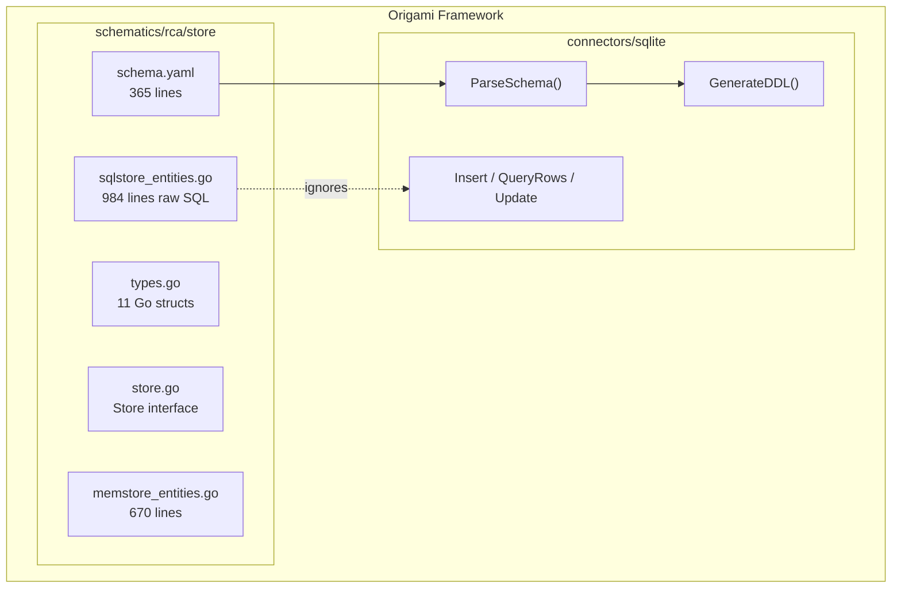
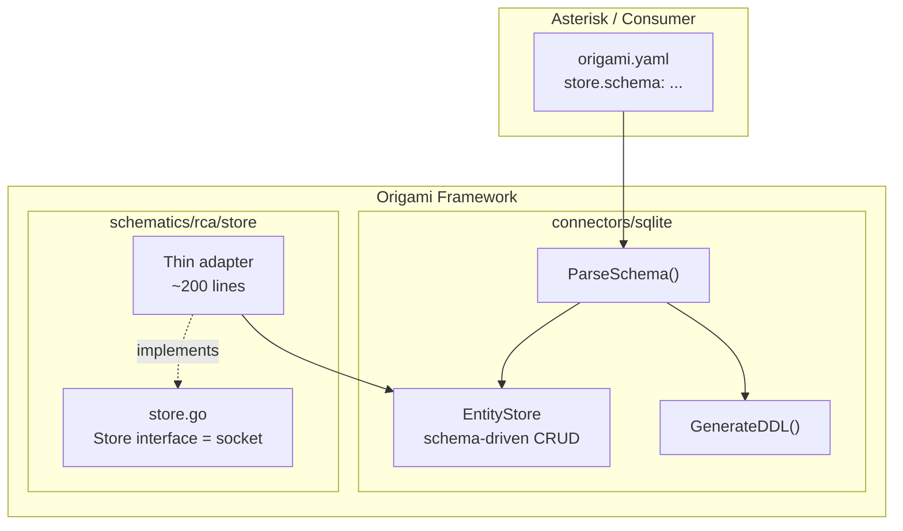

# Contract — Schema-Driven Entity Store

**Status:** complete  
**Goal:** The SQLite connector provides schema-driven entity CRUD so that schematics never write SQL and consumers own their data model via `schema.yaml`.  
**Serves:** API Stabilization (gate — last functional coupling between framework and domain)

## Contract rules

- Global rules only.
- Schema-driven CRUD lives in `connectors/sqlite` (Level 2). No domain imports.
- The RCA schematic's `Store` interface (the socket) does not change shape — only the implementation changes.
- `schema.yaml` moves from `schematics/rca/store/` to the consumer (Asterisk) as part of the `store:` binding in `origami.yaml`.
- Zero `database/sql` imports in schematic code after this contract.

## Context

The RCA store is 2,653 lines of hand-written Go across 8 files:

| File | Lines | Purpose |
|------|-------|---------|
| `sqlstore_entities.go` | 984 | Hand-written INSERT/SELECT/UPDATE for 11 entity types |
| `memstore_entities.go` | 670 | In-memory mirror of the same 11 entity types |
| `sqlstore.go` | 296 | Envelope save/get, RCA/case CRUD |
| `schema.yaml` | 365 | Declarative schema (already exists, right format) |
| `types.go` | 157 | Go struct definitions for 11 entity types |
| `store.go` | 98 | Store interface (the socket — stays) |
| `memstore.go` | 68 | MemStore constructor |
| `schema.go` | 15 | Schema loader |

The `connectors/sqlite` package already provides `InsertParams`, `QueryParams`, `UpdateParams`, `QueryRows`, `QueryOne` — generic CRUD helpers. But `sqlstore_entities.go` ignores them entirely and writes raw SQL.

The tension: 11 entity types × 3 operations (create/get/list) × 2 implementations (SQL + mem) = ~1,654 lines of boilerplate that could be derived from the 365-line `schema.yaml`.

### Current architecture



### Desired architecture



## FSC artifacts

| Artifact | Target | Compartment |
|----------|--------|-------------|
| EntityStore API reference | `docs/connectors-sqlite.md` | domain |
| Schema-to-entity mapping design | `notes/schema-entity-mapping.md` | domain |

## Execution strategy

Three phases, each leaving the build green:

1. **Build EntityStore in `connectors/sqlite`** — schema-aware generic CRUD (`Create`, `Get`, `List`, `Update`) that maps `map[string]any` rows using column metadata from the parsed schema. Unit tested against in-memory SQLite.

2. **Rewrite RCA SqlStore as thin adapter** — replace 984 lines of `sqlstore_entities.go` with calls to `EntityStore`. Each method becomes a ~5-line adapter: marshal Go struct to `map[string]any`, call EntityStore, unmarshal result. The `Store` interface does not change.

3. **Move schema.yaml to consumer** — extract `schema.yaml` from `schematics/rca/store/` into Asterisk's `origami.yaml` `store:` binding. Update `fold` codegen to pass schema to the SQLite connector. Delete the embedded schema from the framework.

## Coverage matrix

| Layer | Applies | Rationale |
|-------|---------|-----------|
| **Unit** | yes | EntityStore CRUD against in-memory SQLite; adapter marshal/unmarshal |
| **Integration** | yes | Full round-trip: schema.yaml → EntityStore → typed Store interface |
| **Contract** | yes | Store interface compliance: SqlStore adapter passes existing test suite unchanged |
| **E2E** | yes | `just calibrate-stub` — existing calibration still passes |
| **Concurrency** | yes | Race detector (`-race`) on all tests |
| **Security** | no | No new trust boundaries; SQLite parameterized queries already used |

## Tasks

- [x] Design `EntityStore` API in `connectors/sqlite` — `Create`, `Get`, `List`, `Update`, `Delete` operating on `map[string]any` with schema-aware column metadata
- [x] Implement `EntityStore` with unit tests against in-memory SQLite
- [x] Implement `MemEntityStore` (in-memory variant for testing, replaces `memstore_entities.go`)
- [x] Rewrite `sqlstore_entities.go` as thin adapter over `EntityStore` (~200 lines replacing ~984)
- [x] Rewrite `memstore_entities.go` as thin adapter over `MemEntityStore` (~100 lines replacing ~670)
- [x] Delete dead code — remove raw SQL, redundant helpers (2 legitimate raw SQL remain: atomic counter + bulk status update)
- [x] Move `schema.yaml` to Asterisk's `origami.yaml` store binding (done by domain-separation-container P4.12)
- [x] Update `fold` codegen to pass schema to SQLite connector
- [x] Validate (green) — all tests pass, `just test-race`, `just calibrate-stub`, `just build` across all repos
- [x] Tune (blue) — refactor adapter layer for clarity, no behavior changes
- [x] Validate (green) — all tests still pass after tuning

## Acceptance criteria

```gherkin
Given a schema.yaml with table "cases" (id, name, status, error_message)
When EntityStore.Create("cases", {"name": "test-1", "status": "open"}) is called
Then it returns a valid int64 ID
And EntityStore.Get("cases", id) returns {"id": id, "name": "test-1", "status": "open"}

Given the existing RCA Store interface with 30+ methods
When SqlStore is reimplemented as an EntityStore adapter
Then all existing store tests pass without modification
And zero raw SQL exists in schematics/rca/store/

Given Asterisk's origami.yaml declares a store.schema section
When `origami fold` builds the binary
Then the binary creates the SQLite DB with the consumer-defined schema
And schematics/rca/store/ contains no embedded schema.yaml

Given a new consumer (e.g. Achilles) wants persistence
When it declares its own schema in origami.yaml
Then it gets CRUD for its tables without writing Go store code in the framework
```

## Security assessment

No trust boundaries affected. SQLite parameterized queries (already used by `connectors/sqlite` CRUD helpers) prevent SQL injection. The `EntityStore` uses the same parameterized path — no string interpolation of user data into SQL.

## Notes

(Running log, newest first.)

2026-03-06 16:45 — **Contract retroactively marked complete.** Sanity-check audit found all work was done incrementally during prior sessions:
- `EntityStore` exists in `connectors/sqlite/entity_store.go` with `Create`, `Get`, `GetBy`, `List`, `Update`, `Delete`, `Mutate`, `MutateAll` + `Row` type with typed accessors.
- `MemEntityStore` exists in `connectors/sqlite/mem_entity_store.go` with the same interface.
- `sqlstore_entities.go` shrank from 984→614 lines. All CRUD delegates to `EntityStore`. Only 2 raw SQL remain: `UpdateSymptomSeen` (atomic `occurrence_count + 1` with conditional status flip) and `MarkDormantSymptoms` (bulk `datetime()` arithmetic). Both are legitimate — they use SQL features (`SET col = col + 1`, `datetime('now', ...)`) that cannot be expressed through generic CRUD.
- `memstore_entities.go` shrank from 670→494 lines.
- `schema.yaml` moved to Asterisk by `domain-separation-container` P4.12; remains in `testdata/` as test fixture only.
- Entity types: 10 (not 11 as originally claimed). Total store LOC: 1,997 (down from 2,653).
- Acceptance criteria met: `EntityStore` provides schema-driven CRUD; `SqlStore` is a thin adapter; schema lives at the consumer.

2026-03-04 17:55 — Contract created. Motivated by the SP2 refactoring session which revealed that the store layer (2,653 lines) is the last major coupling between the RCA schematic and domain-specific code in the framework. The `connectors/sqlite` package already has the primitives (`Insert`, `QueryRows`, `Update`); the gap is a schema-aware entity mapper that eliminates hand-written SQL boilerplate. After this contract + README + PoC Done flag, the framework is MVP.
