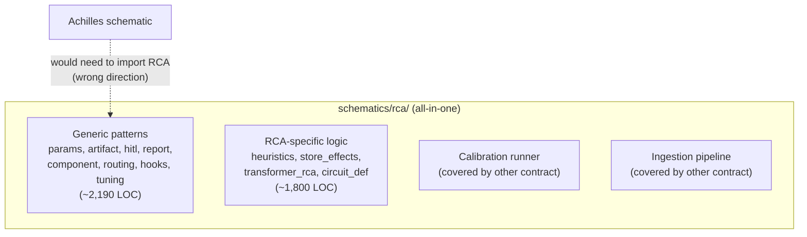
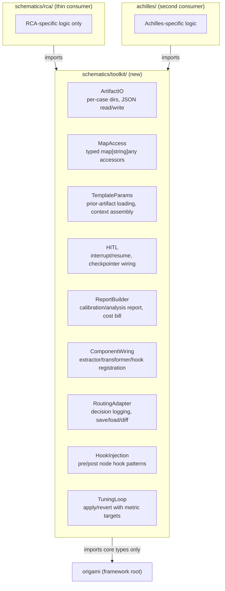

# Contract — schematic-runtime-toolkit

**Status:** complete  
**Goal:** Generic schematic runtime patterns (template params, HITL, artifact I/O, report rendering, component wiring, adapter routing, hooks, tuning) are extracted from `schematics/rca/` into a reusable `schematics/toolkit/` package, so a second schematic (Achilles) can use them without importing RCA.  
**Serves:** Containerized Runtime (next-milestone)

## Contract rules

- **Extract, don't redesign.** Move working patterns with minimal interface generalization. No speculative abstractions.
- **RCA stays functional.** Every extraction phase ends with `go test -race ./...` green. RCA imports the toolkit and delegates; it never loses functionality.
- **Achilles validates generality.** Each extracted primitive is considered done only when Achilles can import and use it without touching `schematics/rca/`.
- **Depends on existing contracts.** Calibration runner (`calibration-harness-decoupling`) and ingestion (`ingestion-pipeline-decoupling`) are out of scope — they have their own contracts.
- Global rules apply.

## Context

Conversation: [Root package health check](65013565-a183-40d2-ae82-707267f65454) identified that `schematics/rca/` contains ~3,800 LOC of generic patterns that any schematic needs. When Achilles (or a future schematic) needs template parameters, HITL review, artifact I/O, report rendering, or component wiring, it would have to either duplicate thousands of lines or import from `schematics/rca/` — a wrong dependency direction.

### What's NOT covered by existing contracts

| Generic pattern | Current file(s) | LOC | Existing contract |
|-----------------|-----------------|-----|-------------------|
| Calibration runner | `cal_runner`, `cal_adapters`, `cal_types`, `metrics` | ~1,200 | `calibration-harness-decoupling` |
| RP ingestion | `rp_source`, `source` | ~170 | `ingestion-pipeline-decoupling` |
| **Template param building** | `params`, `params_types` | ~360 | **NONE — this contract** |
| **Artifact I/O** | `artifact`, `map_access` | ~150 | **NONE — this contract** (+ DSC P5.6: `nodeArtifactFilenames`) |
| **HITL review** | `hitl`, `hitl_transformer` | ~240 | **NONE — this contract** |
| **Report rendering** | `report_data` | ~600 | **NONE — this contract** |
| **Component wiring** | `component` | ~100 | **NONE — this contract** (+ DSC P5.3: `allNodeNames`) |
| **Routing adapter** | `adapter_routing` | ~140 | **NONE — this contract** |
| **Hook injection pattern** | `hooks`, `hooks_inject` | ~470 | **NONE — this contract** |
| **Tuning loop** | `tuning` | ~130 | **NONE — this contract** |

**Total scope: ~2,190 LOC** of generic patterns to extract.

### Current architecture

### Desired architecture

## FSC artifacts

| Artifact | Target | Compartment |
|----------|--------|-------------|
| Toolkit API reference | `docs/toolkit-api.md` | domain |
| Extraction decision log | `notes/schematic-toolkit-extraction-log.md` | domain |

## Execution strategy

Extract one pattern at a time, from least coupled to most coupled. Each phase: extract → RCA consumes → tests green → Achilles validates. This ordering minimizes cascading breakage.

### Phase 1 — Foundation (leaf utilities, no dependencies)

Extract `map_access` and `artifact` — pure utility code with no framework imports beyond basic types.

### Phase 2 — Template & Component (depends on Phase 1)

Extract `params`/`params_types` (depends on artifact I/O) and `component` (depends on framework types).

### Phase 3 — Hooks & Routing (depends on Phase 2)

Extract `hooks`/`hooks_inject` (depends on component wiring) and `adapter_routing` (depends on artifact I/O).

### Phase 4 — HITL & Tuning (depends on Phases 1-2)

Extract `hitl`/`hitl_transformer` (depends on checkpointer types) and `tuning` (depends on metrics).

### Phase 5 — Report rendering (depends on all above)

Extract `report_data` — the most coupled pattern, depends on artifact I/O, template params, and metrics types.

### Phase 6 — Achilles integration test

Prove the toolkit works for a second consumer by having Achilles import and use at least ArtifactIO, TemplateParams, ComponentWiring, and ReportBuilder.

## Coverage matrix

| Layer | Applies | Rationale |
|-------|---------|-----------|
| **Unit** | yes | Each extracted primitive retains its existing unit tests, moved to `toolkit/` |
| **Integration** | yes | RCA schematic must still pass `go test -race ./...` after each extraction |
| **Contract** | yes | New `toolkit/` interfaces must be documented and tested for contract compliance |
| **E2E** | yes | `just calibrate-stub` must pass after each phase |
| **Concurrency** | no | No new shared state; existing concurrency patterns are preserved |
| **Security** | no | No trust boundaries affected |

## Tasks

### Phase 1 — Foundation

- [x] P1.1: Create `schematics/toolkit/` package with `doc.go`.
- [x] P1.2: Extract `map_access.go` → `toolkit/mapaccess.go`. Update `schematics/rca/` to import from toolkit.
- [x] P1.3: Extract `artifact.go` (generic parts) → `toolkit/artifact.go`. Update `schematics/rca/` to import from toolkit. **Absorbs DSC P5.6:** RCA `NodeArtifactFilename` now delegates to `toolkit.NodeArtifactFilename(nodeName, rcaNodeArtifacts)` with a guard for unknown nodes (returns `""`). Convention-based fallback available for new schematics.
- [x] P1.4: Validate — `go test -race ./...` green.

### Phase 2 — Template & Component

- [x] P2.1: Extract `params.go`, `params_types.go` → `toolkit/params.go`, `toolkit/params_types.go`. Generalize template context assembly.
- [x] P2.2: Extract `component.go` → `toolkit/component.go`. Generalize extractor/transformer/hook registration. **Absorbs DSC P5.3:** `TransformerComponent`, `HITLComponent` accept variadic `*framework.CircuitDef`; `nodeNames(cd)` helper uses `toolkit.NodeNamesFromCircuit` with fallback to `allNodeNames`. `ComponentConfig` gains `CircuitDef` field. All existing callers unchanged.
- [x] P2.3: Validate — `go test -race ./...` green.

### Phase 3 — Hooks & Routing

- [x] P3.1: Extract `hooks.go`, `hooks_inject.go` (generic hook injection pattern) → `toolkit/hooks.go`. RCA-specific hook logic stays in RCA.
- [x] P3.2: Extract `adapter_routing.go` → `toolkit/routing.go`. Generalize routing decision interface.
- [x] P3.3: Validate — `go test -race ./...` green.

### Phase 4 — HITL & Tuning

- [x] P4.1: Extract `hitl.go`, `hitl_transformer.go` → `toolkit/hitl.go`. Generalize interrupt/resume wiring.
- [x] P4.2: Extract `tuning.go` → `toolkit/tuning.go`. Generalize apply/revert with metric targets.
- [x] P4.3: Validate — `go test -race ./...` green.

### Phase 5 — Report rendering

- [x] P5.1: Extract generic report rendering patterns from `report_data.go` → `toolkit/report.go`. RCA-specific report sections stay in RCA.
- [x] P5.2: Validate — `go test -race ./...` green.

### Phase 6 — Achilles validation

- [x] P6.1: In Achilles, import and use `toolkit.NodeNamesFromCircuit` (circuit-aware `NodeRegistry`), `toolkit.PluralizeCount` + `toolkit.GroupByKey` (report rendering), `toolkit.NodeArtifactFilename` (convention-based artifact naming).
- [x] P6.2: Validate — Achilles `go build ./...` green, Origami `go test -race ./...` green (50+ packages), Asterisk `just build` green.
- [x] P6.3: Tune — API surface documented in `docs/toolkit-api.md`; extraction decisions logged in `notes/schematic-toolkit-extraction-log.md`.
- [x] P6.4: Validate — all tests still pass after tuning.

## Acceptance criteria

**Given** the `schematics/toolkit/` package after this contract,  
**When** a new schematic (Achilles) needs template params, artifact I/O, HITL, report rendering, component wiring, routing, hooks, or tuning,  
**Then** it imports `schematics/toolkit/` — not `schematics/rca/`.

**Given** the `schematics/rca/` package after this contract,  
**When** its files are inspected,  
**Then** it contains only RCA-specific logic (heuristics, store effects, domain types, RCA-specific hooks). Generic runtime patterns live in `toolkit/`.

**Given** the `schematics/rca/` LOC after this contract,  
**When** compared to the LOC before,  
**Then** `schematics/rca/` has shrunk by approximately 2,190 LOC (moved to toolkit).

**Given** all tests and calibration,  
**When** run after the final phase,  
**Then** `go test -race ./...` is green and `just calibrate-stub` passes.

## Security assessment

No trust boundaries affected.

## Notes

2026-03-06 — Contract drafted. Scoped to ~2,190 LOC of generic patterns not covered by `calibration-harness-decoupling` or `ingestion-pipeline-decoupling`. Ordered from least coupled (map_access, artifact) to most coupled (report_data). Achilles validates generality in Phase 6.

2026-03-06 — **Absorbed DSC P5.3 and P5.6** during contract reassessment. P5.3 (`allNodeNames` hardcoded list → read from circuit YAML) absorbed into P2.2 (component wiring). P5.6 (`nodeArtifactFilenames` hardcoded map → convention-based derivation) absorbed into P1.3 (artifact I/O). Both are schematic-level wiring concerns that naturally belong in the toolkit extraction, not in the domain-separation contract.

2026-03-05 — **Phases 1-5 largely complete.** Toolkit package created with 12 source files and 12 test files. All extraction targets implemented: mapaccess, artifact, params, component, hooks, routing, hitl, tuning, report. Additionally, source catalog decoupling completed (not originally scoped): generic `Source`, `SourceCatalog`, `SourceReader` types extracted to toolkit; root `knowledge/` directory deleted; all imports migrated through RCA, connectors, and schematics/knowledge. `go test -race ./...` green (50 packages). Two partial items remain: P1.3 (RCA still uses own `NodeArtifactFilename`) and P2.2 (RCA still uses hardcoded `allNodeNames`). Phase 6 (Achilles validation) not started. Contract moved to active.

2026-03-05 — **Contract complete.** P1.3: RCA `NodeArtifactFilename` delegates to `toolkit.NodeArtifactFilename` with override map + unknown-node guard. P2.2: `TransformerComponent`, `HITLComponent`, `buildExtractors` accept variadic `*framework.CircuitDef`; `nodeNames(cd)` helper prefers circuit-derived names. `ComponentConfig` gains `CircuitDef` field. P6: Achilles imports toolkit for circuit-aware `NodeRegistry` (`NodeNamesFromCircuit`), report rendering (`PluralizeCount`, `GroupByKey`), and artifact filename convention (`NodeArtifactFilename`). FSC artifacts: `docs/toolkit-api.md` API reference and `notes/schematic-toolkit-extraction-log.md` extraction log. All three repos green: Origami `go test -race ./...` (50+ packages), Achilles `go build ./...`, Asterisk `just build`.
