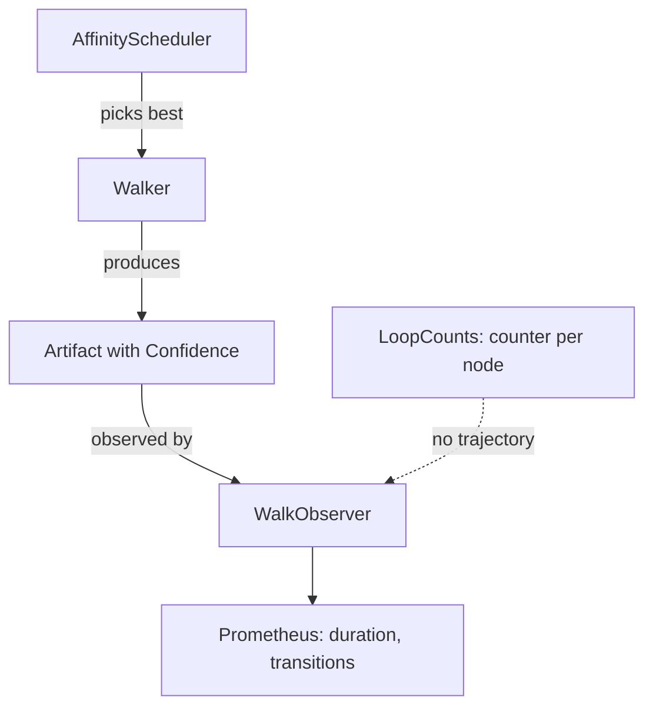
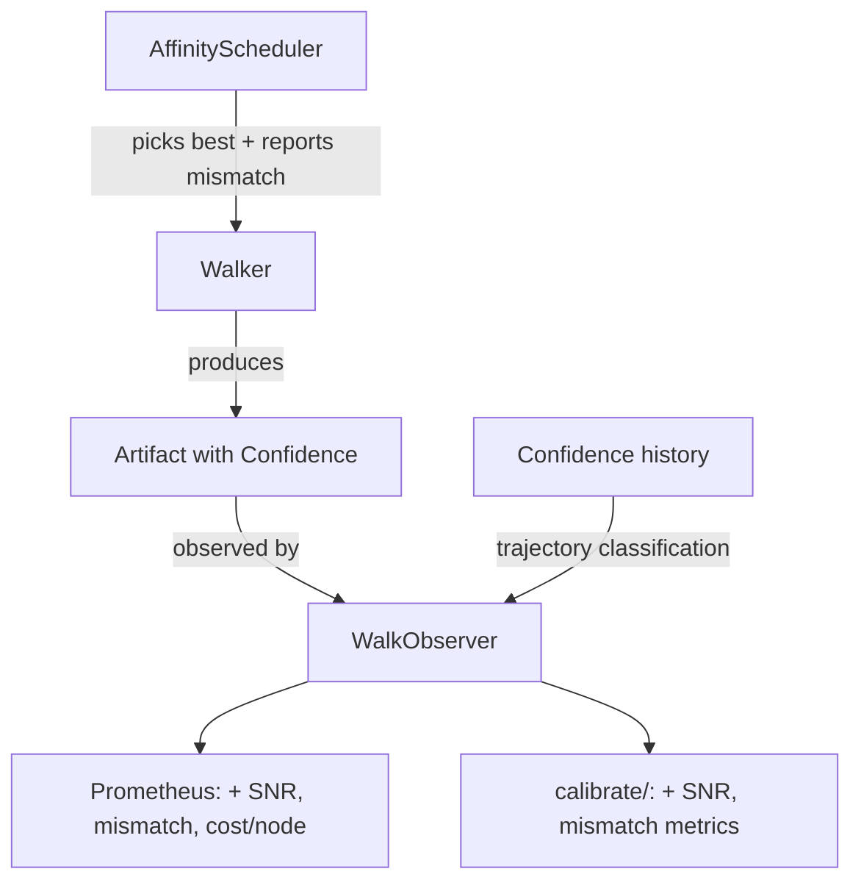

# Contract — signal-integrity

**Status:** complete  
**Goal:** Add evidence SNR metric, per-node cost tracking, impedance mismatch scoring, and convergence trajectory classification.  
**Serves:** API Stabilization

## Contract rules

- New metrics are observability features, not throttling gates — consistent with Safety > Speed.
- All metrics surface via `WalkObserver` events and `calibrate/` reports. No new dependencies.
- Impedance mismatch scoring extends `AffinityScheduler`, does not replace it.
- Convergence trajectory classification extends `WalkerState`, does not replace `LoopCounts`.
- Derived from: [electronic-circuit-theory.md](../../docs/case-studies/electronic-circuit-theory.md), Takeaways 4-6, Gaps 2-3.

## Context

- [electronic-circuit-theory.md](../../docs/case-studies/electronic-circuit-theory.md) — Signal integrity metrics, impedance matching, convergence trajectory patterns.
- [scheduler.go](../../../../scheduler.go) — `AffinityScheduler.Select()` (lines 30-74). Routes without reporting match quality.
- [observer.go](../../../../observer.go) — `WalkEvent` (lines 28-40) with `Metadata map[string]any` extension point.
- [walker.go](../../../../walker.go) — `WalkerState.LoopCounts` (line 19). Counter only, no confidence history.
- [observability/prometheus.go](../../../../observability/prometheus.go) — Existing token/cost counters.
- [calibrate/scorecard.go](../../../../calibrate/scorecard.go) — Default metric definitions (lines 227-272).
- [dispatch/token.go](../../../../dispatch/token.go) — Per-step token tracking. No per-node tracking.

### Current architecture

### Desired architecture

## FSC artifacts

| Artifact | Target | Compartment |
|----------|--------|-------------|
| SNR, mismatch, trajectory glossary entries | `glossary/` | domain |

## Execution strategy

1. Add `Mismatch() float64` reporting to `AffinityScheduler.Select()` via `WalkEvent.Metadata`.
2. Add confidence history tracking to `WalkerState` (per-loop confidence values).
3. Implement trajectory classifier: underdamped, overdamped, critically damped, unstable.
4. Implement evidence SNR computation at node boundaries (evidence items in vs. out).
5. Add per-node token/cost tracking by wiring `dispatch.TokenRecord` to node names.
6. Add Prometheus gauges/counters for SNR, mismatch, trajectory.
7. Add SNR and mismatch to `calibrate/` default scorecard.

## Coverage matrix

| Layer | Applies | Rationale |
|-------|---------|-----------|
| **Unit** | yes | Mismatch scoring, trajectory classifier, SNR computation |
| **Integration** | yes | Metrics flow from scheduler -> observer -> Prometheus/calibrate |
| **Contract** | no | No new public interfaces — these are metrics, not API contracts |
| **E2E** | yes | Walk with mismatched walkers produces mismatch events |
| **Concurrency** | no | Metrics are per-walk, not shared across concurrent walks |
| **Security** | no | No trust boundaries affected |

## Tasks

- [ ] Add `Mismatch() float64` computation to `AffinityScheduler.Select()`, emit via `WalkEvent.Metadata["mismatch"]`
- [ ] Add `ConfidenceHistory []float64` to `WalkerState` for loop-based tracking
- [ ] Implement trajectory classifier: `ClassifyTrajectory(history []float64) TrajectoryType`
- [ ] Emit trajectory classification via `WalkEvent.Metadata["trajectory"]`
- [ ] Implement `EvidenceSNR(inputItems, outputItems int) float64` computation
- [ ] Wire evidence SNR into `EventNodeExit` metadata
- [ ] Add per-node token/cost tracking: extend `TokenRecord` with node name, aggregate in Prometheus
- [ ] Add Prometheus metrics: `origami_evidence_snr`, `origami_walker_mismatch`, `origami_convergence_trajectory`
- [ ] Add SNR and mismatch to `calibrate/scorecard.go` default metrics
- [ ] Validate (green) — all tests pass, acceptance criteria met.
- [ ] Tune (blue) — refactor for quality. No behavior changes.
- [ ] Validate (green) — all tests still pass after tuning.

## Acceptance criteria

- **Given** a team walk with a Fire walker assigned to a Water node,
- **When** `AffinityScheduler.Select()` runs,
- **Then** `WalkEvent.Metadata["mismatch"]` reports a non-zero mismatch score.

- **Given** a looping node that produces confidence values [0.6, 0.7, 0.65, 0.72, 0.68],
- **When** the trajectory classifier runs,
- **Then** it classifies the pattern as "underdamped" (oscillating around target).

- **Given** a node that receives 5 evidence items and outputs 3,
- **When** the SNR is computed,
- **Then** `EvidenceSNR = 3/5 = 0.60`.

- **Given** a circuit walk with per-node token tracking enabled,
- **When** the walk completes,
- **Then** `origami_tokens_total` has labels for each node name visited.

## Security assessment

No trust boundaries affected.

## Notes

2026-03-01 — Contract created from electronic circuit case study. Evidence SNR closes Gap 2. Per-node cost tracking closes Gap 3. Impedance mismatch scoring makes Takeaway 4 actionable. Convergence trajectory classification makes Takeaway 5 actionable.
