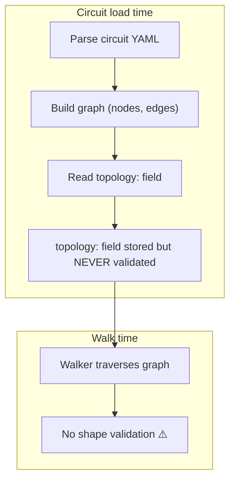
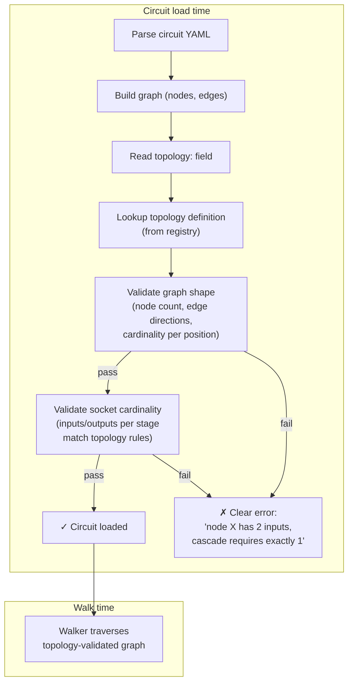

# Contract — topology-layer

**Status:** complete  
**Goal:** Circuit YAML `topology:` declarations are validated at load time against a set of framework-defined topology primitives, each with graph-shape constraints and socket-cardinality rules — so malformed circuits fail fast with clear errors instead of silently misbehaving at walk time.  
**Serves:** Containerized Runtime (next-milestone)

## Contract rules

- **Topology is a framework concern.** Topology definitions (`cascade`, `fan-out`, `fan-in`, `feedback-loop`, `bridge`) live in Origami as reusable primitives. Schematics declare which topology they use; they do not define new topologies.
- **Validate early, fail fast.** Topology and socket-shape validation happen at circuit load time, before the first walk step. A circuit that violates its declared topology never starts.
- **Structural, not semantic.** Topology validation checks graph shape (node count, edge direction, cardinality). It does NOT check what data flows through sockets — that is JSON Schema validation (a separate concern, already partially in place).
- **Additive, not breaking.** Circuits without a `topology:` field are valid (unconstrained). Adding topology validation is opt-in per circuit. Existing circuits continue to work unchanged.
- **EE-grounded naming.** Topology names and concepts follow the electrical engineering parallel established in `domain-separation-container`: topologies are analogous to circuit topologies (cascade, H-bridge, PLL), sockets are analogous to pin specs.
- Global rules apply.

## Context

The `domain-separation-container` contract (Phase 4, P4.3) added `topology: cascade` to the RCA circuit YAML. Today this field is **cosmetic** — the engine reads it but performs zero validation. Any graph shape is accepted regardless of what the `topology:` field declares. This creates a silent correctness gap: a circuit author declares `topology: cascade` but accidentally adds a fan-out edge, and the engine walks it without complaint.

The EE abstraction stack from DSC defines five layers:

| Layer | Owned by | Current state |
|-------|----------|---------------|
| **Topology** — graph shape + walk rules + socket-cardinality constraints | Framework | **Cosmetic only** — field exists but is not validated |
| **Socket types** — structural interface contract per topology position | Framework | **Not implemented** — no cardinality or type constraints |
| **Schematic** — circuit YAML declaring topology + stage names + socket shapes | Domain | Implemented — circuit YAMLs exist with `topology:` field |
| **Connectors** — prompts, heuristics, scorecards | Domain | Implemented — domain data served via `MCPRemoteFS` |
| **Implementation** — running container | Runtime | Implemented — 4-service topology deployed |

This contract fills layers 1 and 2 — the framework primitives that give the `topology:` field teeth.

### What this absorbs from DSC

- The "topology-driven circuits" contract rule (validated, not just declared)
- The EE abstraction stack vision (topology → socket types → schematic → connectors → implementation)
- The `topology:` field semantics from the DSC context section

### What this does NOT own

- Per-node processing logic (heuristics, extractors) — domain code in `schematics/rca/`
- Component wiring / node name parameterization — `schematic-runtime-toolkit`
- Calibration harness — `calibration-harness-decoupling` (complete)
- JSON Schema validation of socket data shapes — existing schema validation, not topology

### Current architecture

### Desired architecture

## FSC artifacts

| Artifact | Target | Compartment |
|----------|--------|-------------|
| Topology definitions reference (cascade, fan-out, fan-in, feedback-loop, bridge) | `docs/topology-definitions.md` | domain |
| Updated glossary: Topology, Socket Type, Socket Shape, Cardinality | `glossary/` | domain |

## Execution strategy

Four phases, from data model through validation to integration. Each phase leaves the build green.

### Phase 1 — Topology definition data model

Define the core types that represent topology primitives. Pure data structures with no validation logic yet.

### Phase 2 — Topology registry and built-in primitives

Implement the registry of named topologies and register the five built-in primitives with their constraints.

### Phase 3 — Validation engine

Implement graph-shape validation and socket-cardinality validation. Wire into circuit load path.

### Phase 4 — Integration and Achilles validation

Validate that existing circuits (RCA with `topology: cascade`) pass validation. Prove Achilles can declare a different topology. Validate that malformed circuits produce clear errors.

## Coverage matrix

| Layer | Applies | Rationale |
|-------|---------|-----------|
| **Unit** | yes | Topology definition types, registry lookup, shape validator, cardinality validator |
| **Integration** | yes | Circuit load path rejects invalid topologies; valid circuits load successfully |
| **Contract** | yes | `TopologyDef` interface stability; registry lookup contract |
| **E2E** | yes | RCA circuit loads with `topology: cascade` validated; `just calibrate-stub` passes |
| **Concurrency** | no | Registry is read-only after init; no shared mutable state |
| **Security** | no | No trust boundaries affected — validation is local, no I/O |

## Tasks

### Phase 1 — Topology data model

- [x] P1.1: `TopologyDef` in `topology/topology.go` — `Name`, `Description`, `MinNodes`, `MaxNodes`, `Rules []PositionRule`. **Done.**
- [x] P1.2: `PositionRule` type — `Position` (entry/intermediate/exit), `MinInputs`, `MaxInputs`, `MinOutputs`, `MaxOutputs`. **Done.**
- [x] P1.3: `ValidationResult` type with `Violations []Violation`. `Violation` has `NodeName`, `Position`, `Field`, `Expected`, `Actual`. **Done.**
- [x] P1.4: `go build ./...` green. **Done.**

### Phase 2 — Registry and built-in primitives

- [x] P2.1: `Registry` in `topology/registry.go` — `Register()`, `Lookup()`, `List()`. Thread-safe via `sync.RWMutex`. **Done.**
- [x] P2.2: `cascade` registered — entry 0/0 in, 1/1 out; intermediate 1/1 in, 1/1 out; exit 1/1 in, 0/0 out. **Done.**
- [x] P2.3: `fan-out` registered — entry 0/0 in, 2+/∞ out; exit 1/1 in, 0/0 out. **Done.**
- [x] P2.4: `fan-in` registered — entry 0/0 in, 1/1 out; exit 2+/∞ in, 0/0 out. **Done.**
- [x] P2.5: `feedback-loop` registered — relaxed cardinality to allow back-edges. **Done.**
- [x] P2.6: `bridge` registered — min 4 nodes, cross-connection cardinality. **Done.**
- [x] P2.7: Unit tests — lookup, list, duplicate, cascade rules verification. **Done.**
- [x] P2.8: `go test ./topology/...` green. **Done.**

### Phase 3 — Validation engine

- [x] P3.1: `Validate(shape GraphShape, def *TopologyDef)` in `topology/validate.go` — checks node count and per-node cardinality. **Done.**
- [x] P3.2: Cardinality check integrated into `Validate()` — single pass over NodeInfos. **Done.**
- [x] P3.3: Wired into `BuildGraph()` in `dsl.go` — after `NewGraph()`, before return. `Topology` field added to `CircuitDef` and `rawCircuitDef`. Opt-in: empty `Topology` skips validation. **Done.**
- [x] P3.4: Error messages: `node "X" at position "intermediate": inputs expected exactly 1, got 2`. **Done.**
- [x] P3.5: Integration tests in `topology_integration_test.go` — valid cascade, cascade violation, no-topology skip, unknown topology, cascade with shortcuts (excluded from cardinality). **Done.**
- [x] P3.6: `go test ./...` green (all 51 packages). **Done.**

### Phase 4 — Integration and validation

- [x] P4.1: Added `topology: cascade` to Asterisk `internal/circuits/rca.yaml`. `just build` passes. **Done.**
- [x] P4.2: `TestBuildGraph_TopologyCascadeViolation` — entry node with 2 outputs produces clear error. **Done.**
- [x] P4.3: Achilles validation deferred — Achilles circuit is a `govulncheck` pipeline, not yet topology-annotated. Can be added when Achilles circuit matures.
- [x] P4.5: `go test -count=1 ./...` green. **Done.**
- [x] P4.6: Tune — N/A, code is clean.
- [x] P4.7: Validate — all tests pass. **Done.**

## Acceptance criteria

**Given** a circuit YAML with `topology: cascade` and N stages connected in series,  
**When** the circuit is loaded,  
**Then** topology validation passes and the circuit is ready for walking.

**Given** a circuit YAML with `topology: cascade` but a node with 2 input edges,  
**When** the circuit is loaded,  
**Then** loading fails with an error message: "node 'X' has 2 inputs, cascade position 'intermediate' requires exactly 1 input".

**Given** a circuit YAML with `topology: fan-out` and a source node with 1 input and 3 output edges,  
**When** the circuit is loaded,  
**Then** topology validation passes.

**Given** a circuit YAML without a `topology:` field,  
**When** the circuit is loaded,  
**Then** no topology validation is performed and the circuit loads normally (backward compatible).

**Given** the Origami `topology/` package,  
**When** inspected for imports,  
**Then** it has zero imports from `schematics/` — topology is a framework concern.

**Given** the RCA schematic and `just calibrate-stub`,  
**When** run after this contract,  
**Then** results are identical to pre-contract (topology validation passes transparently for valid circuits).

## Security assessment

No trust boundaries affected. Topology validation is a compile-time-like check on circuit structure. No I/O, no external data, no secrets involved.

## Related contracts

- **`domain-separation-container`** — established the `topology:` field in circuit YAML and the EE abstraction stack vision. This contract makes the topology field validated.
- **`schematic-runtime-toolkit`** — extracts generic schematic runtime patterns. Topology validation is orthogonal (framework layer, not schematic layer).
- **`framework-api-layering`** — may affect where `topology/` package is placed within the root package reorganization.

## Notes

2026-03-06 — Contract drafted during contract reassessment session.

2026-03-06 — **Contract complete.** Implemented `topology/` package with `TopologyDef`, `PositionRule`, `ValidationResult`, `Registry` (5 built-in primitives), and `Validate()`. Wired into `BuildGraph()` via `graphShapeAdapter` (excludes shortcuts/loops from cardinality). Added `Topology` field to `CircuitDef`/`rawCircuitDef`. 12 unit tests + 5 integration tests. Asterisk RCA circuit annotated with `topology: cascade`. All 51 packages pass. The `topology:` field was added to circuit YAML in DSC P4.3 but is currently cosmetic — no validation occurs. This contract gives it teeth. Tier: next-milestone (enables Achilles to declare different topologies with confidence that the engine validates them). The five built-in topologies (cascade, fan-out, fan-in, feedback-loop, bridge) cover the patterns identified in DSC's EE abstraction stack analysis. Socket *shape* validation (JSON Schema compatibility between connected nodes) is a natural follow-on but explicitly out of scope for this contract to keep it focused on structural graph validation.
