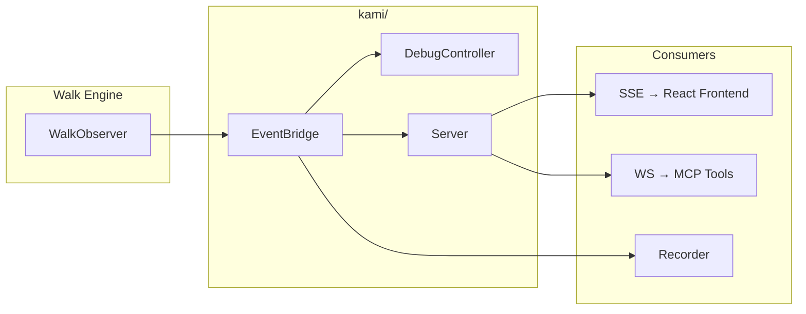
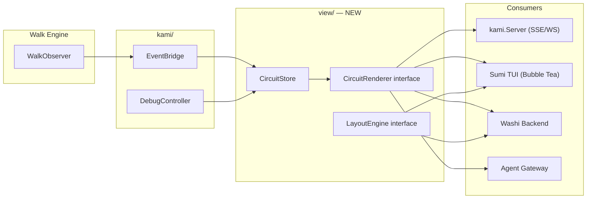

# Contract — viewmodel-layer

**Status:** complete (2026-03-02)  
**Goal:** Ship a reactive ViewModel layer (`CircuitStore`, `CircuitRenderer`, `LayoutEngine`) that decouples circuit visual state from rendering surface, enabling GUI (Washi), TUI (Sumi), and Agent consumers from one API.  
**Serves:** API Stabilization (finish-line — external dependency)

## Contract rules

Global rules only, plus:

- **Framework code only.** The ViewModel layer lives in the Origami framework. No product-specific rendering logic (React, Bubble Tea, etc.) belongs here.
- **Zero breaking changes to existing observers.** `WalkObserver`, `WalkEvent`, `kami.EventBridge`, and `kami.Event` remain unchanged. The ViewModel layer is additive — it consumes these types, it does not replace them.
- **Kami migration is backward-compatible.** `kami.Server` can optionally consume `CircuitStore` instead of raw `EventBridge`. The SSE JSON format does not change. Existing Kami frontends (debugger, Kabuki) work without modification.

## Context

- `observer.go` — `WalkObserver` interface, `WalkEvent`, `MultiObserver`, `LogObserver`, `TraceCollector`
- `kami/bridge.go` — `EventBridge` pub/sub (the pattern `CircuitStore` extends)
- `kami/event.go` — Unified `kami.Event` type (walk events + signals + debug events)
- `kami/debug.go` — `DebugController`, `CircuitSnapshot`, breakpoints, pause/resume
- `kami/server.go` — `Server.handleSSE` (current direct EventBridge → SSE pipe)
- `studio/backend/observer.go` — `StudioObserver` (Washi's event store adapter — future consumer)
- `dsl.go` — `CircuitDef`, `NodeDef`, `EdgeDef`, `ZoneDef`
- `render.go` — `Render(*CircuitDef) string` (Mermaid text output)
- `contracts/draft/washi.md` — Washi product spec (Phase 1 consumes ViewModel)
- `contracts/draft/sumi.md` — Sumi TUI spec (depends on ViewModel)
- `docs/case-studies/electronic-symbols-washi-pictograms.md` — OSS pictogram vocabulary + semantic zoom levels
- `docs/case-studies/electronic-circuit-theory.md` — Component-level mapping (transistor = Node, etc.)

### Current architecture

Every consumer subscribes directly to `EventBridge` and derives its own visual state. No shared representation of "what the circuit looks like now."

### Desired architecture

`CircuitStore` is the single source of truth for visual state. All rendering surfaces subscribe to it. `LayoutEngine` computes positions appropriate to each medium.

## FSC artifacts

| Artifact | Target | Compartment |
|----------|--------|-------------|
| `CircuitStore` glossary term | `glossary/` | domain |
| `CircuitRenderer` glossary term | `glossary/` | domain |
| `LayoutEngine` glossary term | `glossary/` | domain |
| Five Layers interaction model | `contracts/draft/washi.md` (update) | domain |

## Execution strategy

Single phase. The scope is an interface layer + one concrete store implementation + two layout algorithms + Kami migration. No product frontend work.

### Phase 1: Core types

Define the reactive state model in a new `view/` package:

- `CircuitSnapshot` — full point-in-time state of a circuit (topology + node states + walker positions + breakpoints + selection)
- `StateDiff` — incremental change (node state transition, walker moved, breakpoint toggled)
- `NodeVisualState` — enum: `Idle`, `Active`, `Completed`, `Error`
- `CircuitStore` — ingests `CircuitDef` + subscribes to `kami.EventBridge`, maintains `CircuitSnapshot`, emits `StateDiff` to subscribers

### Phase 2: Renderer and layout interfaces

- `CircuitRenderer` — abstract contract for rendering surfaces
- `LayoutEngine` — abstract contract for position computation
- `GridLayout` — cell-based layout (topological sort into row/column grid, zone-aware). Primary consumer: Sumi TUI.
- `LogicalLayout` — coordinate-based layout (assigns float64 x/y positions). Primary consumer: Washi (as seed for dagre/ELK).

### Phase 3: Kami migration

- Optionally wire `kami.Server` to consume `CircuitStore` instead of raw `EventBridge`
- `CircuitStore` implements `kami.EventBridge` subscriber interface, so it's a drop-in data source
- SSE JSON format unchanged — Kami frontends work without modification

## Coverage matrix

| Layer | Applies | Rationale |
|-------|---------|-----------|
| **Unit** | yes | `CircuitStore` state transitions, `GridLayout` node placement, `LogicalLayout` coordinate assignment |
| **Integration** | yes | Walk a circuit → verify `CircuitStore` emits correct `StateDiff` sequence → verify `CircuitSnapshot` matches expected state |
| **Contract** | yes | `CircuitRenderer` interface stability, `LayoutEngine` interface stability |
| **E2E** | no | No product frontend — consumers test their own rendering |
| **Concurrency** | yes | `CircuitStore` receives events from walk goroutines, emits diffs to subscriber goroutines. Must be thread-safe. |
| **Security** | no | No trust boundaries affected — pure in-process data transformation |

## Tasks

- [ ] **VM1** Define `view/` package — `CircuitSnapshot`, `StateDiff`, `NodeVisualState` types
- [ ] **VM2** Implement `CircuitStore` — ingest `CircuitDef` + subscribe to `EventBridge`, maintain snapshot, pub/sub for `StateDiff`
- [ ] **VM3** Define `CircuitRenderer` interface — `RenderTopology`, `ApplyDiff`, `HandleInput`
- [ ] **VM4** Define `LayoutEngine` interface — `Layout(*CircuitDef) CircuitLayout`
- [ ] **VM5** Implement `GridLayout` — topological sort into row/column grid, zone-aware grouping
- [ ] **VM6** Implement `LogicalLayout` — coordinate-based node positioning with zone containment
- [ ] **VM7** Unit tests — `CircuitStore` state transitions for all `WalkEventType` values
- [ ] **VM8** Unit tests — `GridLayout` and `LogicalLayout` produce valid positions for canonical circuits
- [ ] **VM9** Integration test — walk a circuit with `CircuitStore` subscribed, verify `StateDiff` sequence and final `CircuitSnapshot`
- [ ] **VM10** Migrate `kami.Server` to optionally consume `CircuitStore` (backward-compatible, gated by `Config` field)
- [ ] Validate (green) — all tests pass, Kami still works identically with and without `CircuitStore`
- [ ] Tune (blue) — refactor for quality. No behavior changes.
- [ ] Validate (green) — all tests still pass after tuning.

## Acceptance criteria

**Given** a `CircuitDef` with 5 nodes across 2 zones and an `EventBridge`,  
**When** a `CircuitStore` subscribes to the bridge and a walk executes,  
**Then** the store's `Snapshot()` reflects the correct `NodeVisualState` for each node at every point during the walk, walker positions update on `node_enter` events, and subscribers receive `StateDiff` values in the order events occurred.

**Given** two `CircuitRenderer` implementations subscribed to the same `CircuitStore`,  
**When** a walk event occurs,  
**Then** both renderers receive the same `StateDiff` at the same time. Neither blocks the other.

**Given** a `CircuitDef` with zones,  
**When** `GridLayout.Layout()` is called,  
**Then** nodes within the same zone are placed in adjacent grid cells, zones do not overlap, and the start node is in the leftmost column.

**Given** `kami.Server` configured with a `CircuitStore`,  
**When** an SSE client connects,  
**Then** the SSE JSON output is identical to the current `EventBridge`-direct mode. Existing Kami frontends render correctly without changes.

## Security assessment

No trust boundaries affected. The ViewModel layer is pure in-process data transformation between existing framework types. No network I/O, no user input parsing, no credential handling.

## Notes

2026-03-02 — Contract created. Motivated by the need to support both GUI (Washi) and TUI (Sumi) from a single API. The `kami.EventBridge` pub/sub pattern is the proven foundation — `CircuitStore` extends it with derived visual state.
