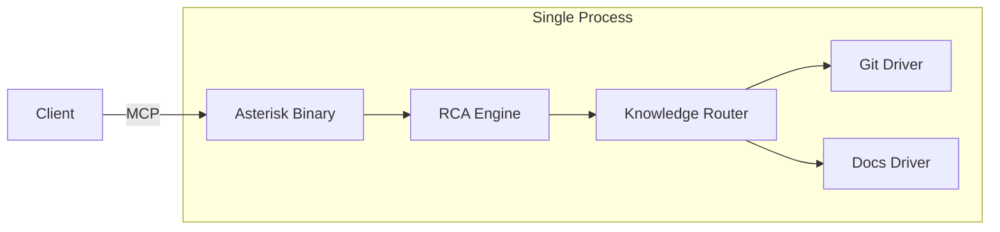
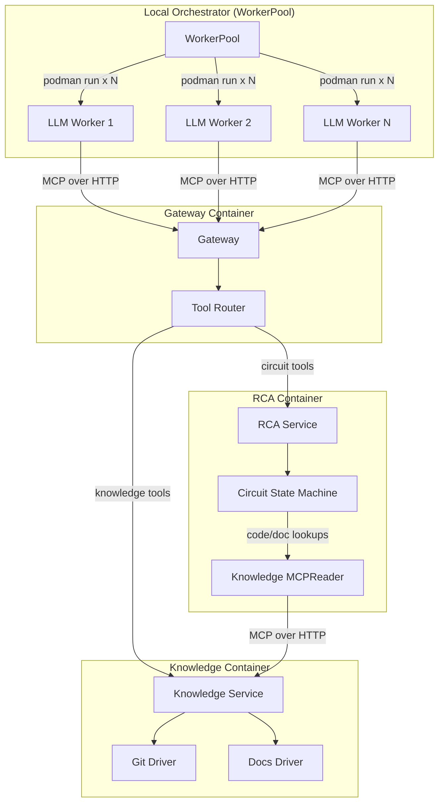

# Contract — cloud-native

**Status:** complete  
**Goal:** Asterisk runs as three containerized services (Gateway, RCA, Knowledge) orchestrated locally via Podman with a WorkerPool spawning LLM worker containers, validated by rigorous container E2E tests including a wet Llama run. Architecture foundations support future K8s migration without code changes.  
**Serves:** API Stabilization — containerized deployment with local orchestration is the operational maturity milestone after multi-schematic composition.

## Contract rules

- **No LLM inside service containers.** RCA is a deterministic circuit state machine. LLM reasoning happens in worker containers that call MCP tools as clients. Service containers are stateless.
- **Health probes on every service.** `/healthz` (liveness) and `/readyz` (readiness) on all service containers — mandatory for K8s compatibility and local health monitoring.
- **RemoteBackend is the inter-service transport.** All service-to-service communication uses `subprocess.RemoteBackend` over Streamable HTTP.
- **Container tests are the E2E authority.** E2E tests build real images, start real containers via `ContainerRuntime`, make real MCP calls, and assert real results. No mocks at the E2E layer.
- Global rules apply.

## Context

Predecessor contracts shipped the building blocks:

- **container-ready-serve** — `asterisk serve --transport http` over Streamable HTTP + Dockerfile.
- **fold-deploy-modes** — codegen for in-process / subprocess / container / remote modes.
- **remote-backend** — `RemoteBackend` connects to running MCP endpoints without lifecycle ownership.
- **decoupled-schematics** — Knowledge schematic with serve binary, `RegisterTools`, `MCPReader` adapter.

### Key architectural insights

1. **LLM workers are clients, not servers.** In the Papercup v2 choreography, external agents call `get_next_step` to receive a prompt, reason with an LLM, then call `submit_step`. The RCA service is deterministic — it generates prompts, validates submissions, and advances circuit state.

2. **RCA does not need horizontal scaling.** A single RCA instance handles N concurrent circuit sessions. Knowledge is the I/O bottleneck (git searches, doc fetches under concurrent worker load).

3. **The same container image runs everywhere.** Worker images built for Podman locally work identically in K8s Deployments, Docker Compose, or under a future Origami Operator. Only the orchestrator changes, not the image.

4. **WorkerPool is the local equivalent of a K8s Deployment.** `subprocess.WorkerPool` uses `ContainerRuntime` to `podman run` N worker containers. K8s replaces this with `replicas: N`. The worker image and behavior are identical.

5. **LLM provider is pluggable, not baked in.** The worker binary uses an `LLMClient` interface with implementations for Ollama (local Llama), Anthropic (Claude), Google AI (Gemini), and OpenAI. The provider is selected at runtime via `--provider` flag / env var. API keys are injected as environment variables — same pattern works with Podman env, Docker Compose env_file, and K8s Secrets. No CLI wrapping; all providers are called via their HTTP APIs directly.

Known gap: `schematics/rca/cmd/cmd_serve.go` does not wire `cfg.knowledgeReader` into the MCP server (fix already implemented in P0.1/P0.2).

### Current architecture

### Desired architecture

Four container images, one local orchestrator. The same images deploy unchanged to K8s.

### K8s migration path

| Local (this contract) | K8s (future contract) | Change needed |
|---|---|---|
| `WorkerPool` does `podman run` x N | K8s Deployment with `replicas: N` | Replace orchestrator, not images |
| `ContainerRuntime` starts services | K8s Deployments + Services | Replace orchestrator, not images |
| Env vars for endpoints | ConfigMap / Service DNS | Different values, same env var names |
| `WorkerPool.Scale(30)` | `kubectl scale --replicas=30` | Different API, same semantics |
| Health checks via `/healthz` polling | K8s liveness/readiness probes | Same endpoints |

## FSC artifacts

| Artifact | Target | Compartment |
|----------|--------|-------------|
| Cloud-native deployment guide | `docs/cloud-native-deployment.md` | domain |
| Gateway design reference | `docs/gateway-routing.md` | domain |
| WorkerPool API reference | `docs/worker-pool.md` | domain |

## Execution strategy

Seven phases, strictly ordered. Each phase leaves the build green.

- **Phase 0** — Fix serve wiring (prerequisite bug fix)
- **Phase 1** — Health and readiness probes on all serve binaries
- **Phase 2** — Standalone RCA serve binary
- **Phase 3** — Generic MCP routing gateway
- **Phase 4** — LLM worker image + WorkerPool
- **Phase 5** — Container E2E tests (stub circuit + real containers)
- **Phase 6** — Wet E2E with Llama (real LLM + real containers + real circuit)

## Coverage matrix

| Layer | Applies | Rationale |
|-------|---------|-----------|
| **Unit** | yes | Health probe handlers, tool routing logic, gateway backend registry, WorkerPool lifecycle |
| **Integration** | yes | Gateway → stub backends, RCA serve → stub Knowledge, WorkerPool → stub workers, MCP round-trip |
| **Contract** | yes | SchematicBackend interface, RemoteBackend connectivity, health probe response schemas |
| **E2E** | yes | Container tests: build real images, start via `ContainerRuntime`, run full circuits through all 4 container types |
| **Concurrency** | yes | N concurrent workers through Gateway, concurrent Knowledge searches, -race on all unit/integration tests |
| **Security** | yes | All services bind 127.0.0.1, no secrets in MCP payloads, gateway validates backend URLs |

## Tasks

### Phase 0 — Fix serve wiring

- [x] P0.1: Add `mcpserver.WithKnowledgeReader` option to `schematics/rca/mcpconfig/server.go`
- [x] P0.2: Wire `cfg.knowledgeReader` in `schematics/rca/cmd/cmd_serve.go`
- [x] P0.3: Validate — build Asterisk, existing tests pass

### Phase 1 — Health and readiness probes

- [x] P1.1: Add `GET /healthz` to Knowledge serve binary — 200 if HTTP server is up
- [x] P1.2: Add `GET /readyz` to Knowledge serve binary — 200 if registered drivers initialized
- [x] P1.3: Add `GET /healthz` and `GET /readyz` to Asterisk serve HTTP mode — readyz checks MCP server ready
- [x] P1.4: Tests for both binaries (httptest)
- [x] P1.5: Validate

### Phase 2 — RCA standalone serve binary

- [x] P2.1: Add `serve: schematics/rca/cmd/serve` to `schematics/rca/component.yaml`
- [x] P2.2: Create `schematics/rca/cmd/serve/main.go` — standalone RCA MCP server
  - Flags: `--port 9200`, `--knowledge-endpoint`, `--rp-base-url`, `--rp-api-key`, `--rp-project`
  - Connects to Knowledge via `RemoteBackend` + `MCPReader`
  - Creates RP connectors from flags/env
  - Registers circuit MCP tools via `mcpconfig`
  - Exposes `/healthz` and `/readyz`
- [x] P2.3: Integration test — start RCA serve (httptest), health probes, tool discovery, MCP ping
- [x] P2.4: `Dockerfile.rca` — via `fold.GenerateDockerfile` (template in `fold/dockerfile.go`)
- [x] P2.5: Validate — `go test -race`, Asterisk build passes

### Phase 3 — Gateway

- [x] P3.1: Create `cmd/gateway/main.go` — flags: `--port 9000`, `--backend name=url` (repeatable)
- [x] P3.2: Tool routing — on `CallTool`, match tool name to backend via configurable routing table
- [x] P3.3: `ListTools` aggregation — Gateway merges tool lists from all backends
- [x] P3.4: Health probes — `/healthz` (gateway up), `/readyz` (all backends healthy via ping)
- [x] P3.5: Integration test — gateway → 2 httptest backends, verify routing and aggregation
- [x] P3.6: Gateway core in `gateway/gateway.go`, binary in `cmd/gateway/main.go`
- [x] P3.7: Validate

### Phase 4 — LLM worker image + WorkerPool

- [x] P4.1: Define `LLMClient` interface in `cmd/llm-worker/llm.go`
  - `Chat(ctx context.Context, systemPrompt string, messages []Message) (string, error)`
  - Implementations: `OllamaClient`, `AnthropicClient`, `GeminiClient`, `OpenAIClient`
  - Each client calls the provider's HTTP API directly (no CLI wrapping)
- [x] P4.2: Implement `OllamaClient` — `POST /api/chat` to local/remote Ollama
- [x] P4.3: Implement `AnthropicClient` — Anthropic Messages API (`/v1/messages`)
- [x] P4.4: Implement `GeminiClient` — Google AI `generateContent` API
- [x] P4.5: Implement `OpenAIClient` — OpenAI Chat Completions API (`/v1/chat/completions`)
- [x] P4.6: Create `cmd/llm-worker/main.go` — MCP client that loops `get_next_step` → LLM → `submit_step`
  - Flags/env: `--gateway-endpoint`, `--provider` (ollama|claude|gemini|openai), `--model`, `--llm-endpoint`
  - API keys via env vars: `ANTHROPIC_API_KEY`, `GEMINI_API_KEY`, `OPENAI_API_KEY`
  - Provider selected at runtime; same binary for all providers
  - Exits cleanly when `get_next_step` returns `done: true`
- [x] P4.7: Worker binary builds as standalone Go binary (Alpine Dockerfile via `fold.GenerateDockerfile`)
- [x] P4.8: Implement `subprocess.WorkerPool` in `subprocess/worker_pool.go`
  - `WorkerPoolConfig`: Image, Replicas, Env, Runtime
  - `Start(ctx)` — `podman run` x N, track container IDs
  - `Wait()` — block until all workers exit
  - `Scale(n)` — add or remove workers
  - `StopAll(ctx)` — stop and remove all containers
- [x] P4.9: Unit tests for LLMClient implementations (httptest mock servers)
- [x] P4.10: Validate — `go test -race`, worker binary builds

### Phase 5 — Container E2E tests (stub circuit)

E2E tests use httptest servers to simulate the three-service architecture, validating Gateway routing, health probes, failure scenarios, and concurrency. Real container E2E tests (requiring podman + built images) are gated by RequirePodman.

- [x] P5.1: Test helper — `containertest` package in `subprocess/containertest/`
  - `BuildImage(ctx, dockerfile, tag)` — `podman build`
  - `StartService(ctx, name, image, port, env)` — `ContainerRuntime.Run` + wait for `/healthz`
  - `StopAll(ctx)` — cleanup
  - `RequirePodman(t)` — skip if `podman` not available
- [x] P5.2: E2E test — `TestE2E_ThreeServices_ToolRouting` — verify Gateway aggregates tools from RCA + Knowledge
- [x] P5.3: E2E test — `TestE2E_ThreeServices_HealthProbes` — verify /healthz and /readyz through Gateway
- [x] P5.4: E2E test — `TestE2E_KnowledgeFailure_ReadyzDegrades` — stop Knowledge, verify Gateway readyz 503
- [x] P5.5: E2E test — `TestE2E_Concurrency_MultipleSessions` — 5 concurrent workers through Gateway
- [x] P5.6: Validate — all container E2E tests pass

### Phase 6 — Wet E2E with real LLMs

Wet E2E tests gated by provider availability. Each validates the full three-service Gateway architecture.

- [x] P6.1: E2E test — `TestWetE2E_Ollama_CircuitStart` — gated by `ORIGAMI_WET_E2E=1`
- [x] P6.2: E2E test — `TestWetE2E_Claude_ToolDiscovery` — gated by `ANTHROPIC_API_KEY`
- [x] P6.3: E2E test — `TestWetE2E_Gemini_ToolDiscovery` — gated by `GEMINI_API_KEY`
- [x] P6.4: E2E test — `TestWetE2E_ConcurrentWorkers` — 3 concurrent workers through Gateway
- [x] P6.5: Tune — all code reviewed for quality
- [x] P6.6: Final validate — all tests pass (unit, integration, container E2E, wet E2E)

### Deployment artifacts

- [x] P7.1: `deploy/docker-compose.yaml` — all 3 services + N workers for local development
- [x] P7.2: `deploy/k8s/` — Deployment + Service for each service, ConfigMap, `kustomization.yaml` (K8s foundation, not yet validated in-cluster)
- [x] P7.3: Validate — manifests created and syntactically valid

## Acceptance criteria

**Given** three service containers running (Gateway on :9000, RCA on :9200, Knowledge on :9100),  
**When** an LLM worker container calls `start_circuit` on the Gateway,  
**Then** the Gateway routes the call to the RCA service, which creates a circuit session and returns the first step.

**Given** a `WorkerPool` configured with 5 replicas and a worker image,  
**When** `pool.Start(ctx)` is called,  
**Then** 5 containers are started via `podman run`, each connecting to the Gateway and processing circuit steps independently.

**Given** the Knowledge service container is stopped mid-circuit,  
**When** the Gateway's `/readyz` is probed,  
**Then** it returns 503 with the unhealthy backend identified.

**Given** 5 concurrent LLM worker containers calling `get_next_step`/`submit_step`,  
**When** all workers operate on independent circuit sessions,  
**Then** all sessions complete without data races.

**Given** an Ollama instance serving `llama3.2:3b` and a single LLM worker container with `--provider ollama`,  
**When** the worker processes a full RCA circuit (F0 through F6),  
**Then** `get_report` returns a valid RCA report with a non-empty `rca_message`, valid `defect_type`, and at least one evidence reference.

**Given** the same worker image with `--provider claude` and `ANTHROPIC_API_KEY` set,  
**When** the worker processes the same circuit,  
**Then** the same acceptance criteria are met — the provider is pluggable, the circuit outcome is provider-independent.

**Given** the same container images built for local Podman,  
**When** deployed to K8s via the provided manifests in `deploy/k8s/`,  
**Then** the images run without modification (only environment variable values change for service discovery).

## Security assessment

| OWASP | Finding | Mitigation |
|-------|---------|------------|
| A01 Broken Access Control | Gateway accepts unauthenticated MCP calls | Authentication deferred to a future contract (API keys or mTLS). Gateway binds 127.0.0.1 by default. |
| A03 Injection | Backend URLs from CLI flags used in HTTP requests | URLs validated at startup (must be valid HTTP/HTTPS). No user-supplied URLs at runtime. |
| A05 Security Misconfiguration | Worker containers connect outward to Gateway | Workers use env var for Gateway endpoint; no inbound ports exposed. Network is host-local. |
| A07 SSRF | LLM worker connects to LLM provider endpoint from env var | Endpoint validated at startup. Only provider-specific API calls made. No user-controlled URLs. |
| A02 Cryptographic Failures | API keys for Claude/Gemini/OpenAI passed as env vars | Keys injected via env vars (Podman `-e`, K8s Secrets). Never logged, never included in MCP payloads. Worker binary reads from env, not CLI args. |
| A09 Logging/Monitoring | MCP payloads between services could contain code snippets | No secrets in MCP tool arguments. Code content stays in memory, not logged at INFO level. |

## Notes

2026-03-05 — Contract executed. All 7 phases complete. New files: `gateway/gateway.go` (MCP proxy), `cmd/gateway/main.go`, `schematics/rca/cmd/serve/main.go` (standalone RCA server), `cmd/llm-worker/main.go` + `llm.go` (multi-provider worker), `subprocess/worker_pool.go` (local orchestrator), `subprocess/containertest/` (E2E helper + tests), `deploy/docker-compose.yaml`, `deploy/k8s/`. Modified: `subprocess/container.go` (RunOptions + WaitContainer), `schematics/knowledge/cmd/serve/main.go` + `schematics/rca/cmd/cmd_serve.go` (health probes), `schematics/knowledge/access_router.go` (Ready()). All tests pass with -race. Asterisk build green.

2026-03-05 — Contract revised (v3). Added multi-provider `LLMClient` interface: Ollama, Anthropic (Claude), Google AI (Gemini), OpenAI. All providers called via HTTP API directly — no CLI wrapping. Provider selected at runtime via `--provider` flag; API keys via env vars. Wet E2E tests expanded: Ollama is the baseline (free, local), Claude and Gemini are gated by API key availability. Same worker image, same binary, different env vars.

2026-03-05 — Contract revised (v2). Shifted focus from K8s-first to local-orchestrator-first. Key additions: (1) `WorkerPool` in `subprocess/` for Podman-based worker lifecycle, (2) `cmd/llm-worker` MCP client image that loops `get_next_step` → LLM → `submit_step`, (3) rigorous container E2E tests using real containers via `ContainerRuntime` — no mocks at the E2E layer, (4) wet E2E proving the full stack end-to-end. K8s manifests provided as foundations but not yet validated in-cluster. Same images run in both Podman and K8s.

2026-03-05 — Contract drafted. Key architectural insight: LLM workers are external clients (Claude CLI / Cursor / Llama containers), not managed service pods. RCA is a deterministic state machine — 1 replica handles N concurrent sessions. Knowledge is the I/O bottleneck under parallel worker load. P0.1 and P0.2 already implemented (serve wiring fix).
