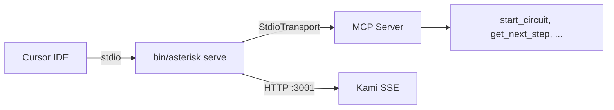
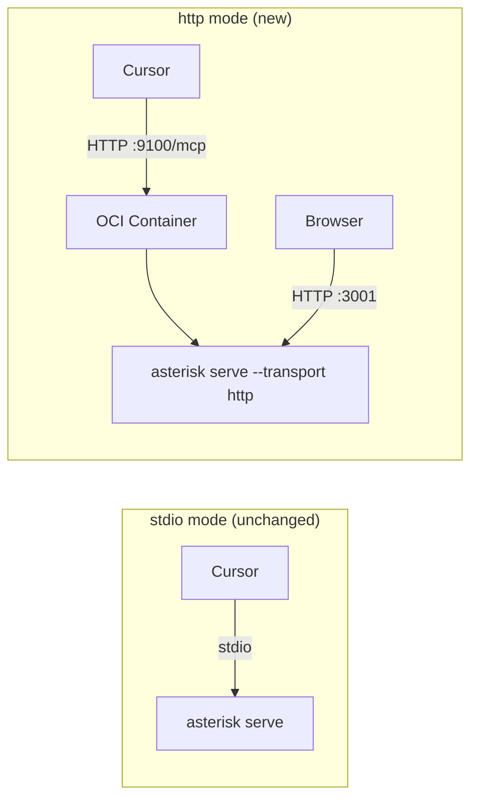

# Contract — container-ready-serve

**Status:** complete  
**Goal:** The `serve` command supports HTTP transport via `--transport http`, enabling Asterisk to run as a container that Cursor connects to via MCP over Streamable HTTP.  
**Serves:** API Stabilization (gate)

## Contract rules

- Backward compatibility is non-negotiable: `asterisk serve` with no flags must remain stdio.
- The HTTP transport must use `sdkmcp.NewStreamableHTTPHandler` — same SDK surface as the knowledge schematic.
- The Dockerfile assumes a pre-built binary (no `origami fold` inside the container build).

## Context

The Asterisk MCP server currently only supports stdio transport (`sdkmcp.StdioTransport`). This works for local Cursor integration where Cursor spawns the binary as a subprocess, but prevents container deployment. Users wanting to consume Asterisk as a Cursor skill would need Go, Origami, source checkout, and `just build`.

With HTTP transport, the dependency chain collapses to: OCI runtime + Cursor `url` config.

The knowledge schematic at `schematics/knowledge/cmd/serve/main.go:46-65` already implements the exact HTTP serving pattern via `sdkmcp.NewStreamableHTTPHandler`. The `subprocess.ContainerBackend` and `subprocess.RemoteBackend` already connect to HTTP MCP endpoints. This contract closes the loop for the primary app.

### Current architecture

### Desired architecture

## FSC artifacts

| Artifact | Target | Compartment |
|----------|--------|-------------|
| `container` glossary entry | `glossary/glossary.mdc` | domain |

## Execution strategy

Two sequential streams. Stream A is the core change (Origami). Stream B is the consumer artifact (Asterisk). Build + test after each.

### Stream A: HTTP transport for serve command

**File:** `schematics/rca/cmd/cmd_serve.go`

1. Add `--transport` flag (string, default `"stdio"`, values: `stdio`, `http`).
2. Add `--port` flag (int, default `9100`, only used when `--transport http`).
3. When `--transport http`:
   - Use `sdkmcp.NewStreamableHTTPHandler` with `Stateless: false` (circuit server is stateful — sessions persist across requests).
   - Use `signal.NotifyContext` for graceful shutdown (no stdin watchdog in HTTP mode).
   - Listen on `:<port>` via `http.ListenAndServe`.
4. When `--transport stdio` (default): current behavior unchanged.
5. Kami setup is transport-independent — works in both modes.

### Stream B: Dockerfile + config examples

**Repo:** Asterisk

1. Add `Dockerfile` at repo root (copy pre-built binary to `gcr.io/distroless/static`).
2. Document both mcp.json configurations (stdio for local dev, HTTP for container/remote) in the Dockerfile comments.

## Coverage matrix

| Layer | Applies | Rationale |
|-------|---------|-----------|
| **Unit** | yes | Existing `mcpconfig/server_test.go` tests use in-memory transport — no regression. HTTP handler construction is SDK code, not ours. |
| **Integration** | yes | Manual: `asterisk serve --transport http`, then `curl localhost:9100/mcp` |
| **Contract** | yes | Go compiler verifies `srv.MCPServer` satisfies `NewStreamableHTTPHandler`'s `*sdkmcp.Server` parameter |
| **E2E** | no | No live circuit — validated via integration test. Full E2E is calibration, out of scope. |
| **Concurrency** | N/A | HTTP handler is provided by the MCP SDK; no new shared state introduced |
| **Security** | yes | See Security assessment |

## Tasks

- [x] Stream A — Add `--transport` and `--port` flags to `cmd_serve.go`, implement HTTP branch
- [x] Stream B — Add `Dockerfile` to Asterisk, document mcp.json configurations
- [x] Validate (green) — `just build`, existing tests pass, manual test both transports
- [x] Tune (blue) — no refactoring needed; clean separation into serveStdio/serveHTTP.
- [x] Validate (green) — all tests still pass after tuning.

## Acceptance criteria

- **Given** `asterisk serve` (no flags), **when** Cursor connects via stdio, **then** the server works identically to before (no regression).
- **Given** `asterisk serve --transport http --port 9100`, **when** a client connects to `http://localhost:9100/mcp`, **then** MCP tool calls succeed (start_circuit, get_next_step, submit_step).
- **Given** `asterisk serve --transport http`, **when** `--kami-port 3001` is also set, **then** Kami SSE is available at `:3001` alongside MCP HTTP at `:9100`.
- **Given** the `Dockerfile` and a pre-built binary, **when** `docker build -t asterisk . && docker run -p 9100:9100 asterisk serve --transport http`, **then** Cursor can connect via `"url": "http://localhost:9100/mcp"`.

## Security assessment

| OWASP | Finding | Mitigation |
|-------|---------|------------|
| A01:2021 Broken Access Control | HTTP endpoint is unauthenticated — anyone on the network can call MCP tools. | Acceptable for local dev (bind to localhost). Container deployments should use network policies or a reverse proxy. Same trust model as the knowledge schematic. |
| A05:2021 Misconfiguration | Binding to `0.0.0.0` in a container exposes the server to all interfaces. | Container EXPOSE + user-controlled `-p` flag. Document recommended bind address. |
| A09:2021 Logging & Monitoring | HTTP requests are not logged by default. | MCP SDK handles request routing; Origami's `logging.New("mcp")` logs lifecycle events. Per-request logging is a future enhancement. |

## Notes

2026-03-05 22:45 — Executed. Changes: `cmd_serve.go` now supports `--transport http --port 9100` via `sdkmcp.NewStreamableHTTPHandler` (Stateless: false). Clean separation into `serveStdio()`/`serveHTTP()` functions. Signal-based shutdown (SIGINT) in HTTP mode replaces stdin watchdog. Asterisk `Dockerfile` added (distroless, pre-built binary). Manual test confirmed: `initialize` RPC succeeds over HTTP. Pre-existing flaky test `TestServer_FourSubagents_ViaResolve` unchanged.

2026-03-05 — Contract drafted from plan-mode analysis. The knowledge schematic already implements the exact HTTP pattern. The primary change is ~20 lines in `cmd_serve.go` (transport switch) plus a 4-line Dockerfile. The `Stateless: false` setting is the key design decision — circuit sessions are stateful (unlike the stateless knowledge schematic).
