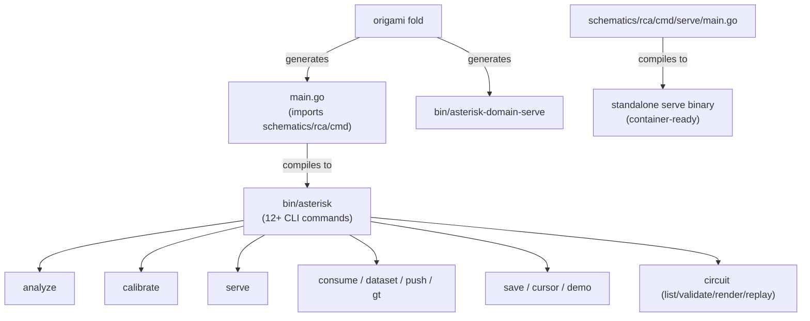
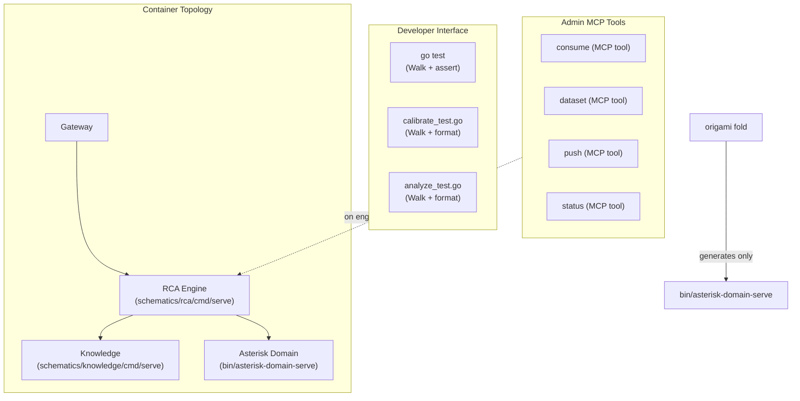

# Contract — monolith-retirement

**Status:** complete  
**Goal:** The fold-generated monolith binary is retired. Every CLI command is either a test wrapper invoking `Walk(domainFS, input)`, an MCP tool on a container, or deleted. `origami fold` generates only the domain-serve binary. Asterisk remains a zero-Go configuration repo.  
**Serves:** Containerized Runtime — eliminating the monolith removes the last dual-path surface area (embedded vs remote, CLI vs container).

## Contract rules

- **Prerequisite: domain-separation-container complete.** Phase 5 (`map[string]any` genericization) must be done before this contract starts. `Walk()` must work with any domain's data via `fs.FS`.
- **No new CLI commands.** If a workflow needs a user-facing interface, it's an MCP tool on a container or a test helper.
- **Tests are the primitive.** `Walk(domainFS, input) → (result, metrics)` is the core. CLI wrappers invoke `Walk()` with real data sources and format output for humans. They add zero logic that isn't also available via tests or MCP.
- **Delete over deprecate.** No `// Deprecated:` markers. When a command is replaced, delete it.
- Global rules apply.

## Context

The monolith binary (`bin/asterisk`) is generated by `origami fold` from `origami.yaml`. Fold generates a `main.go` that imports `schematics/rca/cmd`, calls `Apply()` to wire bindings, then `Execute()` to run the CLI. The `schematics/rca/cmd` package defines 12+ commands:

| Command | What it does | Replacement path |
|---|---|---|
| `serve` | Start MCP server (stdio/HTTP) | **Standalone binary** — already exists at `schematics/rca/cmd/serve/main.go` |
| `calibrate` | Run calibration against a scenario | **Test wrapper** — `go test` with real data + formatted output |
| `analyze` | Run RCA on an RP launch or envelope JSON | **Test wrapper** — `Walk()` with RP fetcher + formatted output |
| `consume` | Discover new CI failures, create candidate cases | **MCP tool** — admin tool on the RCA container |
| `dataset` | Manage ground-truth dataset (review, promote) | **MCP tool** — admin tool on the RCA container |
| `push` | Push RCA artifact to ReportPortal | **MCP tool** — admin tool on the RCA container |
| `status` | Show investigation state for a case | **MCP tool** — query tool on the RCA container |
| `gt` | Ground-truth dataset management | **MCP tool** — admin tool on the RCA container |
| `save` | Save artifact to store | **Delete** — superseded by `submit_step` MCP tool |
| `cursor` | Interactive Cursor-based RCA | **Delete** — superseded by Papercup v2 skill choreography |
| `demo` | Start interactive RCA demo | **Delete** — superseded by Kabuki + Sumi |
| `circuit` | Circuit operations (list, validate, render, replay) | **Split** — `validate`/`render` → `origami lint`/`origami autodoc`; `replay` → Kami; `list` → `domain_info` MCP tool |

### Current architecture



Two paths to the same engine: the monolith `serve` command and the standalone serve binary. Dual-path = dual-maintenance = dual-bugs.

### Desired architecture



Zero monolith. `origami fold` generates only the domain-serve binary. Developers use `go test`. Production uses containers. Admin operations are MCP tools.

### DX principle: tests as the primitive

From the domain-separation contract:

```
Test case  = Walk(domainFS, input) → metrics → assert correctness
CLI tool   = Walk(domainFS, input) → metrics → format for humans
Container  = Walk(domainFS, input) → metrics → serve over MCP
```

The "CLI tool" layer is a test file with a `main`-like entry point: real data sources, real RP connection, formatted terminal output. It lives in the test infrastructure, not in a CLI command tree. Running a calibration is:

```bash
go test -run TestCalibrate_PTPMock -v ./schematics/rca/mcpconfig/ -timeout 10m
```

Not:

```bash
bin/asterisk calibrate --scenario=ptp-mock --backend=llm
```

Both invoke the same `Walk()`. The test version asserts on metrics. The CLI version formats them. The contract unifies them.

### Command migration detail

**Test wrappers** (`calibrate`, `analyze`) become test files that:
1. Accept scenario/input via test flags or environment variables
2. Build a real `fs.FS` (either `os.DirFS` for local or `MCPRemoteFS` for remote)
3. Call `Walk()` with real data sources
4. Format output to stdout (human-readable report)
5. Assert on metrics (optional — skip assertions for "just run it" mode)

**MCP tools** (`consume`, `dataset`, `push`, `status`, `gt`) become tools registered on the RCA engine's MCP server, accessible via Gateway. They perform admin/data-management operations that don't involve circuit walking.

**Deleted** (`save`, `cursor`, `demo`) are superseded by existing infrastructure (MCP `submit_step`, Papercup skills, Kabuki/Sumi).

**Split** (`circuit`) — `validate` and `render` are already covered by `origami lint` and `origami autodoc`. `replay` is Kami's job. `list` is the `domain_info` MCP tool.

## FSC artifacts

| Artifact | Target | Compartment |
|----------|--------|-------------|
| Test-wrapper pattern documentation | `docs/test-wrapper-pattern.md` | domain |
| Admin MCP tools reference | `docs/admin-mcp-tools.md` | domain |

## Execution strategy

Four phases. Each leaves the build green. Commands are migrated incrementally — one category at a time.

- **Phase 1** — Delete dead commands (`save`, `cursor`, `demo`, `circuit`)
- **Phase 2** — Migrate core commands to test wrappers (`calibrate`, `analyze`)
- **Phase 3** — Migrate admin commands to MCP tools (`consume`, `dataset`, `push`, `status`, `gt`)
- **Phase 4** — Remove monolith codegen from fold + update Asterisk manifest

## Coverage matrix

| Layer | Applies | Rationale |
|-------|---------|-----------|
| **Unit** | yes | Test wrapper helpers, MCP admin tool handlers |
| **Integration** | yes | Test wrappers with real `fs.FS`, admin tools via MCP round-trip |
| **Contract** | yes | MCP tool schemas for admin tools |
| **E2E** | no | Container E2E already covered by domain-separation-container |
| **Concurrency** | no | No new shared state |
| **Security** | yes | Admin MCP tools touch RP data — same trust boundary as existing CLI commands |

## Tasks

### Phase 1 — Delete dead commands

- [ ] P1.1: Delete `cmd_save.go` — superseded by `submit_step` MCP tool.
- [ ] P1.2: Delete `cmd_cursor.go` — superseded by Papercup v2 skill choreography.
- [ ] P1.3: Delete `cmd_demo.go` — superseded by Kabuki + Sumi.
- [ ] P1.4: Delete `cmd_circuit.go` — `validate` → `origami lint`, `render` → `origami autodoc`, `replay` → Kami, `list` → `domain_info`.
- [ ] P1.5: Remove dead imports, update `root.go` registration.
- [ ] P1.6: Validate — build green, remaining commands still work.

### Phase 2 — Test wrappers for core commands

- [ ] P2.1: Extract `Walk()` as a standalone, documented function if not already exposed. Signature: `Walk(ctx, domainFS fs.FS, circuitName string, input any, opts ...WalkOption) (result any, metrics Metrics, err error)`.
- [ ] P2.2: Create `schematics/rca/mcpconfig/calibrate_test.go` with `TestCalibrate_*` functions that accept scenario/backend via test flags, call `Walk()` with real data, format calibration report to stdout.
- [ ] P2.3: Create `schematics/rca/mcpconfig/analyze_test.go` with `TestAnalyze_*` functions that accept an envelope path or RP launch ID, call `Walk()`, format RCA report to stdout.
- [ ] P2.4: Delete `cmd_calibrate.go` and `cmd_analyze.go`.
- [ ] P2.5: Update `justfile` recipes to use `go test -run` instead of `bin/asterisk calibrate`.
- [ ] P2.6: Validate — calibration and analysis work via `go test`, same output quality.

### Phase 3 — Admin MCP tools

- [ ] P3.1: Register `consume` as MCP tool on the RCA engine server — discover new failures, create candidate cases.
- [ ] P3.2: Register `dataset_review`, `dataset_promote`, `dataset_status` as MCP tools.
- [ ] P3.3: Register `push_artifact` as MCP tool — push RCA result to RP.
- [ ] P3.4: Register `investigation_status` as MCP tool — show case state.
- [ ] P3.5: Register `gt_status`, `gt_import`, `gt_export` as MCP tools.
- [ ] P3.6: Delete `cmd_consume.go`, `cmd_dataset.go`, `cmd_push.go`, `cmd_status.go`, `cmd_gt.go`.
- [ ] P3.7: Validate — admin operations accessible via MCP, round-trip tests pass.

### Phase 4 — Remove monolith codegen

- [ ] P4.1: Remove `mainTemplate` and monolith codegen from `fold/codegen.go`. `fold.Run()` generates only the domain-serve binary.
- [ ] P4.2: Remove `imports:` section handling from `fold/manifest.go` (no longer needed — domain-serve doesn't import schematics).
- [ ] P4.3: Remove `bindings:` section handling (connector wiring was for the monolith CLI).
- [ ] P4.4: Remove `embed:` section handling (domain-serve uses `domain_serve.embed`, not the top-level `embed:`).
- [ ] P4.5: Simplify Asterisk `origami.yaml` — remove `imports:`, `bindings:`, `embed:`, `sources:`, `circuits:` sections. Only `name:`, `description:`, `version:`, and `domain_serve:` remain.
- [ ] P4.6: Delete the `schematics/rca/cmd/` package (the CLI command tree). Only `schematics/rca/cmd/serve/` survives as the standalone engine binary.
- [ ] P4.7: Update fold unit tests — no monolith codegen tests, domain-serve-only tests.
- [ ] P4.8: Validate — `origami fold` in Asterisk produces only `bin/asterisk-domain-serve`. `go test -race ./...` green. All container tests pass.
- [ ] P4.9: Tune — clean up dead code, update docs.
- [ ] P4.10: Validate — all tests pass after tuning.

## Acceptance criteria

**Given** `origami fold` run on the Asterisk `origami.yaml`,  
**When** compilation completes,  
**Then** only `bin/asterisk-domain-serve` is produced. No monolith binary.

**Given** a developer wanting to run stub calibration,  
**When** they run `go test -run TestCalibrate_PTPMock -v ./schematics/rca/mcpconfig/`,  
**Then** the test loads the scenario from `os.DirFS("testdata/")`, walks the circuit, and prints a formatted calibration report to stdout.

**Given** a developer wanting to analyze a failure,  
**When** they run `go test -run TestAnalyze -v ./schematics/rca/mcpconfig/ -envelope=/path/to/envelope.json`,  
**Then** the test loads the envelope, walks the circuit, and prints a formatted RCA report to stdout.

**Given** the RCA engine container running,  
**When** an admin calls the `consume` MCP tool via Gateway,  
**Then** the engine discovers new CI failures and creates candidate cases, returning results over MCP.

**Given** the `schematics/rca/cmd/` package,  
**When** inspected after this contract,  
**Then** only `cmd/serve/` exists. All CLI commands (`analyze`, `calibrate`, `consume`, `dataset`, `push`, `save`, `cursor`, `demo`, `status`, `gt`, `circuit`) are deleted.

## Security assessment

| OWASP | Finding | Mitigation |
|-------|---------|------------|
| A01 Broken Access Control | Admin MCP tools (`consume`, `dataset`, `push`) write to RP and the store — same trust boundary as existing CLI | Same RP API key auth. No new trust boundaries. Tools are registered on the engine server, accessible only through Gateway. |
| A05 Security Misconfiguration | Test wrappers with real data read RP API keys from env/files | Same pattern as existing CLI. Keys never in code. `.rp-api-key` is gitignored. |

## Notes

2026-03-06 — Contract drafted. Successor to `domain-separation-container`. Prerequisite: domain-separation Phase 5 (`map[string]any` genericization) complete so `Walk()` is domain-agnostic. The 12+ CLI commands map to four categories: test wrappers (calibrate, analyze), MCP tools (consume, dataset, push, status, gt), deleted (save, cursor, demo), and split (circuit → existing tools). `origami fold` stops generating the monolith binary — only domain-serve.
