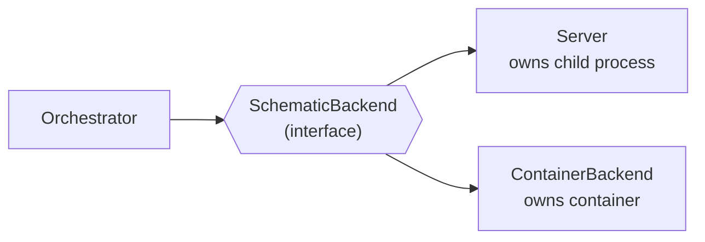
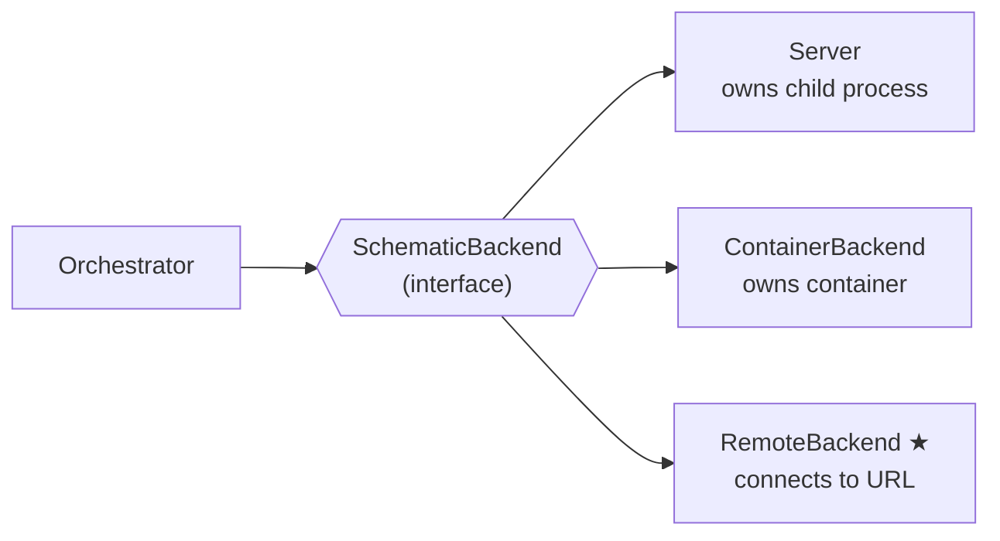

# Contract — remote-backend

**Status:** complete  
**Goal:** A SchematicBackend that connects to an already-running MCP endpoint without owning process lifecycle.  
**Serves:** API Stabilization — completes the SchematicBackend polymorphism by separating connectivity from lifecycle ownership.

## Contract rules

- **Test-first.** Write the test before the implementation.
- **Each commit leaves the build green.**
- **No new dependencies.** Uses existing `MCPConnector`, `StreamableClientTransport`, and `SchematicBackend` interface.

## Context

Today `SchematicBackend` has two implementations:

| Backend | Transport | Lifecycle | Use case |
|---------|-----------|-----------|----------|
| `Server` | stdio (CommandTransport) | Owns the child process | In-process subprocess |
| `ContainerBackend` | HTTP (StreamableClientTransport) | Owns the container (podman/docker) | OCI container |

Both couple connectivity with lifecycle ownership: `Start()` spawns a process or container, `Stop()` kills it. There's no way to connect to a schematic that someone else started — a `serve` binary running in another terminal, a container started by docker-compose, or a service managed by an external system.

This forces a wasteful dev loop: every integration test or manual iteration goes through container build → start → connect → stop → remove. A `RemoteBackend` breaks that: start the service once, point the Orchestrator at it, iterate freely.

### Current architecture



### Desired architecture



## FSC artifacts

Code only — no FSC artifacts.

## Execution strategy

Single-phase, bottom-up:
1. Write unit tests defining the expected behavior (connectivity, health, tool calls, error paths).
2. Implement `RemoteBackend`.
3. Write integration test: start `serve` binary, connect via `RemoteBackend`, call a tool, verify.
4. Add compile-time interface check to `backend.go`.
5. Validate, tune, validate.

## Coverage matrix

| Layer | Applies | Rationale |
|-------|---------|-----------|
| **Unit** | yes | `RemoteBackend` constructor, `Start`/`Stop` semantics, `Healthy` timeout, error paths |
| **Integration** | yes | Start `serve` binary → connect → call tool → verify response → disconnect |
| **Contract** | yes | Compile-time `_ SchematicBackend = (*RemoteBackend)(nil)` |
| **E2E** | no | No circuit walk required — this is a transport layer |
| **Concurrency** | yes | Concurrent `CallTool` under `sync.Mutex`-guarded session |
| **Security** | yes | See Security assessment below |

## Tasks

- [x] T1: Write `remote_test.go` — 8 unit tests covering ToolCallRoundTrip, Healthy, StopIdempotent, CallToolAfterStop, DoubleStart, CallToolBeforeStart, MultipleConcurrentCalls, StartFailsOnBadEndpoint.
- [x] T2: Implement `RemoteBackend` in `subprocess/remote.go` — struct with `Endpoint string`, `Connector *MCPConnector`, configurable `PingTimeout`, `HTTPTimeout`. `Start()` establishes MCP session. `Stop()` closes session (does not kill the remote). `CallTool()` delegates. `Healthy()` pings.
- [x] T3: Add compile-time check `_ SchematicBackend = (*RemoteBackend)(nil)` and `_ ToolCaller = (*RemoteBackend)(nil)` to `backend.go`.
- [x] T4: Integration coverage folded into unit tests — httptest MCP server provides full round-trip validation without external process dependencies.
- [x] T5: Validate (green) — `go test -race ./subprocess/...` passes, all existing tests unaffected.
- [x] T6: Tune (blue) — updated SchematicBackend doc comment, reviewed naming/error messages. No behavior changes.
- [x] T7: Validate (green) — `go test -race ./subprocess/...` still passes.

## Acceptance criteria

```gherkin
Given a knowledge schematic serve binary is running on port 9200
When I create a RemoteBackend with Endpoint "http://127.0.0.1:9200/mcp"
  And call Start()
Then the MCP session is established
  And Healthy() returns true
  And CallTool("knowledge_ensure", ...) returns a result
  And Stop() closes the session without killing the remote process

Given no service is running on port 9201
When I create a RemoteBackend with Endpoint "http://127.0.0.1:9201/mcp"
  And call Start()
Then Start() returns an error containing "connect"

Given a RemoteBackend that has not been started
When I call CallTool(...)
Then it returns an error "not connected"

Given a started RemoteBackend
When the remote service goes down
Then Healthy() returns false within PingTimeout
```

## Security assessment

| OWASP | Finding | Mitigation |
|-------|---------|------------|
| A01: Broken Access Control | RemoteBackend connects to arbitrary URLs — a misconfigured endpoint could point to an unintended service. | Endpoint is set by the caller (dev/operator), not user input. No URL construction from untrusted data. |
| A07: SSRF | `Endpoint` field accepts any URL. | Same as above — caller-controlled, not user-facing. Log the endpoint at connect time for auditability. |
| A09: Logging | Connection failures could leak endpoint URLs in logs. | Acceptable — endpoint URLs are infrastructure config, not secrets. |

No trust boundaries crossed beyond what `ContainerBackend` already does (it also connects to HTTP endpoints). `RemoteBackend` removes the container runtime privilege requirement, which is a net security improvement.

## Notes

2026-03-03 — Contract created. Motivated by the K8s readiness audit: RemoteBackend is the only missing foundation that improves the current dev workflow (faster iteration without container lifecycle) while also being the single biggest prerequisite for any distributed deployment.
2026-03-03 — Contract complete. RemoteBackend implemented in subprocess/remote.go (~105 LOC), 8 unit tests in remote_test.go (~230 LOC), compile-time checks in backend.go. All tests pass with -race. T4 (integration test with external serve binary) was folded into unit tests since httptest provides full MCP round-trip coverage without external process dependencies.
