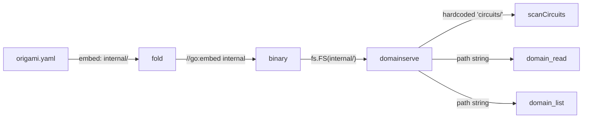
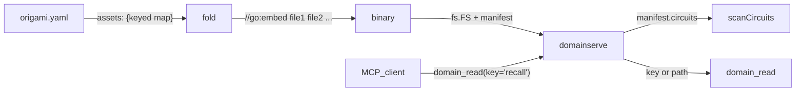

# Contract — manifest-as-map

**Status:** complete  
**Goal:** `origami.yaml` is the single, explicit table of contents for a domain project — every file is declared by key, the embed directory wrapper is eliminated, and `fold` + `domainserve` resolve assets by manifest keys, not filesystem conventions.  
**Serves:** 100% DSL — Zero Go

## Contract rules

- Backward compatibility: `embed:` (single directory) is still accepted. New `assets:` section is the preferred path. Both cannot coexist.
- Origami framework changes land first. Asterisk migration follows.
- No behavioral changes. Circuits, calibrations, and builds produce identical output before and after.
- Complements `dsl-lexicon` (file self-identity via `kind:` envelope) and does not overlap — this contract owns the **manifest wiring** that tells the system where files live.

## Context

### Problem

Today `origami.yaml` has a single `embed:` field pointing to an opaque directory:

```yaml
domain_serve:
  embed: internal/
```

This creates three DX problems:

1. **False depth.** The `internal/` directory adds a nesting level with no semantic value. It exists solely because `fold` requires a single embed directory.
2. **Implicit discovery.** `domainserve.scanCircuits()` hardcodes `"circuits"` as a sub-path convention. Prompts, schemas, scenarios are resolved by convention too. A newcomer must reverse-engineer the conventions from Go code.
3. **Orphan blindness.** Files not referenced by any circuit or convention (e.g. `tuning-quickwins.yaml`) sit in the directory undetected. Nothing validates completeness.

### Current architecture



### Desired architecture



The manifest becomes the routing table. `fold` embeds exactly what's declared. `domainserve` resolves by key (with path fallback for backward compat).

### Design: manifest `assets:` section

```yaml
name: asterisk
version: "1.0"

assets:
  circuits:
    rca: circuits/rca.yaml
    calibration: circuits/calibration.yaml

  prompts:
    recall:      prompts/recall/judge-similarity.md
    triage:      prompts/triage/classify-symptoms.md
    resolve:     prompts/resolve/select-repo.md
    investigate: prompts/investigate/deep-rca.md
    correlate:   prompts/correlate/match-cases.md
    review:      prompts/review/present-findings.md
    report:      prompts/report/regression-table.md

  schemas:
    recall:      schemas/rca/F0_RECALL.yaml
    triage:      schemas/rca/F1_TRIAGE.yaml
    resolve:     schemas/rca/F2_RESOLVE.yaml
    investigate: schemas/rca/F3_INVESTIGATE.yaml
    correlate:   schemas/rca/F4_CORRELATE.yaml
    review:      schemas/rca/F5_REVIEW.yaml
    report:      schemas/rca/F6_REPORT.yaml

  vocabulary: vocabulary.yaml
  heuristics: heuristics.yaml

  scenarios:
    ptp-mock:    scenarios/ptp-mock.yaml
    ptp-real:    scenarios/ptp-real.yaml
    daemon-mock: scenarios/daemon-mock.yaml

  scorecards:
    rca: scorecards/rca.yaml

  reports:
    rca:         reports/rca-report.yaml
    calibration: reports/calibration-report.yaml
    transcript:  reports/transcript-report.yaml

  sources:
    ptp: sources/ptp.yaml
    ocp: sources/ocp-platform.yaml

domain_serve:
  port: 9300
```

All paths are relative to `origami.yaml`. No wrapper directory needed. `fold` collects all referenced paths and generates the `//go:embed` directive(s). `domainserve` receives both the `fs.FS` and the parsed `assets:` map for key-based resolution.

## FSC artifacts

| Artifact | Target | Compartment |
|----------|--------|-------------|
| Manifest schema reference | `notes/manifest-assets-schema.md` (Origami) | domain |
| DSL migration note | `notes/embed-to-assets-migration.md` (Asterisk) | domain |

## Execution strategy

Four phases. Each leaves the build green and is independently shippable.

**Phase 1 — Manifest schema (Origami)**
Extend `fold/manifest.go` to parse `assets:` as a structured map. Define `AssetMap` type with typed sections (circuits, prompts, schemas, etc.) plus a generic `map[string]string` fallback for unknown sections. `embed:` and `assets:` are mutually exclusive — emit clear error if both present. Backward compat: `embed:` still works exactly as today.

**Phase 2 — Codegen for multi-file embed (Origami)**
When `assets:` is present, `fold/codegen.go` collects all referenced file paths into a single `//go:embed` directive (Go supports space-separated patterns). `fold/fold.go` copies only the referenced files (not a whole directory) into the temp build dir, preserving their relative paths. Tests: round-trip — manifest with `assets:` produces correct `//go:embed`, compiles, and the resulting `fs.FS` serves the declared files.

**Phase 3 — domainserve key-based resolution (Origami)**
Extend `domainserve.Config` to accept an optional `AssetMap`. Add `domain_resolve` MCP tool: given a section + key (e.g. `prompts/recall`), returns the file content by looking up the manifest path. `scanCircuits()` uses `assets.circuits` when available, falls back to `"circuits/"` directory scan. `domain_read` still works by raw path (backward compat) but `domain_resolve` by key is the preferred API.

**Phase 4 — Asterisk migration**
Flatten `internal/` — move all subdirectories to repo root. Replace `embed: internal/` with `assets:` map in `origami.yaml`. Update the 3 cross-references in YAML files (calibration scorecard path, scenario local_path). Update justfile lint glob. Delete empty `internal/` directory. Validate: `just build`, `just calibrate-stub`.

## Coverage matrix

| Layer | Applies | Rationale |
|-------|---------|-----------|
| **Unit** | yes | `AssetMap` parsing, file collection, embed directive generation, key resolution |
| **Integration** | yes | `origami fold` builds with `assets:` manifest; `domainserve` serves by key |
| **Contract** | yes | `embed:` still accepted (backward compat); `assets:` + `embed:` emits error |
| **E2E** | yes | Asterisk `just build` produces working binary after migration |
| **Concurrency** | no | No shared state changes |
| **Security** | no | No trust boundary changes |

## Tasks

### Phase 1 — Manifest schema

- [ ] P1.1 — Define `AssetMap` struct in `fold/manifest.go`: `Circuits`, `Prompts`, `Schemas`, `Scenarios`, `Scorecards`, `Reports`, `Sources` (each `map[string]string`), plus `Vocabulary`, `Heuristics` (single `string`), plus `Extra map[string]map[string]string` for unknown sections.
- [ ] P1.2 — Add `Assets *AssetMap` to `DomainServeConfig`. Validate mutual exclusion with `Embed`.
- [ ] P1.3 — `AllPaths() []string` method on `AssetMap` — returns deduplicated list of all referenced file paths.
- [ ] P1.4 — Unit tests: parse manifest with `assets:`, parse with `embed:`, parse with both (error), parse with neither (error).
- [ ] P1.5 — Validate: `go test -race ./fold/...`, `go build ./...`.

### Phase 2 — Codegen for multi-file embed

- [ ] P2.1 — `GenerateDomainServe`: when `Assets` is set, generate `//go:embed path1 path2 ...` from `AllPaths()`. Paths sorted for deterministic output.
- [ ] P2.2 — `Fold()`: when `Assets` is set, copy only referenced files (preserving directory structure) instead of copying a whole directory.
- [ ] P2.3 — Codegen test: manifest with `assets:` produces correct Go source with multi-path `//go:embed`.
- [ ] P2.4 — Integration test: `Fold()` with `assets:` manifest produces a compilable binary.
- [ ] P2.5 — Validate: `go test -race ./fold/...`, `go build ./...`.

### Phase 3 — domainserve key-based resolution

- [ ] P3.1 — Add `AssetMap` field to `domainserve.Config`.
- [ ] P3.2 — `scanCircuits()`: use `cfg.AssetMap.Circuits` when non-nil; fall back to directory scan.
- [ ] P3.3 — Add `domain_resolve` MCP tool: `{section: "prompts", key: "recall"}` → reads file via `AssetMap` lookup → returns content.
- [ ] P3.4 — Unit tests: key resolution, missing key error, fallback to directory scan when no `AssetMap`.
- [ ] P3.5 — Validate: `go test -race ./domainserve/...`, `go build ./...`.

### Phase 4 — Asterisk migration

- [ ] P4.1 — Move `internal/circuits/`, `internal/prompts/`, `internal/schemas/`, `internal/scenarios/`, `internal/scorecards/`, `internal/reports/`, `internal/sources/`, `internal/datasets/` to repo root.
- [ ] P4.2 — Move `internal/vocabulary.yaml`, `internal/heuristics.yaml`, `internal/schema.yaml` to repo root.
- [ ] P4.3 — Replace `embed: internal/` with `assets:` map in `origami.yaml`.
- [ ] P4.4 — Update cross-references: `calibration.yaml` scorecard path, scenario `local_path` fields.
- [ ] P4.5 — Update justfile lint glob.
- [ ] P4.6 — Delete empty `internal/` directory.
- [ ] P4.7 — Validate (green): `just build`, `just calibrate-stub`, `origami lint`.
- [ ] P4.8 — Tune (blue): review file organization, rename unclear files, remove orphans.
- [ ] P4.9 — Validate (green): all tests still pass after tuning.

## Acceptance criteria

```gherkin
Given an origami.yaml with an `assets:` section
When I run `origami fold`
Then a working binary is produced
  And only the files declared in `assets:` are embedded
  And no wrapper directory is required

Given an origami.yaml with `embed:` (legacy)
When I run `origami fold`
Then the build works exactly as before (backward compat)

Given an origami.yaml with both `assets:` and `embed:`
When I run `origami fold`
Then the build fails with a clear error message

Given a running domain-serve with `assets:` config
When I call `domain_resolve` with section "prompts" and key "recall"
Then I receive the content of the prompt file declared for that key

Given the Asterisk repo after migration
When I list the top-level directory
Then there is no `internal/` directory
  And `circuits/`, `prompts/`, `schemas/` etc. are at the root
  And `just build` produces a working binary
```

## Security assessment

No trust boundaries affected. All changes are structural (manifest parsing, file embedding, path resolution). No new I/O sources, no credentials, no network surface changes.

## Relationship to other contracts

| Contract | Relationship |
|----------|-------------|
| `dsl-lexicon` (Asterisk) | Complementary. Lexicon owns file self-identity (`kind:` envelope). Manifest-as-map owns how the entrypoint YAML declares and locates those files. Lexicon P3.1 (file move) deferred until P4 here settles directory structure. |
| `dsl-wiring` (Asterisk) | Downstream. dsl-wiring depends on manifest-as-map for `assets:` schema (manifest wiring gaps G3/G6/G7 absorbed here). |
| `circuit-dsl-shorthand` (Asterisk) | No direct dependency. Shorthand operates on circuit YAML syntax, not manifest schema. |

## Notes

2026-03-08 — Contract complete. All 4 phases implemented:
- P1: `AssetMap` type with `Files` catch-all (domain-agnostic, no `Vocabulary`/`Heuristics` named fields). Mutual exclusion validation. 11 unit tests.
- P2: Multi-file `//go:embed` codegen, selective file copy, `AssetIndex` literal in generated main.go. Integration test confirms real binary build.
- P3: `AssetIndex` type in domainserve, `Resolve()` method, `domain_resolve` MCP tool, `scanCircuits()` with asset map fallback. 15 tests.
- P4: Asterisk `internal/` flattened to root, `origami.yaml` rewritten with `assets:` map, 3 cross-references fixed, justfile updated. `just build` produces working binary.

Design note: `Vocabulary` and `Heuristics` were originally named fields on `AssetMap` but moved to generic `Files map[string]string` — these are domain-specific concepts that don't belong in framework types.

2026-03-07 20:00 — Contract drafted. Root cause: `fold` only supports single-directory embed, forcing the `internal/` wrapper. The manifest-as-map approach makes the entrypoint YAML the explicit table of contents. Four phases: manifest schema → multi-file codegen → key-based resolution → Asterisk migration. Backward compatible throughout.
