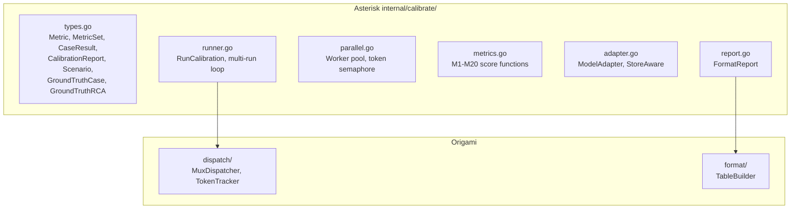
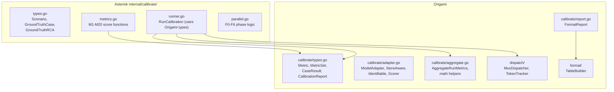

# Contract — calibration-primitives

**Status:** complete  
**Goal:** Generic calibration types, interfaces, and aggregation in Origami so any consumer (Asterisk, Achilles) can run scenario-vs-ground-truth calibration without reimplementing the scaffolding.  
**Serves:** Framework maturity (next-milestone)

## Contract rules

- Zero domain imports — `calibrate/` must not import Asterisk, Achilles, or any consumer.
- Types must be JSON-serializable (`json` tags on all exported fields).
- `MetricSet` groups are domain-agnostic labels; consumers decide which metrics go in which group.

## Context

Asterisk's `internal/calibrate/` contains ~2500 LOC mixing generic calibration scaffolding with RCA-specific scoring. The boundary map (`.cursor/docs/boundary-map.md`) identifies the calibration runner pattern as P1: "shared by any Origami consumer running calibration."

Achilles (second Origami consumer) will need the same calibration loop for vulnerability-discovery accuracy. Extracting the generic primitives avoids copy-paste.

Ouroboros (`ouroboros/`) measures model behavior via probes — complementary, not overlapping. Ouroboros could adopt `Metric`/`MetricSet` later for consistency.

Companion contract: Asterisk `calibration-primitives-consumer.md` — refactors Asterisk to import these types.

### Current architecture

### Desired architecture

## FSC artifacts

| Artifact | Target | Compartment |
|----------|--------|-------------|
| Calibration primitive design notes | `docs/` | domain |

## Execution strategy

1. Create `calibrate/` package with types (Metric, MetricSet, CaseResult, CalibrationReport).
2. Add interfaces (ModelAdapter, StoreAware, Identifiable, Scorer).
3. Extract aggregation functions (AggregateRunMetrics + math helpers).
4. Extract generic report formatting.
5. Tests for all of the above.
6. Validate, tune, validate.

## Coverage matrix

| Layer | Applies | Rationale |
|-------|---------|-----------|
| **Unit** | yes | All types, aggregation math, report formatting |
| **Integration** | no | No cross-boundary calls; pure library |
| **Contract** | yes | Interface satisfaction verified by compile-time checks |
| **E2E** | no | Consumer-side validation (Asterisk companion contract) |
| **Concurrency** | no | No shared mutable state in primitives |
| **Security** | no | No trust boundaries affected |

## Tasks

- [x] Create `calibrate/types.go` — Metric, MetricSet (with AllMetrics, PassCount), CalibrationReport
- [x] Create `calibrate/adapter.go` — ModelAdapter, Identifiable interfaces
- [x] Create `calibrate/aggregate.go` — AggregateRunMetrics, PassEvaluator, Mean, Stddev, SafeDiv, SafeDivFloat
- [x] Create `calibrate/report.go` — MetricSection, FormatConfig, FormatReport using format.TableBuilder
- [x] Tests: types_test.go (4 tests), aggregate_test.go (9 tests), report_test.go (7 tests)
- [x] Validate (green) — all 20 tests pass, go build ./... clean.
- [x] Tune (blue) — no structural changes needed.
- [x] Validate (green) — all tests still pass.

## Acceptance criteria

- **Given** Origami's `calibrate/` package exists, **when** `go build ./calibrate/...` runs, **then** it compiles with zero domain imports.
- **Given** `MetricSet` with 10 metrics (3 passing), **when** `PassCount()` is called, **then** it returns 3.
- **Given** 3 run metric sets, **when** `AggregateRunMetrics` is called, **then** each metric value is the mean across runs with variance in Detail.
- **Given** a `CalibrationReport` with metrics and case results, **when** `FormatReport` is called, **then** it produces a human-readable table with pass/fail indicators.
- **Given** Asterisk's `ModelAdapter` has `SendPrompt(caseID string, step CircuitStep, prompt string)`, **when** the interface is changed to `step string`, **then** it satisfies `calibrate.ModelAdapter` (verified by Asterisk companion contract).

## Security assessment

No trust boundaries affected.

## Notes

2026-02-25 — Contract drafted. Extracted from boundary map P1 candidates. Companion: Asterisk `calibration-primitives-consumer`.
2026-02-25 — Contract complete. Created `calibrate/` package with 4 source files + 3 test files (20 tests). StoreAware and Scorer deferred as domain-specific (stay in consumers). CaseResult omitted from generic package (too domain-specific).
