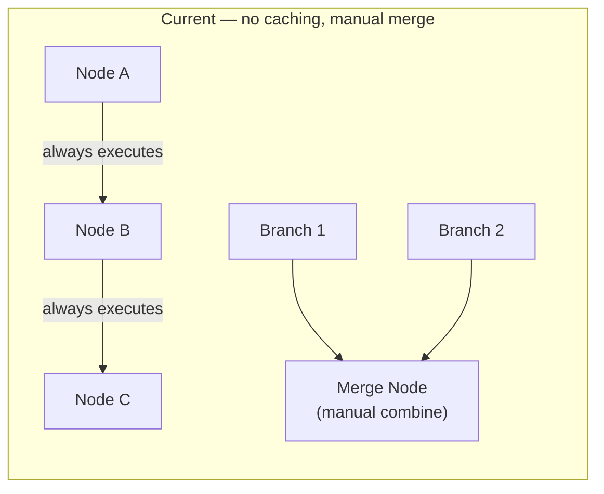
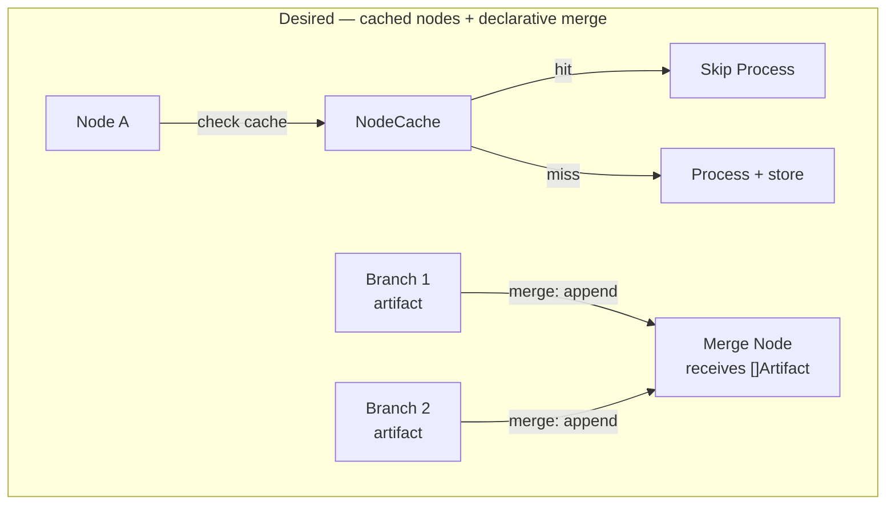

# Contract — Circuit Efficiency

**Status:** draft  
**Goal:** Add node caching (skip re-execution for identical inputs) and fan-in merge strategies (move merge logic from application code to DSL) — closing two runtime efficiency gaps vs LangGraph.  
**Serves:** Polishing & Presentation (nice)

## Contract rules

- Node caching is opt-in per node. Default behavior is no caching (every walk executes every node).
- Cache keys must be deterministic. Non-deterministic inputs (timestamps, random values) must be excluded from key computation.
- Fan-in merge strategies are opt-in. Default behavior is unchanged — merge nodes receive the last artifact from each parallel branch via application logic.
- `InMemoryCache` is the default. Production backends are out of scope for this contract but the interface must support them.

## Context

- **Origin:** LangGraph case study (`docs/case-studies/langgraph-graph-duality.md`) Gaps 5+6.
  - Gap 5: LangGraph caches expensive node results by input hash with configurable TTL. Origami re-executes every node on every walk.
  - Gap 6: LangGraph's per-key reducers (`Annotated[list, add]`) merge parallel node outputs. Origami's fan-out merge relies on the merge node's application logic.
- **Current state:**
  - No caching: `runner.go` calls `Node.Process()` unconditionally on every walk.
  - Fan-out/fan-in: `fanout.go` executes parallel branches via `errgroup`, collects artifacts into a slice, and passes them to the merge node as `NodeContext.Meta["fan_in_artifacts"]`. The merge node's `Process()` must manually combine them.
- **Cross-references:**
  - `origami-fan-out-fan-in` (completed) — Created the parallel edge and fan-out infrastructure. This contract adds declarative merge strategies on top.
  - `origami-dsl-runner` (completed) — Runner walk loop where caching would be inserted.

### Current architecture

### Desired architecture

## FSC artifacts

Code only — no FSC artifacts.

## Execution strategy

Phase 1 adds node caching with a `NodeCache` interface and DSL integration. Phase 2 adds fan-in merge strategies to `EdgeDef`. Phase 3 validates.

## Coverage matrix

| Layer | Applies | Rationale |
|-------|---------|-----------|
| **Unit** | yes | Cache hit/miss, TTL expiry, key generation, merge strategy application |
| **Integration** | yes | Runner respects cache during walk, fan-in with declared merge strategy |
| **Contract** | yes | NodeCache interface, CachePolicy schema, merge strategy values |
| **E2E** | no | Efficiency optimizations, not topology changes |
| **Concurrency** | yes | InMemoryCache must handle concurrent walkers; merge strategies interact with fan-out parallelism |
| **Security** | no | In-process caching, no trust boundaries |

## Tasks

### Phase 1 — Node caching

- [ ] **NC1** Define `NodeCache` interface: `Get(key string) (Artifact, bool)`, `Set(key string, artifact Artifact, ttl time.Duration)`
- [ ] **NC2** `InMemoryCache` implementation: thread-safe map with TTL-based expiry (lazy eviction on `Get`)
- [ ] **NC3** Define `CachePolicy` struct: `TTL time.Duration`, `KeyFunc func(NodeContext) string` (default: hash of `PriorArtifact.Raw()`)
- [ ] **NC4** Add `Cache *CachePolicy` field to `NodeDef` in `dsl.go` — `cache:` section in YAML with `ttl:` and optional `key:` expression
- [ ] **NC5** Runner integration: before `Node.Process()`, check cache with computed key. On hit, return cached artifact and emit `EventNodeCacheHit`. On miss, execute and store.
- [ ] **NC6** `WithNodeCache(cache NodeCache) RunOption` — injects cache into the runner
- [ ] **NC7** Unit tests: cache miss → execute → cache set; cache hit → skip execute; TTL expiry → re-execute; concurrent access safe

### Phase 2 — Fan-in merge strategies

- [ ] **FM1** Add `Merge string` field to `EdgeDef` in `dsl.go` — valid values: `append`, `latest`, `custom`
- [ ] **FM2** `merge: append` — fan-in collects all branch artifacts into a `ListArtifact` (new type: wraps `[]Artifact`). Merge node receives this as `PriorArtifact`.
- [ ] **FM3** `merge: latest` — fan-in keeps only the last-completed branch artifact. Merge node receives a single `Artifact`.
- [ ] **FM4** `merge: custom` — current behavior. Merge node receives `NodeContext.Meta["fan_in_artifacts"]` and handles combination itself. This is the default when no `merge:` is specified.
- [ ] **FM5** Define `ListArtifact` struct: implements `Artifact`, wraps `[]Artifact`, `Type()` returns `"list"`, `Confidence()` returns average, `Raw()` returns the slice.
- [ ] **FM6** Update `walkFanOut` in `fanout.go` to apply the declared merge strategy before passing to the merge node
- [ ] **FM7** Unit tests: `append` produces `ListArtifact` with all branch results; `latest` produces single artifact from last branch; `custom` retains current behavior; missing `merge:` defaults to `custom`

### Phase 3 — Validate and tune

- [ ] **V1** Validate (green) — `go build ./...`, `go test ./...` all pass. Caching works. Merge strategies work. No regression in existing fan-out tests.
- [ ] **V2** Tune (blue) — Review CachePolicy key function API. Review merge strategy naming (`append` vs `collect`, `latest` vs `last`). Consider adding `EventNodeCacheHit` to WalkObserver.
- [ ] **V3** Validate (green) — all tests still pass after tuning.

## Acceptance criteria

**Given** a circuit with node B having `cache: { ttl: 60s }` and a `WithNodeCache(InMemoryCache)`,  
**When** the circuit is walked twice with identical input,  
**Then** node B executes on the first walk and returns a cached result on the second walk. `EventNodeCacheHit` is emitted on the second walk.

**Given** a circuit with parallel branches merging at node M with `merge: append`,  
**When** branches produce artifacts A1 and A2,  
**Then** node M receives a `ListArtifact` containing `[A1, A2]` as its `PriorArtifact`.

**Given** a circuit with parallel branches merging at node M with `merge: latest`,  
**When** branches complete in order (A1 first, A2 second),  
**Then** node M receives A2 as its `PriorArtifact`.

**Given** a circuit with parallel branches merging at node M with no `merge:` field,  
**When** branches produce artifacts,  
**Then** the current behavior is unchanged — artifacts are available via `NodeContext.Meta["fan_in_artifacts"]`.

## Security assessment

No trust boundaries affected. Caching is in-process. Merge strategies operate on locally-produced artifacts. No external calls.

## Notes

2026-02-25 — Contract created from LangGraph case study Gaps 5+6. Node caching is particularly valuable for LLM nodes where identical prompts waste tokens and time. Fan-in merge strategies move a common pattern from application code into the DSL, reducing boilerplate in consumers like Asterisk. Both are small scope individually; combined to avoid contract proliferation.
