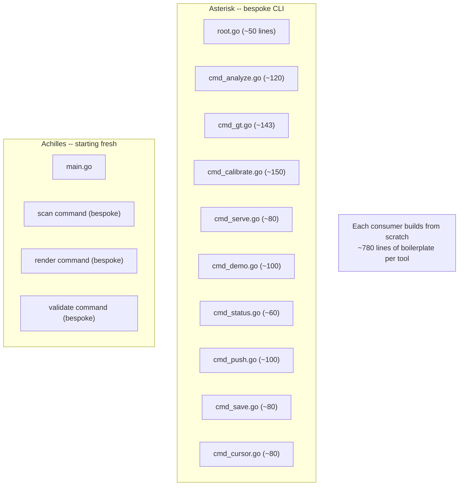
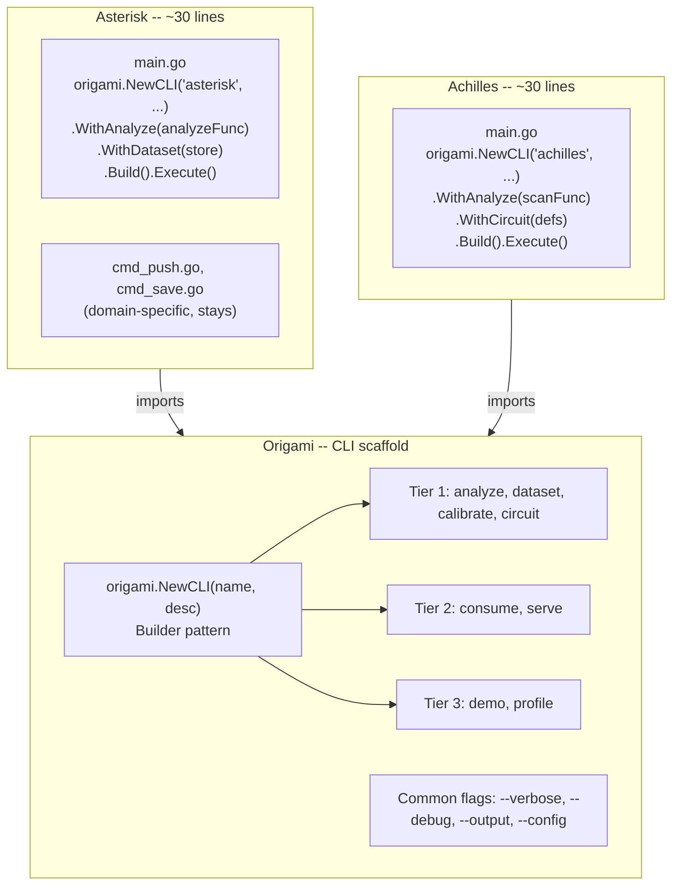

# Contract — Consumer CLI Scaffold

**Status:** draft  
**Goal:** Provide an `origami.NewCLI()` builder API that gives every Origami consumer tool 8 standard CLI commands — `analyze`, `dataset`, `calibrate`, `circuit`, `consume`, `serve`, `demo`, `profile` — replacing ~780 lines of bespoke Cobra code per consumer with ~30 lines of builder calls.  
**Serves:** System Refinement (should)

## Contract rules

- The scaffold is a Go API in Origami, not a code generator. Consumers call `origami.NewCLI()` and register their domain-specific implementations.
- `analyze` is the only command the consumer MUST implement from scratch. Every other command has a framework-provided default behavior that the consumer configures.
- Tier 1 commands (`analyze`, `dataset`, `calibrate`, `circuit`) are required for any production-grade tool. Tier 2 (`consume`, `serve`) and Tier 3 (`demo`, `profile`) are opt-in.
- `replay` is a subcommand of `circuit`, not a top-level command. It uses the Kami Replayer under the hood.
- The scaffold does NOT impose a project layout. It provides Cobra commands; consumers wire them into their own `main.go`.
- Commands share a common flag vocabulary: `--verbose`, `--debug`, `--output` (json/table/markdown), `--config`.

## Context

- **Problem:** Asterisk has 10 bespoke Cobra commands (~780 lines of boilerplate). Achilles is starting from scratch and would duplicate the same patterns. Every new Origami consumer (future operators, future domains) repeats this work.
- **Current state:** Each consumer builds their own `cmd_*.go` files with custom flag parsing, help text, and subcommand wiring. No shared infrastructure beyond Cobra itself.
- **Cross-references:**
  - `principled-calibration-scorecard` — the `calibrate` command uses `ScoreCard` YAML and the generic scorer
  - `origami-adapters` — the `circuit` command resolves adapter FQCNs when rendering/validating
  - `kami-live-debugger` — `circuit replay` uses the Kami Replayer
  - `kabuki-presentation-engine` — the `demo` command uses Kabuki
  - `migrate-ouroboros-to-marshaller` — the `profile` command uses Ouroboros MCP server
  - `origami-observability` — `WithObservability()` builder method wires OTel + Prometheus into the CLI

### Current architecture



### Desired architecture



## The 8 Perennial Commands

### Tier 1 — Core (every tool MUST have)

| # | Command | What it does | Subcommands |
|---|---------|-------------|-------------|
| 1 | **analyze** | The domain function. The reason the tool exists. | *(domain-defined)* |
| 2 | **dataset** | Manage datasets: list, status, import, export, review, promote | `list`, `status <name>`, `import <path>`, `export <path>`, `review`, `promote <case-id>` |
| 3 | **calibrate** | Run scorecard evaluation against a dataset. Uses `DefaultScoreCard()` when no custom scorecard path is provided. `report` subcommand includes `CostBill` output (from `dispatch.FormatCostBill`). Note: `CostBill` is a dispatch-level concern — `circuit run` also emits a cost bill for every dispatch, not just calibration. | `run <scenario>`, `report <scenario>`, `compare <a> <b>` |
| 4 | **circuit** | Circuit operations (including replay) | `render <circuit>`, `validate <circuit>`, `list`, `replay <recording.jsonl> [--speed] [--port]` |

### Tier 2 — Infrastructure (most tools need)

| # | Command | What it does | Subcommands |
|---|---------|-------------|-------------|
| 5 | **consume** | Ingest data from sources, produce/update datasets | `run`, `status` |
| 6 | **serve** | Run as MCP server | *(no subcommands)* |

### Tier 3 — Optional features

| # | Command | What it does | Subcommands |
|---|---------|-------------|-------------|
| 7 | **demo** | Kabuki presentation server | `--port`, `--live`, `--speed` |
| 8 | **profile** | Ouroboros model discovery | `run <model>`, `report`, `compare` |

## Builder API

```go
package origami

type CLI struct { /* ... */ }

type CLIBuilder struct { /* ... */ }

func NewCLI(name, description string) *CLIBuilder

func (b *CLIBuilder) WithAnalyze(fn AnalyzeFunc) *CLIBuilder
func (b *CLIBuilder) WithDataset(store DatasetStore) *CLIBuilder
func (b *CLIBuilder) WithCalibrate(scorecard string, runner CalibrateRunner) *CLIBuilder
func (b *CLIBuilder) WithCircuit(defs ...string) *CLIBuilder
func (b *CLIBuilder) WithConsume(circuit string) *CLIBuilder
func (b *CLIBuilder) WithServe(config MCPConfig) *CLIBuilder
func (b *CLIBuilder) WithDemo(config KabukiConfig) *CLIBuilder
func (b *CLIBuilder) WithProfile() *CLIBuilder
func (b *CLIBuilder) WithExtraCommand(cmd *cobra.Command) *CLIBuilder
func (b *CLIBuilder) Build() *CLI
func (c *CLI) Execute() error
```

### Interface contracts

```go
type AnalyzeFunc func(ctx context.Context, args []string) error

type DatasetStore interface {
    List() ([]DatasetSummary, error)
    Status(name string) (*DatasetStatus, error)
    Import(path string) error
    Export(path string) error
    ListCandidates() ([]Candidate, error)
    Promote(caseID string) error
}

type CalibrateRunner interface {
    Run(ctx context.Context, scenario string, scorecard *ScoreCard) (*CalibrationReport, error)
}

type MCPConfig struct {
    Tools   []mcp.Tool
    Options []mcp.ServerOption
}

type KabukiConfig interface {
    Sections() []Section
    Theme() Theme
}
```

### What this replaces in Asterisk

| Current file | Lines | Replaced by |
|---|---|---|
| `cmd_gt.go` | 143 | `origami.WithDataset(store)` |
| `cmd_calibrate.go` | ~150 | `origami.WithCalibrate(scorecard, runner)` |
| `cmd_serve.go` | ~80 | `origami.WithServe(mcpConfig)` |
| `cmd_demo.go` | ~100 | `origami.WithDemo(kabukiConfig)` |
| `cmd_status.go` | ~60 | `origami.WithCircuit(defs)` subcommand |
| `cmd_analyze.go` | ~120 | `origami.WithAnalyze(analyzeFunc)` |
| `cmd_cursor.go` | ~80 | absorbed into `analyze --interactive` |
| `cmd_push.go` | ~100 | domain-specific, stays |
| `cmd_save.go` | ~80 | domain-specific, stays |
| `root.go` | ~50 | `origami.NewCLI()` |
| **Total replaced** | **~780 lines** | **~30 lines** |

## FSC artifacts

| Artifact | Target | Compartment |
|----------|--------|-------------|
| CLI scaffold API reference | `docs/cli-scaffold.md` | domain |
| Consumer migration guide | `docs/cli-migration.md` | domain |

## Execution strategy

Phase 1 defines the builder API types and interfaces (`CLIBuilder`, `AnalyzeFunc`, `DatasetStore`, etc.). Phase 2 implements the Tier 1 commands with framework-provided Cobra wiring. Phase 3 adds Tier 2 commands. Phase 4 adds Tier 3 commands. Phase 5 migrates Asterisk from bespoke commands to the scaffold. Phase 6 migrates Achilles. Phase 7 validates and tunes.

## Coverage matrix

| Layer | Applies | Rationale |
|-------|---------|-----------|
| **Unit** | yes | Builder pattern, command registration, flag parsing, interface compliance |
| **Integration** | yes | Build CLI, run `--help`, verify subcommand tree matches spec |
| **Contract** | yes | Interface definitions (`DatasetStore`, `CalibrateRunner`, `AnalyzeFunc`), command names, flag vocabulary |
| **E2E** | yes | `asterisk dataset list` and `achilles circuit render` both work after migration |
| **Concurrency** | no | CLI is single-threaded startup |
| **Security** | no | No trust boundaries — CLI wiring only |

## Tasks

### Phase 1 — Builder API types (Origami)

- [ ] **B1** Define `CLIBuilder` struct in `cli/scaffold.go`
- [ ] **B2** Define `NewCLI(name, desc)` constructor
- [ ] **B3** Define `AnalyzeFunc`, `DatasetStore`, `CalibrateRunner` interfaces
- [ ] **B4** Define `MCPConfig`, `KabukiConfig` types (or reference existing types from their packages)
- [ ] **B5** Implement `With*()` methods on `CLIBuilder` — store config, validate at `Build()`
- [ ] **B6** Implement `Build()` → assemble Cobra root command with registered subcommands
- [ ] **B7** Implement `WithExtraCommand(*cobra.Command)` for domain-specific commands (e.g., `push`, `save`)
- [ ] **B8** Unit tests: builder with all tiers, builder with Tier 1 only, `Build()` error on missing `analyze`

### Phase 2 — Tier 1 commands (Origami)

- [ ] **T1A** `analyze` command: delegates to `AnalyzeFunc`, passes remaining args
- [ ] **T1B** `dataset` command tree: `list`, `status`, `import`, `export`, `review`, `promote` — all delegate to `DatasetStore` interface
- [ ] **T1C** `calibrate` command tree: `run <scenario>`, `report <scenario>`, `compare <a> <b>` — loads `ScoreCard` YAML, delegates to `CalibrateRunner`
- [ ] **T1D** `circuit` command tree: `render` (graphviz DOT), `validate` (schema check), `list` (registered circuits), `replay <file>` (Kami Replayer with `--speed`, `--port`)
- [ ] **T1E** Common flags on root: `--verbose`, `--debug`, `--output` (json/table/markdown), `--config`
- [ ] **T1F** Unit tests: each subcommand registered, `--help` output matches spec, `circuit replay` wires Kami Replayer

### Phase 3 — Tier 2 commands (Origami)

- [ ] **T2A** `consume` command: `run` (walks ingestion circuit), `status` (shows last run)
- [ ] **T2B** `serve` command: starts MCP server with provided tools and options
- [ ] **T2C** Unit tests: `serve` registers tools, `consume run` walks circuit

### Phase 4 — Tier 3 commands (Origami)

- [ ] **T3A** `demo` command: starts Kabuki server with provided config and theme
- [ ] **T3B** `profile` command: `run <model>` (Ouroboros discovery), `report` (last results), `compare <a> <b>` (model comparison)
- [ ] **T3C** Unit tests: `demo` starts server, `profile run` delegates to Ouroboros

### Phase 5 — Migrate Asterisk (Asterisk)

- [ ] **MA1** Create `cmd/asterisk/main.go` using `origami.NewCLI("asterisk", ...)` builder
- [ ] **MA2** Implement `DatasetStore` wrapping existing `internal/store/` and ground truth logic
- [ ] **MA3** Implement `CalibrateRunner` wrapping existing `internal/calibrate/` runner
- [ ] **MA4** Wire `cmd_push.go` and `cmd_save.go` via `WithExtraCommand()`
- [ ] **MA5** Delete replaced `cmd_*.go` files (gt, calibrate, serve, demo, status, cursor, root)
- [ ] **MA6** Integration test: `asterisk --help` shows expected command tree
- [ ] **MA7** Integration test: `asterisk dataset list` produces same output as old `asterisk gt status`

### Phase 6 — Migrate Achilles (Achilles)

- [ ] **AC1** Create `main.go` using `origami.NewCLI("achilles", ...)` builder
- [ ] **AC2** Wire existing scan logic into `AnalyzeFunc`
- [ ] **AC3** Wire existing render/validate into `WithCircuit()`
- [ ] **AC4** Integration test: `achilles --help` shows expected command tree

### Phase 7 — Validate and tune

- [ ] Validate (green) — `go build ./...`, `go test ./...` across all three repos. CLI commands match spec.
- [ ] Tune (blue) — help text clarity, flag naming, error messages, output formatting.
- [ ] Validate (green) — all tests still pass after tuning.

## Acceptance criteria

**Given** a consumer calling `origami.NewCLI("asterisk", "Root-cause analysis").WithAnalyze(fn).WithDataset(store).Build()`,  
**When** the user runs `asterisk dataset list`,  
**Then** the framework-provided `dataset list` command invokes `store.List()` and formats the output.

**Given** a consumer calling `.WithCircuit("circuits/asterisk-rca.yaml")`,  
**When** the user runs `asterisk circuit replay recording.jsonl --speed 2.0 --port 3001`,  
**Then** the Kami Replayer starts on port 3001 at 2x speed with the given recording.

**Given** a consumer that does NOT call `.WithDemo()`,  
**When** the user runs `asterisk demo`,  
**Then** the command is not registered and `asterisk --help` does not show it.

**Given** a consumer calling `.WithExtraCommand(pushCmd)`,  
**When** the user runs `asterisk push`,  
**Then** the domain-specific push command executes normally alongside framework commands.

**Given** `asterisk --output json dataset list`,  
**When** the command runs,  
**Then** output is JSON-formatted (not table). The `--output` flag applies to all commands.

## Security assessment

| OWASP | Finding | Mitigation |
|-------|---------|------------|
| N/A | CLI scaffold is build-time wiring only | No runtime trust boundaries. No external calls. No user input beyond CLI args. |

## Notes

2026-02-26 — Contract created. Motivated by the observation that Asterisk has ~780 lines of bespoke Cobra commands that Achilles would duplicate. "dataset" replaces "gt" (ground truth is jargon; dataset is universal). `replay` is a subcommand of `circuit` (not a top-level command). The builder pattern (`NewCLI().With*().Build()`) follows the same ergonomic pattern as `kami.NewServer()`. Domain-specific commands (`push`, `save`) stay via `WithExtraCommand()`.
