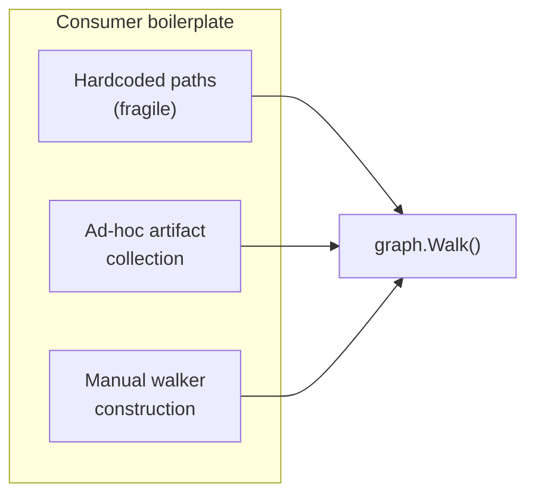
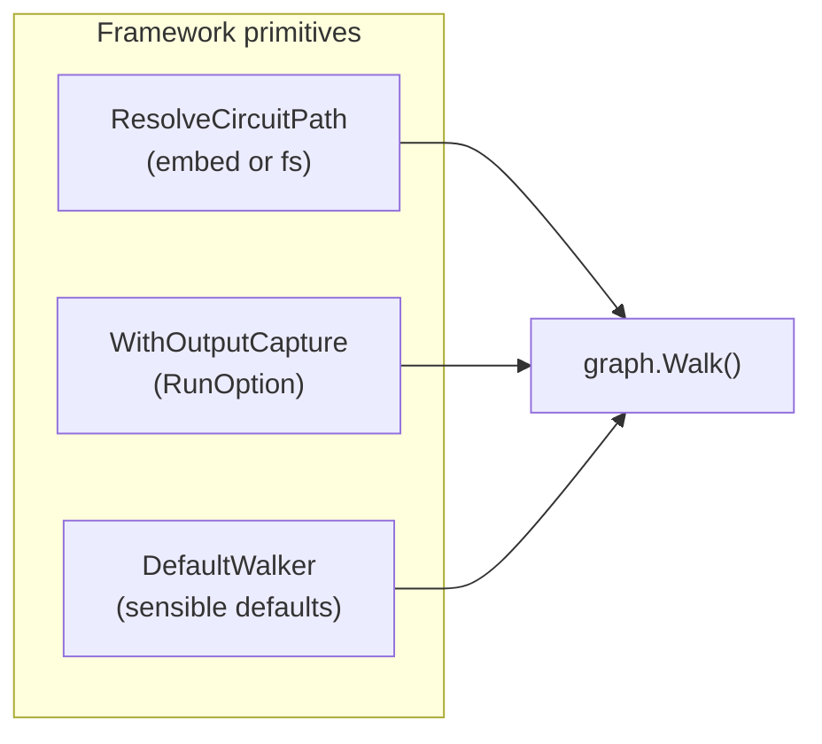

# Contract — Consumer Ergonomics

**Status:** complete  
**Goal:** Add three missing framework primitives (`ResolveCircuitPath`, `WithOutputCapture`, `DefaultWalker`) that eliminate boilerplate in consumers like Asterisk and Achilles.  
**Serves:** Polishing & Presentation (nice)

## Contract rules

- Each primitive must be usable independently — no forced coupling between the three.
- `DefaultWalker` must produce a deterministic identity for reproducible circuit runs.
- `WithOutputCapture` must not interfere with existing `WalkObserver` implementations — it stacks, not replaces.
- All three are public API additions. They must be backward-compatible (no breaking changes to existing consumers).

## Context

- **Achilles audit:** Analysis of Achilles (second Origami consumer) revealed three API gaps that force consumers to write boilerplate code. Each gap is the same pattern: a generic need addressed with ad-hoc, consumer-specific code.
- **ResolveCircuitPath gap:** Both Asterisk and Achilles hardcode relative paths to circuit YAML files. When the binary runs from a different directory, paths break. Achilles uses `circuits/achilles.yaml` directly; Asterisk uses `internal/orchestrate/circuit_rca.yaml`. A framework helper to resolve circuit paths from `go:embed` or the file system would eliminate this fragility.
- **WithOutputCapture gap:** Both consumers need to collect artifacts produced at each node after a walk. Currently, each implements its own walk-and-collect pattern. A generic `RunOption` that captures artifacts per node would eliminate duplication.
- **DefaultWalker gap:** Achilles doesn't use personas or elements — it just needs "a walker that works." Currently it must construct a full `Walker` with element and persona to call `graph.Walk()`. A factory that returns a sensible default would lower the entry barrier for simple consumers.

### Current architecture

### Desired architecture

## FSC artifacts

Code only — no FSC artifacts. These are small API additions documented in Go package docs.

## Execution strategy

Phase 1-3 each deliver one primitive with unit tests. Phase 4 proves ergonomics by updating Achilles to use all three. Phase 5 validates.

## Coverage matrix

| Layer | Applies | Rationale |
|-------|---------|-----------|
| **Unit** | yes | Path resolution (embed vs fs fallback), output capture (artifact collection per node), DefaultWalker (deterministic identity) |
| **Integration** | yes | Phase 4: Achilles walks a circuit using all three primitives end-to-end |
| **Contract** | yes | Public API additions — signatures must be stable |
| **E2E** | no | Primitives are building blocks, not user-facing features |
| **Concurrency** | yes | WithOutputCapture must be safe for parallel walks (fan-out) |
| **Security** | no | No trust boundaries affected — local file resolution, in-memory artifact collection |

## Tasks

### Phase 1 — ResolveCircuitPath

- [x] **P1** Define `ResolveCircuitPath(name string, opts ...ResolveOption) (string, error)` in a new file (e.g. `resolve.go`)
- [x] **P2** Resolution strategy: (1) check `go:embed` registry, (2) check `$ORIGAMI_PIPELINES` env var, (3) check working directory, (4) return error with searched locations
- [x] **P3** `RegisterEmbeddedCircuit(name string, content []byte)` — consumers call this in `init()` to register `go:embed` circuits
- [x] **P4** Unit tests: embedded circuit found, fs fallback, env var override, not-found error message lists searched paths

### Phase 2 — WithOutputCapture

- [x] **O1** Define `WithOutputCapture() RunOption` that returns a `RunOption` and an `*OutputCapture` handle
- [x] **O2** `OutputCapture` struct: `Artifacts() map[string]Artifact` (node name → artifact), `ArtifactAt(node string) (Artifact, bool)`
- [x] **O3** Implementation: `OutputCapture` implements `WalkObserver`, captures artifacts on `node_exit` events. Stacks with any existing observer via `CompositeObserver`.
- [x] **O4** Thread-safety: `OutputCapture` must be safe for concurrent reads during parallel fan-out walks
- [x] **O5** Unit tests: walk a 3-node graph, verify artifacts captured at each node, verify concurrent safety

### Phase 3 — DefaultWalker

- [x] **W1** Define `DefaultWalker() Walker` factory in `walker.go` or `defaults.go`
- [x] **W2** Returns a Walker with: Earth element (stable, methodical — safest default), Sentinel persona (observant, reliable), deterministic seed for reproducibility
- [x] **W3** `DefaultWalkerWithElement(element Element) Walker` — override just the element, keep persona consistent
- [x] **W4** Unit tests: DefaultWalker produces deterministic identity across calls, element override works

### Phase 4 — Prove ergonomics (Achilles)

- [x] **A1** Update Achilles `main.go` to use `ResolveCircuitPath("achilles")` instead of hardcoded path
- [x] **A2** Update Achilles to use `WithOutputCapture()` instead of ad-hoc artifact collection
- [x] **A3** Update Achilles to use `DefaultWalker()` instead of manual walker construction
- [x] **A4** Verify Achilles `go build ./...` and `go test ./...` pass with reduced boilerplate

### Phase 5 — Validate and tune

- [x] **V1** Validate (green) — `go build ./...`, `go test ./...` in both Origami and Achilles. All three primitives work independently and together.
- [x] **V2** Tune (blue) — Review naming, godoc, error messages. Ensure discoverability.
- [x] **V3** Validate (green) — all tests still pass after tuning.

## Acceptance criteria

**Given** Achilles registers its circuit via `RegisterEmbeddedCircuit("achilles", circuitYAML)`,  
**When** `ResolveCircuitPath("achilles")` is called from any working directory,  
**Then** the embedded circuit content is returned without path errors.

**Given** a 3-node circuit is walked with `WithOutputCapture()`,  
**When** the walk completes,  
**Then** `capture.Artifacts()` contains entries for all 3 nodes with their produced artifacts.

**Given** `DefaultWalker()` is called twice in separate processes,  
**When** the walker identities are compared,  
**Then** they are identical (deterministic).

**Given** Achilles uses all three primitives,  
**When** the total boilerplate lines in `main.go` are compared before and after,  
**Then** the reduction is measurable (target: 30%+ fewer lines in circuit setup).

## Security assessment

No trust boundaries affected. `ResolveCircuitPath` reads local files and embedded content only. `WithOutputCapture` operates on in-memory artifacts. `DefaultWalker` produces a static identity with no external inputs.

## Notes

2026-02-25 — Contract created. Three primitives identified during Achilles audit (framework-implementation boundary analysis). Each addresses a pattern where both Asterisk and Achilles wrote ad-hoc code for a generic need. ResolveCircuitPath eliminates hardcoded paths, WithOutputCapture eliminates ad-hoc artifact collection, DefaultWalker lowers the entry barrier for simple consumers.

2026-02-25 — Contract complete. All three primitives implemented: `resolve.go`, `capture.go`, `defaults.go` with full test coverage. Achilles adoption (A1-A4) done — main.go rewritten to use `go:embed` + `RegisterEmbeddedCircuit`, `DefaultWalker()`, and `OutputCapture`. Added `DefaultGraph.SetObserver()` to support external consumers setting observers on graphs built via `NewRunnerWith`. CHECKPOINTs A-C pass (Origami, Asterisk, Achilles all build and test clean).
