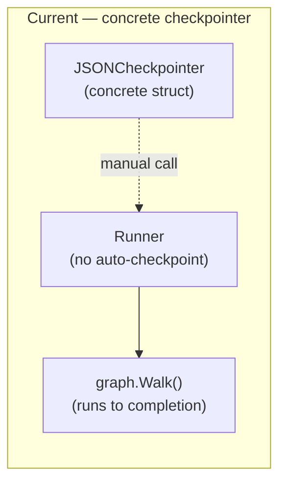
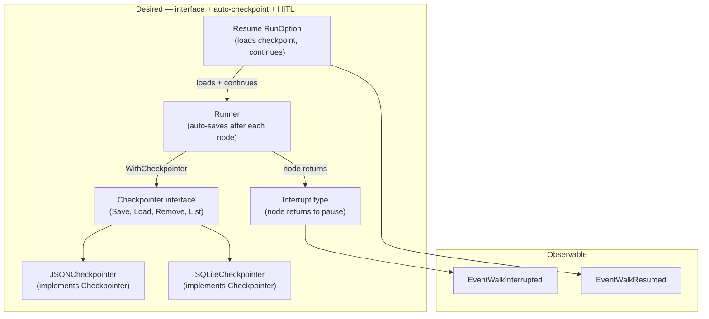

# Contract — Durable Execution

**Status:** draft  
**Goal:** Extract a `Checkpointer` interface from `JSONCheckpointer`, add pluggable backends and durability modes, and define an `Interrupt/Resume` HITL primitive for walker pause/resume — closing the two highest-priority infrastructure gaps vs LangGraph.  
**Serves:** Polishing & Presentation (should)

## Contract rules

- The `Checkpointer` interface must be backward-compatible. `JSONCheckpointer` becomes the first implementation with zero API changes for existing consumers.
- `Interrupt` is a framework-level concept, not a Kami concept. Kami's Debug API (Pause/Resume) should consume `Interrupt/Resume` rather than re-implementing its own pause mechanism.
- SQLite backend must not become a required dependency. Import via build tag or separate sub-package (`checkpoint/sqlite`).
- Durability modes are opt-in. Default behavior is `sync` (persist before next node).

## Context

- **Origin:** LangGraph case study (`docs/case-studies/langgraph-graph-duality.md`) Gaps 1+2. LangGraph's checkpointing is production-grade: 3 durability modes, multiple backends, automatic crash recovery, thread-based isolation. LangGraph's `interrupt()` + `Command(resume=...)` is first-class HITL.
- **Current state:** `JSONCheckpointer` in `checkpoint.go` has `Save/Load/Remove` methods but is a concrete struct, not an interface. No `WithCheckpointer` RunOption. No interrupt/resume primitive. The runner does not auto-checkpoint.
- **Cross-references:**
  - `kami-live-debugger` Phase 3 (Debug API: D1-D5) — Kami's Pause/Resume/AdvanceNode can delegate to the framework `Interrupt/Resume` primitive instead of implementing its own.
  - `walker-experience` — `WithMemory` RunOption is the pattern to follow for `WithCheckpointer`.
  - `origami-poc-batteries` (completed) — Created `JSONCheckpointer` as a PoC battery.

### Current architecture

No interface. No auto-checkpoint in the walk loop. No way to pause mid-walk. Consumers must manually call `Save/Load` outside the framework.

### Desired architecture

## FSC artifacts

| Artifact | Target | Compartment |
|----------|--------|-------------|
| Checkpointer interface reference | `docs/checkpointer.md` | domain |
| HITL pattern guide | `docs/interrupt-resume.md` | domain |

## Execution strategy

Phase 1 extracts the `Checkpointer` interface from the existing concrete `JSONCheckpointer`. Phase 2 wires auto-checkpointing into the runner via a new `WithCheckpointer` RunOption. Phase 3 adds the `Interrupt/Resume` HITL primitive with WalkObserver events. Phase 4 adds a `SQLiteCheckpointer` as a production-grade backend. Phase 5 validates end-to-end.

## Coverage matrix

| Layer | Applies | Rationale |
|-------|---------|-----------|
| **Unit** | yes | Checkpointer interface compliance, JSONCheckpointer Save/Load/Remove, SQLiteCheckpointer CRUD, Interrupt return handling, Resume state restoration |
| **Integration** | yes | Runner auto-checkpoints after each node, Interrupt pauses walk, Resume continues from checkpoint |
| **Contract** | yes | Checkpointer interface stability, Interrupt/Resume protocol |
| **E2E** | yes | Walk with checkpointer → kill → resume → completes from last checkpoint |
| **Concurrency** | yes | SQLiteCheckpointer thread isolation, concurrent walkers with independent checkpoints |
| **Security** | no | Checkpoints are local files or local SQLite. No trust boundaries. |

## Tasks

### Phase 1 — Checkpointer interface

- [ ] **CP1** Extract `Checkpointer` interface in `checkpoint.go`: `Save(state *WalkerState) error`, `Load(id string) (*WalkerState, error)`, `Remove(id string) error`, `List() ([]string, error)`
- [ ] **CP2** `JSONCheckpointer` implements `Checkpointer` (already has Save/Load/Remove — add `List`)
- [ ] **CP3** Unit tests: verify `JSONCheckpointer` satisfies `Checkpointer` interface, test `List` returns saved walker IDs

### Phase 2 — Auto-checkpointing in runner

- [ ] **AC1** Add `WithCheckpointer(cp Checkpointer) RunOption` to `run.go`
- [ ] **AC2** Runner calls `cp.Save(walkerState)` after each successful `Node.Process()` call
- [ ] **AC3** `WithResume(walkerID string) RunOption` — loads checkpoint via `cp.Load(walkerID)` and starts walk from `state.CurrentNode` instead of the graph's start node
- [ ] **AC4** Runner calls `cp.Remove(walkerID)` after successful walk completion (clean up)
- [ ] **AC5** Unit tests: walk with checkpointer saves after each node; resume from mid-walk checkpoint continues correctly; checkpoint removed after completion

### Phase 3 — Interrupt/Resume (HITL)

- [ ] **IR1** Define `Interrupt` struct: `Reason string`, `Data map[string]any`. When `Node.Process()` returns `(nil, Interrupt{...})`, the runner checkpoints state and stops the walk without error
- [ ] **IR2** `IsInterrupt(err error) bool` helper — checks if an error is an `Interrupt`
- [ ] **IR3** Emit `EventWalkInterrupted` via `WalkObserver` when interrupt occurs (includes node name, walker ID, interrupt reason)
- [ ] **IR4** `WithResumeInput(walkerID string, input any) RunOption` — loads checkpoint, injects `input` into `WalkerState.Context["resume_input"]`, continues from interrupted node
- [ ] **IR5** Emit `EventWalkResumed` via `WalkObserver` when resume begins
- [ ] **IR6** Unit tests: node returns Interrupt → walk pauses, checkpoint saved, EventWalkInterrupted emitted. Resume with input → walk continues from interrupted node, EventWalkResumed emitted, input available in context

### Phase 4 — SQLiteCheckpointer

- [ ] **SQ1** `SQLiteCheckpointer` in `checkpoint/sqlite/` sub-package — implements `Checkpointer` using a single SQLite file with a `checkpoints` table (`id TEXT PRIMARY KEY, state BLOB, updated_at TIMESTAMP`)
- [ ] **SQ2** Thread isolation: each walker ID gets its own row. Concurrent walkers do not interfere.
- [ ] **SQ3** `NewSQLiteCheckpointer(dbPath string) (*SQLiteCheckpointer, error)` — auto-creates DB and table
- [ ] **SQ4** Unit tests: CRUD operations, concurrent Save/Load from multiple goroutines, verify thread isolation

### Phase 5 — Validate and tune

- [ ] **V1** Validate (green) — `go build ./...`, `go test ./...` all pass. Auto-checkpointing works. Interrupt/Resume works. SQLite backend works.
- [ ] **V2** Tune (blue) — Review Checkpointer interface for forward-compatibility. Review Interrupt semantics (error vs sentinel type). Ensure Kami cross-reference is documented.
- [ ] **V3** Validate (green) — all tests still pass after tuning.

## Acceptance criteria

**Given** a circuit walk with `WithCheckpointer(jsonCP)`,  
**When** the walker processes nodes A → B → C,  
**Then** checkpoints are saved after A, B, and C. After successful completion, the checkpoint is removed.

**Given** a walk that was interrupted at node B (node returned `Interrupt{Reason: "need approval"}`),  
**When** `Run(circuit, WithResumeInput(walkerID, approvalData))` is called,  
**Then** the walk resumes from node B with `approvalData` in `WalkerState.Context["resume_input"]`, and `EventWalkResumed` is emitted.

**Given** a `SQLiteCheckpointer` with 3 saved checkpoints,  
**When** `List()` is called,  
**Then** it returns 3 walker IDs. Each can be loaded, and the loaded state matches what was saved.

**Given** a walk crashes after node B (process killed),  
**When** the process restarts and calls `Run(circuit, WithCheckpointer(cp), WithResume(walkerID))`,  
**Then** the walk continues from node B's checkpoint without re-executing nodes A and B.

## Security assessment

No trust boundaries affected. Checkpoints are local files (JSON) or local SQLite. No external API calls. Resume input is provided by the caller, not by external sources. If SQLite files are stored in shared locations, standard file permissions apply.

## Notes

2026-02-25 — Contract created from LangGraph case study Gaps 1+2. LangGraph's durable execution (3 modes, multiple backends, crash recovery) and HITL (`interrupt()` + `Command(resume=...)`) are its strongest infrastructure advantages. This contract closes both gaps with Origami's own primitives. The Checkpointer interface follows the same pattern as existing framework interfaces (Transformer, Extractor, Hook). The Interrupt/Resume primitive is designed to be consumed by Kami's Debug API.
