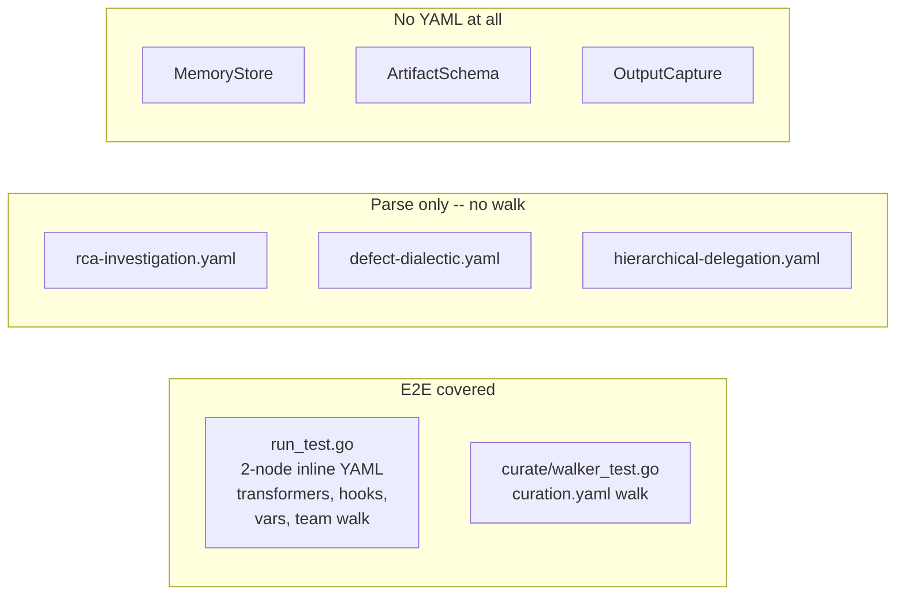
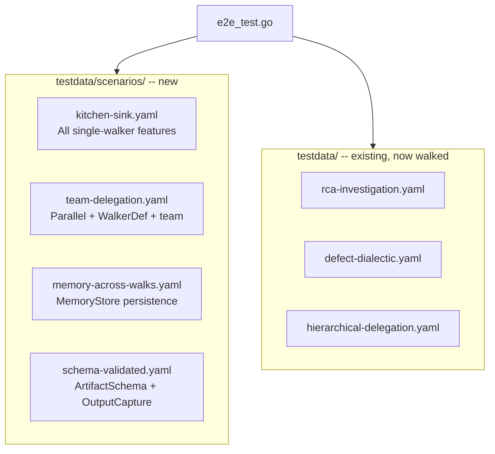

# Contract — E2E DSL Testing

**Status:** draft  
**Goal:** Every framework feature exercised end-to-end: YAML file loaded, graph built, walked to _done, artifacts and path verified.  
**Serves:** Polishing & Presentation (should)

## Contract rules

- No dedicated sprint. E2E tests are injected as gates into every remaining CHECKPOINT (C through F).
- All E2E tests live in one file (`e2e_test.go`) for discoverability. Scenario YAMLs live in `testdata/scenarios/`.
- Stub nodes and transformers only -- no LLM calls. E2E tests must be deterministic and fast.
- Real-world YAMLs (`testdata/*.yaml`) must be walked with stub registries to prove structural walkability.

## Context

- **Gap inventory:** 8 features have no E2E walk coverage (parallel edges, extractors, WalkerDef, MemoryStore, ArtifactSchema, OutputCapture, Adversarial Dialectic, real-YAML walks).
- **Existing E2E:** `run_test.go` walks trivial inline YAML (2-node echo circuits). `curate/walker_test.go` walks `curation.yaml`. No other testdata YAML is walked.
- **Existing parse-only:** `dsl_test.go` loads `rca-investigation.yaml`, `defect-dialectic.yaml` -- validates structure, never walks.

### Current architecture

### Desired architecture

## FSC artifacts

| Artifact | Target | Compartment |
|----------|--------|-------------|
| E2E testing strategy reference | `docs/e2e-testing.md` | domain |

## Execution strategy

No phased execution -- all scenarios are created together and run at every CHECKPOINT. The contract delivers:

1. Four scenario YAML files covering all gaps
2. Walk tests for three existing real-world YAMLs
3. One test file (`e2e_test.go`) containing all E2E tests
4. Injected tasks in `ouroboros-seed-circuit` and `kami-live-debugger` for sprint-specific E2E

## Coverage matrix

| Layer | Applies | Rationale |
|-------|---------|-----------|
| **Unit** | no | This contract is about integration, not units |
| **Integration** | yes | Full YAML to build to walk to verify circuit |
| **Contract** | yes | ArtifactSchema validation, registry resolution |
| **E2E** | yes | This IS the E2E contract |
| **Concurrency** | yes | Parallel fan-out scenario, MemoryStore concurrent access |
| **Security** | no | No trust boundaries -- all local test data |

## Tasks

### Scenario YAMLs

- [ ] **S1** Create `testdata/scenarios/kitchen-sink.yaml` -- zones, `when:` expressions, shortcuts, loops, transformers, hooks (`after:`), input resolution (`${node.output}`), prompt rendering (`{{.Config.var}}`), circuit vars, artifact schema
- [ ] **S2** Create `testdata/scenarios/team-delegation.yaml` -- WalkerDef (walkers section with persona, element, step_affinity), BuildWalkersFromDef, parallel fan-out edges, team walk with AffinityScheduler, zone stickiness
- [ ] **S3** Create `testdata/scenarios/memory-across-walks.yaml` -- simple 2-node circuit for MemoryStore testing. Walk 1 sets key, walk 2 reads key. Verifies cross-walk persistence scoped by walker identity.
- [ ] **S4** Create `testdata/scenarios/schema-validated.yaml` -- circuit with `schema:` on every node. Walk with WithOutputCapture. Verify all captured artifacts match declared schemas.

### E2E walk tests

- [ ] **T1** `TestE2E_KitchenSink` -- load kitchen-sink.yaml, walk with controllable stub transformers. Test shortcut path (high confidence) and loop path (low confidence). Verify hook fires, input resolved, prompt rendered, schema passes.
- [ ] **T2** `TestE2E_TeamDelegation` -- load team-delegation.yaml, BuildWalkersFromDef from def.Walkers, team walk. Verify both specialist walkers visit their affinity nodes. Verify parallel edges produce fan-out.
- [ ] **T3** `TestE2E_MemoryPersistence` -- load memory-across-walks.yaml, walk twice with same MemoryStore. Verify walk 2 reads value set in walk 1. Verify different walker IDs are isolated.
- [ ] **T4** `TestE2E_SchemaValidation` -- load schema-validated.yaml, walk with WithOutputCapture. Verify all artifacts match schema. Verify intentional schema violation produces error.
- [ ] **T5** `TestE2E_RealYAML_RCAInvestigation` -- load `testdata/rca-investigation.yaml`, build with stub NodeRegistry (7 families) and always-forward EdgeFactory, walk to _done. Verify 7-node path.
- [ ] **T6** `TestE2E_RealYAML_DefectDialectic` -- load `testdata/defect-dialectic.yaml`, build with stub NodeRegistry (5 families) and forward EdgeFactory (indict to discover to defend to hearing to verdict to _done). Verify dialectic path.
- [ ] **T7** `TestE2E_RealYAML_HierarchicalDelegation` -- load `testdata/patterns/hierarchical-delegation.yaml`, BuildWalkersFromDef, team walk with stub nodes. Verify all 3 walkers participate.
- [ ] Validate (green) -- `go build ./...`, `go test -run TestE2E ./...` all pass.
- [ ] Tune (blue) -- refactor test helpers for reuse across scenarios.
- [ ] Validate (green) -- all tests still pass after tuning.

### Injected tasks (other contracts)

- [ ] **I1** Inject into `ouroboros-seed-circuit` Phase 2: E2E walk test for `ouroboros-probe.yaml` -- verify Generator to Subject to Judge path walks to _done with stub transformers
- [ ] **I2** Inject into `kami-live-debugger` Phase 1: Verify EventBridge receives WalkEvents from an E2E scenario walk

## Acceptance criteria

**Given** `testdata/scenarios/kitchen-sink.yaml` with 4 nodes, 3 zones, expression edges, and shortcuts,  
**When** the circuit is loaded, built with stub registries, and walked,  
**Then** the walk completes at `_done` with the correct path (shortcut or loop depending on stub output), hooks fire, artifacts match schema, input resolution and prompt rendering produce expected values.

**Given** `testdata/scenarios/team-delegation.yaml` with 3 WalkerDefs and parallel edges,  
**When** walkers are built from WalkerDef, team walk is executed,  
**Then** all specialist nodes are visited, parallel fan-out occurs, and each walker's persona and element match the YAML definition.

**Given** all 3 real-world YAMLs (`rca-investigation`, `defect-dialectic`, `hierarchical-delegation`),  
**When** each is loaded, built with stub registries, and walked,  
**Then** each walk completes at `_done` without errors, proving structural walkability.

## Security assessment

No trust boundaries affected. All test data is local. No external calls. No secrets.

## Notes

2026-02-25 -- Contract created. Addresses 8 E2E coverage gaps identified during Sprint 2 retrospective. No dedicated sprint -- tests are CHECKPOINT gates. Injections into `ouroboros-seed-circuit` (task I1) and `kami-live-debugger` (task I2).
