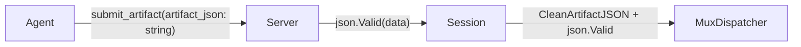
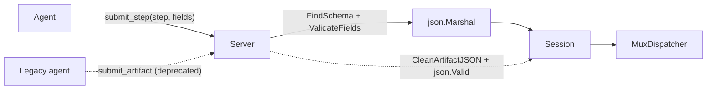

# Contract — marshaller-step-schema-factory

**Status:** complete  
**Goal:** Replace freeform `submit_artifact` with schema-validated `submit_step` tool using StepSchemas as a step factory.  
**Serves:** Framework Maturity

## Contract rules

Global rules only.

## Context

Discussion with head of AI identified that `submit_artifact` accepts raw JSON strings — freeform text from LLMs with no structural validation at the MCP boundary. The existing `StepSchemas` registry already declares field names and types per step but only renders them as a markdown table in the worker prompt.

This contract promotes `StepSchemas` from documentation to runtime validation: one `submit_step` MCP tool with a `step` discriminator field validates incoming fields against the schema before marshalling into JSON bytes for the `MuxDispatcher`.

Companion contract in Asterisk: enriches `asteriskStepSchemas()` with `FieldDef` entries and updates the calibrate skill.

### Current architecture

### Desired architecture

## FSC artifacts

Code only — no FSC artifacts.

## Execution strategy

1. Enrich `StepSchema` with `FieldDef` (name, type, required) and `ValidateFields` method.
2. Add `FindSchema` on `CircuitConfig` for step name lookup.
3. Register `submit_step` tool with schema-validated handler.
4. Deprecate `submit_artifact` with warning log (keep for backward compat).
5. Move `CleanArtifactJSON` out of the session's `SubmitArtifact` into deprecated handler only.
6. Update `WorkerPrompt` to reference `submit_step`.
7. Add unit + integration tests.

## Coverage matrix

| Layer | Applies | Rationale |
|-------|---------|-----------|
| **Unit** | yes | `ValidateFields`, `FindSchema`, field validation edge cases |
| **Integration** | yes | Full MCP round-trip with `submit_step` via in-memory transport |
| **Contract** | yes | `submit_step` tool visible in ListTools, schema matches StepSchema defs |
| **E2E** | no | Covered by Asterisk's stub calibration |
| **Concurrency** | no | No new shared state; existing MuxDispatcher tests cover routing |
| **Security** | yes | A03 — schema validation replaces permissive json.Valid |

## Tasks

- [x] Enrich `StepSchema` with `FieldDef` and `ValidateFields` method
- [x] Add `FindSchema` on `CircuitConfig`
- [x] Register `submit_step` tool with schema-validated handler
- [x] Deprecate `submit_artifact` with warning log
- [x] Move `CleanArtifactJSON` out of session path into deprecated handler
- [x] Update `WorkerPrompt` to reference `submit_step`
- [x] Add unit + integration tests
- [x] Validate (green) — all tests pass
- [x] Tune (blue) — refactor for quality
- [x] Validate (green) — all tests still pass after tuning

## Acceptance criteria

- **Given** a worker calls `submit_step` with correct step name and fields, **when** the Marshaller receives it, **then** it validates, marshals to JSON, and routes via `MuxDispatcher`.
- **Given** a worker calls `submit_step` with a missing required field, **when** the Marshaller validates, **then** it returns an error before reaching the dispatcher.
- **Given** a worker calls `submit_step` with an unknown step name, **when** the Marshaller validates, **then** it returns an error listing valid step names.
- **Given** a worker calls the deprecated `submit_artifact`, **when** the Marshaller receives it, **then** it logs a deprecation warning and processes as before.
- **Given** all changes are applied, **when** `go test ./...` runs, **then** all tests pass.

## Security assessment

| OWASP | Finding | Mitigation |
|-------|---------|------------|
| A03 Injection | `submit_artifact` accepted arbitrary JSON with no schema validation | `submit_step` validates against `FieldDef` before routing |

## Notes

2026-02-24 — Contract created. StepSchema enrichment, submit_step handler, deprecation of submit_artifact, WorkerPrompt update all implemented. Tests pending.
2026-02-24 — All tasks complete. Unit tests (ValidateFields, FindSchema, submit_step full loop, unknown step, missing required field, zero dispatch ID) and integration tests passing. Tune pass done (stale comments fixed). Both repos green.
