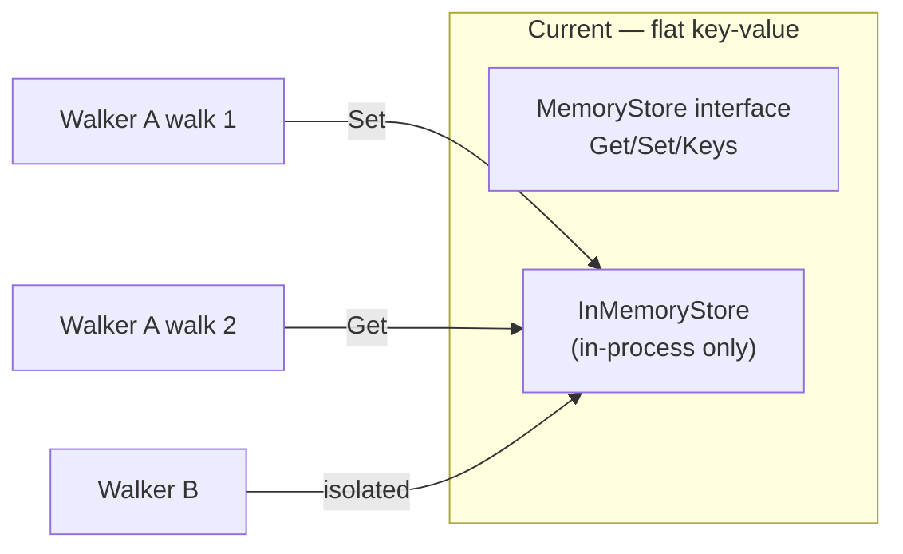
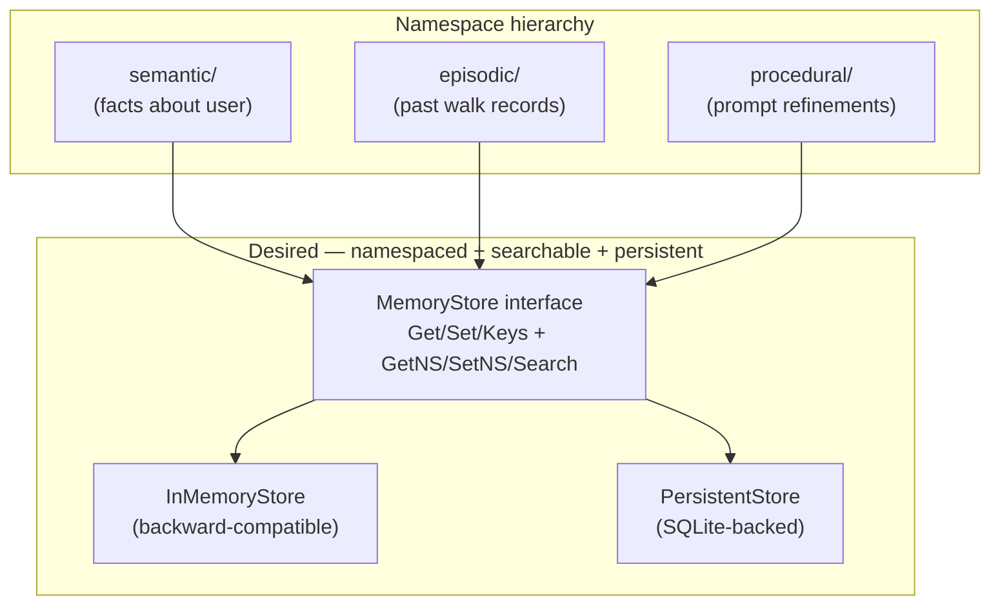

# Contract — Memory Evolution

**Status:** draft  
**Goal:** Evolve `MemoryStore` from walker-scoped key-value to a namespaced, searchable, persistent store — closing the memory depth gap vs LangGraph.  
**Serves:** Polishing & Presentation (nice)

## Contract rules

- The existing `MemoryStore` interface (`Get/Set/Keys`) must remain backward-compatible. New methods are additive.
- `InMemoryStore` retains its current behavior as the default. New implementations are opt-in.
- SQLite persistence must not become a required dependency. Import via sub-package (`memory/sqlite`).
- Memory types (semantic, episodic, procedural) are organizational conventions expressed through namespaces, not separate interfaces.

## Context

- **Origin:** LangGraph case study (`docs/case-studies/langgraph-graph-duality.md`) Gap 4. LangGraph's memory spans three types: short-term (thread-scoped), long-term (cross-thread `Store` with namespaces and semantic search), and procedural (self-modifying prompts). Origami's `MemoryStore` is walker-scoped key-value only.
- **Current state:** `MemoryStore` interface in `memory.go` has `Get(walkerID, key)`, `Set(walkerID, key, value)`, `Keys(walkerID)`. `InMemoryStore` is the only implementation (thread-safe, in-process, no persistence). Created by the `walker-experience` contract.
- **LangGraph comparison:** LangGraph's `BaseStore` supports `get(namespace, key)`, `put(namespace, key, value)`, `search(namespace, query=..., filter=...)` with semantic search via embeddings. Namespaces are hierarchical tuples (e.g., `("user_id", "application_context")`).
- **Cross-references:**
  - `walker-experience` — Created `MemoryStore` and `InMemoryStore`. This contract extends that work.
  - `durable-execution` — `PersistentStore` could share SQLite infrastructure with `SQLiteCheckpointer`.

### Current architecture

Walker-scoped, in-process only. No namespaces, no search, no persistence across restarts.

### Desired architecture

## FSC artifacts

| Artifact | Target | Compartment |
|----------|--------|-------------|
| Memory system reference | `docs/memory.md` | domain |

## Execution strategy

Phase 1 extends the `MemoryStore` interface with namespace-aware methods (backward-compatible). Phase 2 adds a `PersistentStore` backed by SQLite. Phase 3 defines memory type conventions (semantic, episodic, procedural) with tag-based retrieval. Phase 4 validates.

## Coverage matrix

| Layer | Applies | Rationale |
|-------|---------|-----------|
| **Unit** | yes | Namespace CRUD, search, InMemoryStore backward-compat, PersistentStore CRUD |
| **Integration** | no | No cross-boundary changes |
| **Contract** | yes | MemoryStore interface backward-compatibility |
| **E2E** | no | Memory is a runtime primitive, not circuit topology |
| **Concurrency** | yes | PersistentStore must handle concurrent walker access |
| **Security** | no | Local storage only |

## Tasks

### Phase 1 — Namespaced MemoryStore

- [ ] **NS1** Add namespace-aware methods to `MemoryStore` interface: `GetNS(namespace, walkerID, key string) (any, bool)`, `SetNS(namespace, walkerID, key string, value any)`, `KeysNS(namespace, walkerID string) []string`, `Search(namespace, query string) []MemoryItem`
- [ ] **NS2** Define `MemoryItem` struct: `Namespace`, `WalkerID`, `Key string`, `Value any`, `Tags []string`, `CreatedAt time.Time`
- [ ] **NS3** Existing `Get/Set/Keys` use a default namespace (`""`) — no behavior change for current consumers
- [ ] **NS4** `InMemoryStore` implements the extended interface: namespace adds a second scoping dimension (namespace → walkerID → key)
- [ ] **NS5** `Search` on `InMemoryStore` does substring matching on keys and string values (no embeddings — simple but useful)
- [ ] **NS6** Unit tests: namespace isolation, backward-compatible Get/Set, search returns matching items

### Phase 2 — PersistentStore (SQLite)

- [ ] **PS1** `PersistentStore` in `memory/sqlite/` sub-package — implements `MemoryStore` using SQLite with a `memories` table (`namespace TEXT, walker_id TEXT, key TEXT, value BLOB, tags TEXT, created_at TIMESTAMP, PRIMARY KEY (namespace, walker_id, key))`)
- [ ] **PS2** `NewPersistentStore(dbPath string) (*PersistentStore, error)` — auto-creates DB and table
- [ ] **PS3** Values serialized as JSON blobs. Tags serialized as comma-separated strings.
- [ ] **PS4** `Search` uses SQLite `LIKE` on key and value columns. Tag filtering via `tags LIKE '%tag%'`.
- [ ] **PS5** Thread-safe: `sync.RWMutex` around SQLite operations (single-writer, multiple-reader)
- [ ] **PS6** Unit tests: CRUD across restarts (close DB, reopen, verify data persists), concurrent access, namespace isolation

### Phase 3 — Memory type conventions

- [ ] **MT1** Define conventional namespace constants: `NamespaceSemantic = "semantic"`, `NamespaceEpisodic = "episodic"`, `NamespaceProcedural = "procedural"`
- [ ] **MT2** Helper functions: `SetFact(store, walkerID, key, value)` (semantic), `RecordEpisode(store, walkerID, walkID string, summary string)` (episodic), `UpdateInstruction(store, walkerID, key, instruction string)` (procedural)
- [ ] **MT3** `WithTaggedMemory(store MemoryStore, tags ...string) RunOption` — auto-tags all memory writes during the walk with the provided tags
- [ ] **MT4** Unit tests: helpers write to correct namespaces, tags are applied, search by tag returns tagged items

### Phase 4 — Validate and tune

- [ ] **V1** Validate (green) — `go build ./...`, `go test ./...` all pass. Extended interface is backward-compatible. PersistentStore survives restarts.
- [ ] **V2** Tune (blue) — Review interface for forward-compatibility. Consider whether `Search` should accept structured queries vs plain strings.
- [ ] **V3** Validate (green) — all tests still pass after tuning.

## Acceptance criteria

**Given** an `InMemoryStore` with values set via `Set(walkerID, key, value)`,  
**When** `Get(walkerID, key)` is called,  
**Then** the existing behavior is unchanged — full backward compatibility.

**Given** a `PersistentStore` with semantic memories set via `SetNS("semantic", walkerID, "preference", "dark mode")`,  
**When** the process restarts and `GetNS("semantic", walkerID, "preference")` is called,  
**Then** `"dark mode"` is returned — persistence across restarts.

**Given** a store with items tagged `["rca", "ptp"]` in the semantic namespace,  
**When** `Search("semantic", "ptp")` is called,  
**Then** the matching items are returned.

**Given** values set in namespace `"semantic"` for walker A,  
**When** `GetNS("episodic", walkerA, sameKey)` is called,  
**Then** nothing is returned — namespaces are isolated.

## Security assessment

No trust boundaries affected. Memory stores are local (in-process or local SQLite). No external API calls. PII/secrets in memory values are the consumer's responsibility to manage.

## Notes

2026-02-25 — Contract created from LangGraph case study Gap 4. LangGraph's memory system is significantly richer than Origami's current `InMemoryStore`. This contract bridges the gap without over-engineering: namespaces provide organizational structure, SQLite provides persistence, and conventional memory types (semantic/episodic/procedural) follow LangGraph's proven categorization without requiring separate interfaces.
