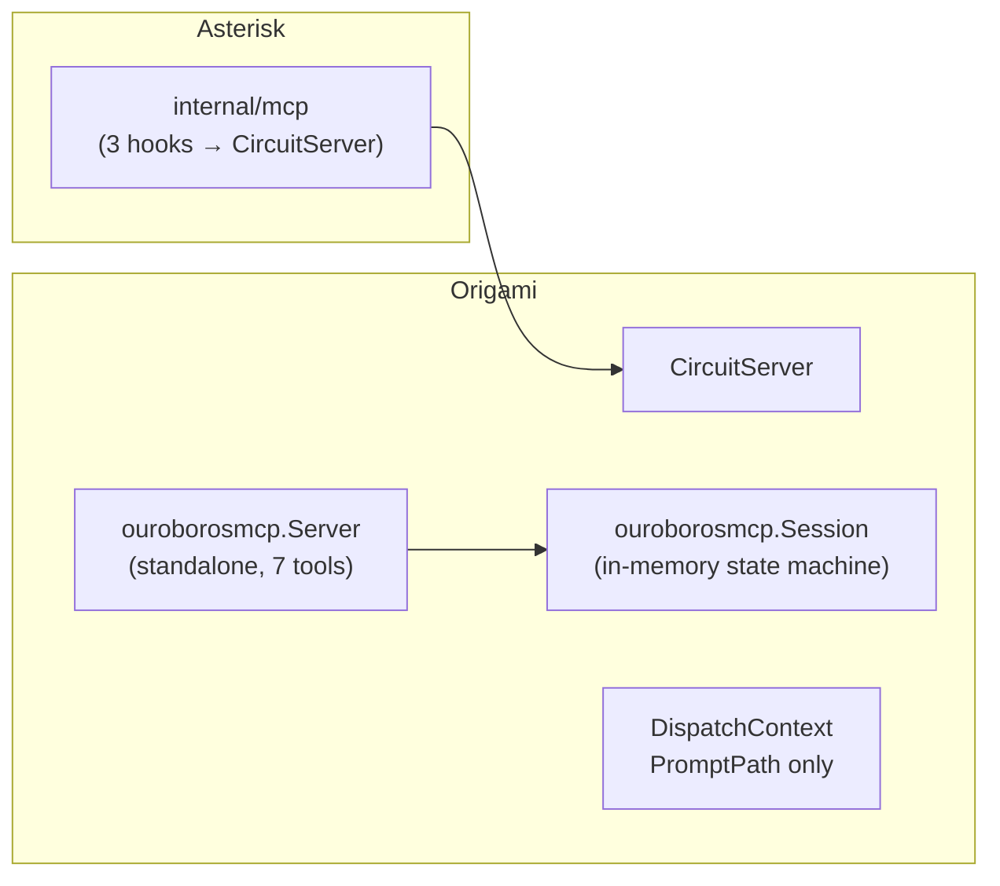
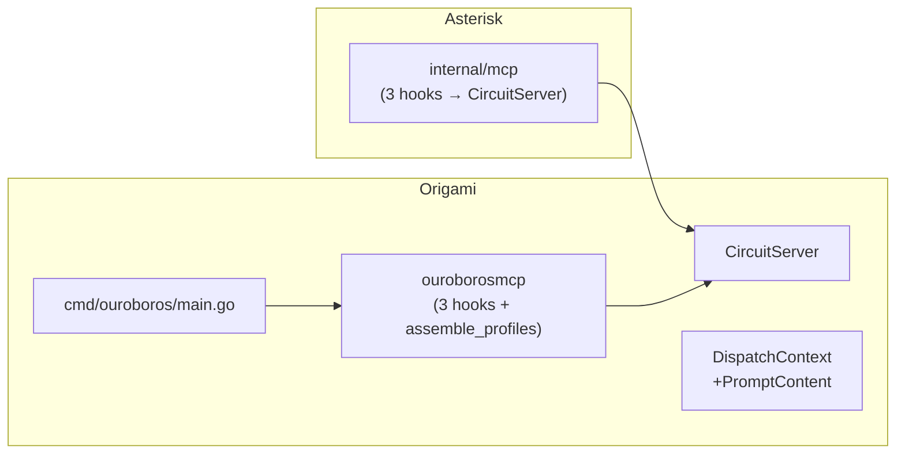

# Contract — migrate-ouroboros-to-marshaller

**Status:** complete  
**Goal:** Ouroboros MCP server is deleted; all discovery tools are served by CircuitServer with three domain hooks.  
**Serves:** Framework Maturity

## Contract rules

- Zero new MCP tool handlers — reuse CircuitServer's 6 tools. Only `assemble_profiles` is registered as an extra domain tool.
- Discovery-specific logic stays in `ouroboros/` and `ouroborosmcp/` — the RunFunc orchestrates but does not move scoring/parsing code.
- All existing `ouroborosmcp/` tests must pass or be migrated.

## Context

- CircuitServer (`mcp/circuit_server.go`) provides 6 generic MCP tools and domain injection via `CircuitConfig`.
- Asterisk successfully migrated in `f19e979` — domain code shrank from ~800 to ~170 lines.
- Ouroboros (`ouroborosmcp/server.go`) currently maintains a standalone MCP server with 7 tools (6 map 1:1 to CircuitServer, 1 is domain-extra).
- `DispatchContext` currently only supports file-based prompts (`PromptPath`). Ouroboros generates prompts in-memory. A `PromptContent` field is needed.

### Current architecture

### Desired architecture

## FSC artifacts

Code only — no FSC artifacts.

## Execution strategy

### Phase 1 — DispatchContext inline prompt support

Add `PromptContent string` to `DispatchContext`. Update CircuitServer's `handleGetNextStep` to prefer `dc.PromptContent` over file read when set. This is a backward-compatible extension — file-based dispatch is unchanged.

### Phase 2 — Ouroboros domain hooks

Create the `CircuitConfig` for Ouroboros with three hooks:

- **`CreateSession`**: Parse `extra` params (max_iterations, probe_id, terminate_on_repeat). Return a `RunFunc` that loops: generate prompt with exclusion list → `disp.Dispatch()` (blocks until artifact) → parse identity → score probe → check termination → repeat or return `RunReport`. Always `parallel=1`.
- **`StepSchemas`**: Single "discover" step — field: `response` (raw text from LLM).
- **`FormatReport`**: Render `RunReport` as human-readable text (unique models, scores, term reason).

Register `assemble_profiles` as an extra tool via `sdkmcp.AddTool(srv.MCPServer, ...)` after `NewCircuitServer()`.

### Phase 3 — Delete standalone server

Remove `ouroborosmcp/server.go` (standalone Server struct) and `ouroborosmcp/session.go` (state machine absorbed into RunFunc). Migrate tests to exercise CircuitServer with Ouroboros hooks.

### Phase 4 — CLI entry point + mcp.json

Create `cmd/ouroboros/main.go` (~30 lines) — instantiate CircuitServer with Ouroboros config, run over stdio. Update `.cursor/mcp.json` to rename `asterisk` → `marshaller` and point `ouroboros` at the compiled binary.

## Coverage matrix

| Layer | Applies | Rationale |
|-------|---------|-----------|
| **Unit** | yes | RunFunc iteration logic, prompt generation, response parsing, report building |
| **Integration** | yes | Full CircuitServer tool loop with Ouroboros hooks (start → step → submit → report) |
| **Contract** | yes | CircuitConfig interface adherence (3 hooks) |
| **E2E** | no | No external dependencies — discovery uses synthetic probe responses |
| **Concurrency** | no | Ouroboros is serial (parallel=1); MuxDispatcher concurrency tested in CircuitServer suite |
| **Security** | no | No trust boundaries changed |

## Tasks

- [x] Phase 1: Add `PromptContent` to `DispatchContext`; update CircuitServer to use it
- [x] Phase 2: Implement Ouroboros `CircuitConfig` (CreateSession RunFunc, StepSchemas, FormatReport) + `assemble_profiles` extra tool
- [x] Phase 3: Delete `ouroborosmcp/server.go` and `session.go`; migrate tests
- [x] Phase 4: Update `cmd/origami/main.go` `ouroborosServe`; update `.cursor/mcp.json`
- [x] Validate (green) — `go build ./...` and `go test ./...` pass in Origami, Asterisk, Achilles
- [x] Tune (blue) — refactor for quality, no behavior changes
- [x] Validate (green) — all tests still pass after tuning

## Acceptance criteria

- **Given** the Ouroboros MCP server entry in `mcp.json`, **when** Cursor connects, **then** the tools `start_circuit`, `get_next_step`, `submit_artifact`, `get_report`, `emit_signal`, `get_signals`, and `assemble_profiles` are available.
- **Given** `start_circuit(extra: {max_iterations: 3, probe_id: "refactor-v1"})`, **when** the agent loops through get/submit 3 times, **then** `get_report` returns a `RunReport` with discovered models and probe scores.
- **Given** a repeated model identity in a submission, **when** `terminate_on_repeat` is true, **then** the next `get_next_step` returns `done=true`.
- **Given** `assemble_profiles` called after persisted runs exist, **then** aggregated `ModelProfile` results are returned.
- **Given** the migration is complete, **then** `ouroborosmcp/server.go` and `ouroborosmcp/session.go` no longer exist.
- **Given** `go build ./...` and `go test ./...` in Origami, Asterisk, and Achilles, **then** all pass.

## Security assessment

No trust boundaries affected. Ouroboros handles synthetic probe data only.

## Notes

2026-02-24 10:45 — Contract complete. All phases executed and validated. Ouroboros now uses CircuitServer with 3 hooks + 1 extra tool. `ouroborosmcp/` reduced from 5 files (~22KB) to 3 files (~26KB including comprehensive tests). API change: `CreateSession` now receives `*dispatch.SignalBus` for domain-specific observability — Asterisk updated to accept (ignores it).

2026-02-23 22:15 — Contract created. Ouroboros discovery protocol maps 1:1 onto CircuitServer primitives. The key insight: `MuxDispatcher.Dispatch()` blocks until the artifact returns, so the sequential iteration dependency (each prompt depends on previous results) is naturally enforced inside the RunFunc loop.
