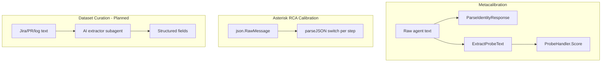
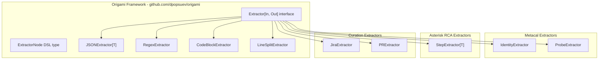

# Contract — origami-agentic-network-framework

**Status:** complete  
**Goal:** Establish Origami as the framework identity; implement `Extractor[In, Out]` as a core primitive with batteries-included implementations.  
**Serves:** Framework showcase (current goal)

## Contract rules

Global rules only, plus:

- **Origami is the framework.** The name "Agentic Network Framework" is retired in all docs, rules, and glossary entries.
- **Extractors are first-class.** They are Tome V primitives alongside Nodes (Tome I), Elements (Tome II), Personae (Tome III), and Ouroboros (Tome IV).
- **Low floor, high ceilings, wide walls** (Papert/Resnick). Batteries-included extractors require zero custom code. Domain extractors implement the same interface. Any implementation can be registered and used in YAML.
- **Zero domain imports in `pkg/framework/`.** Batteries-included extractors are generic. Domain extractors live in `internal/`.
- **Three CLIs per tool.** Every Origami-based tool ships three CLI surfaces: End-User (run the domain pipeline), Pipeline Developer (calibrate against ground truth), Dataset Developer (curate ground truth). This is a framework-level pattern, not optional.

## The Three CLIs

Every tool built on Origami requires three distinct CLI surfaces serving different personas in the development lifecycle:

| Phase | Persona | CLI Surface | Purpose |
|-------|---------|-------------|---------|
| **1. Dataset Developer** | Builds ground truth | `<tool> dataset` | Fetch, extract, validate, promote evidence into structured ground truth |
| **2. Pipeline Developer** | Calibrates the pipeline | `<tool> calibrate` | Measure pipeline accuracy against ground truth, tune agentic workflow |
| **3. End-User** | Uses the tool in production | `<tool> run` | Execute the domain pipeline, get results |

Dependency chain: `Dataset Developer -> Pipeline Developer -> End-User`. You cannot calibrate without ground truth. You cannot ship without calibration.

Extractors serve all three personas:
- **End-User**: extractors parse agent output into structured results (implicit use)
- **Pipeline Developer**: extractors score predicted vs. expected (comparison use)
- **Dataset Developer**: extractors turn unstructured evidence into ground truth records (explicit use)

### Asterisk as reference implementation

| Origami Pattern | Asterisk CLI | Status |
|-----------------|-------------|--------|
| Dataset Developer | `asterisk gt` (ground truth ingestor) | Draft contract |
| Pipeline Developer | `asterisk calibrate` (M1-M20 metrics) | Complete |
| End-User | `asterisk analyze` (RP launch -> RCA) | Complete |

## Context

- `github.com/dpopsuev/origami` — All existing Origami primitives (Tomes I-IV).
- `github.com/dpopsuev/origami/metacal/discovery.go` — `ParseIdentityResponse`, `ExtractProbeText`, `ParseProbeResponse` — ad-hoc extractors that should implement the `Extractor` interface.
- `internal/calibrate/runner.go` — `parseJSON[T]` switch per step — ad-hoc typed extraction.
- `rules/domain/dsl-design-principles.mdc` — DSL principles governing pipeline YAML; P7 (Progressive Disclosure) governs extractor adoption.
- Completed framework contracts (Tomes I-IV) in `completed/framework/`.

### Current architecture

Three pipelines, three ad-hoc parsing strategies, zero shared abstraction:

### Desired architecture

One interface, many implementations. Framework owns the abstraction; domains own the implementations:

## FSC artifacts

| Artifact | Target | Compartment |
|----------|--------|-------------|
| Origami glossary entry | `glossary/` | domain |
| Three CLIs glossary entry | `glossary/` | domain |
| Updated DSL principles | `rules/domain/` | universal |
| Three CLIs pattern documentation | `docs/` | domain |
| Architecture diagram update (Extractor primitive) | `docs/` | domain |

## Execution strategy

Phase 1 establishes the Origami identity across docs and rules. Phase 2 designs the core `Extractor` interface and DSL integration. Phase 3 implements batteries-included extractors (low floor). Phase 4 proves the interface by refactoring existing ad-hoc parsers (high ceilings). Phase 5 validates and tunes. Phase 6 updates all docs, FSC artifacts, and knowledge store entries to reflect the Three CLIs pattern and extractor additions.

## Coverage matrix

| Layer | Applies | Rationale |
|-------|---------|-----------|
| **Unit** | yes | Each extractor implementation: happy path, error cases, edge inputs |
| **Integration** | yes | ExtractorNode wired into a pipeline DSL definition; walker invokes extraction |
| **Contract** | yes | `Extractor[In, Out]` interface compliance across all implementations |
| **E2E** | no | No full pipeline validation needed — extractors are leaf primitives |
| **Concurrency** | no | Extractors are stateless; no shared state |
| **Security** | yes | Input validation: malformed JSON, regex DoS, oversized inputs |

## Tasks

### Phase 1 — Identity

- [x] Update `glossary/glossary.mdc`: add Origami definition, keep Ouroboros as subsystem
- [x] Update `rules/domain/dsl-design-principles.mdc`: replace "Agentic Network Framework" with "Origami"
- [x] Update `contracts/current-goal.mdc`: add this contract to the weekend side-quest urgency map
- [x] Update `contracts/index.mdc`: add this contract to the active section

### Phase 2 — Extractor interface

- [x] Design `Extractor[In, Out]` interface in `pkg/framework/extractor.go`
- [x] Add `ExtractorNode` type to the pipeline DSL (`pkg/framework/dsl.go`)
- [x] Unit tests: interface compliance, ExtractorNode in pipeline definition

### Phase 3 — Low floor (batteries-included)

- [x] Implement `JSONExtractor[T]`: `[]byte` -> `T` via `json.Unmarshal`
- [x] Implement `RegexExtractor`: `string` -> `map[string]string` via named capture groups
- [x] Implement `CodeBlockExtractor`: `string` -> `string` (extract fenced code blocks)
- [x] Implement `LineSplitExtractor`: `string` -> `[]string` (split, skip blanks)
- [x] Unit tests for all four extractors: happy path, empty input, malformed input

### Phase 4 — Demonstrate ceilings

- [x] Refactor `metacal.ParseIdentityResponse` as an `Extractor[string, ModelIdentity]` implementation
- [x] Refactor `metacal.ExtractProbeText` / `ParseProbeResponse` as extractor implementations
- [x] Refactor `calibrate.parseJSON[T]` as an `Extractor[json.RawMessage, T]` implementation
- [x] Integration tests: existing metacal and calibrate tests still pass with new extractor wiring

### Phase 5 — Validate and tune

- [x] Validate (green) — all tests pass, acceptance criteria met
- [x] Tune (blue) — refactor for quality, no behavior changes
- [x] Validate (green) — all tests still pass after tuning

### Phase 6 — Housekeeping (docs and FSC)

- [x] Document the Three CLIs pattern in `docs/framework-guide.md` (or create if part of `framework-developer-guide` contract)
- [x] Add "Three CLIs" glossary entry to `glossary/glossary.mdc`
- [x] Update `docs/architecture.md` with Extractor primitive in the Origami component diagram
- [x] Review and update `notes/` for any stale references to "Agentic Network Framework"
- [x] Verify `contracts/index.mdc` and `current-goal.mdc` are consistent with all changes
- [x] Update `rules/domain/dsl-design-principles.mdc` P7 (Progressive Disclosure) table to include Extractor features

## Acceptance criteria

**Given** the Origami framework in `github.com/dpopsuev/origami`,  
**When** this contract is complete,  
**Then**:
- An `Extractor[In, Out]` interface exists with `Extract(ctx, in) (out, error)` method
- At least 4 batteries-included extractors implement the interface (JSON, regex, code-block, line-split)
- `ExtractorNode` is a valid DSL node type declarable in YAML
- At least 2 existing ad-hoc parsers (metacal identity, calibrate parseJSON) are refactored to implement `Extractor`
- All existing tests pass with no regressions
- Glossary, DSL principles, goal manifest, and contracts index reference "Origami" (not "Agentic Network Framework")
- The Three CLIs pattern (End-User, Pipeline Developer, Dataset Developer) is documented in glossary and framework guide
- Asterisk is validated as the reference implementation of the Three CLIs pattern

## Security assessment

| OWASP | Finding | Mitigation |
|-------|---------|------------|
| A03 Injection | `RegexExtractor` accepts user-provided patterns — potential ReDoS | Compile-time regex validation; timeout on `regexp.MatchString`; reject patterns with catastrophic backtracking indicators |
| A05 Misconfiguration | `JSONExtractor` may expose verbose error messages with internal struct names | Wrap `json.Unmarshal` errors; strip internal type info from user-facing messages |

## Notes

2026-02-22 — All 6 phases complete. Extractor interface + 4 batteries-included extractors in `pkg/framework/`. IdentityExtractor, ProbeTextExtractor, CodeBlockProbeExtractor in metacal. StepExtractor in calibrate. DSL supports `extractor` field on nodes. Full test suite green (30 packages). Framework guide updated with Three CLIs + Extractors sections. Glossary, architecture doc, DSL principles all updated.

2026-02-22 — Codified the Three CLIs pattern: every Origami-based tool ships End-User (run), Pipeline Developer (calibrate), and Dataset Developer (dataset) CLI surfaces. Dependency chain: dataset -> calibrate -> run. Asterisk is the reference implementation. Added Phase 6 (housekeeping) for docs and FSC updates.

2026-02-22 — Contract created. Origami is the framework name. Extractors are Tome V — first-class primitives following the low-floor/high-ceiling/wide-walls philosophy. The "Agentic Network Framework" label is retired.
