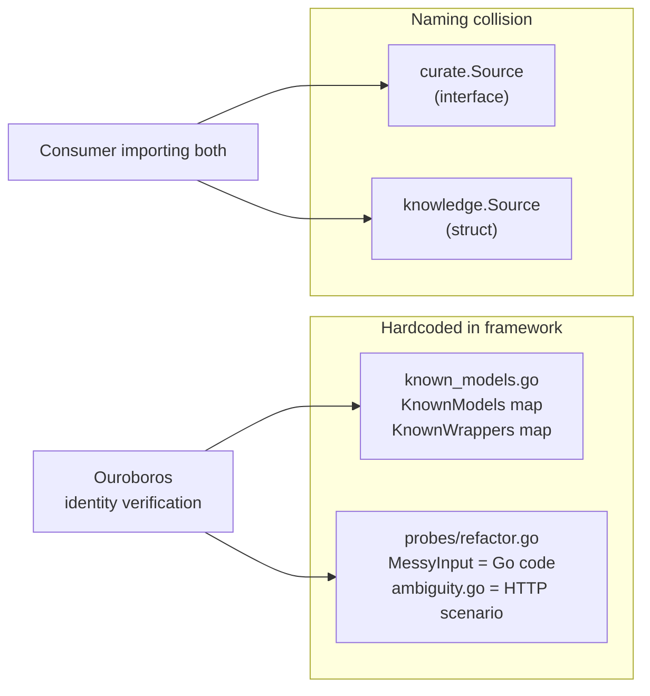
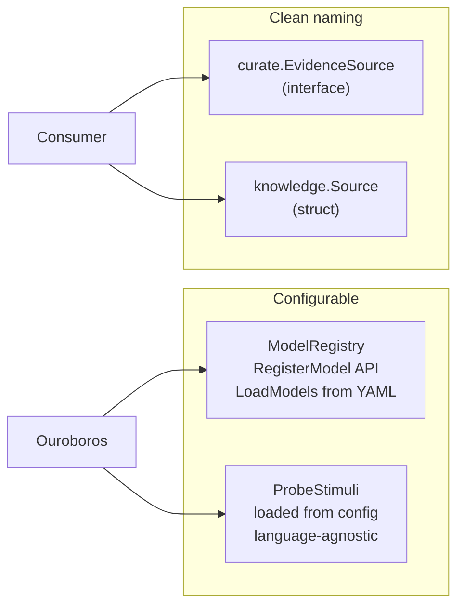

# Contract — Origami API Hygiene

**Status:** draft  
**Goal:** Fix three API cleanliness issues discovered during architectural audit: hardcoded model registry, `Source` naming collision across packages, and hardcoded probe stimuli — all breaking changes ideal for R1's window.  
**Serves:** System Refinement (should)

## Contract rules

- Breaking is allowed. One consumer (Asterisk), same developer, same sprint. No backward-compat shims.
- Each fix is mechanical and self-contained. No cascading design changes.
- Tests must pass after each fix (not just at the end).

## Context

These three issues were identified during a cross-repo architectural sanity check. None are bugs — the code works — but each creates unnecessary coupling, naming confusion, or hardcoded data that limits framework reuse.

### Finding 1 — Hardcoded model registry (`known_models.go`)

`origami/known_models.go` exports `KnownModels` and `KnownWrappers` as hardcoded Go maps containing specific model names (`claude-sonnet-4-20250514`, `stub`, `basic-heuristic`) and wrapper names (`cursor`, `copilot`, `azure`). This is operational data that changes every time a new model ships. Ouroboros identity verification depends on it, but the data should be configurable — not compiled into the framework.

**Affected file:** `known_models.go` (root package)

### Finding 2 — `curate.Source` vs `knowledge.Source` naming collision

Two Origami packages export `Source` with different meanings:
- `curate.Source` — an **interface** for fetching raw evidence from external systems
- `knowledge.Source` — a **struct** representing a catalog entry (repo, doc, API)

Any consumer importing both packages gets a collision. The fix: rename `curate.Source` to `curate.EvidenceSource` (it fetches raw evidence; the name matches its godoc).

**Affected files:** `curate/interfaces.go`, `curate/walker.go`, `curate/walker_test.go`, and any consumer code importing `curate.Source`.

### Finding 3 — Hardcoded Ouroboros probe stimuli

`ouroboros/probes/refactor.go` contains `MessyInput` — a hardcoded Go code block used as the refactoring stimulus. `ambiguity.go` contains a hardcoded HTTP client retry scenario. The probe *framework* is generic, but these stimuli are language/domain-specific. For Achilles (security scanning), you'd want security-specific stimuli. Stimuli should be loadable from config so consumers can provide domain-appropriate inputs.

**Affected files:** `ouroboros/probes/refactor.go`, `ouroboros/probes/ambiguity.go`, potentially `ouroboros/probes/persistence.go`, `ouroboros/probes/summarize.go`, `ouroboros/probes/debug.go`.

### Cross-references

- `origami-observability` — model identity tracking feeds Prometheus labels; configurable registry aligns with OTel model attributes
- `origami-adapters` — probe stimuli could be distributed as adapter content
- `principled-calibration-scorecard` — `curate.EvidenceSource` rename affects dataset ingestion code

### Current architecture

### Desired architecture

## FSC artifacts

Code only — no FSC artifacts.

## Execution strategy

Three independent fixes, each self-contained. Order: H2 (naming collision — most mechanical) → H1 (model registry) → H3 (probe stimuli). Each fix is a single commit.

## Coverage matrix

| Layer | Applies | Rationale |
|-------|---------|-----------|
| **Unit** | yes | Model registry lookup, EvidenceSource interface compliance, probe stimulus loading |
| **Integration** | yes | Ouroboros identity probe with configurable models, curation walker with renamed Source |
| **Contract** | yes | `curate.EvidenceSource` interface, `ModelRegistry` API |
| **E2E** | no | No circuit walk behavior changes |
| **Concurrency** | no | Registry populated at startup |
| **Security** | no | No trust boundaries affected |

## Tasks

### Phase 1 — Source naming collision (H2)

- [ ] **H2a** Rename `curate.Source` interface to `curate.EvidenceSource` in `curate/interfaces.go`
- [ ] **H2b** Update all references in `curate/walker.go`, `curate/walker_test.go`
- [ ] **H2c** Update Asterisk consumer code referencing `curate.Source`
- [ ] **H2d** Unit tests pass — `go test ./curate/...`

### Phase 2 — Model registry (H1)

- [ ] **H1a** Define `ModelRegistry` type in `known_models.go`: `Register(ModelIdentity)`, `RegisterWrapper(name string)`, `IsKnown(ModelIdentity) bool`, `IsWrapper(name string) bool`, `Lookup(name string) (ModelIdentity, bool)`
- [ ] **H1b** Provide `DefaultModelRegistry()` pre-populated with current `KnownModels`/`KnownWrappers` entries (backward compat)
- [ ] **H1c** Add `LoadModels(path string) error` — load model entries from YAML file
- [ ] **H1d** Ouroboros identity verification uses `ModelRegistry` instead of package-level maps
- [ ] **H1e** Unit tests: register, lookup, YAML load, unknown model detection

### Phase 3 — Probe stimuli (H3)

- [ ] **H3a** Define `ProbeStimulus` struct: `Name`, `Language`, `Input string`, `ExpectedBehavior string`
- [ ] **H3b** Move hardcoded `MessyInput` (refactor probe) and HTTP scenario (ambiguity probe) to default stimuli loaded via `DefaultStimuli()`
- [ ] **H3c** Add `LoadStimuli(path string) ([]ProbeStimulus, error)` — YAML loader for custom stimuli
- [ ] **H3d** Probe functions accept `ProbeStimulus` parameter instead of using package-level constants
- [ ] **H3e** Unit tests: default stimuli match current behavior, custom YAML stimuli load correctly

### Validate and tune

- [ ] Validate (green) — `go build ./...`, `go test ./...` all pass across Origami, Asterisk, Achilles.
- [ ] Tune (blue) — refactor for quality. No behavior changes.
- [ ] Validate (green) — all tests still pass after tuning.

## Acceptance criteria

**Given** a consumer importing both `curate` and `knowledge` packages,  
**When** the consumer references `curate.EvidenceSource` and `knowledge.Source`,  
**Then** there is no naming collision and both types are clearly distinguishable.

**Given** a new foundation model (e.g. `gemini-2.5-pro`),  
**When** a consumer calls `registry.Register(ModelIdentity{ModelName: "gemini-2.5-pro", Provider: "Google"})`,  
**Then** `IsKnownModel` returns true for that model without modifying Origami source code.

**Given** a security-focused consumer (Achilles),  
**When** the consumer provides a `probes.yaml` with a buffer overflow stimulus instead of Go refactoring code,  
**Then** Ouroboros probes use the custom stimulus and produce valid dimension scores.

## Security assessment

No trust boundaries affected.

## Notes

2026-02-26 — Contract created from architectural audit findings F1 (known_models.go hardcoded), F2 (curate.Source vs knowledge.Source collision), F4 (probe stimuli hardcoded). All three are API cleanliness issues — the code works but limits framework reuse. Grouped because all are breaking changes best landed in R1.
