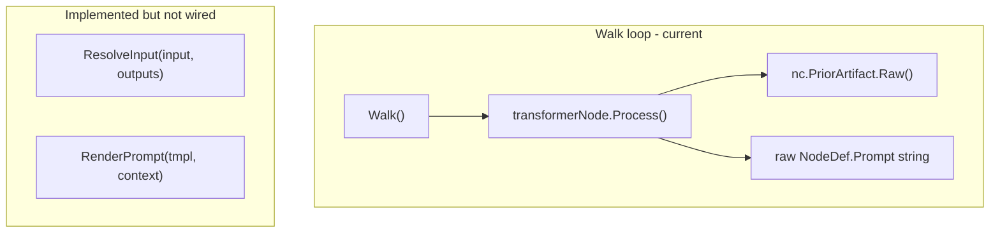
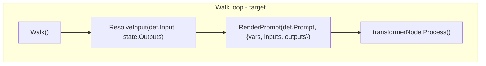

# Contract — origami-green-border-integrity

**Status:** complete  
**Goal:** `${node.output}` input resolution and prompt template rendering work end-to-end in `transformerNode.Process()`, and `origami run` has a CLI integration test.  
**Serves:** Framework Maturity (current goal)

## Contract rules

Global rules only, plus:

- **Close the gap, don't expand scope.** `ResolveInput` and `RenderPrompt` already exist and are tested in isolation (`vars.go`, `vars_test.go`). This contract wires them into the runtime path. No new features.
- **CLI integration test is mandatory.** The `origami run` and `origami validate` commands must be validated by a test that exercises a real YAML pipeline through the binary.

## Context

- `vars.go` — `ResolveInput`, `RenderPrompt`, `MergeVars`, `TemplateContext`. All tested in isolation.
- `graph.go` — Walk loop. `WalkerState.Outputs` is populated after each node. Currently `transformerNode.Process()` uses `nc.PriorArtifact.Raw()` as input instead of resolving `${node.output}` references.
- `transformer.go` — `transformerNode.Process()` passes raw `NodeDef.Prompt` string without template rendering.
- `cmd/origami/main.go` — `origami run` and `origami validate` CLI commands.
- `notes/framework-maturity-assessment.md` — Gaps #1, #2, #4.

### Current architecture

### Desired architecture

## FSC artifacts

Code only — no FSC artifacts.

## Execution strategy

Phase 1: Wire `ResolveInput` into the Walk loop so `transformerNode` receives resolved input from `WalkerState.Outputs`. Phase 2: Wire `RenderPrompt` into `transformerNode.Process()` so the prompt is rendered with `TemplateContext` (vars, inputs, outputs). Phase 3: Add a CLI integration test. Phase 4: Validate, tune, validate.

## Coverage matrix

| Layer | Applies | Rationale |
|-------|---------|-----------|
| **Unit** | yes | `transformerNode.Process` with resolved input and rendered prompt |
| **Integration** | yes | Full pipeline walk with `${node.output}` references resolving correctly |
| **Contract** | no | No new interfaces |
| **E2E** | yes | `origami run` CLI integration test with a multi-node pipeline |
| **Concurrency** | no | Walk is sequential per case |
| **Security** | no | No new trust boundaries |

## Tasks

- [ ] Wire `ResolveInput` into Walk loop: before calling `transformerNode.Process()`, resolve `NodeDef.Input` against `WalkerState.Outputs`
- [ ] Wire `RenderPrompt` into `transformerNode.Process()`: assemble `TemplateContext` from pipeline vars, resolved input, and outputs; render prompt template before passing to transformer
- [ ] Add CLI integration test: `origami run` with a multi-node YAML pipeline that uses `input:`, `prompt:`, `when:`, and `after:`
- [ ] Validate (green) — all tests pass, acceptance criteria met
- [ ] Tune (blue) — refactor for quality, no behavior changes
- [ ] Validate (green) — all tests still pass after tuning

## Acceptance criteria

**Given** a pipeline YAML with nodes declaring `input: ${recall.output}` and `prompt: prompts/triage.md`,  
**When** the pipeline is executed via `origami run` or `framework.Run()`,  
**Then**:
- `${recall.output}` resolves to the recall node's actual output artifact from `WalkerState.Outputs`
- The prompt template is rendered with `TemplateContext` containing vars, resolved input, and prior outputs
- The CLI integration test passes end-to-end
- `go build ./...` and `go test ./...` pass in Origami

## Security assessment

No trust boundaries affected. Input resolution and prompt rendering operate on framework-internal data structures.

## Notes

2026-02-18 — Contract created. Gate contract for Framework Maturity goal. Closes gaps #1, #2, #4 from the maturity assessment.
