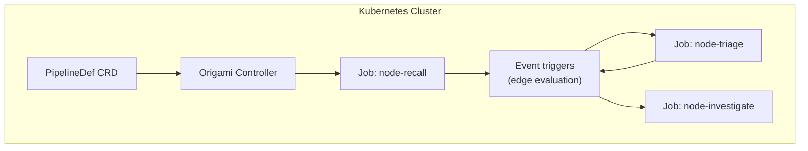

# Contract — origami-k8s-pipeline-operator

**Status:** complete  
**Goal:** Pipeline YAML runs as a Kubernetes Custom Resource Definition (CRD); nodes execute as Jobs or Pods, edges trigger as events.  
**Serves:** Framework Maturity (current goal)

## Contract rules

Global rules only, plus:

- **Architectural sketch only.** No implementation until next-milestone contracts (`origami-fan-out-fan-in`, `origami-network-dispatch`) are complete.
- **BYOI capstone.** This is the far end of the infrastructure-agnostic spectrum. The same `PipelineDef` YAML that runs in `origami run` becomes a CRD.

## Context

- `strategy/origami-vision.mdc` — Execution model trajectory: "Vision: CRD-based K8s operator."
- `origami-network-dispatch` — Prerequisite. Nodes must be callable over the network before they become Pods.
- `origami-fan-out-fan-in` — Prerequisite. Parallel execution must work before distributed parallel execution.
- `dsl.go` — `PipelineDef` as the CRD source.

### Architectural sketch



### CRD schema (draft)

```yaml
apiVersion: origami.io/v1
kind: Pipeline
metadata:
  name: rca-investigation
spec:
  vars:
    recall_hit: 0.85
  nodes:
    - name: recall
      transformer: llm
      image: myregistry/rca-agent:latest
      resources:
        limits:
          memory: 512Mi
  edges:
    - from: recall
      to: triage
      when: "output.match == true"
```

### Key design decisions (to be resolved)

1. **Artifact transport:** S3/PVC shared volume? gRPC streaming? etcd?
2. **Edge evaluation:** Controller-side (central) or sidecar (distributed)?
3. **State management:** WalkerState as ConfigMap? CRD status subresource?
4. **Failure handling:** Job retry policy? Circuit breaker per node?
5. **Observability:** Kubernetes events? OpenTelemetry? Custom metrics?

## FSC artifacts

| Artifact | Target | Compartment |
|----------|--------|-------------|
| K8s operator design document | `docs/` | domain |
| CRD schema specification | `docs/` | domain |

## Execution strategy

This contract is design-only. Implementation begins after `origami-network-dispatch` is complete. The design must answer the 5 key questions above and produce a CRD schema, controller architecture, and migration path from `origami run` to CRD.

## Coverage matrix

| Layer | Applies | Rationale |
|-------|---------|-----------|
| **Unit** | N/A | Design-only contract |
| **Integration** | N/A | Design-only contract |
| **Contract** | yes | CRD schema must be valid Kubernetes CRD YAML |
| **E2E** | N/A | Design-only contract |
| **Concurrency** | N/A | Design-only contract |
| **Security** | yes | K8s RBAC, pod security, network policies |

## Tasks

- [ ] Draft CRD schema (`Pipeline`, `PipelineRun` resources)
- [ ] Design controller architecture (reconciliation loop, Job management)
- [ ] Design artifact transport mechanism (evaluate S3, PVC, gRPC options)
- [ ] Design edge evaluation (central vs distributed)
- [ ] Design state management (ConfigMap vs status subresource)
- [ ] Write design document with trade-offs and recommendations
- [ ] Peer review of design

## Acceptance criteria

**Given** the completed design document,  
**When** reviewed against the BYOI principle and execution model trajectory,  
**Then**:
- CRD schema is valid and maps 1:1 to `PipelineDef` YAML
- Controller architecture handles node lifecycle (create, monitor, cleanup Jobs)
- Artifact transport mechanism is specified with trade-offs
- Migration path from `origami run` to CRD is documented
- No implementation code is written

## Security assessment

| OWASP | Finding | Mitigation |
|-------|---------|------------|
| A01 Access Control | Operator needs RBAC to create/delete Jobs, read CRDs. | Principle of least privilege. Namespace-scoped by default. |
| A05 Misconfiguration | CRD defaults could create privileged pods. | `securityContext` defaults: non-root, read-only FS, no capabilities. |
| A02 Cryptographic | Artifacts between pods transit over network. | Enforce TLS for artifact transport. Encrypt at rest in S3/PVC. |

## Notes

2026-02-18 — Contract created. Vision-tier for Framework Maturity goal. Architectural sketch only — no implementation until network dispatch is complete.
