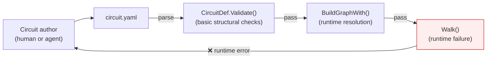
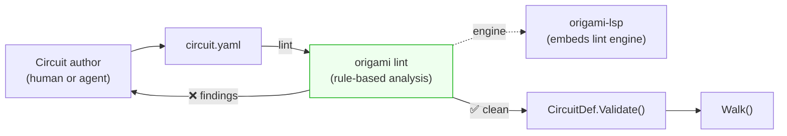

# Contract — Origami Lint

**Status:** complete
**Goal:** Ship `origami lint` — a rule-based static analyzer for circuit YAML that catches structural, semantic, and best-practice issues before runtime, and can auto-fix the most common ones.
**Serves:** Polishing & Presentation (should — accelerates agentic workflow)

## Contract rules

- The linter is a framework feature. It must not import any consumer code (Asterisk, Achilles).
- Rules are standalone units: one file per rule, each implementing a `Rule` interface. Rules can be enabled/disabled, have severity levels, and carry tags.
- The linter is the static analysis **engine** that the LSP (`origami-lsp`) will embed. Design for embedding: `lint.Run(def *CircuitDef) []Finding` must work without CLI, filesystem, or IO.
- Profiles (min → strict) provide graduated adoption. New projects start at `strict`, existing projects migrate from `min` upward.
- Auto-fix is mandatory for structural/mechanical rules (missing IDs, naming conventions). Semantic rules (reachability, element affinity mismatches) warn but do not auto-fix.
- E2E scenario YAMLs from `testdata/` and `testdata/scenarios/` are the linter's golden fixtures: valid circuits must produce zero findings. If a scenario YAML triggers a lint finding, either the rule is wrong or the YAML should be fixed.

## Context

- **Inspiration:** [`ansible-lint`](https://github.com/ansible/ansible-lint) (3.8k stars, v26+) — rule-based playbook linter with profiles, auto-fix, pre-commit integration, GitHub Action. Ansible-lint preceded `ansible-language-server` and remains the CI workhorse while the LSP handles editor-time feedback.
- **Existing validation:** `CircuitDef.Validate()` (dsl.go:115-174) covers structural basics (non-empty fields, node/edge existence, cross-references). `BuildGraphWith()` catches expression compilation and node/edge resolution errors. `run.Validate()` adds hook existence checks. None of these are rule-based, configurable, severity-aware, or produce machine-readable diagnostics with line numbers.
- **Gaps found in exploration:** No validation for `Element` values, `Merge` strategy values, `Cache.TTL` format, `Imports` resolution, `Input` reference validity, graph reachability, orphaned nodes, WalkerDef element/persona values (validated elsewhere in BuildWalkersFromDef, not in circuit validation).
- **Agentic workflow impact:** When the AI agent authors or modifies circuit YAML, `origami lint` runs as a local circuit stage — catching errors before the first walk. This shifts debugging left: instead of "walk failed because node X doesn't exist," the agent sees "line 14: edge E3 references undefined node 'invesitgate' (did you mean 'investigate'?)". The linter becomes the agent's spell-checker.
- **LSP relationship:** This contract produces the `lint/` package. The `origami-lsp` contract (vision-tier) embeds it. The linter is useful standalone (CLI, CI, pre-commit) long before the LSP ships.

### Current architecture

### Desired architecture

## FSC artifacts

| Artifact | Target | Compartment |
|----------|--------|-------------|
| Linter rule catalog reference | `docs/lint-rules.md` | domain |
| DSL best practices (derived from rules) | `notes/dsl-best-practices.md` | domain |

## Execution strategy

Phase 1 builds the linter engine (Rule interface, Runner, Finding type, profiles). Phase 2 implements structural rules. Phase 3 implements semantic rules (graph analysis). Phase 4 implements best-practice rules. Phase 5 adds auto-fix. Phase 6 wires CLI + CI integration. Each phase ends with validation against the golden fixture set.

## Coverage matrix

| Layer | Applies | Rationale |
|-------|---------|-----------|
| **Unit** | yes | Each rule tested against positive (triggers) and negative (clean) YAML fragments |
| **Integration** | yes | Full linter run against testdata scenario YAMLs — zero false positives |
| **Contract** | yes | `Rule` interface stability, `Finding` schema, profile definitions |
| **E2E** | yes | `origami lint circuit.yaml` CLI returns correct exit codes and output |
| **Concurrency** | no | Linter is single-threaded per file (stateless rules). N/A. |
| **Security** | no | Read-only file analysis, no network, no secrets. N/A. |

## Tasks

### Phase 1 — Engine (`lint/` package)

- [ ] **E1** `Rule` interface: `ID() string`, `Description() string`, `Severity() Severity`, `Tags() []string`, `Check(ctx *LintContext) []Finding`, `Fix(ctx *LintContext) []Fix` (optional)
- [ ] **E2** `Severity` enum: `error`, `warning`, `info` (maps to LSP DiagnosticSeverity)
- [ ] **E3** `Finding` struct: `RuleID`, `Severity`, `Message`, `File`, `Line`, `Column`, `Suggestion` (optional — "did you mean X?"), `FixAvailable bool`
- [ ] **E4** `Fix` struct: `Finding`, `Replacement string`, `StartLine/EndLine int`
- [ ] **E5** `LintContext`: holds `*CircuitDef`, raw YAML bytes (for line number resolution), file path, `*GraphRegistries` (optional — for deeper checks)
- [ ] **E6** `Runner`: loads rules, filters by profile/tags, executes, collects findings, sorts by severity+line
- [ ] **E7** `Profile` enum and mapping: `min` (errors only), `basic` (errors + structure), `moderate` (+ semantics), `strict` (all rules). Default: `moderate`.
- [ ] **E8** `lint.Run(def *CircuitDef, raw []byte, opts ...Option) []Finding` — embeddable entry point (no IO)
- [ ] **E9** YAML line-number resolver: map `NodeDef`/`EdgeDef` fields back to source lines via `yaml.v3` node tree

### Phase 2 — Structural rules

- [ ] **S1** `missing-node-element` — Every node should declare an `element:`. Severity: warning. Auto-fix: no (requires domain knowledge).
- [ ] **S2** `invalid-element` — `element:` value not in `{fire, water, earth, air, diamond, lightning, iron}`. Severity: error. Auto-fix: fuzzy-match suggestion.
- [ ] **S3** `invalid-merge-strategy` — `merge:` value not in `{append, latest, custom}`. Severity: error.
- [ ] **S4** `missing-edge-name` — Edges should have a `name:` for readability. Severity: info.
- [ ] **S5** `duplicate-edge-condition` — Two edges from the same node with identical `when:` expressions. Severity: warning.
- [ ] **S6** `empty-prompt` — Node has `family:` but no `prompt:` and no `transformer:`. May produce empty prompts at runtime. Severity: warning.
- [ ] **S7** `invalid-cache-ttl` — `cache.ttl:` not parseable as Go `time.Duration`. Severity: error.
- [ ] **S8** `missing-circuit-description` — `description:` is empty. Severity: info.
- [ ] **S9** `unnamed-node` — Node missing `name:` field. Severity: error. (Caught by `Validate()` but deserves a lint finding with line number.)
- [ ] **S10** `invalid-walker-element` — WalkerDef `element:` not in allowed set. Severity: error.
- [ ] **S11** `invalid-walker-persona` — WalkerDef `persona:` not in known persona set. Severity: error.

### Phase 3 — Semantic rules (graph analysis)

- [ ] **G1** `orphan-node` — Node not reachable from `start:` via any edge path. Severity: warning.
- [ ] **G2** `unreachable-done` — No edge path from `start:` reaches `_done`. Severity: error.
- [ ] **G3** `dead-edge` — Edge whose `from:` node is unreachable. Severity: warning.
- [ ] **G4** `shortcut-bypasses-required` — Shortcut edge skips a node that has `schema:` (implying required validation). Severity: warning.
- [ ] **G5** `zone-element-mismatch` — Zone declares `element: X` but contains a node with `element: Y`. Severity: info.
- [ ] **G6** `expression-compile-error` — `when:` expression doesn't compile via expr-lang. Severity: error.
- [ ] **G7** `fan-in-without-merge` — Multiple edges converge on a node but no `merge:` strategy declared. Severity: warning.

### Phase 4 — Best-practice rules

- [ ] **B1** `prefer-when-over-condition` — Edge uses deprecated `condition:` instead of `when:`. Severity: warning. Auto-fix: rename field.
- [ ] **B2** `name-your-edges` — Circuit has >3 edges without `name:`. Severity: info.
- [ ] **B3** `terminal-edge-to-done` — Last edge in a chain should go to `_done`, not leave the graph open. Severity: warning.
- [ ] **B4** `zone-stickiness-without-provider` — Zone declares `stickiness: >0` but no nodes in the zone have `provider:`. Severity: info.
- [ ] **B5** `large-circuit-no-zones` — Circuit has >6 nodes but no `zones:` defined. Severity: info.
- [ ] **B6** `element-affinity-chain` — Three consecutive nodes with incompatible elements (e.g., fire→fire→fire with no water/earth break). Severity: info.

### Phase 5 — Auto-fix

- [ ] **F1** `Fix()` implementation for `invalid-element` — fuzzy match via Levenshtein distance
- [ ] **F2** `Fix()` implementation for `prefer-when-over-condition` — rename `condition:` → `when:`
- [ ] **F3** `Fix()` implementation for `missing-edge-name` — generate name from `from → to`
- [ ] **F4** `Fix()` implementation for `missing-circuit-description` — insert `description: ""` placeholder
- [ ] **F5** `origami lint --fix` mode: apply all available fixes, re-validate, report remaining findings

### Phase 6 — CLI + CI integration

- [ ] **I1** `origami lint <file.yaml>` command: load, lint, print findings, exit code (0=clean, 1=warnings, 2=errors)
- [ ] **I2** `origami lint --profile <name>` flag
- [ ] **I3** `origami lint --format json` for machine-readable output (CI integration)
- [ ] **I4** `origami lint --fix` applies auto-fixes and prints diff
- [ ] **I5** `.origami-lint` config file: profile, rule enable/disable, per-rule severity override
- [ ] **I6** Pre-commit hook support (`.pre-commit-hooks.yaml` in Origami repo)
- [ ] **I7** Add `origami lint` as a stage in agent-operations local circuit (after Build, before Unit test)
- [ ] Validate (green) — all tests pass, all testdata YAMLs lint clean, CLI returns correct codes.
- [ ] Tune (blue) — message clarity, suggestion quality, output formatting.
- [ ] Validate (green) — all tests still pass after tuning.

## Acceptance criteria

**Given** a circuit YAML with `element: fyre` on a node,
**When** `origami lint circuit.yaml` runs,
**Then** finding: `error: S2/invalid-element at line 12: unknown element "fyre" (valid: fire, water, earth, air, diamond, lightning, iron). Did you mean "fire"?`

**Given** a circuit with a node not reachable from `start:`,
**When** `origami lint circuit.yaml` runs,
**Then** finding: `warning: G1/orphan-node at line 23: node "unused_step" is not reachable from start node "recall".`

**Given** a circuit with edges using `condition:` instead of `when:`,
**When** `origami lint --fix circuit.yaml` runs,
**Then** `condition:` fields are renamed to `when:` in-place, and the output shows the diff.

**Given** any YAML in `testdata/scenarios/` or `testdata/*.yaml`,
**When** `origami lint` runs with `--profile strict`,
**Then** zero findings are reported. (Golden fixture invariant.)

**Given** `origami lint --format json circuit.yaml`,
**When** findings exist,
**Then** output is a JSON array of `Finding` structs, parseable by CI tools and the future LSP.

## Security assessment

No trust boundaries affected. The linter performs read-only static analysis on local YAML files. No network, no secrets, no user input beyond file paths.

## Notes

2026-02-26 17:45 — Contract created. Inspired by [ansible-lint](https://github.com/ansible/ansible-lint) rule architecture: standalone rules, profiles (min→strict), auto-fix, CI-first design. Positioned as the engine the LSP will embed — ansible-lint preceded ansible-language-server by years and remains the CI workhorse. Agentic workflow impact: shifts errors left from "walk failed at runtime" to "lint caught it before the first walk." The SupervisorTracker race post-mortem reinforced this: if the agent's tools catch structural errors early, fewer runtime surprises propagate into production.
