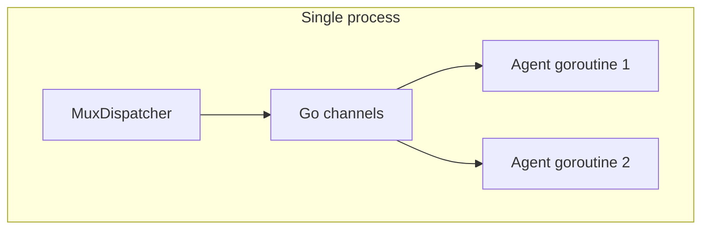
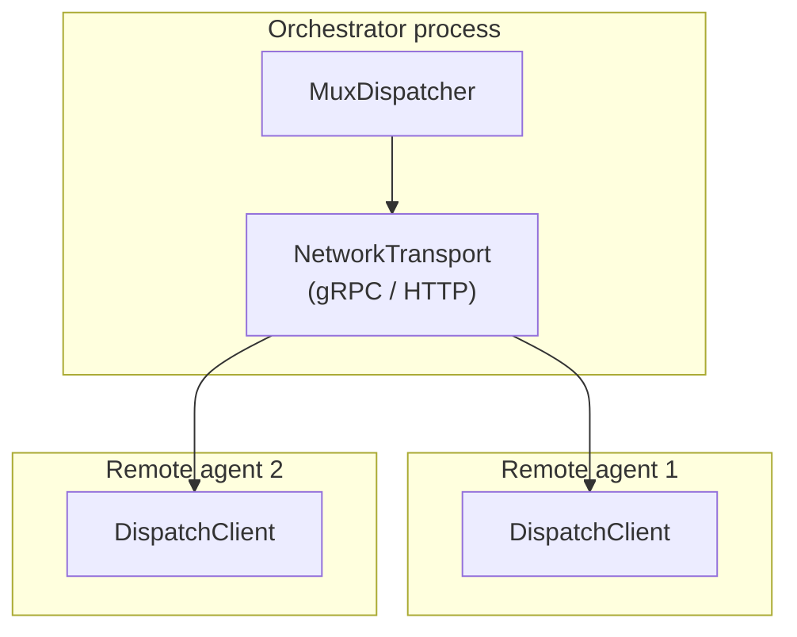

# Contract — origami-network-dispatch

**Status:** complete  
**Goal:** MuxDispatcher works over gRPC or HTTP, enabling nodes to be processed by remote agents while preserving the same `GetNextStep` / `SubmitArtifact` protocol.  
**Serves:** Framework Maturity (current goal)

## Contract rules

Global rules only, plus:

- **Backward compatible.** In-process channel-based MuxDispatcher is the default. Network transport is opt-in.
- **Same protocol.** Remote agents use the same `GetNextStep` / `SubmitArtifact` contract. The transport changes, not the protocol.
- **BYOI principle.** The framework provides the network transport. The consumer decides whether agents are local goroutines, CLI processes, or remote services.

## Context

- `strategy/origami-vision.mdc` — Execution model trajectory: "Then: nodes as network services."
- `dispatch/mux.go` — `MuxDispatcher` with `GetNextStep(agentID)`, `SubmitArtifact(agentID, artifact)`, pull-based model.
- `internal/mcp/` (Asterisk) — MCP server that wraps MuxDispatcher for Cursor subagents. Proves the protocol works across process boundaries.
- `notes/mux-dispatcher-architecture.md` — Current vs desired state architecture.

### Current architecture

### Desired architecture

## FSC artifacts

| Artifact | Target | Compartment |
|----------|--------|-------------|
| Network dispatch design reference | `docs/` | domain |
| Dispatch protocol specification | `docs/` | domain |

## Execution strategy

Phase 1: Define `NetworkDispatcher` interface wrapping MuxDispatcher over gRPC or HTTP. Phase 2: Implement `GetNextStep` and `SubmitArtifact` as network RPCs. Phase 3: Implement `DispatchClient` for remote agents. Phase 4: Backward compatibility — in-process channel is default, network is opt-in. Phase 5: Validate with integration tests.

## Coverage matrix

| Layer | Applies | Rationale |
|-------|---------|-----------|
| **Unit** | yes | Network serialization, protocol compliance |
| **Integration** | yes | Orchestrator + remote agent over localhost gRPC/HTTP |
| **Contract** | yes | `GetNextStep` / `SubmitArtifact` protocol preserved over network |
| **E2E** | no | Full distributed deployment is out of scope |
| **Concurrency** | yes | Multiple remote agents pulling concurrently |
| **Security** | yes | Network transport introduces authentication and encryption requirements |

## Tasks

- [x] Define `NetworkTransport` interface: `Serve(addr)`, `Dial(addr)` for server/client
- [x] Implement gRPC transport: proto definition for `GetNextStep` / `SubmitArtifact` RPCs
- [x] Implement HTTP transport: REST endpoints for the same protocol (alternative to gRPC)
- [x] Implement `DispatchClient` that wraps transport for remote agents
- [x] Wire `NetworkDispatcher` into MuxDispatcher as optional transport layer
- [x] Backward compatibility: default to in-process channels; opt-in to network via config
- [x] Integration test: orchestrator + 2 remote agents over localhost
- [x] Validate (green) — all tests pass with `-race`
- [x] Tune (blue) — refactor for quality
- [x] Validate (green) — all tests still pass after tuning

## Acceptance criteria

**Given** a MuxDispatcher configured with network transport,  
**When** remote agents call `GetNextStep` and `SubmitArtifact` over gRPC/HTTP,  
**Then**:
- The protocol is identical to in-process channel dispatch
- Remote agents can pull work and submit artifacts
- In-process channel mode still works unchanged (default)
- Multiple remote agents work concurrently without data races
- `go test -race ./...` passes

## Security assessment

| OWASP | Finding | Mitigation |
|-------|---------|------------|
| A02 Cryptographic Failures | Network transport sends artifacts over the wire. | TLS by default for gRPC/HTTP. Reject plaintext in production mode. |
| A07 Authentication | Remote agents need authentication to pull work. | `StaticTokenAuth` (from PoC batteries) as minimum. mTLS for production. |
| A10 SSRF | Orchestrator connects to agent addresses. | Allowlist of agent addresses. No user-controlled URLs. |

## Notes

2026-02-18 — Contract created. Next-milestone for Framework Maturity goal. Second step in the execution model trajectory. Builds on Asterisk's proven MCP-over-process-boundary pattern.
