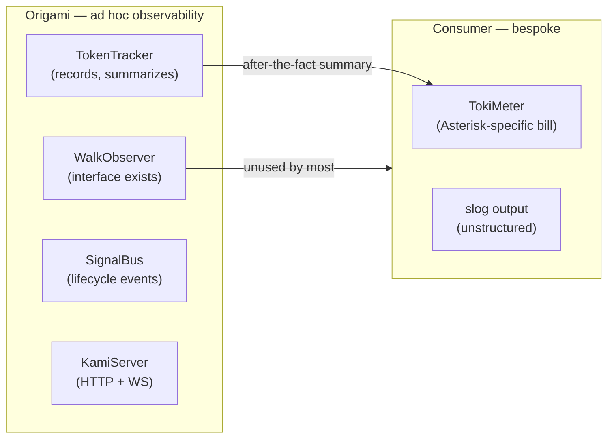
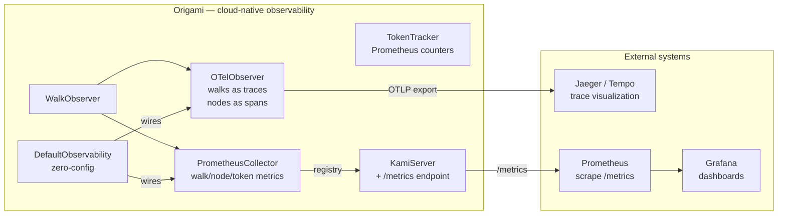

# Contract — Origami Observability

**Status:** complete  
**Goal:** Day-0 cloud-native observability for Origami circuits — every walk is an OpenTelemetry trace, every node is metered via Prometheus, zero config required by default.  
**Serves:** System Refinement (should)

## Contract rules

- OTel is the abstraction layer; Prometheus is one export target. Instrument with OTel, get Prometheus/Jaeger/Datadog/etc. for free.
- `WalkObserver` (already exists) is the primary hook point. OTel and Prometheus adapters implement it.
- Three-layer slog pattern: primitives (`WalkObserver`) → defaults (`DefaultObservability()`) → consumer override.
- Dependencies: `prometheus/client_golang`, `go.opentelemetry.io/otel`. Both are CNCF graduated projects — stable, widely adopted, acceptable risk.
- Breaking change: `TokenTracker.Record()` gains labels (circuit, step, direction) for Prometheus counter emission. `WalkObserver` may gain additional hooks for dispatch-level spans.
- All metrics follow Prometheus naming conventions: `origami_` prefix, snake_case, unit suffix (`_seconds`, `_total`, `_bytes`).

## Context

Circuit walks map perfectly onto the cloud-native observability stack:
- A walk IS a distributed trace (root span = walk, child spans = node visits)
- A node visit IS a metric event (duration histogram, token counter)
- A dispatch IS a child span (provider, model, tokens, cost)
- The SignalBus already emits lifecycle events — these become span events

Origami already has the hook points:
- `WalkObserver` interface — fires on node entry/exit, edge transition
- `TokenTracker` interface — records per-step token usage
- `SignalBus` — circuit lifecycle events
- `KamiServer` — already an HTTP server, natural home for `/metrics`

### Cross-references

- `principled-calibration-scorecard` — token/cost metrics become both ScoreCard `MetricDef`s AND Prometheus counters. The 3 TokiMeter-derived universal metrics (`token_usage`, `token_cost_usd`, `latency_seconds`) bridge calibration and live monitoring.
- `consumer-cli-scaffold` — `WithObservability()` builder method on `CLIBuilder`.
- `kami-live-debugger` (completed) — KamiServer hosts `/metrics` endpoint.
- `case-study-cloud-native-circuit-tools` (draft) — broader cloud-native tool analysis. This contract is the Origami-internal implementation.

### Current architecture

### Desired architecture

## Prometheus metrics (proposed)

| Metric | Type | Labels | Source |
|--------|------|--------|--------|
| `origami_walk_node_duration_seconds` | histogram | circuit, node, element | WalkObserver |
| `origami_walk_edge_transitions_total` | counter | circuit, from, to | WalkObserver |
| `origami_walk_loops_total` | counter | circuit, node | WalkObserver |
| `origami_walk_active` | gauge | circuit | WalkObserver |
| `origami_walk_completed_total` | counter | circuit, status | WalkObserver |
| `origami_tokens_total` | counter | circuit, step, direction | TokenTracker |
| `origami_tokens_cost_usd` | counter | circuit, step | TokenTracker |
| `origami_dispatch_duration_seconds` | histogram | provider, step | dispatch wrapper |
| `origami_dispatch_errors_total` | counter | provider, step | dispatch wrapper |

## OTel trace structure (proposed)

- **Root span:** `circuit.walk` — attributes: circuit name, walker element, persona, team ID
- **Child span:** `node.visit` — attributes: node name, node family, artifacts produced, duration
  - **Child span:** `dispatch` — attributes: provider, model, prompt tokens, artifact tokens, cost USD
- **Span event:** `edge.transition` — attributes: from, to, expression, result
- **Span event:** `loop.detected` — attributes: node, loop count, max allowed
- **Span link:** `team.walker` — cross-walker reference for TeamWalk coordination

## FSC artifacts

| Artifact | Target | Compartment |
|----------|--------|-------------|
| Observability integration guide | `docs/observability.md` | domain |
| Grafana dashboard JSON | `docs/grafana-dashboard.json` | domain |

## Execution strategy

Phase 1 implements OTel trace emission via WalkObserver. Phase 2 implements Prometheus metrics collection. Phase 3 exposes `/metrics` on KamiServer. Phase 4 provides `DefaultObservability()` zero-config wiring. Phase 5 redesigns TokenTracker to emit Prometheus-compatible labeled counters. Phase 6 adds `WithObservability()` to the CLI scaffold builder. Phase 7 validates and tunes.

Phases 1-4 are Origami core. Phase 5 touches `dispatch/token.go`. Phase 6 depends on `consumer-cli-scaffold`. Phase 7 is validation.

## Coverage matrix

| Layer | Applies | Rationale |
|-------|---------|-----------|
| **Unit** | yes | OTelObserver span creation, PrometheusCollector metric emission, DefaultObservability wiring |
| **Integration** | yes | Walk circuit, verify traces exported to in-memory exporter, verify metrics scraped from `/metrics` |
| **Contract** | yes | WalkObserver interface additions, TokenTracker label changes, metric names |
| **E2E** | yes | `origami run circuit.yaml` produces OTel traces and Prometheus metrics without configuration |
| **Concurrency** | yes | PrometheusCollector must be thread-safe across parallel walkers |
| **Security** | no | No trust boundaries — metrics are read-only observation |

## Tasks

### Phase 1 — OTel Trace Emission

- [ ] **O1** Create `observability/otel.go`: `OTelObserver` struct implementing `WalkObserver`
- [ ] **O2** On walk start: create root span `circuit.walk` with circuit name, element, persona attributes
- [ ] **O3** On node entry: create child span `node.visit` with node name, family attributes
- [ ] **O4** On node exit: end span with artifacts-produced count, duration
- [ ] **O5** On edge transition: add span event `edge.transition` with from/to/expression/result
- [ ] **O6** On dispatch: create child span under node span with provider/model/tokens/cost
- [ ] **O7** On walk complete: end root span with status (success/error)
- [ ] **O8** Unit tests: walk a 3-node circuit, verify span tree structure via in-memory exporter

### Phase 2 — Prometheus Metrics

- [ ] **P1** Create `observability/prometheus.go`: `PrometheusCollector` struct implementing `WalkObserver`
- [ ] **P2** Register all 9 metrics from the table above with `prometheus.NewHistogramVec`/`CounterVec`/`GaugeVec`
- [ ] **P3** On node entry/exit: observe `origami_walk_node_duration_seconds`
- [ ] **P4** On edge transition: increment `origami_walk_edge_transitions_total`
- [ ] **P5** On walk start/complete: increment gauge/counter
- [ ] **P6** Unit tests: walk a circuit, scrape metrics, verify values

### Phase 3 — KamiServer `/metrics` Endpoint

- [ ] **K1** Add `/metrics` HTTP handler to `KamiServer` using `promhttp.Handler()`
- [ ] **K2** Wire `PrometheusCollector`'s registry into the handler
- [ ] **K3** Integration test: start KamiServer, walk circuit, GET `/metrics`, verify metric lines

### Phase 4 — DefaultObservability

- [ ] **D1** Create `observability/defaults.go`: `DefaultObservability() []WalkObserver`
- [ ] **D2** Zero-config: creates `OTelObserver` (OTLP exporter if `OTEL_EXPORTER_OTLP_ENDPOINT` is set, noop otherwise) + `PrometheusCollector` (default registry)
- [ ] **D3** `Run()` and `Runner` accept `WithObservability(observers...)` option to inject observers into the walk loop
- [ ] **D4** Unit test: `DefaultObservability()` returns 2 observers, both implement `WalkObserver`

### Phase 5 — TokenTracker Prometheus Integration

- [ ] **T1** Add circuit/step/direction labels to `TokenRecord` (already has `CaseID` and `Step`)
- [ ] **T2** `InMemoryTokenTracker.Record()` increments `origami_tokens_total` and `origami_tokens_cost_usd` Prometheus counters
- [ ] **T3** Ensure thread-safety: counters are atomic via Prometheus client library
- [ ] **T4** Unit test: record tokens, verify Prometheus counter values match

### Phase 6 — CLI Scaffold Integration

- [ ] **S1** Add `WithObservability(observers ...WalkObserver)` to `CLIBuilder`
- [ ] **S2** Default: if not called, uses `DefaultObservability()`
- [ ] **S3** `serve` command: KamiServer auto-exposes `/metrics` when observability is enabled
- [ ] **S4** Unit test: CLI built with default observability exposes `/metrics`

### Phase 7 — Validate and Tune

- [ ] Validate (green) — `go build ./...`, `go test ./...`. Walk produces traces and metrics.
- [ ] Tune (blue) — metric cardinality review (avoid high-cardinality labels), trace sampling configuration, Grafana dashboard template.
- [ ] Validate (green) — all tests still pass after tuning.

## Acceptance criteria

**Given** a circuit walked with `DefaultObservability()`,  
**When** `OTEL_EXPORTER_OTLP_ENDPOINT=http://localhost:4317` is set,  
**Then** OTel traces are exported to the collector with root span `circuit.walk` and child spans for each node.

**Given** a KamiServer started with observability enabled,  
**When** `GET /metrics` is called,  
**Then** the response contains `origami_walk_node_duration_seconds`, `origami_tokens_total`, and all other registered metrics.

**Given** a circuit walked without any observability configuration,  
**When** the walk completes,  
**Then** `DefaultObservability()` is used automatically — Prometheus metrics are collected (no OTel export unless env var is set).

**Given** a consumer calling `origami.NewCLI("tool", "...").WithObservability(custom...).Build()`,  
**When** the consumer provides custom observers,  
**Then** the default observers are replaced, not appended.

## Security assessment

| OWASP | Finding | Mitigation |
|-------|---------|------------|
| A01 | `/metrics` endpoint exposes circuit internals (node names, token counts) | Bind to localhost by default. Production deployment guides recommend firewall or auth proxy. |
| A05 | OTel traces may contain artifact content in attributes | Only metadata (names, counts, durations) goes into spans. No artifact content in trace attributes. |

## Notes

2026-02-26 — Contract created. Motivated by the insight that circuit walks ARE distributed traces and node visits ARE metric events. The cloud-native observability stack (OTel + Prometheus + Grafana + Jaeger) maps perfectly onto Origami's existing `WalkObserver` and `TokenTracker` interfaces. Placed in Sprint R1 because the TokiMeter migration (in `principled-calibration-scorecard`) must design TokenTracker counters Prometheus-friendly from the start — retrofitting later would mean a second breaking change.

2026-02-27 — **Complete.** R6 sprint closed all remaining gaps: (1) `origami_tokens_total` + `origami_tokens_cost_usd` Prometheus counters bridged via `InMemoryTokenTracker.OnRecord` hook; (2) `origami_dispatch_duration_seconds` histogram + `origami_dispatch_errors_total` counter bridged via `TokenTrackingDispatcher.OnDispatch` hook; (3) `WithObservability()` on CLI scaffold with auto-default `DefaultObservability()` and `MetricsHandler()` accessor for KamiServer; (4) full 9-metric integration test. All 3 repos pass `go test -race`.
