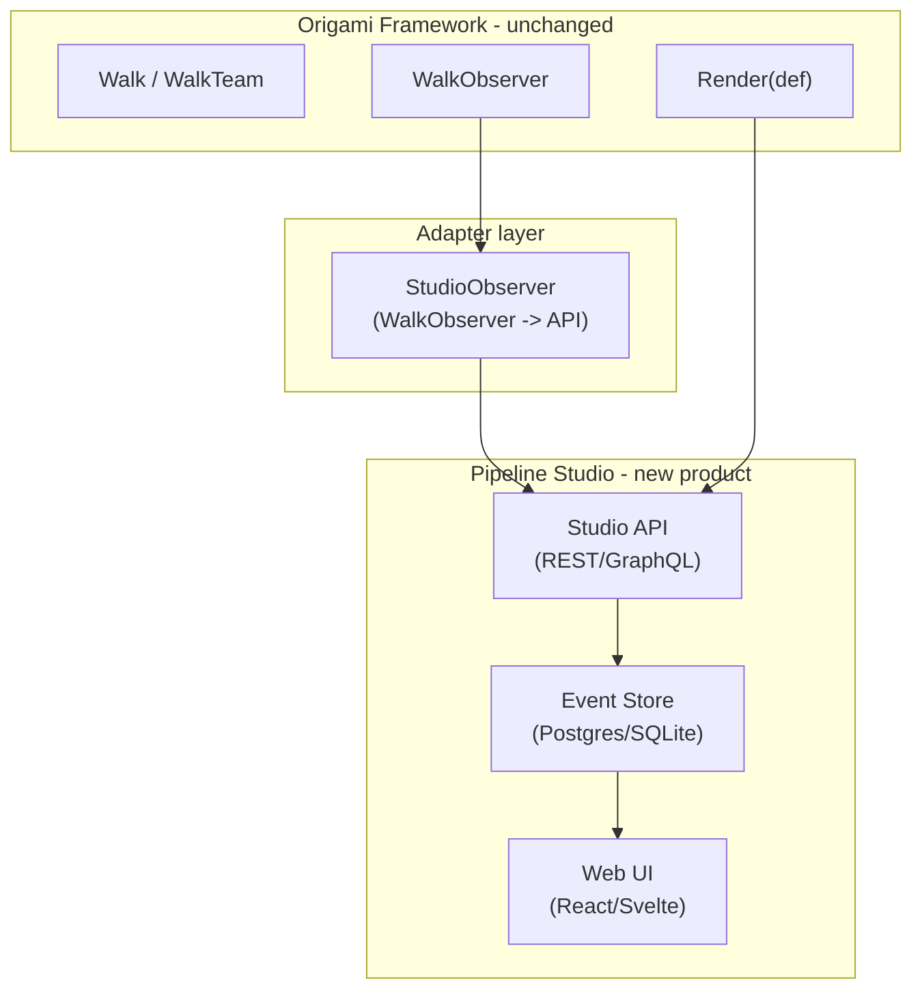

# Contract — origami-pipeline-studio

**Status:** complete  
**Goal:** Separate web product for pipeline visualization, run history, and artifact inspection — like Ansible Tower/AWX for the Origami ecosystem.  
**Serves:** Framework Maturity (current goal)

## Contract rules

Global rules only, plus:

- **Architectural sketch only.** No implementation in this contract. The goal is to define the product boundary, API contract, and data model.
- **Separate product.** Pipeline Studio is NOT part of the Origami framework. It consumes Origami's structured output (`WalkObserver` events, `Artifact` data, Mermaid diagrams). The framework has no dependency on the Studio.
- **Red border respected.** "No web UI" remains true for the framework itself. This is a separate product built on the framework's output.

## Context

- `strategy/origami-vision.mdc` — Product topology: "Future UI product — pipeline definitions, run history, artifact inspection, visualization."
- `walker.go` — `WalkObserver` interface with `OnEvent(WalkEvent)`.
- `observer.go` — `LogObserver`, `TraceCollector` — existing structured output consumers.
- `render.go` — `Render(def)` produces Mermaid flowcharts.
- Ansible Tower/AWX — Architectural inspiration.

### Product scope

| Feature | Data source |
|---|---|
| Pipeline visualization (live Mermaid) | `Render(PipelineDef)`, real-time `WalkEvent` updates |
| Run history timeline | `WalkObserver.OnEvent` stream (persisted) |
| Artifact inspection | `Artifact` data from completed nodes |
| Node detail view | `WalkEvent` metadata (timing, confidence, element) |
| Multi-pipeline dashboard | Multiple `PipelineDef` sources |
| Team walk visualization | `WalkEvent` with walker identity |

### Architecture sketch

### Key design decisions (to be resolved)

1. **Event transport:** HTTP push? WebSocket? gRPC stream? File-based for PoC?
2. **Event store:** Postgres for production? SQLite for PoC? EventStore for event sourcing?
3. **UI framework:** React? Svelte? Plain HTML + HTMX for simplicity?
4. **Mermaid rendering:** Server-side (mermaid-cli) or client-side (mermaid.js)?
5. **Authentication:** Leverage BYOA pattern? Separate auth for Studio?
6. **Multi-tenancy:** Single-user PoC first? Multi-tenant from day one?

## FSC artifacts

| Artifact | Target | Compartment |
|----------|--------|-------------|
| Pipeline Studio product spec | `docs/` | domain |
| StudioObserver adapter design | `docs/` | domain |

## Execution strategy

Design-only. Define the product boundary, API contract, data model, and technology choices. No implementation until the framework's green border is complete and at least one next-milestone contract (fan-out or network dispatch) ships.

## Coverage matrix

| Layer | Applies | Rationale |
|-------|---------|-----------|
| **Unit** | N/A | Design-only contract |
| **Integration** | N/A | Design-only contract |
| **Contract** | yes | API contract between framework and Studio (WalkObserver -> Studio API) |
| **E2E** | N/A | Design-only contract |
| **Concurrency** | N/A | Design-only contract |
| **Security** | yes | Web application security (authentication, authorization, XSS, CSRF) |

## Tasks

- [ ] Define `StudioObserver` adapter: `WalkObserver` implementation that sends events to Studio API
- [ ] Define Studio API contract (REST or GraphQL schema)
- [ ] Design event store schema (runs, events, artifacts)
- [ ] Design UI wireframes (pipeline view, run timeline, artifact inspector)
- [ ] Evaluate technology choices (UI framework, event store, transport)
- [ ] Write product spec with scope, non-goals, and MVP definition
- [ ] Peer review of design

## Acceptance criteria

**Given** the completed product spec,  
**When** reviewed against the product topology in `strategy/origami-vision.mdc`,  
**Then**:
- Product boundary is clear: Studio depends on Origami, not the reverse
- API contract is specified (WalkObserver events as input)
- Event store schema supports run history, artifact inspection, and timeline queries
- UI wireframes cover pipeline visualization, run history, and artifact inspection
- Technology choices are justified with trade-offs
- No implementation code is written
- No changes to the Origami framework are required

## Security assessment

| OWASP | Finding | Mitigation |
|-------|---------|------------|
| A01 Access Control | Web UI needs authentication and authorization. | BYOA pattern for framework adapter. Standard web auth (session/JWT) for Studio UI. |
| A03 Injection | Artifact data displayed in UI could contain malicious content. | Sanitize all artifact display. CSP headers. No `innerHTML`. |
| A05 Misconfiguration | Default deployment could expose Studio without auth. | Require authentication by default. No anonymous access. |
| A07 Authentication | Session management for web UI. | Standard session handling. CSRF tokens. Secure cookies. |

## Notes

2026-02-18 — Contract created. Vision-tier for Framework Maturity goal. Architectural sketch only — the framework ships structured output today (`WalkObserver`, Mermaid, `Artifact`). Studio is a separate consumer product.
