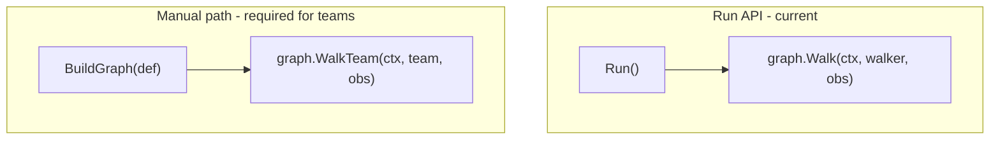
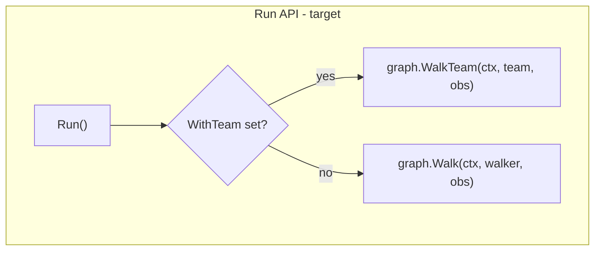

# Contract — origami-walkteam-run-api

**Status:** complete  
**Goal:** `Run()` supports multi-walker team execution via `WithTeam(team)` RunOption, so consumers don't need to build graphs manually for team walks.  
**Serves:** Framework Maturity (current goal)

## Contract rules

Global rules only, plus:

- **Additive only.** `Run()` without `WithTeam()` continues to use single-walker `Walk`. `WithTeam()` is opt-in.
- **Reuse existing primitives.** `graph.WalkTeam`, `Team`, `Scheduler` already exist. This contract wires them into the `Run()` API.

## Context

- `run.go` — `Run()` and `Validate()` Go API with `RunOption` pattern.
- `graph.go` — `WalkTeam(ctx, team, observer) error` method on `DefaultGraph`.
- `walker.go` — `Team` type, `Scheduler` interface, `SingleScheduler`, `AffinityScheduler`.
- `notes/framework-maturity-assessment.md` — Gap #5: WalkTeam not accessible via Run API.

### Current architecture

### Desired architecture

## FSC artifacts

Code only — no FSC artifacts.

## Execution strategy

Phase 1: Add `WithTeam(*Team) RunOption`. Phase 2: Update `Run()` to dispatch to `graph.WalkTeam` when team is set. Phase 3: Tests. Phase 4: Validate, tune, validate.

## Coverage matrix

| Layer | Applies | Rationale |
|-------|---------|-----------|
| **Unit** | yes | `Run()` with `WithTeam()` dispatches to `WalkTeam` |
| **Integration** | yes | Full pipeline walk with team of 2 walkers |
| **Contract** | yes | `WithTeam` RunOption accepted; `Run` API backward compatible |
| **E2E** | no | Achilles doesn't use teams yet |
| **Concurrency** | yes | Team walk involves multiple walkers — verify with `-race` |
| **Security** | no | No trust boundaries affected |

## Tasks

- [x] Add `WithTeam(*Team) RunOption` to `run.go`
- [x] Update `Run()`: if team is set, call `graph.WalkTeam(ctx, team, obs)` instead of `graph.Walk(ctx, walker, obs)`
- [x] Unit test: `Run()` with `WithTeam()` uses WalkTeam
- [x] Integration test: 2-walker team walk via `Run()` with AffinityScheduler
- [x] Verify backward compatibility: `Run()` without `WithTeam()` still uses single-walker Walk
- [x] Validate (green) — all tests pass with `-race`
- [x] Tune (blue) — refactor for quality
- [x] Validate (green) — all tests still pass after tuning

## Acceptance criteria

**Given** the `Run()` API,  
**When** called with `WithTeam(team)` where team has 2+ walkers and a scheduler,  
**Then**:
- `Run()` dispatches to `graph.WalkTeam`
- All walkers participate per the scheduler's decisions
- Existing `Run()` calls without `WithTeam()` are unaffected
- Tests pass with `-race` flag
- `go build ./...` and `go test ./...` pass in Origami

## Security assessment

No trust boundaries affected. Team walk uses the same graph and node processing as single-walker walk.

## Notes

2026-02-18 — Contract created. Quick-win for Framework Maturity goal. Closes gap #5 from the maturity assessment.
