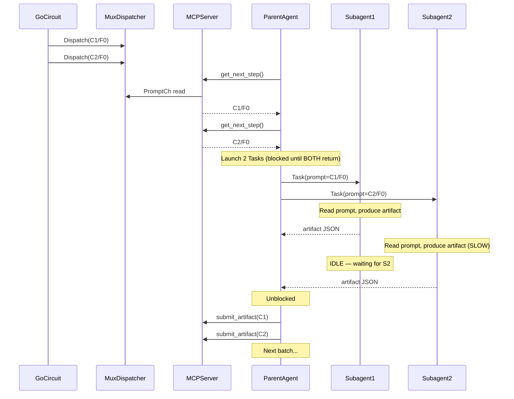
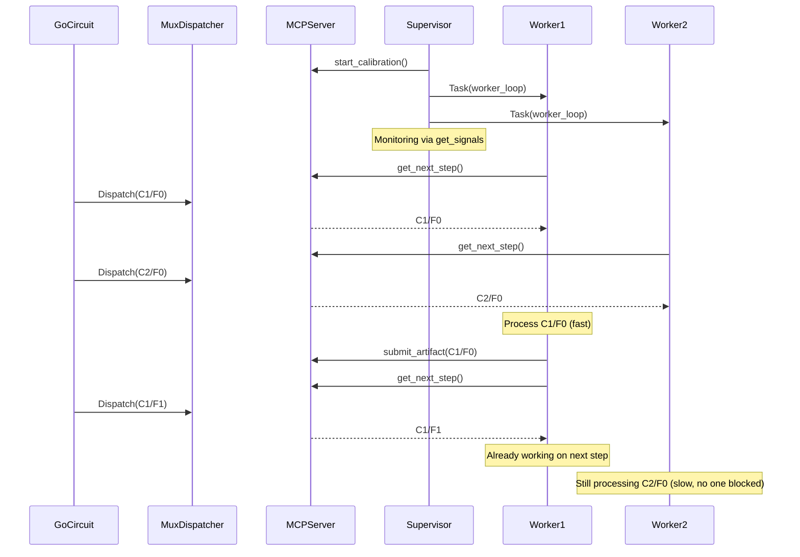
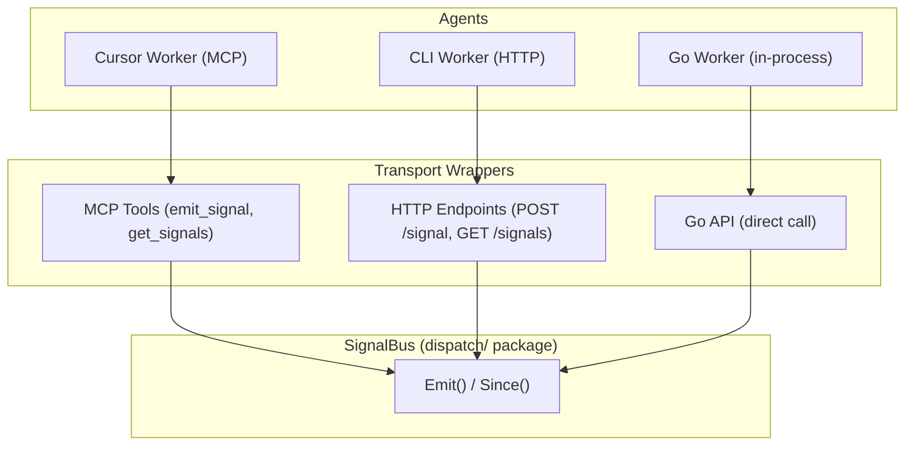

# Contract — papercup-protocol-maturity

**Status:** complete  
**Goal:** Evolve the Papercup agent-bus protocol from orchestration (parent-as-switchboard) to choreography (subagents-as-independent-workers), eliminating the batch barrier and queue starvation problems, and decouple the signal bus from MCP so any transport (CLI, HTTP, MCP) gets full bus power.  
**Serves:** Framework Maturity

## Contract rules

- The `ExternalDispatcher` interface remains backward-compatible. Existing consumers calling `GetNextStep`/`SubmitArtifact` must work unchanged.
- The `MuxDispatcher` channel semantics (single shared `promptCh`) must not change. Hint-based matching layers on top via a new method, not by replacing `GetNextStep`.
- The `SignalBus` must have zero MCP imports after decoupling. MCP tools become thin wrappers.
- Every phase is independently shippable and testable. Later phases layer on earlier ones.
- Skill scaffold (`origami skill scaffold`) must generate the v2 worker-loop pattern after Phase 1.

## Context

- `rules/domain/agent-bus.mdc` — current Papercup v1 protocol. Assigns `get_next_step` and `submit_artifact` exclusively to the main agent (line 16).
- `dispatch/mux.go` — `MuxDispatcher` with `PromptCh()`, per-dispatch routing via `DispatchID`, concurrent `GetNextStep` callers tracked by `session.go:peakPullers`.
- `dispatch/dispatch.go` — `ExternalDispatcher` interface (`GetNextStep`, `SubmitArtifact`), `DispatchContext` with `Provider` field.
- `dispatch/network.go` — `NetworkServer`/`NetworkClient` implementing `ExternalDispatcher` over HTTP. Has `GET /next` and `POST /submit` but no signal endpoints.
- `dispatch/cli.go` — `CLIDispatcher` implementing `Dispatcher` (fire-and-forget), not `ExternalDispatcher`. Cannot participate in worker loops or signal bus.
- `mcp/signal.go` — `SignalBus` (thread-safe append-only log). Zero MCP dependencies internally, but exposed only via MCP tool calls.
- `cmd/origami/cmd_skill.go` — skill scaffold template. Currently generates orchestration (parent-pulls) pattern.
- `contracts/completed/framework/agent-adapter-overloading.md` — color-coded subagent identity, stickiness gradient (0-3), zone system (Backcourt/Frontcourt/Paint), position system (PG/SG/PF/C).
- `contracts/completed/multi-subagent/adaptive-subagent-scheduler.md` — quality-driven batch sizing, cluster-aware routing, budget enforcement.
- Asterisk `skills/asterisk-calibrate/SKILL.md` — current v1 skill implementing batch-pull orchestration pattern.
- Asterisk `internal/mcp/session.go` — `PullerEnter`/`PullerExit`, `peakPullers`, `CheckCapacityGate`. Infrastructure already validates concurrent worker pattern.

### Current architecture

Papercup v1 — Orchestration. Parent is the exclusive switchboard for `get_next_step` and `submit_artifact`. Subagents return artifacts via Task tool return value. Batch barrier: all N subagents must complete before next batch starts.



Signal bus is MCP-only. `CLIDispatcher` and `NetworkClient` have no signal access.

| Capability | MuxDispatcher | NetworkClient | CLIDispatcher |
|---|---|---|---|
| Pull steps (`GetNextStep`) | Yes | Yes | No (wrong interface) |
| Submit artifacts | Yes | Yes | No (stdout return) |
| Signal bus | Yes (MCP tools) | No | No |
| Worker loop capable | Yes | Yes | No |
| Capacity gate | Yes | No | No |

### Desired architecture

Papercup v2 — Choreography. Workers own the full loop. Parent is supervisor. Signal bus is transport-agnostic.



Transport-agnostic bus:



## FSC artifacts

| Artifact | Target | Compartment |
|----------|--------|-------------|
| Papercup protocol v2 specification | `rules/domain/agent-bus.mdc` | domain |
| Papercup, Choreography, Competing Consumers glossary terms | `glossary/glossary.mdc` | domain |
| Updated skill scaffold template | `cmd/origami/cmd_skill.go` | code |

## Execution strategy

Five phases. Each is independently shippable. Phase 1 is the critical path (eliminates batch barrier). Phase 5 (transport decoupling) can run in parallel with Phases 2-4.

### Phase 1 — Choreography Migration (gate)

Subagents own the full `get_next_step → process → submit_artifact` loop. Parent becomes supervisor.

**Protocol change** in `agent-bus.mdc`:

| Responsibility | v1 Owner | v2 Owner |
|---|---|---|
| `start_calibration`, `get_report` | Main agent | Main agent (supervisor) |
| `get_next_step`, `submit_artifact` | Main agent | Worker subagent |
| Read prompt, generate artifact | Subagent | Worker subagent |
| `emit_signal` (dispatch) | Main agent | N/A (worker self-dispatches) |
| `emit_signal` (start, done, error) | Subagent | Worker subagent |
| `emit_signal` (worker_started, worker_stopped) | N/A | Worker subagent (new) |
| Monitor health, replace failed workers | N/A | Main agent (supervisor) |

**Worker loop pseudocode:**

```
emit_signal(session_id, "worker_started", "worker", meta={worker_id})
while true:
    response = get_next_step(session_id, timeout_ms: 30000)
    if response.done: break
    if not response.available: continue
    emit_signal(session_id, "start", "worker", case_id, step)
    prompt = read(response.prompt_path)
    artifact = generate_artifact(prompt)
    submit_artifact(session_id, artifact_json, dispatch_id)
    emit_signal(session_id, "done", "worker", case_id, step, {bytes})
emit_signal(session_id, "worker_stopped", "worker", meta={worker_id})
```

**Supervisor pseudocode:**

```
session = start_calibration(scenario, adapter, parallel=4)
launch 4 Task worker subagents (single message, each runs worker loop)
while not done:
    signals = get_signals(session_id, since=last_index)
    if worker_error: launch replacement worker
    if all workers stopped: break
report = get_report(session_id)
```

**Go code impact:** None for `MuxDispatcher` or `session.go`. Infrastructure already supports concurrent `GetNextStep` callers (`peakPullers`). Capacity gate validates `peakPullers >= desiredCapacity`.

**Cursor platform note:** Parent launches all workers in one message and blocks until all 4 Tasks return. But each worker runs its own loop until `done=true`, so the parent blocks once for the entire circuit duration. Workers self-terminate. This is acceptable — the parent has nothing to do while workers run.

### Phase 2 — Zone-Aware Stickiness

Workers declare preferences when pulling steps. The server tries to match.

- Add `PullHints` struct to `dispatch.go`: `PreferredCaseID string`, `PreferredZone string`, `Stickiness int`
- Add `GetNextStepWithHints(ctx, PullHints)` to `ExternalDispatcher` (non-breaking: `GetNextStep` remains as no-hints path)
- `MuxDispatcher` hint matching: peek at `promptCh`, if top-of-queue matches hint, deliver; else deliver any (stickiness=0) or wait briefly (stickiness=3)
- MCP tool: extend `get_next_step` with optional `preferred_case_id`, `preferred_zone` params
- `NetworkServer`: extend `GET /next` to accept hint query params
- Workers pass hints based on their last-processed case and home zone

### Phase 3 — Work Stealing

When a worker's preferred zone is empty, it crosses zone boundaries.

- Stickiness gradient controls stealing behavior:
  - 0 (PG): no preference, always takes whatever is available
  - 1 (SG): slight preference for home zone, steals after 1 empty poll
  - 2 (PF): strong preference, steals after N empty polls
  - 3 (C): never steals, waits for home-zone work only
- Add `zone_shift` signal for observability (narration: "[PG] Backcourt clear — shifting to Frontcourt")
- Server-side: `MuxDispatcher` inspects `DispatchContext.Provider` field (already exists, maps to zone) to match hints against available steps

### Phase 4 — Adaptive Worker Lifecycle

Supervisor intelligence: the parent reacts to signals.

- **Health monitoring**: track per-worker error rate, latency, heartbeat (via signals)
- **Worker replacement**: if a worker errors or goes silent, resume it or launch a replacement
- **Budget enforcement**: stop launching workers when token budget > 80%
- **Graceful shutdown**: workers check a `should_stop` signal between loop iterations
- **Scale-down**: when queue depth drops below worker count, signal excess workers to stop

### Phase 5 — Transport Decoupling (parallel with Phases 2-4)

Decouple the signal bus from MCP so CLI and HTTP agents get full Papercup power.

**Problem:** `SignalBus` lives in `mcp/` package, exposed only via MCP tool calls. `NetworkServer` has no signal endpoints. `CLIDispatcher` implements `Dispatcher` (fire-and-forget), not `ExternalDispatcher` (worker-loop capable). A CLI agent gets zero bus access.

**Current coupling map:**

| Capability | MuxDispatcher (MCP) | NetworkClient (HTTP) | CLIDispatcher |
|---|---|---|---|
| Pull steps | Yes | Yes | No (wrong interface) |
| Submit artifacts | Yes | Yes | No (stdout return) |
| Signal bus | Yes | No | No |
| Worker loop | Possible | Possible | Impossible |

**Solution — three changes:**

1. **Move `SignalBus` from `mcp/` to `dispatch/`** (or a shared `bus/` package). The struct has zero MCP imports — it's pure Go with a mutex and a slice. MCP tools become thin wrappers calling `Bus.Emit()` and `Bus.Since()`.

2. **Add signal endpoints to `NetworkServer`**: `POST /signal` (emit) and `GET /signals?since=N` (read). This gives HTTP agents (including remote CLI wrappers) full signal bus access.

3. **`CLIWorkerDispatcher`**: A new `ExternalDispatcher` that combines `MuxDispatcher` pull/submit with `CLIDispatcher` exec. It runs the worker loop internally in Go: `GetNextStep → pipe prompt to CLI stdin → capture stdout → SubmitArtifact → repeat`. The CLI tool doesn't need to know about the bus — the Go wrapper handles it.

**After decoupling:**

| Capability | MuxDispatcher (MCP) | NetworkClient (HTTP) | CLIWorkerDispatcher |
|---|---|---|---|
| Pull steps | Yes | Yes | Yes (internal loop) |
| Submit artifacts | Yes | Yes | Yes (internal loop) |
| Signal bus | Yes (MCP tools) | Yes (HTTP endpoints) | Yes (Go API) |
| Worker loop | Yes | Yes | Yes (built-in) |
| Stickiness hints | Yes | Yes | Yes |

## Coverage matrix

| Layer | Applies | Rationale |
|-------|---------|-----------|
| **Unit** | Yes | `PullHints` matching logic, `CLIWorkerDispatcher` loop, `SignalBus` package move |
| **Integration** | Yes | Concurrent workers pulling/submitting through `MuxDispatcher`, `NetworkServer` signal endpoints |
| **Contract** | Yes | `ExternalDispatcher` interface backward-compat, `SignalBus` API stability |
| **E2E** | Yes | Full calibration run with 4 worker subagents (stub scenario) |
| **Concurrency** | Yes | N concurrent `GetNextStep` callers, hint matching under contention, `SignalBus` thread safety |
| **Security** | Yes | Signal endpoints on `NetworkServer` need auth (existing `dispatch/auth.go` pattern) |

## Tasks

### Phase 1 — Choreography Migration

- [x] **P1.1** Update `rules/domain/agent-bus.mdc`: flip responsibility table, add worker lifecycle signals (`worker_started`, `worker_stopped`), document supervisor role
- [x] **P1.2** Update skill scaffold template in `cmd/origami/cmd_skill.go`: generate worker-loop pattern (subagent calls `get_next_step`/`submit_artifact`) instead of orchestration pattern
- [x] **P1.3** Add `worker_started` and `worker_stopped` as auto-recognized signal events in `SignalBus`
- [x] **P1.4** Validate (green) — run existing `MuxDispatcher` concurrency tests, verify `peakPullers` detects worker pattern
- [x] **P1.5** Tune (blue) — refactor protocol documentation for clarity
- [x] **P1.6** Validate (green) — all tests pass

### Phase 2 — Zone-Aware Stickiness

- [x] **P2.1** Add `PullHints` struct to `dispatch/dispatch.go`
- [x] **P2.2** Add `GetNextStepWithHints(ctx, PullHints)` to `ExternalDispatcher` interface (non-breaking addition)
- [x] **P2.3** Implement hint matching in `MuxDispatcher`: prefer matching `DispatchContext` from `promptCh`, fall back based on stickiness level
- [x] **P2.4** Extend `get_next_step` MCP tool and `NetworkServer` `GET /next` with hint params
- [x] **P2.5** Validate (green) — unit tests for hint matching: exact match, fallback, stickiness=0 vs stickiness=3
- [x] **P2.6** Tune (blue) — refactor
- [x] **P2.7** Validate (green) — all tests pass

### Phase 3 — Work Stealing

- [x] **P3.1** Implement stickiness-based stealing logic: empty-poll counter, zone-cross threshold per stickiness level
- [x] **P3.2** Add `zone_shift` signal event
- [x] **P3.3** Validate (green) — unit tests for stealing behavior at each stickiness level
- [x] **P3.4** Tune (blue) — refactor
- [x] **P3.5** Validate (green) — all tests pass

### Phase 4 — Adaptive Worker Lifecycle

- [x] **P4.1** Implement supervisor health tracking: per-worker error rate, latency, last heartbeat (from signals)
- [x] **P4.2** Implement worker replacement: supervisor detects silent/errored worker, launches replacement Task
- [x] **P4.3** Implement budget-based worker scaling and graceful shutdown via `should_stop` signal
- [x] **P4.4** Validate (green) — integration test: worker failure triggers replacement
- [x] **P4.5** Tune (blue) — refactor
- [x] **P4.6** Validate (green) — all tests pass

### Phase 5 — Transport Decoupling

- [x] **P5.1** Move `SignalBus` from `mcp/` to `dispatch/` (or `bus/`). Update all imports. MCP tools become wrappers.
- [x] **P5.2** Add `POST /signal` and `GET /signals?since=N` endpoints to `NetworkServer`
- [x] **P5.3** Implement `CLIWorkerDispatcher`: `ExternalDispatcher` that runs worker loop internally, piping to CLI tool per step
- [x] **P5.4** Extend `NetworkClient` with `EmitSignal` and `GetSignals` methods
- [x] **P5.5** Validate (green) — `CLIWorkerDispatcher` processes steps via a stub CLI tool; `NetworkClient` emits and reads signals
- [x] **P5.6** Tune (blue) — refactor
- [x] **P5.7** Validate (green) — all tests pass

## Acceptance criteria

- **Given** a calibration run with `parallel=4` using worker-loop subagents,
- **When** Worker1 finishes a step in 2s and Worker2 takes 30s,
- **Then** Worker1 immediately pulls and processes its next step without waiting for Worker2.

- **Given** a worker with `preferred_case_id=C3` and stickiness=3,
- **When** `get_next_step` is called with hints,
- **Then** the server delivers a C3 step if available, or blocks until one appears (never delivers a non-C3 step).

- **Given** a worker with stickiness=0 and no preferred zone,
- **When** `get_next_step` is called with hints,
- **Then** the server delivers whatever step is next in the queue (no filtering).

- **Given** a worker that emits an `error` signal and stops,
- **When** the supervisor detects the error via `get_signals`,
- **Then** the supervisor launches a replacement worker Task.

- **Given** a `CLIWorkerDispatcher` configured with `echo` as the CLI command,
- **When** the Go circuit produces 3 steps,
- **Then** the dispatcher processes all 3 by piping prompts to `echo` stdin and submitting the stdout as artifacts.

- **Given** a `NetworkClient` connected to a `NetworkServer`,
- **When** the client calls `EmitSignal("start", "worker", "C1", "F0")`,
- **Then** `GetSignals(since=0)` returns the emitted signal.

## Security assessment

| OWASP | Finding | Mitigation |
|-------|---------|------------|
| A01 Broken Access Control | `NetworkServer` signal endpoints expose session state to any HTTP caller | Reuse existing `dispatch/auth.go` `StaticTokenAuth` middleware on signal endpoints. Same auth as `/next` and `/submit`. |
| A04 Insecure Design | Workers calling `submit_artifact` directly could submit for wrong `dispatch_id` | `MuxDispatcher` already validates `dispatch_id` exists in `pending` map and rejects unknown/double submits. No change needed. |

## Notes

(Running log, newest first.)

- 2026-02-23 — Contract created. Motivated by two observed failures: (1) batch barrier causing 3 idle workers waiting for the slowest in wet calibration runs, (2) queue starvation between batch rounds. Root cause: Papercup v1 protocol assigns `get_next_step`/`submit_artifact` to main agent exclusively. Infrastructure (`MuxDispatcher`, `peakPullers`, `ExternalDispatcher`) already supports the worker pattern — only the protocol forbids it.
- 2026-02-23 — Transport decoupling added as Phase 5 after analysis revealed `SignalBus` is MCP-only, `CLIDispatcher` implements wrong interface (`Dispatcher` not `ExternalDispatcher`), and `NetworkServer` has no signal endpoints. A CLI agent currently gets zero bus power.
- 2026-02-23 — Design patterns incorporated: Competing Consumers (AMQP), Choreography Saga (microservices), Actor Model with Supervision (Erlang/OTP), Work Stealing (ForkJoinPool), Reactive Backpressure (consumer signals readiness via `get_next_step` calls).
- 2026-02-24 — Contract complete. All 5 phases implemented and tested: choreography migration (P1), zone-aware stickiness with PullHints (P2), work stealing with consecutive-miss thresholds (P3), adaptive worker lifecycle with SupervisorTracker (P4), transport decoupling with CLIWorkerDispatcher and signal endpoints (P5). 26 dispatch tests pass including 11 hint/stickiness/stealing and 8 supervisor tests.
