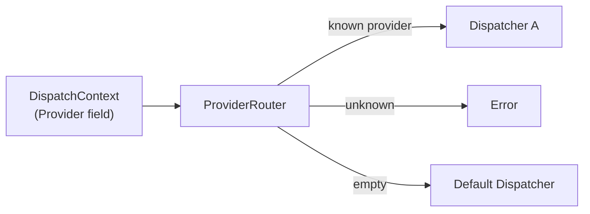
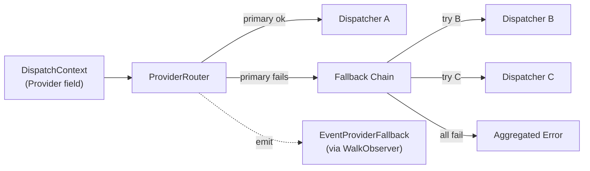

# Contract — Provider Resilience

**Status:** draft  
**Goal:** Add provider fallback chains and document the entry classifier pattern — closing the two dispatch-side gaps identified in the OmO case study.  
**Serves:** Polishing & Presentation (nice)

## Contract rules

- Fallback chains are backward-compatible. Existing ProviderRouter behavior is unchanged when no fallbacks are configured.
- The entry classifier pattern requires no code changes — Origami's DSL already supports it. The gap is documentation, not capability.
- No blind feature copying from OmO. Origami's ProviderRouter is architecturally superior (typed dispatchers, schema validation); fallbacks add resilience to the existing design.

## Context

- **Origin:** OmO case study (`docs/case-studies/omo-agentic-arms-race.md`) identified three gaps. Gap 1 (auto-routing) was injected into `ouroboros-seed-circuit` Phase 10 (depends on PersonaSheet). Gaps 2-3 are housed here.
- **OmO provider fallback:** OmO configures fallback chains per provider — if Anthropic is down, try OpenAI, then Cursor. Origami's ProviderRouter is static: one route per provider, no fallback. A dispatch failure is a circuit failure.
- **OmO Intent Gate:** OmO classifies user requests before routing (research, implementation, investigation, fix). Origami circuits start at a fixed entry node. There is no documented pattern for "classify first, then branch."
- **Cross-references:**
  - `case-study-omo-agentic-arms-race` — Analysis source. Implementation extracted here.
  - `ouroboros-seed-circuit` Phase 10 — Auto-routing (Gap 1) lives there, consumes PersonaSheet.

### Current ProviderRouter

Static routing. If the selected dispatcher fails, the dispatch fails. No retry, no fallback.

### Desired ProviderRouter

Fallback chains add resilience. On primary failure, iterate ordered fallbacks. Emit observability event on each fallback attempt.

## FSC artifacts

| Artifact | Target | Compartment |
|----------|--------|-------------|
| ProviderRouter fallback logic | `dispatch/provider.go` | framework |
| EventProviderFallback signal | `events.go` or `observer.go` | framework |
| WithFallbacks constructor option | `dispatch/provider.go` | framework |
| Entry classifier pattern | `testdata/patterns/intent-classifier.yaml` | domain |

## Execution strategy

Phase 1 adds fallback chains to ProviderRouter. Phase 2 documents the entry classifier pattern as a YAML example. Phase 3 validates.

## Coverage matrix

| Layer | Applies | Rationale |
|-------|---------|-----------|
| **Unit** | yes | ProviderRouter fallback logic, EventProviderFallback signal |
| **Integration** | no | No cross-boundary changes; ProviderRouter is in-process |
| **Contract** | yes | ProviderRouter API addition must be backward-compatible |
| **E2E** | no | Pattern documentation, not circuit behavior change |
| **Concurrency** | no | Fallback is synchronous per-dispatch call |
| **Security** | no | No trust boundaries affected — fallbacks route to already-configured dispatchers |

## Tasks

### Phase 1 — Provider fallback chains

- [ ] **PF1** Add `Fallbacks map[string][]string` to `ProviderRouter` — maps primary provider name to ordered fallback provider list
- [ ] **PF2** On `Dispatch` failure (non-nil error from primary dispatcher), iterate fallbacks in order until one succeeds or all fail
- [ ] **PF3** Emit `EventProviderFallback` via `WalkObserver` when a fallback is used (includes: primary provider, fallback provider, error from primary)
- [ ] **PF4** `WithFallbacks(fallbacks map[string][]string) ProviderRouterOption` — constructor option for `NewProviderRouter`
- [ ] **PF5** Unit tests: primary fails → fallback succeeds; all fail → aggregated error; no fallbacks configured → original behavior unchanged

### Phase 2 — Entry classifier pattern

- [ ] **EC1** Create `testdata/patterns/intent-classifier.yaml` — example circuit where the first node classifies input type and sets `vars.intent`, downstream edges use `when: vars.intent == "investigation"` etc.
- [ ] **EC2** Document the pattern: how to build an Intent Gate as a standard Origami circuit node, equivalent to OmO's category system but declarative
- [ ] **EC3** Verify the YAML parses and the graph builds with `BuildGraphWith`

### Phase 3 — Validate and tune

- [ ] **V1** Validate (green) — `go build ./...`, `go test ./...` all pass. Fallback chains work. Pattern YAML builds.
- [ ] **V2** Tune (blue) — Review ProviderRouter API for backward-compatibility. Polish YAML example.
- [ ] **V3** Validate (green) — all tests still pass after tuning.

## Acceptance criteria

**Given** a `ProviderRouter` configured with `WithFallbacks({"anthropic": ["openai", "cursor"]})`,  
**When** the "anthropic" dispatcher returns an error,  
**Then** the router tries "openai", then "cursor", returning the first success. An `EventProviderFallback` is emitted for each fallback attempt.

**Given** a `ProviderRouter` with no fallbacks configured,  
**When** any dispatcher returns an error,  
**Then** the error is returned directly — existing behavior is unchanged.

**Given** `testdata/patterns/intent-classifier.yaml`,  
**When** loaded with `LoadCircuit` and built with `BuildGraphWith`,  
**Then** the graph has a classifier node, 2+ branching edges with `when: vars.intent == "..."` conditions, and all target nodes are reachable.

## Security assessment

No trust boundaries affected. Provider fallback chains route to already-configured dispatchers — no new external endpoints. The intent classifier pattern is a YAML example with no external calls.

## Notes

2026-02-25 — Contract extracted from `case-study-omo-agentic-arms-race` Part 2 (Gaps 2-3). Gap 1 (auto-routing) was injected into `ouroboros-seed-circuit` Phase 10 because it depends on PersonaSheet output. Fallback chains are OmO's pragmatic resilience pattern applied to Origami's typed ProviderRouter. The entry classifier requires no code — it's a documentation gap showing how Origami's existing DSL supports OmO's Intent Gate pattern declaratively.
