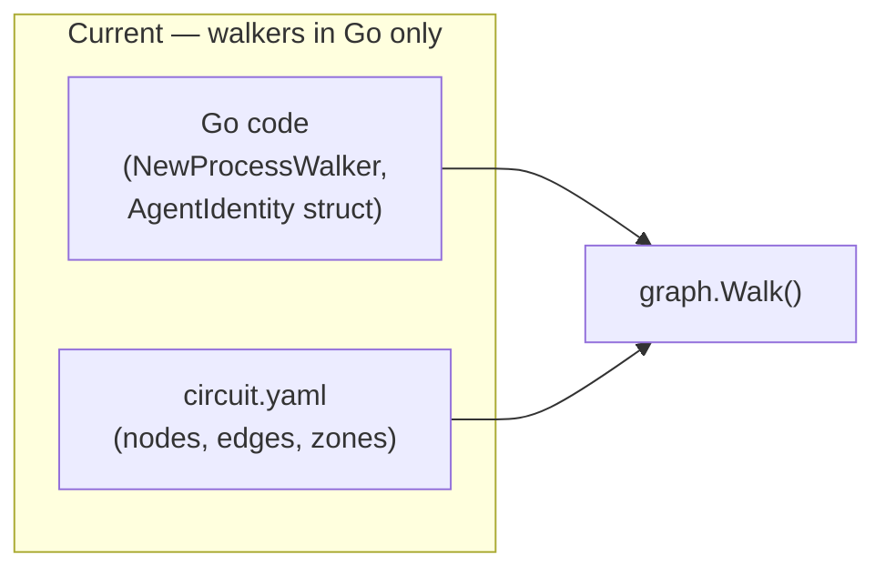
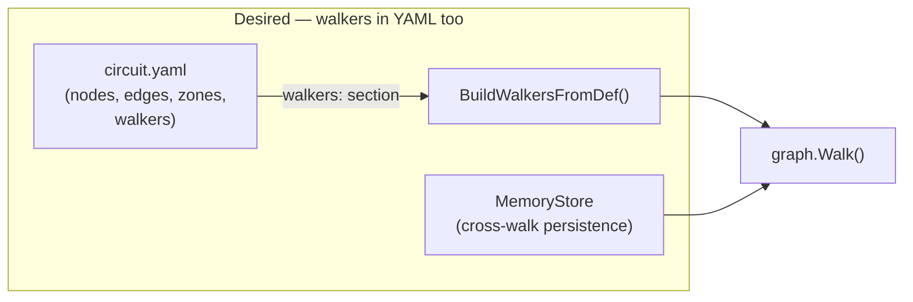

# Contract — Walker Experience

**Status:** complete  
**Goal:** Add WalkerDef (agent-in-YAML), cross-walk MemoryStore, and hierarchical delegation pattern — closing the three walker-side gaps identified in the CrewAI case study.  
**Serves:** Polishing & Presentation (should)

## Contract rules

- WalkerDef extends the circuit DSL. It must follow the same conventions as `NodeDef`, `EdgeDef`, `ZoneDef` — YAML-first, typed Go backing.
- MemoryStore is walker-scoped, not circuit-scoped. It is distinct from `curate.MemoryStore` (dataset-level) and `WalkerState.Context` (per-walk only).
- The hierarchical delegation pattern is documentation, not framework code. Origami's existing fan-out + zone stickiness already supports it.
- No blind feature copying from CrewAI. Each gap is closed using Origami's existing architectural primitives (Elements, Personas, AffinityScheduler).

## Context

- **Origin:** CrewAI case study (`docs/case-studies/crewai-crews-and-flows.md`) identified three gaps where CrewAI's developer experience exceeds Origami's.
- **CrewAI agents.yaml:** CrewAI defines agents in YAML (`role`, `goal`, `backstory`). Origami's personas are Go code — inaccessible to YAML-circuit authors.
- **CrewAI memory:** CrewAI agents carry memory across tasks within a crew. Origami's `WalkerState` resets per walk.
- **CrewAI hierarchical process:** CrewAI auto-assigns a manager agent that delegates. Origami can model this but hasn't documented the pattern.
- **Cross-references:**
  - `consumer-ergonomics` — DefaultWalker is the "don't care" case. WalkerDef is the "care, but in YAML" case. Complementary, not overlapping.
  - `case-study-crewai-crews-and-flows` — Analysis source. Implementation extracted here.

### Current architecture

Walkers are constructed in Go. Circuit YAML defines nodes and edges but not walkers. If a consumer wants to define agents in YAML, they must parse their own config and construct walkers manually.

### Desired architecture

The circuit YAML includes a `walkers:` section. `BuildWalkersFromDef()` constructs typed walkers with Elements and Personas. `MemoryStore` provides cross-walk persistence scoped by walker identity.

## FSC artifacts

| Artifact | Target | Compartment |
|----------|--------|-------------|
| WalkerDef type + builder | `dsl.go` | framework |
| MemoryStore interface + InMemoryStore | `memory.go` (new) | framework |
| WithMemory RunOption | `walk_options.go` | framework |
| Hierarchical delegation pattern | `testdata/patterns/hierarchical-delegation.yaml` | domain |

## Execution strategy

Phase 1 extends the DSL with WalkerDef. Phase 2 adds the MemoryStore framework primitive. Phase 3 documents the hierarchical delegation pattern. Phase 4 validates.

## Coverage matrix

| Layer | Applies | Rationale |
|-------|---------|-----------|
| **Unit** | yes | WalkerDef YAML parsing, MemoryStore get/set, WalkerDef → Walker construction |
| **Integration** | no | No cross-boundary changes |
| **Contract** | yes | WalkerDef schema (new DSL addition), MemoryStore interface |
| **E2E** | no | Pattern documentation + small API additions |
| **Concurrency** | yes | MemoryStore must be safe for concurrent walker access |
| **Security** | no | No trust boundaries affected |

## Tasks

### Phase 1 — WalkerDef (Agent-in-YAML)

- [x] **WD1** Define `WalkerDef` in `dsl.go`: `Name`, `Element`, `Persona`, `Preamble`, `StepAffinity map[string]float64`
- [x] **WD2** Add `Walkers []WalkerDef` to `CircuitDef`
- [x] **WD3** `BuildWalkersFromDef(defs []WalkerDef) ([]Walker, error)` — constructs `ProcessWalker` instances from YAML definitions. Resolves element by name, persona by name, applies preamble and step affinity.
- [x] **WD4** Unit tests: parse circuit YAML with `walkers:` section, build walkers, verify element and persona assignment
- [x] **WD5** Cross-reference: does not overlap with `consumer-ergonomics` DefaultWalker (which is for the "don't care" case; WalkerDef is for the "do care, but in YAML" case)

### Phase 2 — Cross-walk MemoryStore

- [x] **MS1** Define `MemoryStore` interface in `memory.go`: `Get(walkerID, key string) (any, bool)`, `Set(walkerID, key string, value any)`, `Keys(walkerID string) []string`
- [x] **MS2** `InMemoryStore` implementation (thread-safe via `sync.RWMutex`, scoped by walker identity)
- [x] **MS3** `WithMemory(store MemoryStore) RunOption` — injects memory into the walk context, accessible via `WalkerContext.Memory()`
- [x] **MS4** Unit tests: set value in walk 1, retrieve in walk 2 with same walker identity, verify isolation between different walker identities
- [x] **MS5** Cross-reference: does not overlap with `curate.MemoryStore` (dataset-level CRUD) — this is walker-scoped identity memory

### Phase 3 — Hierarchical delegation pattern

- [x] **HD1** Create `testdata/patterns/hierarchical-delegation.yaml` — coordinator node fans out to specialist sub-circuits via `parallel: true` edges, merges results at a merge node
- [x] **HD2** Document the pattern: how Origami's fan-out + zone stickiness models CrewAI's hierarchical process declaratively, with strictly more power (conditional delegation, weighted routing, multi-level hierarchy)
- [x] **HD3** Verify the YAML parses and the graph builds with `BuildGraphWith`

### Phase 4 — Validate and tune

- [x] **V1** Validate (green) — `go build ./...`, `go test ./...` all pass. WalkerDef parses from YAML. MemoryStore works cross-walk with isolation. Pattern YAML builds.
- [x] **V2** Tune (blue) — Review WalkerDef field names for API consistency with NodeDef. Review MemoryStore thread-safety under concurrent walk.
- [x] **V3** Validate (green) — all tests still pass after tuning.

## Acceptance criteria

**Given** a circuit YAML with a `walkers:` section defining two walkers (water/seeker and fire/herald),  
**When** `LoadCircuit` and `BuildWalkersFromDef` are called,  
**Then** two `Walker` instances are returned with correct element, persona, and preamble.

**Given** a `MemoryStore` with a value set during walk 1 for walker "seeker",  
**When** walk 2 starts with the same walker identity and calls `Memory().Get("seeker", "key")`,  
**Then** the value from walk 1 is returned. A different walker identity returns nothing.

**Given** `testdata/patterns/hierarchical-delegation.yaml`,  
**When** loaded with `LoadCircuit` and built with `BuildGraphWith`,  
**Then** the graph has a coordinator node, parallel fan-out edges to 2+ specialist nodes, and a merge node.

## Security assessment

No trust boundaries affected. WalkerDef reads local YAML. MemoryStore is in-process with no persistence beyond the process lifetime. The hierarchical delegation pattern is a YAML example.

## Notes

2026-02-25 — Contract extracted from `case-study-crewai-crews-and-flows` Part 2. The three gaps were identified by analyzing CrewAI's Crews+Flows architecture against Origami's unified graph. CrewAI's DX advantage in these areas is clear: agents in YAML, memory across tasks, documented delegation. Origami closes these gaps using its own primitives (Elements, Personas, AffinityScheduler, fan-out) rather than copying CrewAI's design.

2026-02-25 — Contract complete. WalkerDef in `dsl.go` + `walker_build.go`, MemoryStore in `memory.go`, hierarchical delegation pattern in `testdata/patterns/`. Added curate.MemoryStore cross-reference comment. CHECKPOINTs A-C pass.
