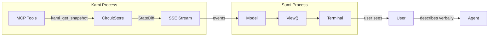
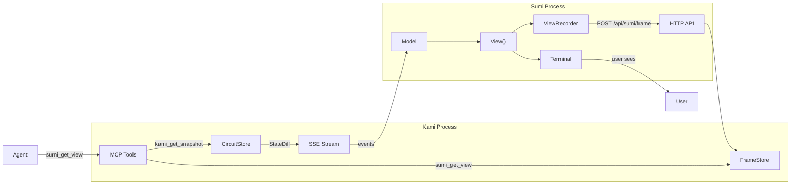

# Contract — sumi-debug-eyes

**Status:** complete  
**Goal:** Give the Cursor agent the ability to see Sumi's TUI state on demand via MCP, using a ring-buffer recorder that continuously captures rendered frames.  
**Serves:** API Stabilization (developer tooling)

## Contract rules

- **Recorder, not screenshot.** The ViewRecorder is a moving-window data structure (ring buffer) that passively captures every rendered frame. No user action needed to populate it.
- **MCP-first access.** The primary consumer is the Cursor agent via MCP tool calls. File-based fallback (F12 dump) is secondary.
- **NoColor text.** Recorded frames use `NoColor: true` rendering — clean text with box-drawing characters, no ANSI escapes.
- **Zero render-path overhead.** The recorder observes `View()` output; it must not add latency to the render cycle. Ring buffer writes are O(1) and lock-free from the render goroutine's perspective.
- **Backward compatible.** The recorder is opt-in. Sumi works exactly as before when no recorder is attached.

## Context

The Cursor agent cannot see Sumi's TUI because Bubble Tea uses alternate screen mode, which Cursor's terminal capture does not record. The agent is blind to visual bugs, layout issues, and stale data. This contract adds a passive recording layer and MCP exposure so the agent can request what the user sees at any time.

Related: `sumi-war-room` (completed) built the multi-panel War Room layout. This contract adds observability into that layout.

### Current architecture

### Desired architecture

## FSC artifacts

| Artifact | Target | Compartment |
|----------|--------|-------------|
| ViewRecorder design reference | `docs/sumi-debug-eyes.md` | domain |
| `sumi_get_view` MCP tool spec | `docs/sumi-debug-eyes.md` | domain |

## Execution strategy

Three phases, each independently testable:

1. **ViewRecorder data structure** — Ring buffer in `sumi/` that stores rendered frames with metadata. Unit tested in isolation.
2. **Kami FrameStore + MCP tool** — Server-side storage for the latest frame, exposed via `sumi_get_view` MCP tool. Kami HTTP endpoint `POST /api/sumi/frame` for Sumi to push frames.
3. **Sumi integration** — Wire the recorder into `Model.View()`, push frames to Kami on state changes (debounced), add F12 keybinding for local file dump as fallback.

## Coverage matrix

| Layer | Applies | Rationale |
|-------|---------|-----------|
| **Unit** | yes | ViewRecorder ring buffer, frame formatting, FrameStore, debounce logic |
| **Integration** | yes | Sumi → Kami frame push, MCP tool returns correct frame |
| **Contract** | yes | `sumi_get_view` MCP tool response schema |
| **E2E** | no | Visual correctness requires human eye; agent analysis is best-effort |
| **Concurrency** | yes | ViewRecorder written from Bubble Tea goroutine, read from HTTP push goroutine |
| **Security** | yes | Frame content may contain circuit data; MCP access same trust boundary as existing tools |

## Tasks

### Phase 1 — ViewRecorder data structure

- [x] **DE1** Create `sumi/view_recorder.go` — `ViewRecorder` struct: ring buffer of `RecordedFrame{Timestamp, Width, Height, Tier, SelectedNode, FocusedPanel, WorkerCount, EventCount, ViewText string}`. Capacity configurable (default 30 frames). Methods: `Record(frame)`, `Latest() *RecordedFrame`, `Last(n) []RecordedFrame`, `Len() int`. Thread-safe via `sync.RWMutex`.
- [x] **DE2** Unit tests for ViewRecorder — push, overflow, Latest/Last retrieval, concurrent read/write safety.

### Phase 2 — Kami FrameStore + MCP tool

- [x] **DE3** Create `kami/frame_store.go` — `FrameStore` struct: holds the latest `RecordedFrame` pushed by Sumi. Thread-safe. Methods: `Store(frame)`, `Latest() *RecordedFrame`.
- [x] **DE4** Add `POST /api/sumi/frame` HTTP endpoint to `kami/server.go` — accepts JSON `RecordedFrame`, stores in FrameStore.
- [x] **DE5** Add `sumi_get_view` MCP tool to `kami/mcp_tools.go` — returns the latest frame as structured text (header with metadata + view text). If no frame available, returns "Sumi not connected or no frames recorded."
- [x] **DE6** Unit tests for FrameStore, HTTP endpoint, MCP tool response format.

### Phase 3 — Sumi integration + fallback

- [x] **DE7** Wire ViewRecorder into `sumi/model.go` — recording triggered in `Update()` on DiffMsg/WindowSizeMsg (not View, which is a value receiver). NoColor re-render captured per frame.
- [x] **DE8** Add frame push goroutine to `sumi/run.go` — polls recorder every 500ms, POSTs to Kami `POST /api/sumi/frame`. Max 2 pushes/second. Failures are silent.
- [x] **DE9** Add `F12` keybinding in `sumi/model.go` — dumps `Latest()` frame to `.sumi/debug-snapshot.txt` as local fallback. Flash "Snapshot saved" in status bar for 2 seconds via `clearFlashMsg` tick.
- [x] **DE10** Integration tests — 4 tests: frame capture on diff, NoColor output, frame push to httptest Kami, dirty-only-on-state-change.

### Finalize

- [x] Validate (green) — all tests pass, MCP tool returns frames, F12 dump works.
- [x] Tune (blue) — removed unused `flashExpiry` field, extracted flash helper in `dumpDebugSnapshot`.
- [x] Validate (green) — all tests still pass after tuning.

## Acceptance criteria

**Given** Sumi is running in `--watch` mode connected to Kami,  
**When** the Cursor agent calls the `sumi_get_view` MCP tool,  
**Then** the response contains the latest rendered frame text showing the War Room layout with current node states, walker positions, and panel structure.

**Given** Sumi has received at least one `DiffMsg`,  
**When** the agent calls `sumi_get_view`,  
**Then** the response includes metadata: timestamp, terminal dimensions, layout tier, selected node, focused panel, worker count, event count.

**Given** Sumi is running but no events have been received,  
**When** the agent calls `sumi_get_view`,  
**Then** the response contains the initial frame showing the empty circuit graph with idle nodes.

**Given** Sumi is not connected to Kami (or Kami has no FrameStore),  
**When** the agent calls `sumi_get_view`,  
**Then** the response returns "Sumi not connected or no frames recorded."

**Given** the user presses `F12` in Sumi,  
**Then** the latest frame is written to `.sumi/debug-snapshot.txt` and the status bar flashes "Snapshot saved."

**Given** 100 rapid state changes occur,  
**Then** the ViewRecorder contains at most 30 frames (ring buffer capacity) and the push goroutine sends at most 2 frames/second to Kami.

## Security assessment

No new trust boundaries. The MCP tool exposes circuit state that is already available via `kami_get_snapshot`. Frame text contains the same information rendered visually. No secrets or PII in the rendered output (circuit names, node names, walker IDs are non-sensitive).

| OWASP | Finding | Mitigation |
|-------|---------|------------|
| A01 Broken Access Control | MCP tools run same-process as Kami, no new exposure | N/A — same trust boundary |
| A03 Injection | Frame text is read-only, no user input parsed | N/A |

## Notes

2026-03-03 16:30 — Contract complete. All 3 phases implemented. Key design adjustment: recording happens in `Update()` not `View()` because Bubble Tea's View() is a value receiver and cannot persist state changes. Full test suite green (35 packages). Tuning: removed unused `flashExpiry` field, extracted `flash()` helper to reduce duplication.

2026-03-03 14:45 — Contract created. Key design decision: ring buffer recorder in Sumi pushes frames to Kami via HTTP, Kami exposes via MCP. This avoids file-system coupling and gives the agent direct tool access. F12 dump is a local fallback for when Kami is unavailable.
