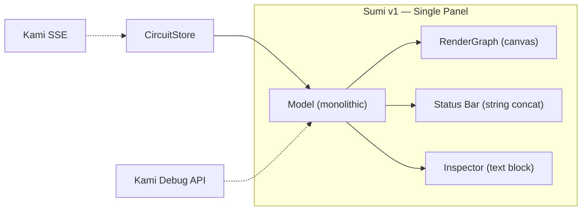
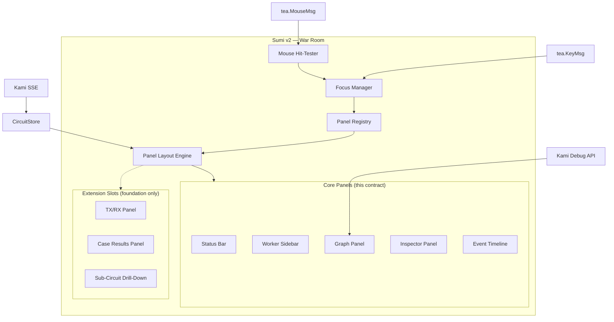

# Contract — sumi-war-room

**Status:** complete  
**Goal:** Upgrade Sumi from a basic single-panel TUI to an ops-grade War Room debugger — multi-panel layout, mouse interaction, event timeline, worker selector, rich node inspector — modeled after Kabuki's LiveDemoSection but stripped of demo fluff. Pure ops tool.  
**Serves:** API Stabilization (next-milestone)

## Contract rules

Global rules only, plus:

- **Upgrade, not rewrite.** Sumi v1 (completed `sumi` contract) is the foundation. This contract enhances the existing `sumi/` package — same Bubble Tea MVU, same `CircuitStore` dependency, same CLI commands. New files are added; existing files are refactored.
- **War Room = Kabuki LiveDemoSection minus fluff.** The target is a TUI equivalent of Kabuki's War Room layout: circuit graph (center), worker list (left), inspector (right), event timeline (bottom), status bar (top). No agent intros, no hero sections, no transition lines — those are presentation concerns.
- **Foundation for extension.** Every panel slot is backed by a `Panel` interface. The layout engine, focus manager, and message router are panel-agnostic. Adding a new panel (TX/RX, case results, sub-circuit drill-down) means implementing the interface and registering it — zero changes to the core layout/focus/routing code.
- **Mouse-first, keyboard-complete.** Mouse interaction (click nodes, click panels, click timeline entries) is the primary UX. Every mouse action has a keyboard equivalent. `tea.WithMouseCellMotion()` is the enabler.
- **Responsive degradation.** The full War Room layout requires 140x40+. At smaller terminals, panels collapse gracefully: inspector hides first, then worker sidebar, then timeline merges into the status bar. At 80x24, only the graph + status bar remain.
- **No new external dependencies.** `bubbletea`, `lipgloss`, and `bubbles` (already in go.mod) provide everything needed. No TUI framework additions.

## Context

- `contracts/completed/api-stabilization/sumi.md` — Sumi v1. Completed. This contract is the sequel.
- `contracts/completed/framework/kami-live-debugger.md` — Kami server: EventBridge, SSE, WS, Debug API.
- `contracts/completed/framework/kabuki-presentation-engine.md` — Kabuki: section-based SPA. The LiveDemoSection is the reference for War Room layout.
- `kami/frontend/src/sections/LiveDemoSection.tsx` — War Room React component. The TUI equivalent is what this contract builds.
- `kami/frontend/src/components/CircuitGraph.tsx` — ReactFlow circuit graph. Sumi's `graph.go` is the TUI analog.
- `sumi/model.go` — Current Bubble Tea model. Will be refactored into panel-based composition.
- `sumi/graph.go` — Current graph renderer. Will be enhanced with selection highlighting and hit regions.
- `view/store.go` — `CircuitStore`. Source of all state diffs. No changes needed.
- `view/layout.go` — `GridLayout`, `CircuitLayout`. Used for node placement and mouse hit-testing.

### Current architecture

All rendering is a single `strings.Join(sections, "\n")`. No panels, no mouse, no focus management. Inspector is a text block appended below the graph. Status bar is a concatenated string. No event history.

### Desired architecture

Panel-based composition with a registry. Each panel implements a `Panel` interface (`ID`, `Update`, `View`, `Focusable`, `PreferredSize`). The layout engine queries the registry to compute positions. The focus manager routes input to the active panel via the registry. Adding a new panel = implement the interface + register — zero changes to layout, focus, or routing code. Extension panels (TX/RX, case results, sub-circuit) get their data types and panel stubs in this contract; full implementation follows when the data pipeline supports them.

## FSC artifacts

| Artifact | Target | Compartment |
|----------|--------|-------------|
| Sumi War Room design reference | `docs/sumi-war-room.md` | domain |

## Execution strategy

Six phases, each delivering a testable increment. Phase 1 (layout + mouse + Panel interface) is the foundation — all subsequent phases build on the panel system. Phases 2-4 build out individual panels. Phase 5 polishes responsiveness. Phase 6 lays the extension foundation: data types, panel stubs, and Kami API surface for TX/RX, case results, and sub-circuit drill-down so that a follow-up contract can implement them without touching the War Room core.

The graph renderer (`graph.go`) is enhanced incrementally: Phase 1 adds hit regions and selection highlighting, Phase 3 adds richer node rendering. The existing graph tests remain valid throughout.

## Coverage matrix

| Layer | Applies | Rationale |
|-------|---------|-----------|
| **Unit** | yes | Panel layout computation, mouse hit-testing, timeline entry formatting, worker list filtering, responsive breakpoints |
| **Integration** | yes | Mouse click → node selection → inspector update flow, SSE event → timeline entry → auto-scroll, worker filter → timeline filter |
| **Contract** | yes | `Panel` interface conformance — all core panels and extension stubs implement it. Panel registry add/remove/query contract. |
| **E2E** | yes | `origami sumi --watch` renders War Room layout, `--no-color` output includes all panels |
| **Concurrency** | yes | `CircuitStore` diffs arrive from SSE goroutine while mouse/keyboard events arrive from Bubble Tea. Timeline ring buffer must be thread-safe. |
| **Security** | no | No trust boundaries affected — same local process as Sumi v1 |

## Tasks

### Phase 1 — Panel layout + mouse infrastructure

- [ ] **WR1** Create `sumi/panels.go` — define the `Panel` interface (`ID() string`, `Title() string`, `Update(tea.Msg) tea.Cmd`, `View(Rect) string`, `Focusable() bool`, `PreferredSize() (minW, minH int)`) and `PanelRegistry` (ordered list, add/remove, lookup by ID, focus ring). Panel layout engine: compute panel rectangles (`Rect{X, Y, W, H}`) from terminal dimensions and registry contents, render lipgloss borders (bright for focused, dim for unfocused), manage focus ring (Tab cycles, click sets)
- [ ] **WR2** Create `sumi/mouse.go` — mouse infrastructure: enable `tea.WithMouseCellMotion()`, dispatch `tea.MouseMsg` to correct panel based on coordinates, graph panel maps mouse position → grid cell → node name via `GridLayout`
- [ ] **WR3** Enhance `sumi/graph.go` — generate `hitMap map[[2]int]string` during `RenderGraph` (maps canvas coordinates to node names), add visual selection highlighting (highlighted border style on selected node, replacing invisible status-bar-only selection)
- [ ] **WR4** Refactor `sumi/model.go` — replace monolithic model with panel-based composition: each panel has `Update(msg) cmd` and `View(rect) string`, main model routes messages based on focus, composes panel views into final output via layout engine
- [ ] **WR5** Unit tests — panel rectangle computation at various terminal sizes, hit-test accuracy (click inside node box → correct node name, click between nodes → nil), focus cycling

### Phase 2 — Status bar + worker sidebar

- [ ] **WR6** Create `sumi/statusbar.go` — extract and enhance top bar: circuit name, worker count (derived from `snap.Walkers`), SSE/Kami connection status, total event count, elapsed time since first event, pause/done/error indicators
- [ ] **WR7** Create `sumi/workers.go` — worker sidebar panel: list active walkers with element-colored indicators (●), click to select a worker (filters timeline, highlights that worker's path on graph), "All" option shows everything (default), keyboard: up/down to navigate, Enter to select
- [ ] **WR8** Unit tests — worker list rendering, selection state, filter propagation

### Phase 3 — Inspector panel

- [ ] **WR9** Create `sumi/inspector.go` — extract inspector from `model.go`, enhance with: scrollable viewport (bubbles/viewport) for overflow, rich node details (name, element, state, zone, transformer, extractor, D/S badge, family), walker info (which walker is at this node, how long), timing info (when node entered/exited, duration), edge info (incoming/outgoing edges with conditions), zone info (zone name, element, member nodes)
- [ ] **WR10** Wire inspector to graph selection — click a node (mouse or keyboard) updates inspector content, inspector auto-scrolls to top on new selection
- [ ] **WR11** Unit tests — inspector content for nodes in various states, scrolling behavior, edge/zone detail rendering

### Phase 4 — Event timeline

- [ ] **WR12** Create `sumi/timeline.go` — event timeline panel: scrollable list of `StateDiff` events formatted as `HH:MM:SS worker_id event_type node_name [detail]`, color-coded by event type (enter=green, exit=blue, error=red, walker_moved=yellow, breakpoint=magenta), ring buffer (last 500 events), auto-scroll follows tail unless user scrolls up, filterable by selected worker (from WR7)
- [ ] **WR13** Wire timeline to store subscription — each `DiffMsg` appends a `TimelineEntry` to the ring buffer, timeline re-renders
- [ ] **WR14** Timeline interaction — click an entry to select the associated node (updates graph selection + inspector), keyboard: up/down scrolls, Enter selects entry's node
- [ ] **WR15** Unit tests — timeline entry formatting, ring buffer overflow, worker filtering, click → node selection

### Phase 5 — Responsive layout + help + polish

- [ ] **WR16** Implement responsive breakpoints — 140x40+ (full War Room), 120x30 (graph + inspector OR timeline, no worker sidebar), 100x24 (graph + compact status bar), 80x24 (graph only, panels hidden). Transitions smooth on `WindowSizeMsg`.
- [ ] **WR17** Create `sumi/help.go` — help overlay toggled with `?`: panel listing all key bindings grouped by context (global, graph, inspector, timeline, workers), mouse actions, and panel descriptions. Rendered as a centered modal over the current view.
- [ ] **WR18** Enhance `sumi/colors.go` — panel border styles (focused: bright element color, unfocused: dim gray), timeline entry styles (per event type), worker indicator styles (per element), help overlay styles

### Phase 6 — Extension foundations

TX/RX, case results, and sub-circuit drill-down are not fully implemented here — they need upstream data pipeline changes (SSE payload extension, case-level events, marble API). This phase builds the **data types, Kami API surface, panel stubs, and integration tests** so that a follow-up contract adds them without touching the War Room core.

- [ ] **WR19** Define TX/RX data types in `view/` — `TxRxEntry{Timestamp, Walker, Direction(tx|rx), Node, ContentType, Content string, Truncated bool}`. Add `TxRxLog` ring buffer (same pattern as timeline). These types are SSE-event-agnostic — they can be populated from extended SSE events, Kami API polling, or replay files.
- [ ] **WR20** Extend Kami SSE event format — add optional `data` field to `kami.Event` for prompt/response payloads. When Kami `EventBridge` receives a `WalkEvent` with `Metadata["prompt"]` or `Metadata["response"]`, include it in the SSE event. Backward-compatible: existing consumers ignore the new field.
- [ ] **WR21** Create `sumi/txrx.go` — TX/RX panel stub implementing `Panel` interface. Renders a placeholder ("TX/RX: waiting for data...") when no entries exist. When `TxRxEntry` items arrive, renders a split view: TX (outgoing prompt) on top, RX (incoming response) on bottom for the selected worker. Scrollable via `bubbles/viewport`. Register in `PanelRegistry` at the position Kabuki uses (flanking the graph).
- [ ] **WR22** Define case result data types in `view/` — `CaseResult{CaseID, DefectType, Confidence float64, Summary, Status string}`. Add `CaseResultSet` (ordered list). These types mirror Kabuki's bottom-row case tabs.
- [ ] **WR23** Add Kami snapshot extension — extend `/api/snapshot` response to include `CaseResults []CaseResult` when available (nil when no case data exists). Sumi's `bootstrapFromSnapshot` populates the case set on connect.
- [ ] **WR24** Create `sumi/cases.go` — case results panel stub implementing `Panel` interface. Renders as a bottom tab bar (like Kabuki's case tabs): one tab per `CaseResult`, click to select, selected case shows defect type + confidence + summary. Empty state: "No case results yet." Register in `PanelRegistry` below the timeline slot.
- [ ] **WR25** Define sub-circuit navigation types — `DrillDownRequest{ParentNode, CircuitDef}` message type. Graph panel emits this on double-click or Enter on a composite node. The model pushes the current `CircuitDef` + `CircuitLayout` onto a breadcrumb stack and switches to the sub-circuit. Back (Esc or breadcrumb click) pops the stack.
- [ ] **WR26** Create `sumi/breadcrumb.go` — breadcrumb bar component. Renders `Root > SubCircuit > ...` above the graph panel. Clickable crumbs pop the navigation stack. Hidden when stack depth is 1 (root circuit). This is a thin UI component; the actual marble-fetching API (`GET /api/marble/{node}`) already exists in Kami.
- [ ] **WR27** Integration tests — (a) TX/RX panel renders entries when `TxRxLog` is populated, remains placeholder when empty; (b) case tabs render when `CaseResultSet` is populated, remain hidden when empty; (c) breadcrumb renders on drill-down push, hides on pop back to root; (d) all extension panels satisfy `Panel` interface contract; (e) layout engine accommodates extension panels without breaking core panels.

### Finalize

- [ ] Validate (green) — all tests pass, `origami sumi --watch` renders War Room, acceptance criteria met.
- [ ] Tune (blue) — refactor for quality. Extract shared patterns, simplify panel composition, optimize render path. No behavior changes.
- [ ] Validate (green) — all tests still pass after tuning.

## Acceptance criteria

**Given** a terminal of 140x40 or larger with a live calibration session,  
**When** `origami sumi --watch 127.0.0.1:3001` is run,  
**Then** the War Room layout renders: status bar (top), worker sidebar (left), circuit graph (center), inspector (right), event timeline (bottom). All panels have borders. The focused panel has a bright border.

**Given** a running War Room with nodes visible on the graph,  
**When** the user clicks on a node with the mouse,  
**Then** the node gets a highlighted border on the graph, the inspector panel updates to show that node's details (name, element, state, zone, transformer, extractor, walker info, timing), and the timeline scrolls to the last event for that node.

**Given** a War Room with multiple active walkers,  
**When** the user clicks a worker in the left sidebar,  
**Then** the event timeline filters to show only that worker's events, and the worker's current node is highlighted on the graph. Clicking "All" removes the filter.

**Given** a live calibration producing state diffs,  
**When** events arrive via SSE,  
**Then** the event timeline appends new entries with timestamps, worker IDs, and event types. The timeline auto-scrolls to show the latest entry. The graph updates node states and walker positions in real-time.

**Given** a terminal of 80x24,  
**When** the War Room starts,  
**Then** only the circuit graph and a compact status bar are visible. No panels overflow or overlap. All keyboard navigation still works.

**Given** the War Room is running,  
**When** the user presses `?`,  
**Then** a help overlay appears listing all key bindings (global, graph, inspector, timeline, workers) and mouse actions. Pressing `?` or `Esc` dismisses it.

**Given** the War Room with a selected node in the inspector,  
**When** the user presses Tab to cycle focus to the timeline, then uses arrow keys,  
**Then** the timeline scrolls independently. Pressing Enter on a timeline entry selects the associated node in the graph and updates the inspector.

**Given** `origami sumi --no-color --watch` connected to a live session,  
**When** output is captured,  
**Then** all panel borders, node labels, event entries, and status information are present without ANSI escape sequences. The layout is human-readable in plain text.

**Given** a new panel type implementing the `Panel` interface,  
**When** registered in `PanelRegistry`,  
**Then** the layout engine positions it, the focus manager includes it in the Tab cycle, mouse clicks inside its bounds route to it, and no existing panel code is modified. Zero-change extensibility.

**Given** a Kami SSE event with `data.prompt` and `data.response` fields,  
**When** received by Sumi in `--watch` mode,  
**Then** the TX/RX panel populates with the prompt (TX) and response (RX) for the active worker. When no data fields are present, the TX/RX panel shows "TX/RX: waiting for data..."

**Given** case results arriving via the snapshot or SSE stream,  
**When** the case results panel has entries,  
**Then** a tab bar renders at the bottom with one tab per case. Clicking a tab shows defect type, confidence, and summary. When no case results exist, the panel is hidden.

**Given** a composite node (marble) in the circuit graph,  
**When** the user double-clicks it or presses Enter,  
**Then** the graph drills down into the sub-circuit, a breadcrumb bar appears showing `Root > NodeName`, and pressing Esc or clicking `Root` in the breadcrumb pops back to the parent circuit.

## Security assessment

No trust boundaries affected. Same local process as Sumi v1 — no new network exposure, no new external calls, no credentials handled. Mouse input is processed locally by Bubble Tea.

## Notes

2026-03-03 — Contract created. Sequel to the completed `sumi` contract. Motivated by user feedback that Sumi v1 is "primitive and bad" for live calibration observation. The War Room model is taken directly from Kabuki's LiveDemoSection: same information density (circuit graph, worker list, event log, node inspector) but rendered in the terminal for ops use.

2026-03-03 — Extension foundation added (Phase 6). Rather than deferring TX/RX, case results, and sub-circuit drill-down entirely, the contract now includes data types, Kami API extensions, panel stubs, and integration tests for all three. The `Panel` interface and `PanelRegistry` make it possible to add new panels with zero changes to the War Room core. Full implementation of TX/RX content population, case scoring pipeline integration, and marble fetch API wiring are follow-up work — but the types, stubs, and test harnesses exist from day one.
