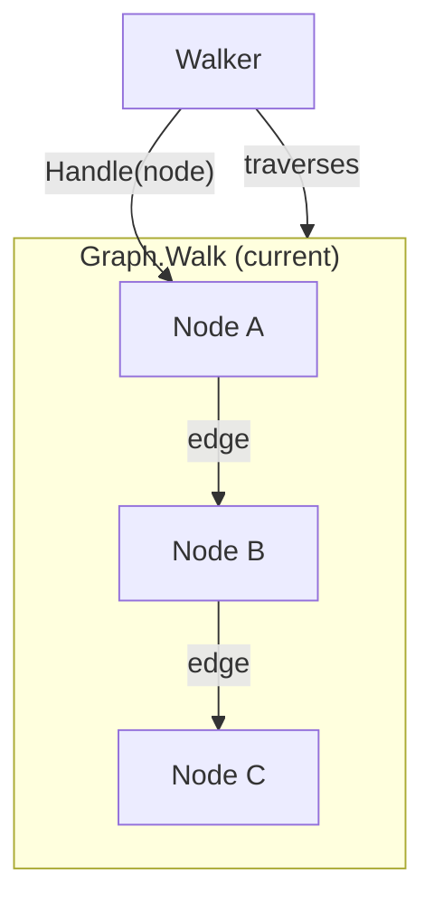
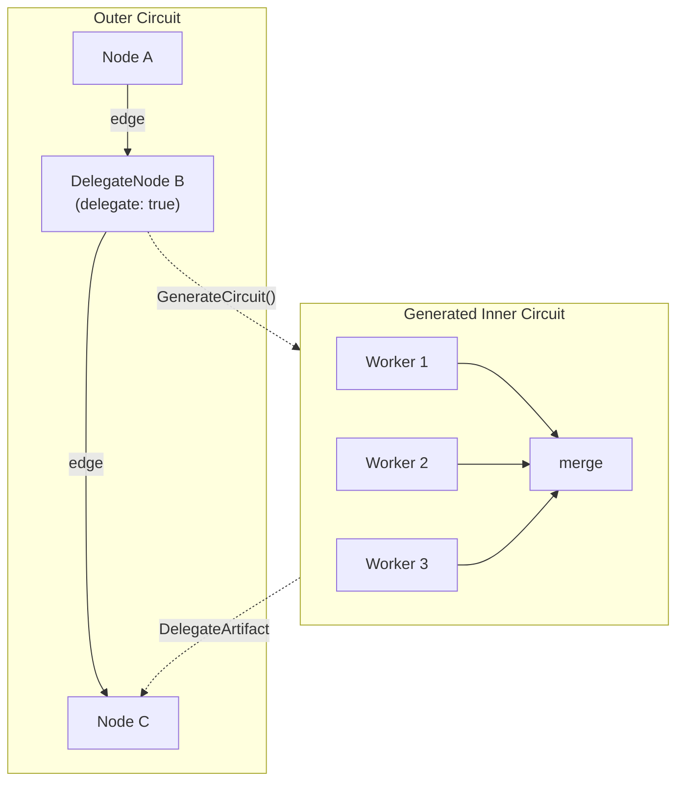

# Contract — delegate-node

**Status:** complete (P5-P6 deferred)  
**Goal:** A circuit node can produce a `CircuitDef` as its artifact; the framework walks the generated circuit as a sub-walk and returns the aggregate result as the outer node's artifact. Enables meta-circuits — circuits generating circuits.  
**Serves:** Containerized Runtime (vision)

## Contract rules

- **Framework primitive.** DelegateNode is a framework-level interface in the root package, not a schematic concern. It extends `Node` without breaking existing `Node` implementations.
- **Observable sub-walks.** Generated circuits must be observable via the same `WalkObserver` interface. Sub-walk events include the parent node name as context so observers can correlate inner and outer execution.
- **Static after generation.** The generated `CircuitDef` is immutable once returned. The sub-walk traverses a fixed graph — no further dynamic modification during execution. This preserves Origami's static-topology-at-walk-time property.
- **Deterministic first.** The `GenerateCircuit` call is stochastic (it may use LLM reasoning to decompose work). The generated circuit should maximize deterministic nodes. The D/S boundary analysis applies to both the outer and inner circuits independently.
- Global rules apply.

## Context

Brainstorming session: [Agentic hierarchy and Operator API](65013565-a183-40d2-ae82-707267f65454) — identified meta-circuits as the keystone primitive for the Origami Operator pattern. A Manager agent's output is itself a circuit definition. This enables recursive composition: a Broker circuit delegates to Manager circuits, which delegate to Worker circuits. The depth is determined by the problem, not by the framework.

- `strategy/origami-vision.mdc` — Amber trajectory: "CRD-based Kubernetes circuit operator (nodes as Jobs/Pods, edges as event triggers)"
- `graph.go` — `Graph.Walk()` and `Graph.WalkTeam()` are the current traversal primitives
- `dsl.go` — `CircuitDef`, `NodeDef`, `WalkerDef` define the YAML DSL types
- `node.go` — `Node` interface: `Name()`, `ElementAffinity()`, `Process(ctx, nc) (Artifact, error)`
- `topology/` — Topology validation with 5 built-in primitives (cascade, fan-out, fan-in, feedback-loop, bridge)
- `fanout.go` — Existing parallel fan-out via `ParallelEdge.IsParallel()` — the closest existing analog to sub-walk execution

### Current architecture

All nodes call `Process()` directly. No node can spawn a sub-circuit. Fan-out exists for parallel edges but is defined statically in YAML.

### Desired architecture

When the Walker reaches a DelegateNode, it calls `GenerateCircuit()`, builds a Graph from the returned `CircuitDef`, walks it, and wraps the sub-walk's results in a `DelegateArtifact` that becomes the outer node's output.

## FSC artifacts

| Artifact | Target | Compartment |
|----------|--------|-------------|
| DelegateNode design reference | `docs/agentic-hierarchy-design.md` | domain |
| `DelegateNode` glossary term | `glossary/` | domain |
| `delegate` topology primitive | `topology/` (code) | domain |

## Execution strategy

Six phases. The interface is introduced first, then execution machinery, then DSL integration, then topology validation, then calibration support.

### Phase 1 — Interface and types

Define the DelegateNode interface and DelegateArtifact type in the framework root package.

### Phase 2 — Sub-walk execution

Wire DelegateNode detection into `graph.go`. When `Walk()` or `WalkTeam()` encounters a node that implements `DelegateNode`, call `GenerateCircuit()`, build a sub-graph via `BuildGraph()`, and walk it. Aggregate sub-walk outputs into a `DelegateArtifact`.

### Phase 3 — DSL extension

Add `delegate: true` and `generator:` fields to `NodeDef`. Wire into `BuildGraph()` so YAML-declared delegate nodes produce `DelegateNode` implementations.

### Phase 4 — Topology validation

Add a `delegate` topology primitive to the `topology/` package. Validate that delegate nodes have at most one output edge (the sub-walk replaces fan-out). Lint rule for delegate node placement.

### Phase 5 — Calibration support

Extend `calibrate.Run()` to support delegate nodes: the generated inner circuit can be calibrated independently. Metrics from inner and outer circuits are reported separately for diagnostic clarity.

### Phase 6 — Validate and tune

Green-yellow-blue cycle.

## Coverage matrix

| Layer | Applies | Rationale |
|-------|---------|-----------|
| **Unit** | yes | DelegateNode interface compliance, DelegateArtifact construction, GenerateCircuit stub tests |
| **Integration** | yes | Full Walk() with a DelegateNode that generates a 3-node inner circuit, artifact propagation to outer walk |
| **Contract** | yes | DelegateNode interface contract, DelegateArtifact schema |
| **E2E** | yes | YAML-declared delegate node parsed, built, walked end-to-end |
| **Concurrency** | yes | Sub-walk shares context/cancellation with outer walk; concurrent sub-walks via parallel delegate edges |
| **Security** | no | No trust boundaries affected — sub-walks execute in the same process with the same permissions |

## Tasks

### Phase 1 — Interface and types

- [x] P1.1: Define `DelegateNode` interface in `delegate.go` (framework root): `GenerateCircuit(ctx context.Context, nc NodeContext) (*CircuitDef, error)`. Extends `Node` — implementations must also satisfy `Node`.
- [x] P1.2: Define `DelegateArtifact` type: wraps the sub-walk's merged artifacts, the generated `CircuitDef` (for observability), and aggregate metrics (node count, elapsed time). Implements `Artifact`.
- [x] P1.3: Unit tests for `DelegateArtifact` construction and `Artifact` interface compliance.
- [x] P1.4: Validate — `go test -race ./...` green.

### Phase 2 — Sub-walk execution

- [x] P2.1: In `graph.go`, detect `DelegateNode` via type assertion in the walk loop. When detected: call `GenerateCircuit()`, call `BuildGraph()` on the result, call `Walk()` on the sub-graph with a cloned walker, collect sub-walk artifacts.
- [x] P2.2: Sub-walk observer forwarding — wrap the outer walk's `WalkObserver` to prefix sub-walk events with the delegate node name (e.g., `"delegate:plan_work:inner_node_1"`).
- [x] P2.3: Context propagation — sub-walk inherits the outer `context.Context` (timeout, cancellation). Sub-walk timeout is bounded by the outer walk's remaining budget.
- [x] P2.4: Artifact aggregation — sub-walk's `WalkerState.Outputs` are merged into the outer `WalkerState.Outputs` under a namespace key (`"delegate:<node_name>"`). The `DelegateArtifact` wrapping the merged result is set as the outer node's artifact.
- [x] P2.5: Integration test: outer circuit with 3 nodes (A → Delegate → C). Delegate generates a 2-node inner circuit. Verify: inner circuit walks, artifacts propagate to C, outer walk completes.
- [x] P2.6: Integration test: cancellation propagation — cancel outer context mid-sub-walk, verify sub-walk aborts.
- [x] P2.7: Validate — `go test -race ./...` green.

### Phase 3 — DSL extension

- [x] P3.1: Add `Delegate bool` and `Generator string` fields to `NodeDef` in `dsl.go`.
- [x] P3.2: In `BuildGraph()`, when `NodeDef.Delegate` is true, create a `DelegateNode` implementation that looks up the `Generator` transformer from the registry and calls it to produce a `CircuitDef`.
- [x] P3.3: Lint rule (`origami lint`): warn if a delegate node has `transformer:` set (the `generator:` field replaces it). Error if `delegate: true` without `generator:`.
- [x] P3.4: Unit test: parse YAML with `delegate: true` node, verify `NodeDef` fields.
- [x] P3.5: Integration test: YAML circuit with delegate node, walk end-to-end.
- [x] P3.6: Validate — `go test -race ./...` green.

### Phase 4 — Topology validation

- [x] P4.1: Add `delegate` topology primitive to `topology/registry.go`. Rules: exactly 1 input edge, exactly 1 output edge (the sub-walk replaces fan-out), no self-loops.
- [ ] P4.2: Lint rule: delegate nodes should not be in a zone with `stickiness > 0` (sub-walks manage their own zone transitions). *(deferred)*
- [x] P4.3: Unit tests for topology validation of delegate nodes.
- [x] P4.4: Validate — `go test -race ./...` green.

### Phase 5 — Calibration support

- [ ] P5.1: Extend `calibrate.Run()` to detect delegate nodes in the circuit. When a delegate node generates an inner circuit during calibration, record inner-circuit metrics separately in the `CalibrationReport`.
- [ ] P5.2: Add `InnerCircuits` field to `CalibrationReport` — a map of delegate node name to inner-circuit metrics.
- [ ] P5.3: Unit test: calibration run with a delegate node, verify inner-circuit metrics appear in report.
- [ ] P5.4: Validate — `go test -race ./...` green.

### Phase 6 — Validate and tune

- [ ] P6.1: Validate (green) — all tests pass, acceptance criteria met.
- [ ] P6.2: Tune (blue) — review API surface, rename for clarity, ensure doc comments are complete. No behavior changes.
- [ ] P6.3: Validate (green) — all tests still pass after tuning.

## Acceptance criteria

**Given** a circuit with a DelegateNode,  
**When** the Walker reaches that node during `Walk()`,  
**Then** it calls `GenerateCircuit()`, builds a sub-graph, walks it, and the sub-walk's artifacts are available to subsequent nodes via `DelegateArtifact`.

**Given** a YAML circuit with `delegate: true` and `generator: my_planner`,  
**When** parsed and built via `BuildGraph()`,  
**Then** the node is a `DelegateNode` that invokes the `my_planner` transformer to produce a `CircuitDef`.

**Given** a sub-walk in progress,  
**When** the outer context is cancelled,  
**Then** the sub-walk aborts promptly. No goroutine leaks.

**Given** a DelegateNode with `WalkObserver` attached,  
**When** the sub-walk executes,  
**Then** all sub-walk events are forwarded to the observer with the delegate node name as prefix.

**Given** the `delegate` topology primitive,  
**When** a circuit declares a delegate node with 2 output edges,  
**Then** topology validation fails with a clear violation message.

## Security assessment

No trust boundaries affected. Sub-walks execute in the same process with the same permissions as the outer walk. The generated `CircuitDef` is validated by `BuildGraph()` before execution — malformed circuits are rejected at build time, not at walk time.

## Notes

2026-03-07 — P1-P4 implemented. DelegateNode interface + DelegateArtifact type in delegate.go. Sub-walk execution wired into Walk() and WalkTeam() in graph.go with observer forwarding (delegateObserver) and context propagation. DSL extension: delegate: + generator: on NodeDef, dslDelegateNode wired in resolveNode, S15 lint rule. Topology: delegate primitive registered as 6th built-in topology. 13 unit/integration tests. P5-P6 deferred.

2026-03-05 — Contract drafted from agentic hierarchy brainstorming session. DelegateNode is the keystone primitive that enables the Operator pattern: Managers produce circuits, Workers execute them. The fractal property (circuits generating circuits) emerges from this single interface. Depends on no other new contracts. All subsequent Operator API contracts (`agent-roles`, `operator-reconciliation`, `finding-router`) build on this foundation.
