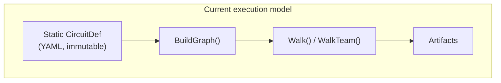
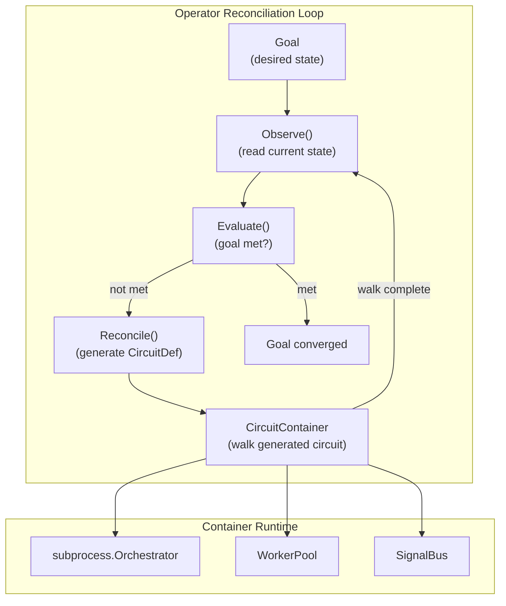

# Contract — operator-reconciliation

**Status:** complete (P4-P5 + P7 deferred)  
**Goal:** The `Operator` interface (`Observe`, `Reconcile`, `Evaluate`) and `RunOperator` reconciliation loop drive dynamic circuit generation and goal convergence. `CircuitContainer` manages the lifecycle of generated circuit instances. This is the Kubernetes Operator pattern applied to AI agent orchestration.  
**Serves:** Containerized Runtime (vision)

## Contract rules

- **Interface-driven.** The framework provides the `Operator` interface and reconciliation loop. Consumers implement domain-specific operators (RCA Operator, Knowledge Operator, etc.). The framework never contains domain logic.
- **DelegateNode integration.** `Reconcile()` returns a `*CircuitDef`. The reconciliation loop uses `DelegateNode` machinery to walk the generated circuit. This contract does not duplicate sub-walk execution — it builds on `delegate-node`.
- **Convergence, not completion.** The reconciliation loop runs until `Evaluate` returns `Met: true` or the context expires. There is no fixed iteration count. The `Evaluation.Progress` field provides a convergence signal for observers.
- **BYOI compliant.** The Operator pattern works in any execution environment (Cursor, CLI, Docker, K8s). `CircuitContainer` abstracts the runtime. The same Operator implementation works whether Workers are Cursor subagents, container processes, or K8s pods.
- Global rules apply.

## Context

Brainstorming session: [Agentic hierarchy and Operator API](65013565-a183-40d2-ae82-707267f65454) — identified the Kubernetes Operator pattern as the right model for agentic hierarchy orchestration. A Manager agent IS a reconciliation controller: it watches desired state (Goal), observes current state (SystemState), computes the delta, generates a circuit to close the gap, walks it, evaluates results, and loops.

- `delegate-node` contract — provides `DelegateNode` interface and sub-walk execution. Operator SDK builds on this.
- `agent-roles` contract — provides `Role` type for role-aware scoping. Operators use roles to assign workers.
- `subprocess/` — `Orchestrator`, `SchematicBackend`, `WorkerPool`, `Server`, `ContainerBackend`, `RemoteBackend`. Existing process lifecycle management.
- `dispatch/` — `MuxDispatcher`, `SignalBus`, `ExternalDispatcher`. Existing work distribution and signal coordination.
- `mcp/` — `CircuitServer`, `CircuitSession`, `CircuitConfig`. Existing MCP session management with Papercup v2.
- `calibrate/` — `ScenarioLoader`, `CaseCollector`, `ReportRenderer`, `ScoreCard`. Existing calibration machinery.
- `strategy/origami-vision.mdc` — Amber trajectory: "CRD-based Kubernetes circuit operator"

### The K8s Operator analogy

| Kubernetes | Origami Operator |
|---|---|
| Container Runtime (containerd) | `subprocess.Orchestrator` |
| Pod Spec | `CircuitDef` (generated YAML) |
| Running Pod | `CircuitContainer` (active walk) |
| Container in a Pod | Worker Agent (attached to nodes) |
| Volume Mount | `ArtifactScope` (what the Worker can see) |
| Service endpoint | `SignalBus` channel |
| CRD (schema) | `Goal` type |
| CR (instance) | `Goal` instance |
| Operator (controller) | Manager Agent implementing `Operator` |
| HPA (autoscaler) | Dynamic fan-out (add Workers when workload grows) |

### Current architecture

Circuits are static. No reconciliation loop. No goal convergence. One walk, one result.

### Desired architecture

The Operator observes, evaluates, reconciles, walks, and loops until the goal converges.

## FSC artifacts

| Artifact | Target | Compartment |
|----------|--------|-------------|
| Operator SDK design reference | `docs/agentic-hierarchy-design.md` | domain |
| `Operator`, `CircuitContainer`, `Reconciliation Loop` glossary terms | `glossary/` | domain |

## Execution strategy

Seven phases. Types first, then the core loop, then container runtime, then subprocess integration, then Papercup extensions, then a reference implementation.

### Phase 1 — Goal and evaluation types

Define `Goal`, `SystemState`, `Evaluation`, and supporting types. These are pure data — no behavior.

### Phase 2 — Operator interface and loop

Define the `Operator` interface and `RunOperator` function. The loop is generic — any `Operator` implementation plugs in.

### Phase 3 — CircuitContainer

Define the `CircuitContainer` interface for managing a single circuit instance lifecycle. In-memory implementation for testing.

### Phase 4 — ContainerRuntime

Define `ContainerRuntime` for CRUD over circuit containers. Integrate with `subprocess.Orchestrator` for worker process management.

### Phase 5 — Papercup extensions

Extend the Papercup protocol with operator-aware signals: `operator_observe`, `operator_reconcile`, `operator_evaluate`, `goal_progress`. Enable MCP-based Operator implementations.

### Phase 6 — Reference implementation

Build a stub Operator that generates trivial circuits for testing the full loop. Prove the machinery works end-to-end.

### Phase 7 — Validate and tune

Green-yellow-blue cycle.

## Coverage matrix

| Layer | Applies | Rationale |
|-------|---------|-----------|
| **Unit** | yes | Goal/SystemState/Evaluation construction, Operator interface mock, RunOperator loop logic |
| **Integration** | yes | Full reconciliation loop with stub Operator generating real circuits, CircuitContainer walk |
| **Contract** | yes | Operator interface contract, Goal schema, CircuitContainer lifecycle states |
| **E2E** | yes | Stub Operator over MCP (Papercup extensions), full loop with signal observation |
| **Concurrency** | yes | Concurrent CircuitContainers, RunOperator with context cancellation, worker attach/detach |
| **Security** | yes | CircuitContainer exposes artifacts and signals — role-scoped access required |

## Tasks

### Phase 1 — Goal and evaluation types

- [ ] P1.1: Define `Goal` struct in `operator.go` (framework root or new `operator/` package): `Description string`, `Constraints []Constraint`, `AcceptCriteria []AcceptanceCriterion`, `Scope Scope`.
- [ ] P1.2: Define `Constraint` and `AcceptanceCriterion` types. Constraints are structural limits (max nodes, max cost, timeout). Acceptance criteria are semantic checks (binary: met or not).
- [ ] P1.3: Define `SystemState` struct: `Artifacts map[string]Artifact`, `Signals []dispatch.Signal`, `Findings []Finding`, `WalkerStates []*WalkerState`, `Timestamp time.Time`.
- [ ] P1.4: Define `Evaluation` struct: `Met bool`, `Progress float64` (0.0 to 1.0), `Findings []Finding`, `NextAction EvalAction` (enum: `ActionRePlan`, `ActionEscalate`, `ActionDone`).
- [ ] P1.5: Unit tests: type construction, JSON round-trip, zero-value defaults.
- [ ] P1.6: Validate — `go test -race ./...` green.

### Phase 2 — Operator interface and loop

- [ ] P2.1: Define `Operator` interface: `Observe(ctx context.Context) (SystemState, error)`, `Reconcile(ctx context.Context, goal Goal, state SystemState) (*CircuitDef, error)`, `Evaluate(ctx context.Context, goal Goal, result WalkResult) (Evaluation, error)`.
- [ ] P2.2: Define `WalkResult` struct: `Artifacts map[string]Artifact`, `Metrics map[string]float64`, `Elapsed time.Duration`, `Error error`.
- [ ] P2.3: Implement `RunOperator(ctx context.Context, op Operator, goal Goal, opts ...OperatorOption) error`. Loop: observe → evaluate → if met, return → reconcile → build graph → walk → repeat. Options: `WithMaxIterations(n)`, `WithObserver(OperatorObserver)`, `WithTimeout(d)`.
- [ ] P2.4: Define `OperatorObserver` interface: `OnObserve(SystemState)`, `OnEvaluate(Evaluation)`, `OnReconcile(*CircuitDef)`, `OnWalkComplete(WalkResult)`. For logging, metrics, and UI integration.
- [ ] P2.5: Unit test: mock Operator that converges after 3 iterations, verify RunOperator loop count.
- [ ] P2.6: Unit test: mock Operator that returns `ActionEscalate`, verify RunOperator returns `ErrEscalate`.
- [ ] P2.7: Unit test: context cancellation mid-loop, verify clean shutdown.
- [ ] P2.8: Validate — `go test -race ./...` green.

### Phase 3 — CircuitContainer

- [ ] P3.1: Define `CircuitContainer` interface: `ID() string`, `Def() *CircuitDef`, `Status() ContainerStatus`, `Walk(ctx context.Context) (*WalkResult, error)`, `Pause(ctx context.Context) error`, `Resume(ctx context.Context) error`, `Abort(ctx context.Context, reason string) error`, `Artifacts() map[string]Artifact`, `Signals() []dispatch.Signal`.
- [ ] P3.2: Define `ContainerStatus` enum: `StatusPending`, `StatusRunning`, `StatusSucceeded`, `StatusFailed`, `StatusAborted`.
- [ ] P3.3: Implement `InMemoryContainer` — in-process implementation that calls `BuildGraph()` + `Walk()` directly. For testing and single-process deployments.
- [ ] P3.4: Unit tests: container lifecycle (pending → running → succeeded), abort, pause/resume.
- [ ] P3.5: Integration test: `InMemoryContainer` walks a 3-node circuit, verify artifacts accessible after completion.
- [ ] P3.6: Validate — `go test -race ./...` green.

### Phase 4 — ContainerRuntime

- [ ] P4.1: Define `ContainerRuntime` interface: `Create(ctx context.Context, def *CircuitDef) (CircuitContainer, error)`, `Get(ctx context.Context, id string) (CircuitContainer, error)`, `List(ctx context.Context, filter ContainerFilter) ([]CircuitContainer, error)`, `Delete(ctx context.Context, id string) error`.
- [ ] P4.2: Implement `InMemoryRuntime` using `InMemoryContainer`. CRUD with map storage.
- [ ] P4.3: Implement `SubprocessRuntime` that wraps `subprocess.Orchestrator` — each `CircuitContainer` is backed by a `SchematicBackend` (Server, ContainerBackend, or RemoteBackend).
- [ ] P4.4: Wire `RunOperator` to use `ContainerRuntime.Create()` instead of inline `BuildGraph()` + `Walk()`. This makes the runtime pluggable.
- [ ] P4.5: Unit tests: InMemoryRuntime CRUD, SubprocessRuntime with mock Orchestrator.
- [ ] P4.6: Validate — `go test -race ./...` green.

### Phase 5 — Papercup extensions

- [ ] P5.1: Define operator-aware signals: `operator_observe`, `operator_reconcile`, `operator_evaluate`, `goal_progress` (with `progress` in meta).
- [ ] P5.2: Add `OperatorConfig` to `CircuitConfig` — callbacks for operator lifecycle events.
- [ ] P5.3: Register MCP tools on `CircuitServer`: `start_operator` (creates operator session with goal), `get_operator_status` (returns current evaluation), `abort_operator` (stops reconciliation loop).
- [ ] P5.4: Unit tests: operator signal emission, MCP tool round-trip.
- [ ] P5.5: Validate — `go test -race ./...` green.

### Phase 6 — Reference implementation

- [ ] P6.1: Implement `StubOperator` in a `testutil/` or `operator/testutil/` package. The stub: `Observe` reads artifacts from a provided map. `Reconcile` generates a trivial 2-node circuit (read → transform). `Evaluate` checks if the transform artifact contains a specific key (configurable).
- [ ] P6.2: Integration test: `RunOperator` with `StubOperator` and `InMemoryRuntime`. Verify the loop: observe → evaluate (not met) → reconcile → walk → observe → evaluate (met) → return.
- [ ] P6.3: Integration test: `RunOperator` with `StubOperator` and `SubprocessRuntime` (mock subprocess). Verify container lifecycle.
- [ ] P6.4: Validate — `go test -race ./...` green.

### Phase 7 — Validate and tune

- [ ] P7.1: Validate (green) — all tests pass, acceptance criteria met.
- [ ] P7.2: Tune (blue) — review API surface, ensure OperatorObserver is ergonomic, clean up package organization. No behavior changes.
- [ ] P7.3: Validate (green) — all tests still pass after tuning.

## Acceptance criteria

**Given** an `Operator` implementation and a `Goal`,  
**When** `RunOperator` is called,  
**Then** the loop runs: observe → evaluate → reconcile → walk → repeat until `Evaluation.Met` is true or the context expires.

**Given** an `Operator` whose `Evaluate` returns `ActionEscalate`,  
**When** `RunOperator` processes the evaluation,  
**Then** it returns `ErrEscalate` with the findings attached. The caller (e.g., a Broker) can handle the escalation.

**Given** a `CircuitContainer` created from a `CircuitDef`,  
**When** `Walk()` is called and completes,  
**Then** `Status()` returns `StatusSucceeded` and `Artifacts()` returns the walk's output artifacts.

**Given** a `CircuitContainer` in `StatusRunning`,  
**When** `Abort()` is called,  
**Then** the walk is cancelled, `Status()` transitions to `StatusAborted`, and the abort reason is accessible.

**Given** the MCP `start_operator` tool,  
**When** a client calls it with a goal,  
**Then** a reconciliation loop starts on the server. `get_operator_status` returns the current `Evaluation.Progress`. Operator signals (`operator_observe`, `operator_reconcile`) stream via `get_signals`.

**Given** an existing circuit with no operator,  
**When** walked with the updated framework,  
**Then** behavior is identical to before. The Operator layer is opt-in.

## Security assessment

| OWASP | Finding | Mitigation |
|-------|---------|------------|
| A01 Broken Access Control | `CircuitContainer` exposes artifacts and signals. In multi-tenant environments, containers from different operators must be isolated. | `ContainerRuntime.List()` accepts a `ContainerFilter` that includes owner/scope. `SubprocessRuntime` delegates to `subprocess.Orchestrator` which manages backend isolation. Role-scoped access from `agent-roles`. |
| A05 Security Misconfiguration | `start_operator` MCP tool creates a reconciliation loop that consumes resources (LLM calls per iteration). | `WithMaxIterations(n)` and `WithTimeout(d)` are enforced. `Goal.Constraints` can include a cost budget. `CircuitServer` enforces capacity gating. |

## Notes

2026-03-05 — Contract drafted from agentic hierarchy brainstorming session. The Operator pattern is the Kubernetes controller-runtime for AI agents. The key insight: `Reconcile()` returns a `*CircuitDef` — the plan IS a circuit. This makes plans observable, calibratable, auditable, and git-diffable. Depends on `delegate-node` (sub-walk execution) and `agent-roles` (role-aware scoping). The `CircuitContainer` abstraction bridges in-process execution (`InMemoryContainer`) and distributed execution (`SubprocessRuntime`), honoring BYOI.

2026-03-07 — P1-P3, P6 implemented. All types, interfaces, and the reconciliation loop live in `operator.go` (framework root). Design simplifications vs original contract: `SystemState` is minimal (artifacts + iteration + elapsed, no Signals/Findings cross-imports), `Constraints` is `map[string]any` (framework doesn't evaluate them — Operator does), `CircuitContainer.Walk` takes `GraphRegistries` explicitly, `Pause`/`Resume` deferred. `RunOperator` uses `InMemoryContainer` internally. StubOperator + integration tests prove the full loop in `operator_test.go`. P4 (ContainerRuntime), P5 (Papercup extensions), P7 (validate/tune) remain deferred.
